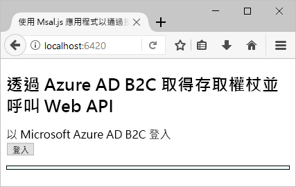
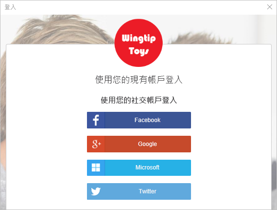
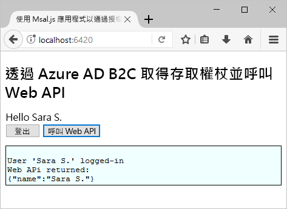

# <a name="quickstart-test-drive-an-azure-ad-b2c-enabled-single-page-app"></a>快速入門：測試已啟用 Azure AD B2C 的單一頁面應用程式

Azure Active Directory (Azure AD) B2C 提供雲端身分識別管理，使您的應用程式、企業和客戶受到保護。 Azure AD B2C 可讓您的應用程式使用開放式標準通訊協定，向社交帳戶和企業帳戶進行驗證。

本快速入門中，您會使用已啟用 Azure AD B2C 的範例單一頁面應用程式，透過社交識別提供者登入，並呼叫受 Azure AD B2C 保護的 Web API。

[!INCLUDE [quickstarts-free-trial-note](../../includes/quickstarts-free-trial-note.md)]

## <a name="prerequisites"></a>先決條件

* [Visual Studio 2017](https://www.visualstudio.com/downloads/)，其中包含 **ASP.NET 和 Web 部署**工作負載。
* 安裝 [Node.js](https://nodejs.org/en/download/)
* Facebook、Google、Microsoft 或 Twitter 社交帳戶。

## <a name="download-the-sample"></a>下載範例

[下載 zip 檔案](https://github.com/Azure-Samples/active-directory-b2c-javascript-msal-singlepageapp/archive/master.zip)，或從 GitHub 複製範例 Web 應用程式。

```
git clone https://github.com/Azure-Samples/active-directory-b2c-javascript-msal-singlepageapp.git
```

## <a name="run-the-sample-application"></a>執行範例應用程式

從 Node.js 命令提示字元執行此範例： 

```
cd active-directory-b2c-javascript-msal-singlepageapp
npm install && npm update
node server.js
```

Node.js 應用程式會輸出在 localhost 上接聽的通訊埠號碼。

```
Listening on port 6420...
```

在網頁瀏覽器中瀏覽至應用程式的 URL`http://localhost:6420`。



## <a name="create-an-account"></a>建立帳戶

按一下 [登入] 按鈕，以根據 Azure AD B2C 原則啟動 Azure AD B2C 的「註冊或登入」工作流程。 

此範例支援數個登入選項，包括使用社交識別提供者或使用電子郵件地址建立本機帳戶。 在本快速入門中，請使用 Facebook、Google、Microsoft 或 Twitter 的社交身分識別提供者帳戶。 

### <a name="sign-up-using-a-social-identity-provider"></a>使用社交識別提供者註冊

Azure AD B2C 會針對範例 Web 應用程式，呈現 Wingtip Toys 虛構品牌的自訂登入頁面。 

1. 若要使用社交識別提供者註冊，按一下您想要使用之識別提供者的按鈕。

    

    您可使用您的社交帳戶認證進行驗證 (登入)，以及授權應用程式讀取您的社交帳戶資訊。 透過授與存取權，應用程式可以從社交帳戶擷取設定檔資訊，例如您的名稱與縣/市。 

2. 完成識別提供者的登入程序。 比方說，如果您選擇 Twitter，請輸入 Twitter 認證，然後按一下 [登入]。

    

    您的新帳戶設定檔詳細資料會預先填入來自您社交帳戶的資訊。 

3. 更新 [顯示名稱]、[職稱] 和 [縣/市] 欄位，然後按一下 [繼續]。  您輸入的值會用於您的 Azure AD B2C 使用者帳戶設定檔。

    您已成功建立使用識別提供者的新 Azure AD B2C 使用者帳戶。 

## <a name="access-a-protected-web-api-resource"></a>存取受保護的 Web API 資源

按一下 [呼叫 Web API] 按鈕，使您的顯示名稱從 Web API 呼叫以 JSON 物件傳回。 



此範例單一頁面應用程式會在對受保護 Web API 資源的要求中包含 Azure AD 存取權杖，以要求該資源執行作業來傳回 JSON 物件。

## <a name="clean-up-resources"></a>清除資源

如果您想要嘗試其他 Azure AD B2C 快速入門或教學課程，可以使用 Azure AD B2C 租用戶。 不再需要時，您可以[刪除您的 Azure AD B2C 租用戶](active-directory-b2c-faqs.md#how-do-i-delete-my-azure-ad-b2c-tenant)。

## <a name="next-steps"></a>後續步驟

在本快速入門中，您使用了已啟用 Azure AD B2C 的範例 ASP.NET 應用程式，透過自訂登入頁面登入、透過社交識別提供者登入，建立 Azure AD B2C 帳戶，以及呼叫受 Azure AD B2C 保護的 Web API。 

下一個步驟是建立您自己的 Azure AD B2C 租用戶，並設定使用您的租用戶來執行的範例。 

> [!div class="nextstepaction"]
> [在 Azure 入口網站中建立 Azure Active Directory B2C 租用戶](active-directory-b2c-get-started.md)