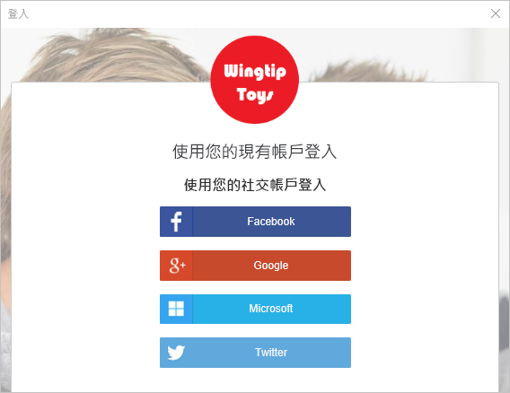
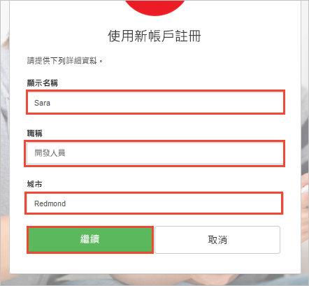
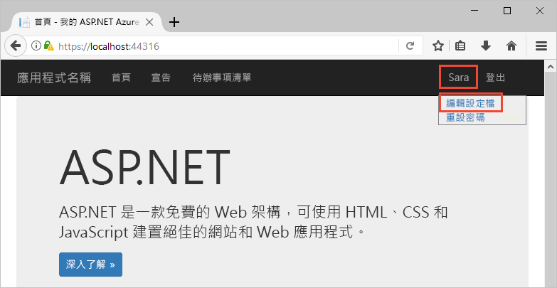

# 測試使用 Azure AD B2C 設定的 Web 應用程式

Azure Active Directory B2C 提供雲端身分識別管理，使您的應用程式、企業和客戶受到保護。  本快速入門使用範例待辦事項清單應用程式示範：

* 使用「註冊或登入」原則建立，或以電子郵件地址使用社交識別提供者或本機帳戶登入。 
* 呼叫受 Azure AD B2C 保護的 API，以建立和編輯待辦事項項目。

## 必要條件

* 使用下列工作負載安裝 [Visual Studio 2017](https://www.visualstudio.com/downloads/)：
    - **ASP.NET 和 Web 開發**

* Facebook、Google、Microsoft 或 Twitter 社交帳戶。 如果您沒有社交帳戶，則需要有效的電子郵件地址。

[!INCLUDE [quickstarts-free-trial-note](../../includes/quickstarts-free-trial-note.md)]

## 下載範例

從 GitHub [下載或複製範例應用程式](https://github.com/Azure-Samples/active-directory-b2c-dotnet-webapp-and-webapi)。

## 在 Visual Studio 中執行應用程式

在範例應用程式專案資料夾中，於 Visual Studio 中開啟 `B2C-WebAPI-DotNet.sln` 方案。 

該方案包含兩個專案：

* **TaskWebApp** – ASP.NET MVC Web 應用程式，使用者可以在其中管理其待辦事項清單項目。  
* **TaskService** – ASP.NET Web API 後端，管理針對使用者待辦事項清單項目執行的所有 CRUD 作業。 Web 應用程式會呼叫此 API 並顯示結果。

在本快速入門中，您需要同時執行 `TaskWebApp` 和 `TaskService` 專案。 

1. 在方案總管中，以滑鼠右鍵按一下方案，然後選取 [設定啟始專案]。 
2. 選取 [多個啟始專案] 選項按鈕。
3. 將兩個專案的 [動作] 變更為 [啟動]。 按一下 [確定] 。

選取 [偵錯] > [開始偵錯]，以建置和執行這兩個應用程式。 每個應用程式會在自己的瀏覽器索引標籤中開啟：

* `https://localhost:44316/` - 此頁面是 ASP.NET Web 應用程式。 在本快速入門中，您直接與此應用程式互動。
* `https://localhost:44332/` - 此頁面是 ASP.NET Web 應用程式呼叫的 Web API。

## 建立帳戶

按一下 ASP.NET Web 應用程式中的 [註冊/登入] 連結，以啟動 [註冊或登入] 工作流程。 建立帳戶時，您可以使用現有的社交識別提供者帳戶或電子郵件帳戶。

### 使用社交識別提供者註冊

若要使用社交識別提供者註冊，按一下您想要使用之識別提供者的按鈕。 如果您偏好使用電子郵件地址，請跳至[使用電子郵件地址註冊](#sign-up-using-an-email-address)一節。

您需要使用您的社交帳戶認證進行驗證 (登入)，以及授權應用程式讀取您的社交帳戶資訊。 透過授與存取權，應用程式可以從社交帳戶擷取設定檔資訊，例如您的名稱與縣/市。 

完成識別提供者的登入程序。 例如，按一下 Twitter 的 [登入] 按鈕。

您的新帳戶設定檔詳細資料會預先填入來自您社交帳戶的資訊。

更新 [顯示名稱]、[職稱] 和 [縣/市] 欄位，然後按一下 [繼續]。  您輸入的值會用於您的 Azure AD B2C 使用者帳戶設定檔。

您已成功建立使用識別提供者的新 Azure AD B2C 使用者帳戶。 

下一步：[跳至檢視您的宣告](#view-your-claims)一節。

### 使用電子郵件地址註冊

如果您選擇不使用社交帳戶提供驗證，則可以建立使用有效電子郵件地址的 Azure AD B2C 使用者帳戶。 Azure AD B2C 本機使用者帳戶使用 Azure Active Directory 作為識別提供者。 若要使用電子郵件地址，請按一下 [還沒有帳戶嗎？立即註冊] 連結。

輸入有效的電子郵件地址，然後按一下 [傳送驗證碼]。 您需要有效的電子郵件地址，才能從 Azure AD B2C 接收驗證碼。 

輸入您在電子郵件中收到的驗證碼，按一下 [驗證碼]。

新增設定檔資訊，然後按一下 [建立]。

您已成功建立新的 Azure AD B2C 本機使用者帳戶。

## 重設密碼

如果您使用電子郵件地址建立帳戶，Azure AD B2C 有讓使用者重設密碼的功能。 若要編輯您建立的設定檔，請按一下功能表列中的設定檔名稱，然後選取 [重設密碼]。

輸入您的電子郵件地址，按一下 [傳送驗證碼] 進行驗證。 驗證碼會傳送到您的電子郵件地址。

輸入您在電子郵件中收到的驗證碼，按一下 [驗證代碼]。

電子郵件地址驗證完之後，請按一下 [繼續]。

輸入您的密碼，然後按一下 [繼續]。

## 檢視您的宣告

按一下 Web 應用程式功能表列中的 [宣告]，以檢視與上一個動作相關聯的宣告。 

在此範例中，上一個動作是 [登入或註冊] 體驗。 請注意，**宣告類型**`http://schemas.microsoft.com/claims/authnclassreference`指示`b2c_1_susi`上一個動作是註冊或登入。 如果上一個動作是密碼重設，「宣告類型」會是 `b2c_1_reset`。

## 編輯您的設定檔

Azure Active Directory B2C 提供讓使用者更新其設定檔的功能。 在 Web 應用程式功能表列中，按一下設定檔名稱，然後選取 [編輯設定檔] 以編輯您建立的設定檔。

變更您的 [顯示名稱] 和 [縣/市]。  按一下 [繼續] 以更新設定檔。

名稱變更之後，請注意頁面右上部分的顯示名稱更新。 

按一下 [宣告]。 您對 [顯示名稱] 和 [縣/市] 所做的變更會反映在宣告中。

 請注意，**宣告類型**`http://schemas.microsoft.com/claims/authnclassreference`已更新為 `b2c_1_edit_profile`，表示上一個執行的動作是編輯設定檔。 也請注意，名稱和縣/市是新值：*Sara S.* 和「西雅圖」。

## 存取資源

按一下 [待辦事項清單]，輸入並修改您的待辦事項清單項目。 ASP.NET Web 應用程式會在對 Web API 資源的要求中包含存取權杖，以要求對使用者待辦事項清單項目執行作業的權限。 

在 [新項目] 文字方塊中輸入文字。 按一下 [新增] 以呼叫受 Azure AD B2C 保護的 Web API，而該 Web API 會加入待辦事項清單項目。

## 其他案例

其他待測試的案例顯示如下：

* 登出應用程式，按一下 [待辦事項清單]。 請注意系統如何提示您登入和如何保存清單項目。 
* 使用不同類型的帳戶建立新帳戶。 例如，如果您先前使用電子郵件地址建立帳戶，請使用社交識別提供者。

## 後續步驟

下一個步驟是建立您自己的 Azure AD B2C 租用戶，並設定使用您的租用戶來執行的範例。 

> [!div class="nextstepaction"]
> [在 Azure 入口網站中建立 Azure Active Directory B2C 租用戶](active-directory-b2c-get-started.md)