<properties  linkid="dev-net-how-to-access-control" urlDisplayName="Access Control" pageTitle="How to use Access Control (.NET) - Azure feature guide" metaKeywords="Azure Access Control Service authentication C#" description="Learn how to use Access Control Service (ACS) in your Azure application to authenticate users when they try to gain access to a web app." metaCanonical="" services="active-directory" documentationCenter=".NET" title="How to Authenticate Web Users with Azure Active Directory Access Control" authors="juneb" solutions="" manager="" editor="" />

# 如何利用 Azure Active Directory 存取控制來驗證 Web 使用者

本指南說明如何使用 Azure Active Directory 存取控制 (也稱為存取控制服務或 ACS)，在使用者嘗試取得 Web 應用程式的存取權時，從身分識別提供者 (例如 Microsoft、Google、Yahoo 和 Facebook) 驗證使用者。

<h2>目錄目錄</h2>

* [什麼是 ACS？](#what-is)
* [概念](#concepts)
* [必要條件](#pre)
* [建立存取控制命名空間](#create-namespace)
* [建立 ASP.NET MVC 應用程式](#create-web-app)
* [整合您的 Web 應用程式與 ACS](#Identity-Access)
* [測試與 ACS 的整合](#Test-ACS)
* [檢視 ACS 所傳送的宣告](#bkmk_viewClaims)
* [在 ACS 管理入口網站中檢視應用程式](#bkmk_VP)
* [新增身分識別提供者](#add-IP)
* [接下來](#whats-next)

<h2>什麼是 ACS？什麼是 ACS？</h2>

大部分開發人員都不是身分識別專家，因而不想花時間為其應用程式和服務開發驗證與授權機制。ACS 是一項 Azure 服務，可讓您輕鬆驗證使用者是否能存取您的 Web 應用程式與服務，而不必新增複雜的驗證邏輯至您的程式碼。

以下是 ACS 中提供的功能：

* 與 Windows Identity Foundation (WIF) 整合。
* 支援熱門的 Web 身分識別提供者 (IP)，包括 Microsoft 帳戶 (舊稱 Windows Live ID)、Google、Yahoo 和 Facebook。
* 支援 Active Directory Federation Services (AD FS) 2.0。
* 一項開放式資料通訊協定 (OData) 型管理服務，可用來對 ACS 設定進行程式設計存取。
* 一個管理入口網站，可用來對 ACS 設定進行系統管理存取。

如需 ACS 的詳細資訊，請參閱[存取控制服務 2.0][1] (英文)。

<h2>概念概念</h2>

ACS 是以宣告式身分識別為原則來打造，後者是為內部部署上或雲端中執行的應用程式建立驗證機制的一致方式。宣告式身分識別是應用程式與服務在遇到本身組織內、其他組織內與網際網路上的使用者時，常用來取得所需關於這些使用者之身分識別資訊的方式。

若要完成本指南中的工作，您應該了解本指南中使用的下列術語及概念：

**用戶端** - 嘗試存取您 Web 應用程式的瀏覽器。

**信賴憑證者 (RP) 應用程式** - 您的 Web 應用程式。RP 應用程式是一個將驗證工作交給外部授權單位負責的網站或服務。以身分識別的行話來說，就是 RP 信任該授權單位。本指南將說明如何設定您的應用程式來信任 ACS。

**權杖** - 使用者需要取得 RP 應用程式的存取權時，需出示由 RP 應用程式信任的授權單位所簽發的有效權杖。這是一組當用戶端經過驗證時所簽發的安全性資料。其包含一組宣告，也就是經驗證之使用者的屬性，例如使用者的名稱或年紀，或使用者角色的識別碼。權杖是以數位方式受到簽署，因此要識別其簽發者可以，但要變更其內容則不行。

**身分識別提供者 (IP)** - 一個負責驗證使用者身分識別並簽發安全性權杖的授權單位，例如 Microsoft 帳戶 (Windows Live ID)、Facebook、Google、Twitter 和 Active Directory。當 ACS 是設定成信任某個 IP 時，它會接受並驗證該 IP 所簽發的權杖。因為 ACS 可以同時信任多個 IP，所以當您的應用程式信任 ACS 時，您和您的應用程式可以提供使用者一個選項，讓 ACS 所信任的任何 IP 代表您進行驗證。

**同盟提供者 (FP)** - 身分識別提供者 (IP) 直接有使用者的資料，並會使用使用者的認證來驗證使用者，以及簽發關於使用者身分的宣告。同盟提供者 (FP) 則是不同種類的授權單位。FP 不會直接驗證使用者，而是當驗證的代理人。它會擔任信賴憑證者應用程式與一個或多個 IP 之間的媒介。ACS 就是一種同盟提供者 (FP)。

**ACS 規則引擎** - 宣告轉換規則會將信任的 IP 所簽發之權杖中的宣告，轉換成可供 RP 使用。ACS 中有一個規則引擎會套用您為 RP 指定的宣告轉換規則。

**存取控制命名空間** - 提供在您的應用程式內定址 ACS 資源的唯一範圍。命名空間包含您的設定 (例如您信任的 IP、您要供應的 RP 應用程式、您要對傳入之權杖套用的規則)，而且它會顯示應用程式和開發人員用來與 ACS 通訊的端點。

下圖顯示 ACS 驗證與 Web 應用程式如何搭配運作：

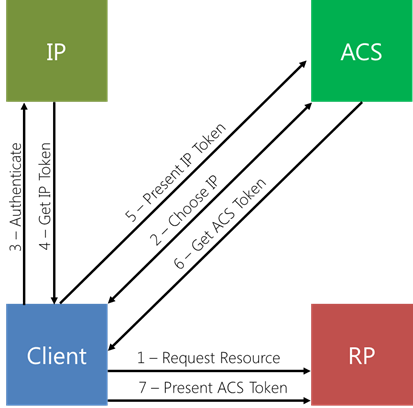

1.  用戶端 (在此案例中是指瀏覽器) 向 RP 要求一個頁面。
2.  因為要求尚未經過驗證，所以 RP 將使用者重新導向至信任的授權單位 (即 ACS)。ACS 列出已為此 RP 指定的 IP，供使用者選擇。使用者選取適當的 IP。
3.  用戶端瀏覽至 IP 的驗證頁面，並提示使用者登入。
4.  在用戶端經過驗證後 (例如，輸入了身分識別認證)，IP 即簽發安全性權杖。
5.  在簽發安全性權杖後，IP 引導用戶端傳送 IP 所簽發的安全性權杖給 ACS。
6.  ACS 驗證 IP 所簽發的安全性權杖、將此權杖中的身分識別宣告輸入至 ACS 規則引擎、計算輸出的身分識別宣告，然後簽發含有這些輸出宣告的新安全性權杖。
7.  ACS 引導用戶端傳送 ACS 所簽發的安全性權杖給 RP。RP 驗證安全性權杖上的簽章、擷取要讓應用程式商務邏輯使用的宣告，然後傳回原先要求的頁面。

<h2>先決條件先決條件</h2>

若要完成本指南中的工作，您需要有下列項目：

* Azure 訂閱
* Microsoft Visual Studio 2012
* Visual Studio 2012 的 Identity and Access Tool (若要下載，請參閱 [Identity and Access Tool][2] (英文))

<h2>建立存取控制命名空間建立存取控制命名空間</h2>

若要使用 Azure 中的 Active Directory 存取控制，請建立存取控制命名空間。此命名空間可提供在您的應用程式內定址 ACS 資源的唯一範圍。

1.  登入 [Azure 管理入口網站][3] (https://manage.WindowsAzure.com)。

2.  按一下 **Active Directory**。
    
    

3.  若要建立新的存取控制命名空間，請按一下 **新增**。如此會選取 **App Services** 及 **存取控制**。按一下 **快速建立**。
    
    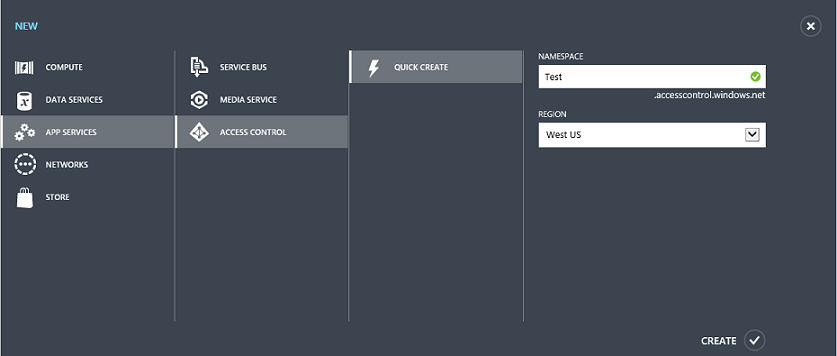

4.  輸入命名空間的名稱。Azure 會確認名稱是否具唯一性。

5.  選取使用命名空間的地區。為了獲得最佳效能，請使用您要在其中部署應用程式的地區，然後按一下 **建立**。

Azure 即會建立並啟動命名空間。

<h2>建立 ASP.NET MVC 應用程式建立 ASP.NET MVC 應用程式</h2>

在此步驟中，您將建立 ASP.NET MVC 應用程式。在後面的步驟中，我們會將這個簡易 Web 表單應用程式與 ACS 整合。

1.  啟動 Visual Studio 2012 或 Visual Studio Express for Web 2012 (舊版 Visual Studio 將不適用於這個教學課程)。
2.  按一下 **檔案**，然後按一下 **新增專案**。 3.  選取 Visual C#/Web 範本，然後選取 **ASP.NET MVC 4 Web 應用程式**。
    
    在本指南中，我們將使用 MVC 應用程式，但是您可以使用任何類型的 Web 應用程式進行此工作。
    
    

4.  在 **名稱** 中，輸入 **MvcACS**，然後按一下 **確定**。
5.  在下一個對話方塊中，選取 **網際網路應用程式**，然後按一下 **確定**。
6.  編輯 *Views\\Shared\_LoginPartial.cshtml* 檔案，並將其內容取代為下列程式碼：
    
        @if (Request.IsAuthenticated)
        {
            string name = "Null ID";
            if (!String.IsNullOrEmpty(User.Identity.Name))
            {
                name = User.Identity.Name;
            }    
            <text>
            Hello, @Html.ActionLink(name, "Manage", "Account", routeValues: null, htmlAttributes: new { @class = "username", title = "Manage" })!
                    @using (Html.BeginForm("LogOff", "Account", FormMethod.Post, new { id = "logoutForm" }))
                    {
                        @Html.AntiForgeryToken()
                        <a href="javascript:document.getElementById('logoutForm').submit()">Log off</a>
                    }
            </text>
        }
        else
        {
            <ul>
                <li>@Html.ActionLink("Register", "Register", "Account", routeValues: null, htmlAttributes: new { id = "registerLink" })</li>
                <li>@Html.ActionLink("Log in", "Login", "Account", routeValues: null, htmlAttributes: new { id = "loginLink" })</li>
            </ul>
        }

	目前，ACS 並未設定 User.Identity.Name，所以我們需要進行上述變更。

1.  按 F5 執行應用程式。預設的 ASP.NET MVC 應用程式隨即出現在您的網頁瀏覽器中。

<h2>整合您的 Web 應用程式與 ACS整合您的 Web 應用程式與 ACS</h2>

在此工作中，您將整合 ASP.NET Web 應用程式與 ACS。

1.  在 **方案總管] 中以滑鼠右鍵按一下 MvcACS 專案，然後選取 [Identity and Access**。
    
    如果 **Identity and Access** 選項未出現在內容功能表上，請安裝 Identity and Access Tool。如需詳細資訊，請參閱[身分識別與存取工具][2] (英文)。
    
    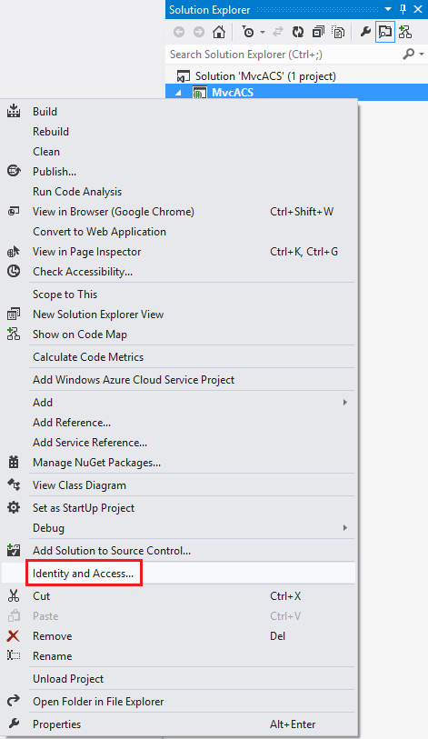

2.  在 **提供者** 索引標籤上，選取 **使用 Azure Access Control Service**。
    
    

3.  按一下 **設定** 連結。
    
    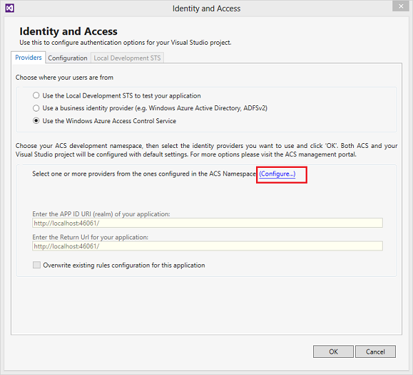
    
    Visual Studio 隨即要求獲得存取控制命名空間的有關資訊。請輸入您稍早建立的命名空間名稱 (在上圖中為 Test，但您將具有不同的命名空間)。切換回 Azure 管理入口網站，以取得對稱金鑰。
    
    

4.  在 Azure 管理入口網站中，按一下存取控制命名空間，然後按一下 **管理**。
    
    

5.  按一下 **Management Service**，然後按一下 **Management Client**。
    
    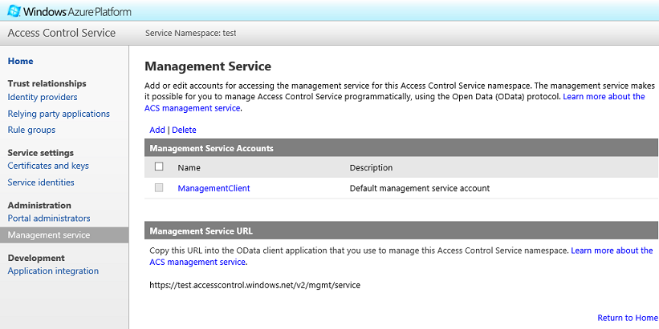

6.  按一下 **對稱金鑰**、再按一下 **Show Key**，然後複製金鑰值。然後，按一下 **取消** 以結束 [Edit Management Client] 頁面，而不進行變更。
    
    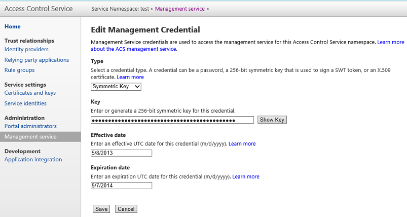

7.  在 Visual Studio 中，將金鑰貼入 **Enter the Management Key for the namespace** 欄位、按一下 **Save management key**，然後按一下 **確定**。
    
    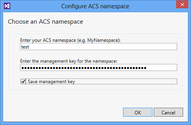
    
    Visual Studio 會使用命名空間的相關資訊，來連線至 ACS 管理入口網站，並取得命名空間的設定，包括身分識別提供者、領域及傳回 URL。

8.  選取 **Windows Live ID** (Microsoft 帳戶)，並按一下 [確定]。
    
    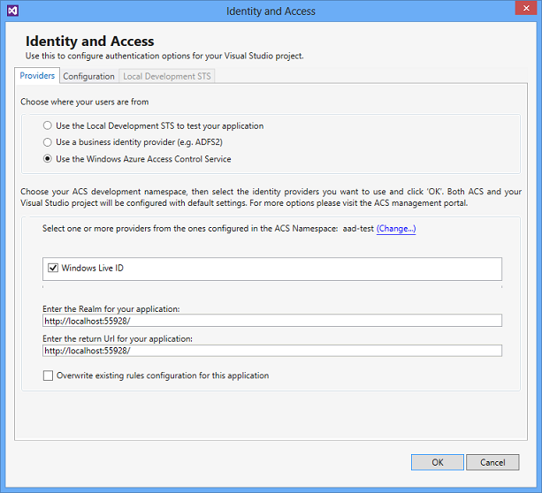

<h2>測試與 ACS 的整合測試與 ACS 的整合</h2>

此工作說明如何測試 RP 應用程式與 ACS 的整合。

* 在 Visual Studio 按 F5 執行應用程式。

當您的應用程式已與 ACS 整合，而且您已選取 Windows Live ID (Microsoft 帳戶) 時，您的瀏覽器會被重新導向至 Microsoft 帳戶的登入頁面，而不是開啟預設的 ASP.NET Web Form 應用程式。當您以有效的使用者名稱和密碼登入後，您就會被重新導向至 MvcACS 應用程式。

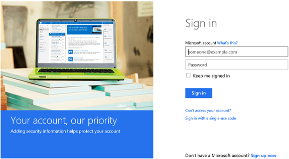

恭喜！您已成功整合 ACS 與 ASP.NET Web 應用程式。ACS 現在會利用使用者的 Microsoft 帳戶認證來處理使用者的驗證。

<h2>檢視 ACS 所傳送的宣告</h2>

在本節中，我們將修改應用程式來檢視 ACS 所傳送的宣告。Identity and Access 工具已建立一個規則群組，此規則群組會掃過所有從該 IP 傳遞至您應用程式的宣告。請注意，不同的身分識別提供者會傳送不同的宣告。

1. 開啟 *Controllers\\HomeController.cs* 檔案。對 **System.Threading** 新增 **using** 陳述式：

	using System.Threading; 

2. 在 HomeController 類別中，新增 *Claims* 方法：
    
    public ActionResult Claims() \{ ViewBag.Message = "Your claims
    page.";
    
         ViewBag.ClaimsIdentity = Thread.CurrentPrincipal.Identity;
        
        return View();
    
		}

2.  在 *Claims* 方法上按一下滑鼠右鍵並選取 **加入檢視**。

	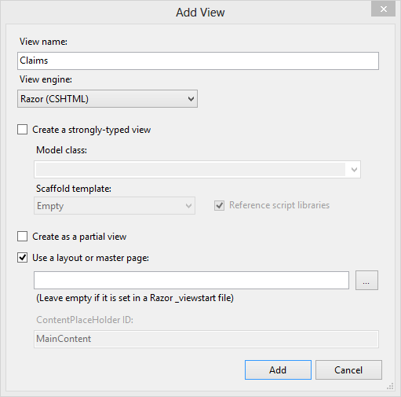

1.  按一下 **新增**。

2.  以下列程式碼取代 *Views\\Home\\Claims.cshtml* 檔案的內容：
    
        @{
            ViewBag.Title = "Claims";
        }
        <hgroup class="title">
            <h1>@ViewBag.Title.</h1>
            <h2>@ViewBag.Message</h2>
        </hgroup>
        <h3>Values from Identity</h3>
        <table>
            <tr>
                <td>
                    IsAuthenticated: 
                </td>
                <td>
                    @ViewBag.ClaimsIdentity.IsAuthenticated 
                </td>
            </tr>
            <tr>
                <td>
                    Name: 
                </td>        
                <td>
                    @ViewBag.ClaimsIdentity.Name
                </td>        
            </tr>
        </table>
        <h3>Claims from ClaimsIdentity</h3>
        <table>
            <tr>
                <th>
                    Claim Type
                </th>
                <th>
                    Claim Value
                </th>
            </tr>
                @foreach (System.Security.Claims.Claim claim in ViewBag.ClaimsIdentity.Claims ) {
            <tr>
                <td>
                    @claim.Type
                </td>
                <td>
                    @claim.Value
                </td>
            </tr>
        }
        </table>

3.  執行應用程式並瀏覽到 *Claims* 方法：

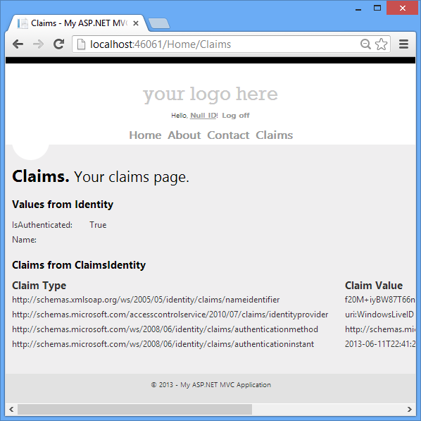

如需關於在應用程式中使用宣告的詳細資訊，請參閱 [Windows Identity Foundation 文件庫 (機器翻譯)][4]。

<h2>在 ACS 管理入口網站中檢視應用程式</h2>

Visual Studio 中的 Identity and Access Tool 會自動將您的應用程式與 ACS 整合。

當您選取 [使用 Azure 存取控制] 選項，然後執行您的應用程式時，Identity and Access Tool 會新增您的應用程式作為信賴憑證者、將它設定為使用選取的身分識別提供者，然後產生並選取該應用程式的預設宣告轉換規則。

您可以在 ACS 管理入口網站中檢閱並變更這些組態設定。請使用下列步驟在入口網站中檢閱變更。

1.  登入 Windows [Azure 管理入口網站][3]。

2.  按一下 **Active Directory**。
    
    

3.  選取存取控制命名空間，然後按一下 **管理**。此動作會開啟 ACS 管理入口網站。
    
    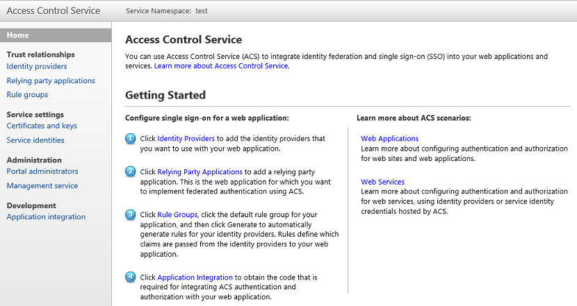

4.  按一下 **Relying party applications**。
    
    新的 MvcACS 應用程式隨即出現在信賴憑證者應用程式清單中。領域會自動設為應用程式主頁面。
    
    

5.  按一下 **MvcACS**。
    
    [Edit Relying Party Application] 頁面包含 MvcACS Web 應用程式的組態設定。當您變更並儲存此頁面上的設定時，變更會立即套用到應用程式。
    
    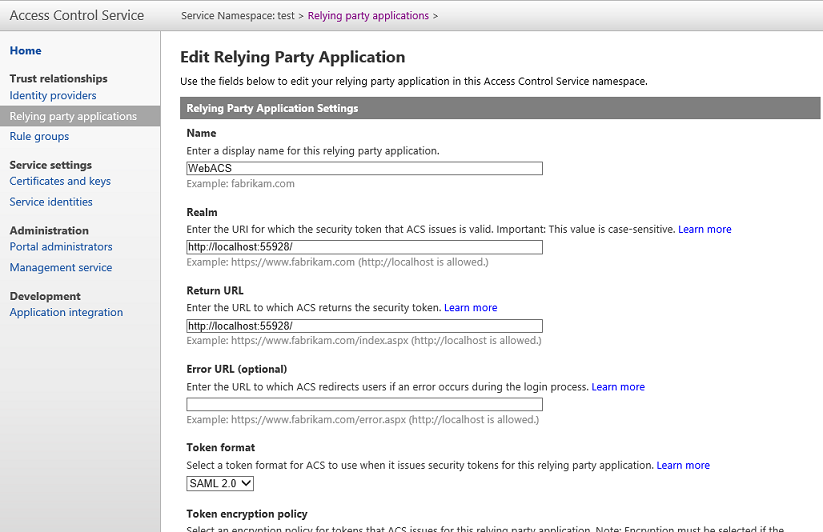

6.  向下捲動頁面，以查看 MvcACS 應用程式的剩餘組態設定，包括身分識別提供者和宣告轉換規則。
    
    

在下一節中，我們將使用 ACS 管理入口網站的功能，對 Web 應用程式進行變更；這只是為了要證明要這麼做有多容易。

<h2>新增身分識別提供者新增身分識別提供者</h2>

讓我們使用 ACS 管理入口網站來變更 MvcACS 應用程式的驗證。在此範例中，我們將新增 Google 作為 MvcACS
的身分識別提供者。

1.  按一下 **識別提供者** (在導覽功能表中)，然後按一下 **新增**。
    
    

2.  按一下 **Google**，然後按 **下一步**。預設已選取 MvcACS 應用程式核取方塊。
    
    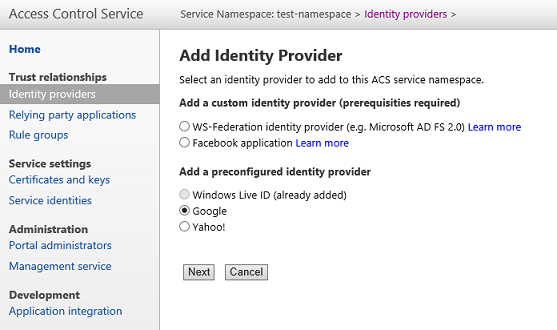

3.  按一下 [儲存]。
    
    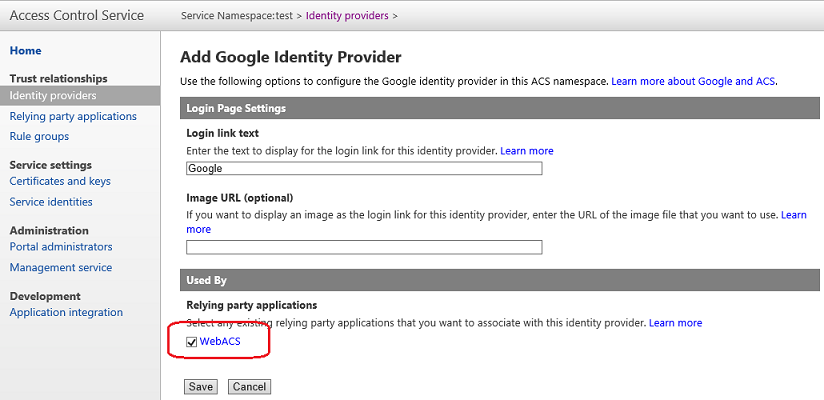

完成！如果您回到 Visual Studio、開啟 MvcACS 應用程式的專案，然後按一下 **Identity and Access**，則工具會同時列出 Windows Live ID 與 Google 身分識別提供者。

因此，當您執行應用程式時，將看到效果。當應用程式支援多個身分識別提供者時，使用者的瀏覽器會先被重新導向至 ACS 主控的頁面，提示使用者選擇身分識別提供者。

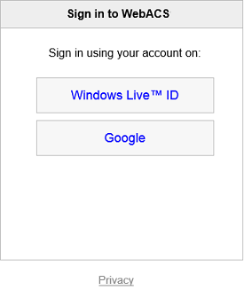

在使用者選取身分識別提供者後，瀏覽器即會移至身分識別提供者登入頁面。

<h2>接下來接下來</h2>

您已建立與 ACS 整合的 Web 應用程式。不過，這只是開始而已！您可以以此案例為基礎進行延伸。

例如，您可以為此 RP 新增更多身分識別提供者，或允許企業目錄 (例如 Active Directory 網域服務) 中註冊的使用者登入 Web 應用程式。

您也可以新增規則至命名空間，來決定哪些宣告會傳送至應用程式以依應用程式商務邏輯進行處理。

若要進一步探索 ACS 功能及試試其他案例，請參閱[存取控制服務 2.0][1] (英文)。

[1]: http://go.microsoft.com/fwlink/?LinkID=212360
[2]: http://go.microsoft.com/fwlink/?LinkID=245849
[3]: http://manage.WindowsAzure.com
[4]: http://msdn.microsoft.com/zh-tw/library/hh377151.aspx