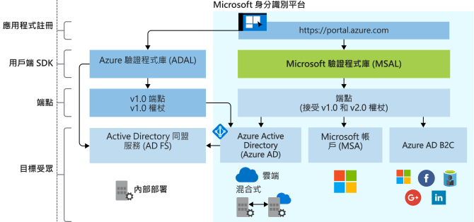

# 關於 Microsoft 身分識別平台

MicrosoftMicrosoft 身分識別平台是 Azure Active Directory (Azure AD) 身分識別服務與開發人員平台的演化。 它可讓開發人員建置應用程式以登入所有 Microsoft 身分識別、取得權杖以呼叫 Microsoft Graph、其他 Microsoft API 或開發人員所建置的 API。 它是具有完整功能的平台，由驗證服務、開放原始碼程式庫、應用程式註冊與設定 (透過開發人員平台與應用程式 API)、完整開發人員文件、程式碼範例與其他開發人員內容所組成。 Microsoft 身分識別平台支援業界標準通訊協定，例如 OAuth 2.0 與 OpenID Connect。

到目前為止，大部分的開發人員都曾透過向 Azure AD v1.0 端點要求權杖 (使用 Azure AD 驗證程式庫 (ADAL)、用於應用程式註冊與設定的 Azure 入口網站，以及用於程式化應用程式設定的 Azure AD Graph API)，以搭配使用 Azure AD v1.0 平台驗證 Azure AD 身分識別 (公司與學校帳戶)。 Azure AD v1.0 平台是一個成熟的平台供應項目，將能夠繼續用於企業應用程式。

若要擴展並改進 Microsoft 身分識別平台的功能，現在可以透過 Azure AD v2.0 端點，驗證更廣泛的 Microsoft 身分識別 (Azure AD 身分識別、Microsoft 帳戶 (例如 outlook.com 與 hotmail.com)，以及透過 Azure AD B2C 的社交與本機帳戶)。 您將在這裡使用 Microsoft 驗證程式庫 (MSAL) 或任何開放原始碼 OAuth2.0 或 OpenID Connect 程式庫、用於應用程式註冊與設定的 Azure 入口網站，以及用於程式化應用程式設定的 Microsoft Graph API。 已更新的 Microsoft 身分識別平台 (特別是 MSAL 程式庫與最新的 Azure 入口網站應用程式註冊體驗) 在過去一年內已大幅進展。 為了完成此版本，我們鼓勵開發人員運用最新的 Microsoft 身分識別平台開發及測試他們的應用程式。

使用最新 ADAL 與最新 MSAL 的應用程式將彼此互相支援 SSO。 從 ADAL 更新至 MSAL 的應用程式將維持使用者登入狀態。 開發人員可以視情況選擇是否將應用程式更新至 MSAL，因為使用 ADAL 建置的應用程式將可繼續運作並受到支援。

## Microsoft 身分識別平台體驗

下圖顯示 Microsoft 身分識別體驗的高階概觀，包括應用程式註冊體驗、SDK、端點，以及支援的身分識別。

Microsoft 身分識別平台有兩個端點 (v1.0 與 v2.0)，以及兩組用來處理這些端點的用戶端程式庫。 開發新的應用程式時，請考量端點與驗證程式庫具備哪些優點，以及它們的目前狀況。 也請考量下列事項：

* 支援的平台

    * [ADAL](active-directory-authentication-libraries.md) 支援 .NET、JavaScript、iOS、Android、Java 與 Python
    * [MSAL Preview](reference-v2-libraries.md) 支援 .NET、JavaScript、iOS 與 Android
    * 兩個端點都支援 .NET 與 Node.js 伺服器中介軟體，以保護 API 與登入。 

* 在我們繼續支援 v1.0 與 ADAL 的同時，v2.0 端點與 MSAL 中也包含了大量創新，例如動態同意與累加式同意。

    之前在 Azure 入口網站中，必須以靜態方式識別您的應用程式所需的所有範圍。 而在 v2.0 端點與和此端點關聯的入口網站中，您可以像之前一樣以靜態方式定義範圍，也可以在應用程式需要權限時動態要求範圍。 此動態方式也提供另一個選擇性功能，也就是累加式同意。 當使用者第一次驗證，以及在他們因需要而要求額外範圍時，累加式同意可讓您要求所需的一個範圍子集。 
    
    例如，在行動裝置上使用相機應用程式時，系統會要求使用者允許應用程式存取相機，並且只會在使用者同意之後才會允許應用程式存取相機並拍攝相片。  當應用程式準備好儲存新相片時，可能會要求相片的讀取/寫入權限。 

* 可能的中斷性變更

    MSAL 適合在生產環境中使用。 我們針對 MSAL 提供的生產層級支援，與為目前的生產程式庫所提供的支援相同。 在預覽期間，我們可能會對 API、內部快取格式，以及此程式庫的其他機制進行一些變更。您必須連同錯誤修正或功能改善一起接受這些變更。 這可能會影響您的應用程式。 例如，快取格式變更可能會影響您的使用者，例如需要他們再次登入。 API 變更可能需要您更新程式碼。 當我們提供正式推出 (GA) 版本時，將會要求您在六個月內更新至 GA 版本，因為屆時使用程式庫預覽版本所撰寫的應用程式可能無法繼續運作。

## 後續步驟

深入了解 v1.0 與 v2.0。

* [關於 v1.0](v1-overview.md)
* [關於 v2.0](v2-overview.md)
