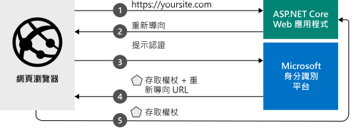

# <a name="quickstart-add-sign-in-with-microsoft-to-an-aspnet-core-web-app"></a>快速入門：將「使用 Microsoft 登入」新增至 ASP.NET Core Web 應用程式

[!INCLUDE [active-directory-develop-applies-v2](../../../includes/active-directory-develop-applies-v2.md)]

在本快速入門中，您將了解 ASP.NET Core Web 應用程式如何從任何 Azure Active Directory (Azure AD) 執行個體登入個人帳戶 (hotmail.com、outlook.com 等) 與公司和學校帳戶。



> [!div renderon="docs"]
> ## <a name="register-and-download-your-quickstart-app"></a>註冊並下載快速入門應用程式
> 有兩個選項可用來啟動快速入門應用程式：
> * [快速] [選項 1：註冊和自動設定您的應用程式，然後下載程式碼範例](#option-1-register-and-auto-configure-your-app-and-then-download-your-code-sample)
> * [手動] [選項 2：註冊並手動設定您的應用程式和程式碼範例](#option-2-register-and-manually-configure-your-application-and-code-sample)
>
> ### <a name="option-1-register-and-auto-configure-your-app-and-then-download-your-code-sample"></a>選項 1：註冊和自動設定您的應用程式，然後下載程式碼範例
>
> 1. 移至 [Azure 入口網站 - 應用程式註冊](https://aka.ms/aspnetcore2-1-aad-quickstart-v2)。
> 1. 輸入應用程式的名稱，並選取 [註冊]。
> 1. 依照指示按一下滑鼠，即可下載並自動設定新的應用程式。
>
> ### <a name="option-2-register-and-manually-configure-your-application-and-code-sample"></a>選項 2：註冊並手動設定您的應用程式和程式碼範例
>
> #### <a name="step-1-register-your-application"></a>步驟 1：註冊您的應用程式
> 若要註冊您的應用程式，並手動將應用程式註冊資訊新增到您的解決方案，請執行下列步驟：
>
> 1. 使用公司或學校帳戶或個人的 Microsoft 帳戶登入 [Azure 入口網站](https://portal.azure.com)。
> 1. 如果您的帳戶可讓您存取多個租用戶，請在右上角選取帳戶，然後將您的入口網站工作階段設定為想要的 Azure AD 租用戶。
> 1. 瀏覽至 Microsoft 身分識別平台，以取得開發人員的[應用程式註冊](https://go.microsoft.com/fwlink/?linkid=2083908)頁面。
> 1. 選取 [新增註冊]。
> 1. 當 [註冊應用程式] 頁面出現時，輸入您應用程式的註冊資訊：
>    - 在 [名稱] 區段中，輸入將對應用程式使用者顯示、且有意義的應用程式名稱，例如 `AspNetCore-Quickstart`。
>    - 在 [重新導向 URL] 中新增 `https://localhost:44321/`，然後選取 [註冊]。
> 1. 選取 [驗證] 功能表，然後新增下列資訊：
>    - 在 [重新導向 URL] 中新增 `https://localhost:44321/signin-oidc`，然後選取 [儲存]。
>    - 在 [進階設定] 區段中，將 [登出 URL]設定為 `https://localhost:44321/signout-oidc`。
>    - 在 [隱含授與] 底下，核取 [識別碼權杖]。
>    - 選取 [ **儲存**]。

> [!div class="sxs-lookup" renderon="portal"]
> #### <a name="step-1-configure-your-application-in-the-azure-portal"></a>步驟 1：在 Azure 入口網站中設定您的應用程式
> 若要讓本快速入門的程式碼範例運作，您必須將回覆 URL 新增為 `https://localhost:44321/` 和 `https://localhost:44321/signin-oidc`，並將登出 URL 新增為 `https://localhost:44321/signout-oidc`，然後要求由授權端點簽發識別碼權杖。
> > [!div renderon="portal" id="makechanges" class="nextstepaction"]
> > [為我進行這項變更]()
>
> > [!div id="appconfigured" class="alert alert-info"]
> >  您的應用程式已設定了這些屬性。

#### <a name="step-2-download-your-aspnet-core-project"></a>步驟 2：下載您的 ASP.NET Core 專案

- [下載 Visual Studio 2017 解決方案](https://github.com/Azure-Samples/active-directory-aspnetcore-webapp-openidconnect-v2/archive/aspnetcore2-2.zip)

#### <a name="step-3-configure-your-visual-studio-project"></a>步驟 3：設定您的 Visual Studio 專案

1. 將 ZIP 檔案解壓縮至根資料夾內的本機資料夾 - 例如 **C:\Azure-Samples**
1. 如果您使用 Visual Studio 2017，請在 Visual Studio 中開啟解決方案 (選用)。
1. 編輯 **appsettings.json** 檔案。 找出 `ClientId`，並將 `ClientId` 的值更新為剛剛所註冊應用程式的 [應用程式 (用戶端) 識別碼] 值。 

    ```json
    "ClientId": "Enter_the_Application_Id_here"
    "TenantId": "Enter_the_Tenant_Info_Here"
    ```

> [!div renderon="docs"]
> 其中：
> - `Enter_the_Application_Id_here` 是註冊於 Azure 入口網站中的應用程式所具備的**應用程式 (用戶端) 識別碼**。 您可以在應用程式的 [概觀] 頁面中找到**應用程式 (用戶端) 識別碼**。
> - `Enter_the_Tenant_Info_Here` 是下列其中一個選項：
>   - 如果您的應用程式支援 [僅限此組織目錄中的帳戶]，請將此值取代為 [租用戶識別碼] 或 [租用戶名稱] (例如 contoso.microsoft.com)
>   - 如果您的應用程式支援 [任何組織目錄中的帳戶]，請將此值取代為 `organizations`
>   - 如果您的應用程式支援 [所有 Microsoft 帳戶使用者]，請將此值取代為 `common`
>
> > [!TIP]
> > 若要尋找 [應用程式 (用戶端) 識別碼]、[目錄 (租用戶) 識別碼] 和 [支援的帳戶類型] 的值，請在 Azure 入口網站中移至應用程式的 [概觀] 頁面。

## <a name="more-information"></a>詳細資訊

本節會概述登入使用者所需的程式碼。 這有助於了解程式碼的運作方式、主要引數，以及如何將登入新增至現有的 ASP.NET Core 應用程式。

### <a name="startup-class"></a>啟始類別

Microsoft.AspNetCore.Authentication 中介軟體會使用啟始類別，這會在初始化主機處理序時執行：

```csharp
public void ConfigureServices(IServiceCollection services)
{
  services.Configure<CookiePolicyOptions>(options =>
  {
    // This lambda determines whether user consent for non-essential cookies is needed for a given request.
    options.CheckConsentNeeded = context => true;
    options.MinimumSameSitePolicy = SameSiteMode.None;
  });

  services.AddAuthentication(AzureADDefaults.AuthenticationScheme)
          .AddAzureAD(options => Configuration.Bind("AzureAd", options));

  services.Configure<OpenIdConnectOptions>(AzureADDefaults.OpenIdScheme, options =>
  {
    options.Authority = options.Authority + "/v2.0/";         // Microsoft identity platform

    options.TokenValidationParameters.ValidateIssuer = false; // accept several tenants (here simplified)
  });

  services.AddMvc(options =>
  {
     var policy = new AuthorizationPolicyBuilder()
                     .RequireAuthenticatedUser()
                     .Build();
     options.Filters.Add(new AuthorizeFilter(policy));
  })
  .SetCompatibilityVersion(CompatibilityVersion.Version_2_1);
}
```

`AddAuthentication` 方法會將服務設定為可新增 Cookie 型驗證 (用於瀏覽器案例)，以及可對 OpenID Connect 設定挑戰。 

包含 `.AddAzureAd` 的程式碼行會將 Microsoft 身分識別驗證新增至您的應用程式。 然後設定為使用 Microsoft 身分識別平台端點登入。

> |Where  |  |
> |---------|---------|
> | ClientId  | 應用程式 (用戶端) 識別碼 (在 Azure 入口網站中註冊的應用程式)。 |
> | 授權單位 | 供使用者用於驗證的 STS 端點。 通常，這會是公用雲端的 <https://login.microsoftonline.com/{tenant}/v2.0>，其中 {tenant} 為您的租用戶名稱或租用戶識別碼，或是使用 common，以參考一般端點 (用於多租用戶應用程式) |
> | TokenValidationParameters | 用於權杖驗證的參數清單。 在此案例中，`ValidateIssuer` 設為 `false`，表示它可以接受來自任何個人或公司或學校帳戶的登入。 |


> [!NOTE]
> 設定 `ValidateIssuer = false` 可簡化本快速入門。 在實際的應用程式中，您需要驗證簽發者。
> 請參閱範例以了解如何執行該動作。

### <a name="protect-a-controller-or-a-controllers-method"></a>保護控制器或控制器的方法

您可以使用 `[Authorize]` 屬性來保護控制站或控制站方法。 這個屬性會將控制站或方法的存取限制為只允許已驗證的使用者，這表示如果使用者未經過驗證，則可啟動驗證挑戰來存取控制站。

[!INCLUDE [Help and support](../../../includes/active-directory-develop-help-support-include.md)]

## <a name="next-steps"></a>後續步驟

請查看此 ASP.NET Core 教學課程的 GitHub 存放庫，以取得詳細資訊：包括如何將驗證新增至全新 ASP.NET Core Web 應用程式、如何呼叫 Microsoft Graph 和其他 Microsoft API、如何呼叫您自己的 API、如何新增授權、如何在國家雲端登入使用者、或使用社交身分識別登入使用者的指示等：

> [!div class="nextstepaction"]
> [ASP.NET Core Web 應用程式教學課程](https://github.com/Azure-Samples/active-directory-aspnetcore-webapp-openidconnect-v2/)
