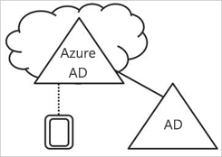
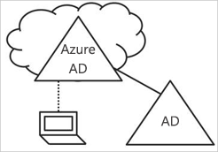
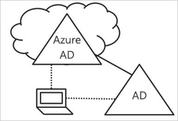

# Azure Active Directory 中的裝置管理簡介

在行動第一、雲端第一的世界中，Azure Active Directory (Azure AD) 可讓您從任何地方單一登入至裝置、應用程式和服務。 隨著裝置的激增 - 包括自備裝置 (BYOD)，IT 專業人員面臨到兩個相對的目標︰

- 讓使用者隨時隨地都具有生產力
- 隨時保護公司資產

透過裝置，您的使用者可存取公司資產。 為了保護公司資產，身為 IT 管理員，您希望控制這些裝置。 這可讓您確保使用者會從符合安全性與合規性之標準的裝置來存取您的資源。 

裝置管理也是[裝置型條件式存取](../conditional-access/require-managed-devices.md)的基礎。 使用裝置型條件式存取時，您可以確保只能透過受控裝置存取環境中的資源。   

本文說明 Azure Active Directory 中的裝置管理運作方式。

## 取得 Azure AD 控制下的裝置

若要取得 Azure AD 控制下的裝置，您有兩個選項：

- 註冊 
- 加入

向 Azure AD **註冊**裝置可讓您管理裝置的身分識別。 當裝置已註冊時，Azure AD 裝置註冊會在使用者登入 Azure AD 時對裝置提供用來驗證裝置的身分識別。 您可以使用此身分識別來啟用或停用裝置。

與 Microsoft Intune 這類的行動裝置管理 (MDM) 解決方案結合時，將會以裝置的其他相關資訊更新 Azure AD 中的裝置屬性。 這可讓您建立條件式存取規則，強制讓裝置的存取符合您的安全性和相容性標準。 如需如何在 Microsoft Intune 中註冊裝置的詳細資訊，請參閱＜在 Intune 中註冊要管理的裝置＞。

**加入**裝置是註冊裝置的擴充功能。 這表示，它會為您提供註冊裝置的所有優點，此外，也會變更裝置的本機狀態。 變更本機狀態可讓您的使用者使用組織的公司或學校帳戶 (而非個人帳戶) 來登入裝置。

## Azure AD 註冊裝置   

Azure AD 註冊裝置的目標是為您提供**自備裝置 (BYOD)** 案例的支援。 在此案例中，使用者可以使用個人裝置存取貴組織的 Azure Active Directory 受控資源。  

此存取是根據裝置上輸入的公司或學校帳戶。  
例如，Windows 10 可讓使用者將公司或學校帳戶新增至個人電腦、平板電腦或電話。  
當使用者新增公司帳戶或學校帳戶時，會向 Azure AD 註冊裝置，並選擇性地在貴組織已設定的行動裝置管理 (MDM) 系統中註冊。 貴組織的使用者可以非常方便地將公司或學校帳戶新增至個人裝置：

- 第一次存取工作應用程式時
- 在 Windows 10 的情況下，手動透過 [設定] 功能表 

您可以為 Windows 10、iOS、Android 和 macOS 設定 Azure AD 註冊裝置。

## Azure AD 加入裝置

Azure AD 加入裝置的目標是簡化：

- Windows 部署工作用的裝置 
- 從任何 Windows 裝置存取組織應用程式與資源
- 工作用裝置的雲端式管理

您可以使用下列任何一種方法來部署 Azure AD Join： 
 - [Windows Autopilot](https://docs.microsoft.com/windows/deployment/windows-autopilot/windows-10-autopilot)
 - [大量部署](https://docs.microsoft.com/intune/windows-bulk-enroll)
 - [自助體驗](azuread-joined-devices-frx.md) 

**Azure AD Join** 適用於想要採用雲端優先 (亦即，以使用雲端服務為主，目標是減少使用內部部署基礎結構) 或只使用雲端 (沒有內部部署基礎結構) 的組織。 針對哪些組織可以部署 Azure AD Join，並沒有任何大小或類型的限制。 Azure AD Join 即使在混合式環境中也可以良好運作，可讓您同時存取雲端及內部部署應用程式與資源。

實作 Azure AD 加入裝置提供下列優點：

- **單一登入 (SSO)** Azure 受控 SaaS 應用程式和服務。 存取工作資源時，您的使用者看不到額外的驗證提示。 即使它們未連線到網域網路，也可使用 SSO 功能。

- 在跨加入裝置之間進行使用者設定的**企業符合規範漫遊**。 使用者不需要連線 Microsoft 帳戶 (例如 Hotmail) 以查看裝置之間的設定。

- 使用 Azure AD 帳戶**存取商務用 Windows 市集**。 您的使用者可以從組織預先選取之應用程式清查中選擇。

- **Windows Hello** 支援安全又方便地存取工作資源。

- **限制**僅從符合合規性原則的裝置存取應用程式。

- 當裝置可以看見內部部署網域控制站時，即可**順暢地存取內部部署資源**。 

雖然 Azure AD Join 主要適用於沒有內部部署 Windows Server Active Directory 基礎結構的組織，但您也可以在下列情況下使用它：

- 您想要使用 Azure AD 和 MDM (例如 Intune) 來轉換成雲端式基礎結構。

- 例如，如果您需要取得行動裝置 (例如控制下的平板電腦和電話)，您無法使用內部部署網域加入。

- 您的使用者主要需要存取 Office 365 或與 Azure AD 整合的其他 SaaS 應用程序。

- 您想要管理 Azure AD 中的使用者群組，而不是 Active Directory 中的使用者群組。 例如，這可以套用於季節工、約聘員工或學生。

- 您要為內部部署基礎結構受到限制的遠端分公司工作者提供加入功能。

您可以設定適用於 Windows 10 裝置的 Azure AD 已加入裝置。

## 混合式 Azure AD 已加入裝置

十多年來，許多組織已對他們的內部部署 Active Directory 使用網域加入以讓：

- IT 部門可從中央位置管理工作用的裝置。

- 使用者可使用使用其 Active Directory 公司或學校帳戶登入他們的裝置。 

通常，具有內部部署使用量的組織依賴映像處理方法來佈建裝置，且通常使用 **System Center Configuration Manager (SCCM)** 或**群組原則 (GP)** 加以管理。

如果您的環境具有內部部署 AD 使用量，而且您也想要從 Azure Active Directory 所提供的功能受益，您可以實作混合式 Azure AD 已加入裝置。 這些裝置既可以加入您的內部部署 Active Directory，也可以加入 Azure Active Directory。

您應該使用 Azure AD 混合式加入裝置，如果：

- 您已將 Win32 應用程式部署至這些倚賴 Active Directory 電腦驗證的裝置。

- 您需要 GP 來管理裝置。

- 您想要繼續使用映像處理解決方案來設定員工的裝置。

您可以針對 Windows 10 及舊版裝置 (例如 Windows 8 和 Windows 7) 設定混合式 Azure AD 已加入裝置。

## 總結

使用 Azure AD 中的裝置管理，您可以： 

- 簡化攜帶 Azure AD 控制下的裝置的流程

- 為使用者提供對貴組織雲端式資源易於使用的存取方式

根據經驗法則，您應該使用：

- Azure AD 註冊裝置：

    - 對於個人裝置 

    - 若要手動向 Azure AD 註冊裝置

- Azure AD 已加入裝置： 

    - 對於您的組織所擁有的裝置

    - 對於**未**加入內部部署 AD 的裝置

    - 若要手動向 Azure AD 註冊裝置

    - 若要變更裝置的本機狀態

- 已加入內部部署 AD 之裝置的混合式 Azure AD 已加入裝置     

    - 對於您的組織所擁有的裝置

    - 對於已加入內部部署 AD 的裝置

    - 若要自動向 Azure AD 中註冊裝置

    - 若要變更裝置的本機狀態

## 後續步驟

- 若要取得在 Azure 入口網站中管理裝置的概觀，請參閱[使用 Azure 入口網站來管理裝置](device-management-azure-portal.md)

- 若要深入了解裝置型條件式存取，請參閱[設定 Azure Active Directory 裝置型條件式存取原則](../conditional-access/require-managed-devices.md)。

- 若要設定：
    - 已註冊 Azure Active Directory 的 Windows 10 裝置，請參閱[如何設定已註冊 Azure Active Directory 的 Windows 10 裝置](../user-help/device-management-azuread-registered-devices-windows10-setup.md)
    - 已加入 Azure Active Directory 的裝置，請參閱[如何設定已加入 Azure Active Directory 的裝置](../user-help/device-management-azuread-joined-devices-setup.md)
    - 已加入混合式 Azure AD 的裝置，請參閱[如何規劃混合式 Azure Active Directory Join 實作](hybrid-azuread-join-plan.md)。

