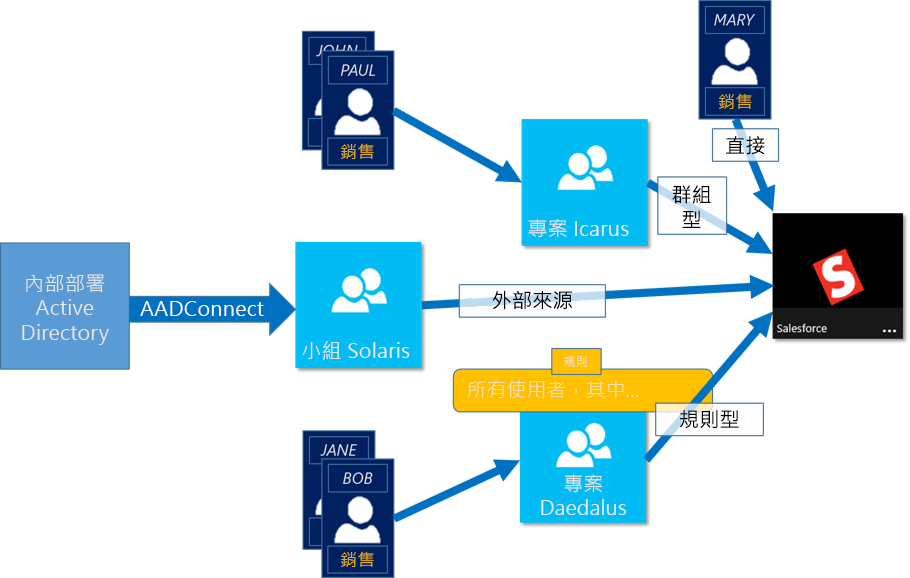
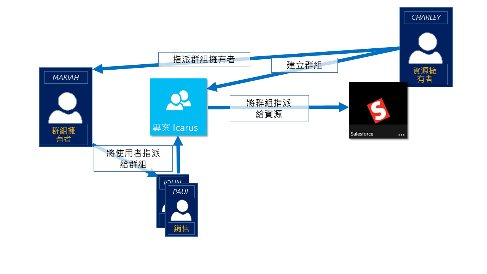

# 使用 Azure Active Directory 群組來管理資源的存取權
Azure Active Directory (Azure AD) 是一個身分識別與存取管理的綜合性解決方案，提供許多強大的功能來管理內部部署和雲端應用程式和資源的存取權，包括如 Office 365 的 Microsoft 線上服務，以及非 Microsoft 的 SaaS 應用程式。 本文會提供概觀，但如果您要立即開始使用 Azure AD 群組，請遵循 [在 Azure AD 中管理安全性群組](active-directory-groups-create-azure-portal.md)的指示。 如果您想要看看如何使用 PowerShell 管理 Azure Active directory 中的群組，則可以在 [適用於群組管理的 Azure Active Directory Cmdlet](../users-groups-roles/groups-settings-v2-cmdlets.md)中深入了解。

> [!NOTE]
> 若要使用 Azure Active Directory，您需要 Azure 帳戶。 如果您沒有帳戶，您可以 [註冊免費的 Azure 帳戶](https://azure.microsoft.com/pricing/free-trial/)。
>
>

Azure AD 的其中一項主要功能是管理資源的存取權。 這些資源可以是目錄的一部分，例如透過目錄中的角色或目錄外部的資源 (例如 SaaS 應用程式、Azure 服務以及 SharePoint 網站或內部部署資源) 管理物件的權限。 有四種方式可以指派使用者存取資源的權限：

1. 直接指派

    資源的擁有者可以直接指派使用者存取資源。
2. 群組成員資格

    資源擁有者可以指派群組存取資源，透過這種方式，授與該群組成員存取資源。 群組的擁有者就可以管理群組的成員資格。 實際上，資源擁有者是委派權限給群組的擁有者，以指派使用者存取其資源。
3. 以規則為基礎

    資源擁有者可以使用規則來表示應指派哪些使用者存取資源。 規則的結果取決於該規則中使用的屬性，以及針對特定使用者的值，透過這種方式，資源擁有者實際上是根據規則中所使用的屬性，委派給授權的來源來管理其資源的存取權。 資源擁有者仍可管理規則本身，並決定哪些屬性與值提供其資源的存取權。
4. 外部授權單位

    資源的存取權從外部來源衍生而來，例如從授權來源 (例如內部部署目錄或如 WorkDay 的 SaaS 應用程式) 同步處理的群組。 資源擁有者指派群組以提供資源存取權，外部來源管理群組的成員。

   

## 觀看說明存取管理的影片
您可以在此觀賞說明與此相關的短片：

**Azure AD：群組的動態成員資格簡介**

> [!VIDEO https://channel9.msdn.com/Series/Azure-Active-Directory-Videos-Demos/Azure-AD--Introduction-to-Dynamic-Memberships-for-Groups/player]
>
>

## 存取管理在 Azure Active Directory 中如何運作？
Azure AD 存取管理解決方案的重點是安全性群組。 使用安全性群組來管理資源的存取權是著名的範例，方法彈性而且容易理解，可以針對想要的使用者群組提供資源的存取權。 資源擁有者 (或目錄的系統管理員) 可以指派群組，對所擁有的資源提供特定的存取權限。 群組的成員會取得存取權，而資源擁有者可以委派管理群組成員清單的權限給其他人，例如部門經理或技術服務管理員。

群組的擁有者也可以讓該群組供自助式服務要求使用。 如此一來，使用者可以搜尋和尋找群組並提出要求加入，就可以尋求權限以存取透過群組所管理的資源。 群組的擁有者可以設定群組，自動核准加入的要求，或者需要經過群組的擁有者核准。 當使用者提出加入群組的要求時，加入要求會轉送給群組的擁有者。 如果其中一個擁有者核准要求，提出要求的使用者會收到通知，並且加入群組。 如果其中一個擁有者拒絕要求，提出要求的使用者會收到通知，但不會加入群組。

## 開始使用存取管理
準備好開始了嗎？ 您可以嘗試一些可以使用 Azure AD 群組進行的基本工作。 使用這些功能，針對組織中的不同資源，提供特殊存取權給不同群組的人員。 以下是基本的首要步驟清單。

* [建立簡單的規則，設定群組的動態成員資格](active-directory-groups-create-azure-portal.md)
* [使用群組來管理 SaaS 應用程式的存取權](../users-groups-roles/groups-saasapps.md)
* [提供可供一般使用者自助服務的群組](../users-groups-roles/groups-self-service-management.md)
* [使用 Azure AD Connect 將內部部署群組同步處理至 Azure](../connect/active-directory-aadconnect.md)
* [管理群組的擁有者](active-directory-accessmanagement-managing-group-owners.md)

## 後續步驟
如果您已經了解存取管理的基本概念，以下是一些 Azure Active Directory 中可用的其他進階功能，可以管理您的應用程式和資源的存取權。

* [使用屬性來建立進階規則](../active-directory-groups-dynamic-membership-azure-portal.md)
* [在 Azure AD 中管理安全性群組](active-directory-groups-create-azure-portal.md)
* [群組的圖形 API 參考](https://msdn.microsoft.com/Library/Azure/Ad/Graph/api/groups-operations#GroupFunctions)
* [設定群組設定的 Azure Active Directory Cmdlet](../users-groups-roles/groups-settings-cmdlets.md)
