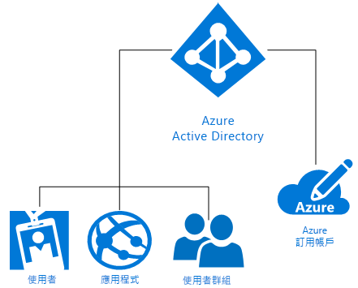

# 了解 Azure 身分識別解決方案
Microsoft Azure Active Directory (Azure AD) 是一個身分識別和存取管理的雲端解決方案，可提供目錄服務、身分識別治理及應用程式存取管理。 Azure AD 可在 [Azure AD 應用程式庫](https://azure.microsoft.com/marketplace/active-directory/all/)中，快速[啟用單一登入 (SSO)](https://docs.microsoft.com/azure/active-directory/active-directory-enterprise-apps-manage-sso) 至 1,000 個預先整合的商業和自訂應用程式。 您可能已經使用這其中有許多應用程式，例如 Office 365、Salesforce.com、Box、ServiceNow 及 Workday。

單一 Azure AD 目錄會在建立時自動與 Azure 訂用帳戶產生關聯。 作為 Azure 中的識別服務，Azure AD 接著會針對雲端式資源提供所有身分識別管理和存取控制功能。 這些資源可以包含個別租用戶 (組織) 的使用者、應用程式及群組，如下圖所示：

Microsoft Azure 可提供數種方式，運用包含不同複雜性等級的身分識別即服務 (IDaaS)，來符合個別組織的需求。 本文的其餘部分將協助您了解基本的 Azure 身分識別術語和概念，以及協助您從可用選項做出最佳選擇的建議。

## 須知詞彙

您需要初步了解提及 Azure 識別服務時的常用詞彙之後，才能決定適用於貴組織的 Azure 身分識別解決方案。

|須知詞彙| 說明|
|-----|-----|
|Azure 訂用帳戶 |訂用帳戶會用來支付 Azure 雲端服務，且通常會連結到一張信用卡。 您可以擁有數個訂用帳戶，但就很難在訂用帳戶之間共用資源。|
|Azure 租用戶 | Azure AD 租用戶是代表單一組織。 它是組織在註冊 Microsoft 雲端服務訂用帳戶 (例如 Azure、Intune 或 Office 365) 時，自動建立的專屬且受信任 Azure AD 執行個體。 租用戶可以在任一個專用環境 (單一租用戶)，或與其他組織 (多租用戶) 共用環境中取得服務的存取權。|
|Azure AD 目錄 | 每個 Azure 租用戶都具有專用、受信任的 Azure AD 目錄，其中包含租用戶的使用者、群組和應用程式。 它可用來執行身分識別和存取租用戶資源的管理功能。 當您註冊諸如 Azure、Microsoft Intune 或 Office 365 等 Microsoft 雲端服務時，會自動佈建唯一的 Azure AD 目錄來代表貴組織，因此有時候您會看到租用戶、Azure AD 和 Azure AD directory這些詞彙在交換使用。 |
|自訂網域 | 當您第一次註冊 Microsoft 雲端服務訂用帳戶時，您的租用戶 (組織) 會使用 .onmicrosoft.com 網域名稱。 不過，大部分的組織會使用一或多個網域名稱來執行業務，並讓使用者用來存取公司資源。 您可以將自訂網域名稱新增至 Azure AD，讓您的使用者熟悉網域名稱，例如 *alice@contoso.com* 而不是 *alice@contoso.onmicrosoft.com*。 |
|Azure AD 帳戶 | 這些身分識別是使用 Azure AD 或其他 Microsoft 雲端服務 (例如 Office 365) 所建立的。 它們儲存在 Azure AD 中，且組織的任何雲端服務訂用帳戶皆可存取。 |
|Azure 訂用帳戶管理員| 帳戶管理員就是註冊或購買 Azure 訂用帳戶的人員。 他們可以使用[帳戶中心](https://account.azure.com/Subscriptions)來執行各種管理工作，例如，建立訂用帳戶、取消訂用帳戶、變更訂用帳戶的計費方式或變更服務管理員。 |
|Azure AD 全域系統管理員 | Azure AD 全域系統管理員可完整存取所有的 Azure AD 系統管理功能。 依預設，註冊 Microsoft 雲端服務訂用帳戶的人員會自動成為全域系統管理員。 您可以擁有一個以上的全域系統管理員，但只有全域系統管理員才能將任何[其他的系統管理員角色](https://docs.microsoft.com/azure/active-directory/active-directory-assign-admin-roles-azure-portal)指派給使用者。 |
|Microsoft 帳戶 | Microsoft 帳戶 (您基於個人用途所建立) 可提供存取消費者導向的 Microsoft 產品和雲端服務，例如 Outlook (Hotmail)、OneDrive、Xbox LIVE 或 Office 365。 會在 Microsoft 所執行的 Microsoft 取用者身分識別帳戶系統中建立這些身分識別並加以儲存。|
|工作或學校帳戶 | 工作或學校帳戶 (系統管理員為了商業/學術用途所發出) 可提供存取所有企業商業層級 Microsoft 雲端服務，例如 Azure、Intune 或 Office 365。|

## 須知概念

現在您已知道基本的 Azure 識別詞彙，接著應該深入了解這些 Azure 身分識別概念，以協助您做出明智的 Azure 識別服務決策。

|須知概念 |說明|
|-----|-----|
|[Azure 訂用帳戶如何與 Azure Active Directory 產生關聯](https://docs.microsoft.com/azure/active-directory/active-directory-how-subscriptions-associated-directory) |每個 Azure 訂用帳戶都具有 Azure AD 目錄的信任關係，可驗證使用者、服務和裝置。 多個訂用帳戶可以信任相同的 Azure AD 目錄，但一個訂用帳戶將只會信任單一 Azure AD 目錄。 這個信任關係不同於訂用帳戶與其他 Azure 資源 (網站、資料庫等) 之間的關係，後者比較像是訂用帳戶的子資源。 如果訂用帳戶已過期，則也會停止存取與 Azure AD 之外的訂用帳戶相關聯的資源。 不過，Azure AD 目錄會保留在 Azure 中，因此您可以將其他訂用帳戶與該目錄產生關聯，並繼續管理租用戶資源。|
|[Azure AD 授權的運作方式](https://docs.microsoft.com/azure/active-directory/active-directory-licensing-get-started-azure-portal) | 當您購買或啟用 Enterprise Mobility Suite、Azure AD Premium 或 Azure AD Basic 時，您的目錄會隨著訂用帳戶更新，包括其有效期間和預付授權。 一旦訂用帳戶啟用後，Azure AD 全域管理員就能管理服務，且可供授權的使用者使用。 可在 Azure 入口網站中的 [Azure Active Directory] > [授權] 刀鋒視窗中取得您訂用帳戶的資訊 (包括已指派或可用的授權數目)。 這也是管理您的授權指派最佳的位置。|
|[Azure 入口網站中的角色型存取控制](https://docs.microsoft.com/azure/role-based-access-control/overview)|Azure 角色型存取控制 (RBAC) 可協助提供 Azure 資源的更細緻存取權管理。 權限太多可能會使帳戶暴露在攻擊者的威脅下。 權限太少則會讓員工無法有效率地完成工作。 使用 RBAC 時，您可以套用至所有資源群組的三個基本角色︰擁有者、參與者、讀取器作為基礎，為員工提供他們需要的確切權限。 您也可以建立最多 2000 個您自己的[自訂 RBAC 角色](https://docs.microsoft.com/azure/role-based-access-control/custom-roles)，來符合您特定的需求。 |
|[混合式身分識別](https://docs.microsoft.com/azure/active-directory/connect/active-directory-aadconnect)|您可以使用 [Azure AD Connect](https://docs.microsoft.com/azure/active-directory/connect/active-directory-aadconnect)，將內部部署 Windows Server Active Directory (AD DS) 與 Azure AD 整合，來達成混合式身分識別。 這可讓您為與 Azure AD 整合之 Office 365、Azure 和內部部署應用程式或 SaaS 應用程式的使用者提供通用身分識別。 您可以利用混合式身分識別，有效地將內部部署環境擴充到雲端，以進行身分識別與存取。|

### Windows Server AD DS 與 Azure AD 之間的差異
Azure Active Directory (Azure AD) 和內部部署 Active Directory (Active Directory Domain Services 或 AD DS) 是儲存目錄資料及管理使用者與資源間通訊的系統，包括使用者登入程序、驗證和目錄搜尋。

如果您已經熟悉內部部署 Windows Server Active Directory Domain Services (AD DS)，第一次引進了 Windows 2000 Server，那麼您應該了解識別服務的基本概念。 不過，也請務必了解 Azure AD 不只是雲端中的網域控制站。 它是在 Azure 中提供身分識別即服務 (IDaaS) 的一個嶄新方式，需要全新的思維模式來充分發揮雲端式功能，並保護貴組織免於遭受最新的威脅攻擊。 

AD DS 是 Windows Server 上的伺服器角色，這表示它可以部署在實體或虛擬機器上。 它具有以 X.500 為基礎的階層式結構。 它會將 DNS 用於尋找物件 (可與使用 LDAP 互動)，而且主要使用 Kerberos 進行驗證。 除了讓機器加入網域以外，Active Directory 還可啟用組織單位 (OU) 和群組原則物件 (GPO)，而且網域之間會產生信任。

多年來，IT 都是使用 AD DS 來保護其安全性周邊，但現代化、無周邊的企業基於為員工、客戶及合作夥伴提供識別身分需求的支援，而需要新的控制項平面。 Azure AD 就是這個身分識別控制平面。 安全性已超越公司防火牆而移至雲端，Azure AD 會透過為使用者提供一個通用身分識別 (在內部部署或雲端)，從而保護公司資源及存取。 這可為您的使用者提供彈性，使其幾乎可從任意裝置中安全地存取完成工作所需的應用程式。 此外，還提供了無縫式風險型資料保護控制項 (透過機器學習服務功能和深入報告來支援)，IT 人員需要這類控制項來保護公司資料的安全。

Azure AD 是多客戶公用目錄服務，這表示您可以在 Azure AD 中針對雲端伺服器和應用程式 (例如 Office 365) 建立租用戶。 使用者和群組會建立於單層式結構中 (不含 OU 或 GPO)。 驗證會透過通訊協定 (如 SAML、WS-同盟和 OAuth) 執行。 您可以查詢 Azure AD，但不是使用 LDAP，而必須使用名為 AD Graph API 的 REST API。 這些全都透過 HTTP 和 HTTPS 進行。

### 擴充 Office 365 管理與安全性功能
已經在使用 Office 365 了嗎？ 您可以透過使用 Azure AD 來擴充內建的 Office 365 功能，以保護所有資源的安全，並使整體人力發揮安全的產能，從而加速您的數位轉換。 當您使用 Azure AD 時，除了 Office 365 功能，還能利用某個針對所有應用程式啟用單一登入的身分識別，來保護整個應用程式組合的安全。 您不只能以裝置狀態，還能以使用者、位置、應用程式和風險作為基礎，來擴充條件式存取功能。 您在需要時，Multi-Factor Authentication (MFA) 功能提供更多的保護。 您將取得使用者權限的其他監督權，並提供隨選、及時的管理存取。 您的使用者將更具生產力，且建立更少的技術支援票證，一切都要歸功於 Azure AD 所提供諸如將忘記的密碼進行重設、應用程式存取要求，以及建立和管理群組等自助功能。

> [!TIP]
> 想要進一步了解如何搭配 Office 365 使用 Azure AD 身分識別管理嗎？ [取得電子書](https://info.microsoft.com/Extend-Office-365-security-with-EMS.html)。

## Microsoft Azure 身分識別解決方案

Microsoft Azure 提供數種方式可供您管理使用者的身分識別，不論是完全在內部部署、僅在雲端中，或甚至是兩者之間的任何位置。 這些選項包括︰Azure 中的自己動手做 (DIY) AD DS、Azure Active Directory (Azure AD)、混合式身分識別和 Azure AD Domain Services。

### 自己動手做 (DIY) AD DS
對於只需要很小雲端使用量的公司，就可以使用 Azure 中的**自己動手做 (DIY) AD DS**。 此選項所支援的許多 Windows Server AD DS 案例，非常適合在 Azure 上部署作為虛擬機器 (VM)。 例如，您可以建立 Azure VM，作為連線到遠端網路的遠處資料中心內執行的網域控制器。 從該處，VM 就能夠支援遠端使用者的驗證要求，並提高驗證效能。 此選項也非常適合作為昂貴災害復原網站的相對低成本替代產品，方法是在 Azure 上裝載少量的網域控制器和單一虛擬網路。 最後，您可能需要在 Azure 上部署 SharePoint 等應用程式，如此一來就需要 Windows Server AD DS，但是不相依於內部部署網路或公司 Windows Server Active Directory。 在此情況下，您可以在 Azure 上部署隔離的樹系，以符合 SharePoint 伺服器陣列的要求。 它也支援部署需要連線到內部部署網路與內部部署 Active Directory 的網路應用程式。

### Azure Active Directory (Azure AD)
**Azure AD 獨立**是一個完整的雲端式身分識別與存取管理即服務 (IDaaS) 解決方案。 Azure AD 提供一組強固的功能，可管理使用者和群組。 對於內部部署與雲端應用程式 (例如 Office 365 等 Microsoft Web 服務，以及許多非 Microsoft 的軟體即服務 (SaaS) 應用程式) 也都可提供保護。 Azure AD 共有三種版本：免費版、基本版及進階版。 Azure AD 能提升組織效率，並可將周邊防火牆之外的安全性擴充至受 Azure 機器學習服務和其他進階安全性功能保護的新控制平面。

### 混合式身分識別
許多前瞻思考的 CIO 和企業捨棄了內部部署或以雲端為基礎的身分識別解決方案之間選擇，而是開始著眼於其公司的長遠方向，準備透過**混合式身分識別**解決方案，將他們的內部部署目錄擴充至雲端。 您可以透過混合式身分識別，取得真正的全域身分識別和存取管理解決方案，來為需要執行其工作的應用程式使用者提供安全且有效率的存取。

> [!TIP]
> 若要深入了解 CIO 如何將 Azure Active Directory 作為其 IT 策略的重心，請下載 [Azure Active Directory 的 CIO 指南](https://aka.ms/AzureADCIOGuide)。

### Azure AD 網域服務
**Azure AD Domain Services** 提供一個雲端式選項，可將 AD DS 用於輕量型 Azure VM 設定控制，並提供一種方式來符合網路應用程式開發與測試的內部部署身分識別需求。 Azure AD Domain Services 並非旨在將內部部署 Azure AD 基礎結構隨即轉移至 Azure AD Domain Services 所管理的 Azure VM。 相反地，應該使用受控網域中的 Azure VM 來支援開發、測試，以及將需要 AD DS 驗證方法的內部部署應用程式移動至雲端。

## 常見案例和建議

關於哪個是最適合的 Azure 身分識別選項，以下是一些常見的身分識別與存取案例和建議。

|身分識別案例| 建議|
|-----|-----|
|我的組織已大量投資於內部部署 Windows Server Active Directory，但是我們想要將身分識別擴充到雲端。| 最常用的 Azure 身分識別解決方案是[混合式身分識別](https://docs.microsoft.com/azure/active-directory/active-directory-hybrid-identity-design-considerations-overview)。 如果您已投資於內部部署 AD DS，可以使用 Azure AD Connect，輕鬆地將身分識別擴充至雲端。|
|我的企業是在雲端中創立，因此並未投資於內部部署身分識別解決方案。| 對於只有雲端而無內部部署投資的企業，[Azure Active Directory](https://docs.microsoft.com/azure/active-directory/active-directory-whatis) 是最佳的選擇。|
|我需要輕量型 Azure VM 設定和控制，以符合進行應用程式開發與測試時的內部部署身分識別需求。|如果您需要將 AD DS 用於輕量型 Azure VM 設定控制，或是計畫將舊式的目錄感知內部部署應用程式加以開發或移轉至雲端，[Azure AD Domain Services](https://docs.microsoft.com/azure/active-directory-domain-services/active-directory-ds-overview) 會是不錯的選擇。|  
|我在 Azure 中需要支援數部虛擬機器，但我的公司仍然大量投資於內部部署 Active Directory (AD DS)。|當您只需支援數部虛擬機器，卻大量投資於內部部署 AD DS 時，可透過 [DIY AD DS](https://msdn.microsoft.com/library/azure/jj156090.aspx) 來使用 Azure VM。 |

## 哪裡可以深入了解？
我們有無數的絕佳線上資源，協助您詳細了解 Azure AD。 以下是一些很棒的文章，讓您快速入門：

* [使用 Azure AD Connect 啟用目錄的混合式管理](../connect/active-directory-aadconnect.md)
* [為連線過的項目提供額外的安全性](../authentication/multi-factor-authentication.md)
* [自動化使用 Azure Active Directory 對於 SaaS 應用程式的使用者佈建和解除佈建](../active-directory-saas-app-provisioning.md)
* [從任何地方管理您的密碼](../user-help/active-directory-passwords-update-your-own-password.md)
* [什麼是搭配 Azure Active Directory 的應用程式存取和單一登入？](../manage-apps/what-is-single-sign-on.md)
* [自動化使用 Azure Active Directory 對於 SaaS 應用程式的使用者佈建和解除佈建](../active-directory-saas-app-provisioning.md)
* [如何為內部部署應用程式提供安全的遠端存取](../manage-apps/application-proxy.md)
* [使用 Azure Active Directory 群組來管理資源的存取權](active-directory-manage-groups.md)
* [什麼是 Microsoft Azure Active Directory 授權？](active-directory-licensing-whatis-azure-portal.md)
* [如何探索組織內使用未經批准的雲端應用程式](../manage-apps/cloud-app-discovery.md)

## 後續步驟

現在您已了解 Azure 身分識別的概念和可供您使用的選項，可以使用下列資源開始實作您所選擇的選項︰

[深入了解 Azure 混合式身分識別解決方案](https://docs.microsoft.com/azure/active-directory/choose-hybrid-identity-solution)

[深入了解 Azure 概念證明環境中的其他資訊](https://aka.ms/aad-poc)

[在生產環境中部署 Azure AD](https://aka.ms/aad-onboard)
