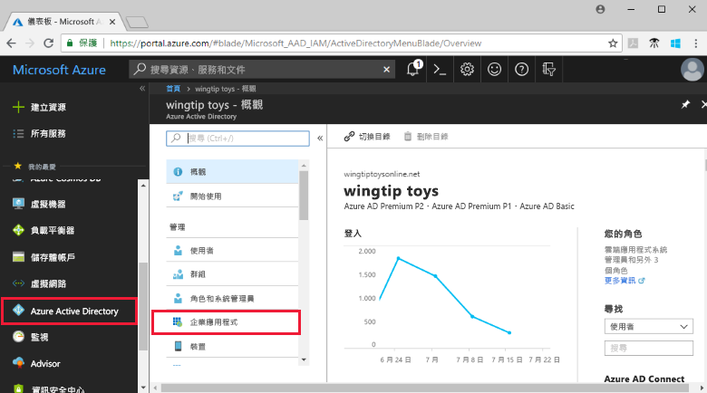
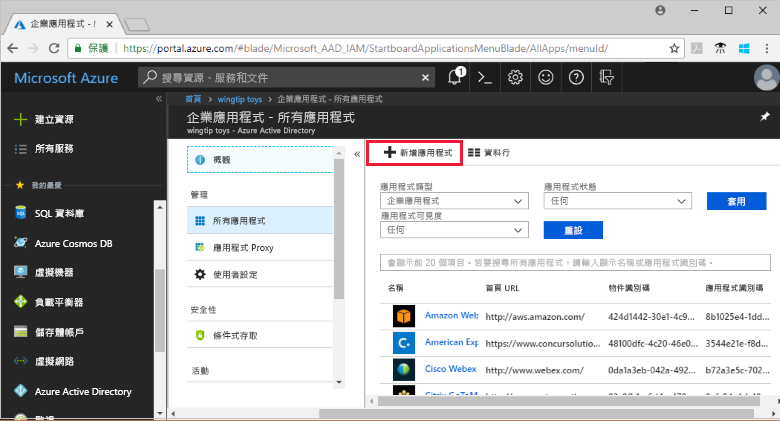
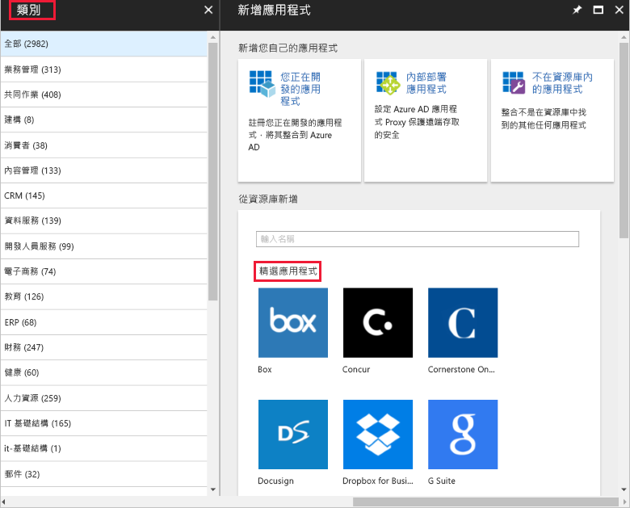
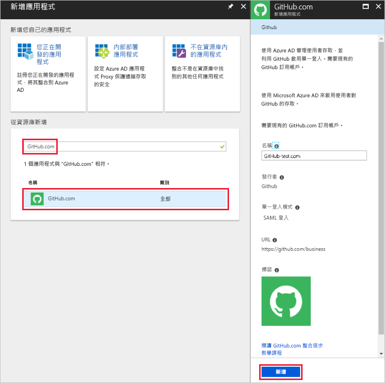
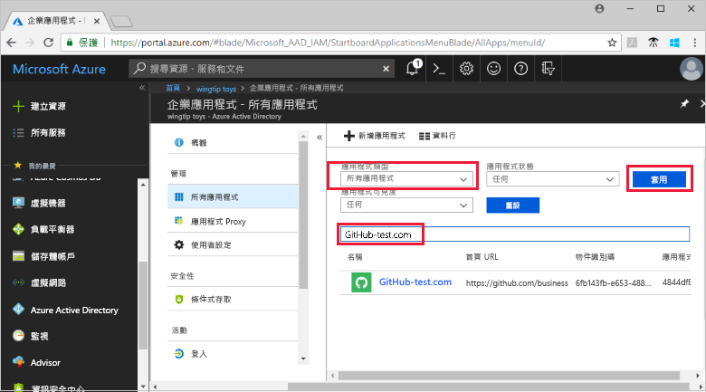
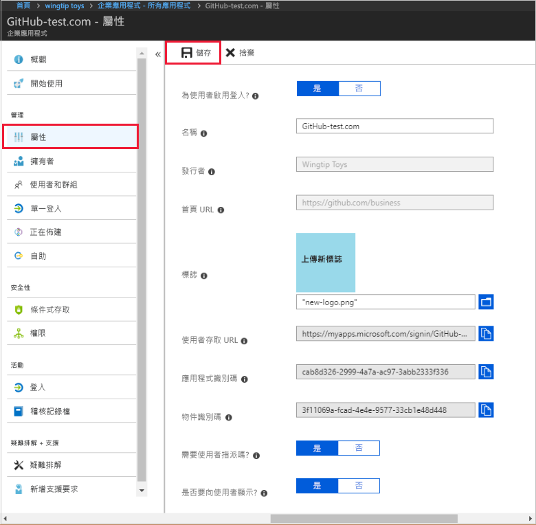
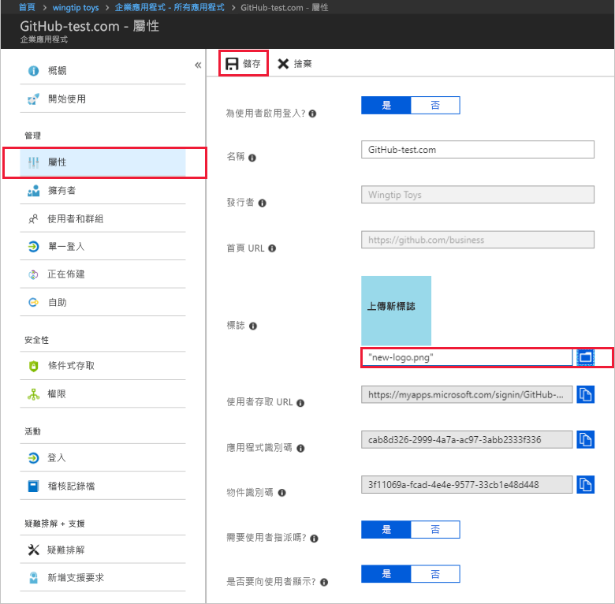

# 快速入門：新增應用程式到您的 Azure Active Directory 租用戶

Azure Active Directory (Azure AD) 有一個資源庫，其中包含數千個預先整合的應用程式。 您組織使用的某些應用程式可能就在資源庫中。 本快速入門會使用 Azure 入口網站，將資源庫應用程式新增至 Azure Active Directory (Azure AD) 租用戶。

將應用程式新增至 Azure AD 租用戶之後，您可以：

- 使用條件式存取原則來管理應用程式的使用者存取。
- 設定單一登入功能，讓使用者可以使用他們的 Azure AD 帳戶登入應用程式。

## 開始之前

若要將應用程式新增至您的租用戶，您需要：

- Azure AD 訂用帳戶
- 已針對應用程式啟用單一登入的訂用帳戶

以 Azure AD 租用戶全域管理員、雲端應用程式系統管理員或應用程式系統管理員的身分登入 [Azure 入口網站](https://portal.azure.com)。

若要測試本教學課程中的步驟，我們建議您使用非生產環境。 如果您沒有 Azure AD 的非生產環境，您可以[取得為期一個月的試用版](https://azure.microsoft.com/pricing/free-trial/)。

## 將應用程式新增至 Azure AD 租用戶

將資源庫應用程式新增至 Azure AD 租用戶：

1. 在 [Azure 入口網站](https://portal.azure.com)的左方瀏覽窗格中，選取 [Azure Active Directory]。

2. 在 [Azure Active Directory] 視格中，選取 [企業應用程式]。

    

3. [所有應用程式] 窗格會隨即開啟，並顯示 Azure AD 租用戶中應用程式的隨機樣本。 選取 [所有應用程式] 窗格頂端的 [新增應用程式]。

    

4. 在 [類別] 窗格中，您會在 [精選應用程式] 區域底下看到屬於資源庫應用程式隨機樣本的圖示。  若要查看更多應用程式，您可以選取 [顯示更多]。 但是，我們不建議以此方式搜尋，因為資源庫中有數千個應用程式。

    

5. 若要搜尋應用程式，請在 [從資源庫新增] 下方，輸入您要新增的應用程式名稱。 從結果中選取應用程式，然後選取 [新增]。 下列範例顯示搜尋 GitHub.com 後出現的 [新增應用程式] 表單。

    

6. 在應用程式專用的表單中，您可以變更屬性資訊。 例如，您可以編輯應用程式名稱，以符合您組織需求。 此範例使用的名稱是 **GitHub-test**。

7. 當您完成屬性變更後，請選取 [新增]。

8. [開始使用] 頁面會隨即顯示，其中包含可為您組織設定應用程式的選項。

您已完成新增應用程式。 如有需要，可以稍作休息。 下一節我們將示範如何變更應用程式的標誌和其他屬性。

## 尋找 Azure AD 租用戶應用程式

讓我們假設您剛才必須先離開，然後現在回來繼續設定您的應用程式。 您要做的第一件事是尋找應用程式。

1. 在 **[Azure 入口網站](https://portal.azure.com)** 的左方瀏覽窗格中，選取 [Azure Active Directory]。

2. 在 [Azure Active Directory] 視格中，選取 [企業應用程式]。

3. 從 [應用程式類型] 下拉式清單中，選取 [所有應用程式]，然後選取 [套用]。 若要深入了解檢視選項，請參閱[檢視租用戶應用程式](view-applications-portal.md)。

4. 您現在可以在您的 Azure AD 租用戶中，看到所有應用程式的清單。 此清單是隨機取樣。 若要查看更多應用程式，請選取一或多次 [顯示更多]。

5. 若要在租用戶中快速尋找應用程式，請在搜尋方塊中輸入應用程式名稱，然後選取 [套用]。 此範例會尋找我們先前新增的 GitHub-test 應用程式。

    

## 設定使用者登入屬性

現在，您已找到應用程式，您可以開啟它並設定應用程式屬性。

若要編輯應用程式屬性：

1. 選取應用程式以將其開啟。
2. 選取 [屬性]，以開啟屬性窗格來進行編輯。

    

3. 請花一點時間了解登入選項。 這些選項會決定已在應用程式中指派或取消指派的使用者要如何登入應用程式。 而且，這些選項也會決定使用者是否可在存取面板中看見應用程式。

    - [為使用者啟用登入] 可決定指派給應用程式的使用者是否可以登入。
    - [需要使用者指派] 可決定未指派給應用程式的使用者是否可以登入。
    - [可讓使用者看見] 可決定指派給應用程式的使用者是否可以在存取面板和 O365 啟動器中看見應用程式。

4. 您可以使用下表來協助您選擇最符合需求的選項。

   - **已指派**的使用者行為：

       | 應用程式屬性設定 | | | 已指派的使用者體驗 | |
       |---|---|---|---|---|
       | 為使用者啟用登入？ | 需要使用者指派？ | 可讓使用者看見？ | 已指派的使用者可以登入？ | 已指派的使用者可以看見應用程式？* |
       | 是 | 是 | 是 | 是 | 是  |
       | 是 | 是 | no  | 是 | no   |
       | 是 | no  | 是 | 是 | 是  |
       | 是 | no  | no  | 是 | no   |
       | no  | 是 | 是 | no  | no   |
       | no  | 是 | no  | no  | no   |
       | no  | no  | 是 | no  | no   |
       | no  | no  | no  | no  | no   |

   - **未指派**的使用者行為：

       | 應用程式屬性設定 | | | 未指派的使用者體驗 | |
       |---|---|---|---|---|
       | 為使用者啟用登入？ | 需要使用者指派？ | 可讓使用者看見？ | 未指派的使用者可以登入？ | 未指派的使用者可以看見應用程式？* |
       | 是 | 是 | 是 | no  | no   |
       | 是 | 是 | no  | no  | no   |
       | 是 | no  | 是 | 是 | no   |
       | 是 | no  | no  | 是 | no   |
       | no  | 是 | 是 | no  | no   |
       | no  | 是 | no  | no  | no   |
       | no  | no  | 是 | no  | no   |
       | no  | no  | no  | no  | no   |

     *使用者是否可以在存取面板和 Office 365 應用程式啟動器中看到應用程式？

## 使用自訂標誌

使用自訂標誌：

1. 建立 215 x 215 像素的標誌，並將它儲存為 PNG 格式。
2. 由於您已經找到您的應用程式，請選取該應用程式。
2. 選取左窗格中的 [屬性]。
4. 上傳標誌。
5. 完成之後，選取 [儲存]。

    

## 後續步驟

在本快速入門中，您已了解如何將資源庫應用程式新增至您的 Azure AD 租用戶。 您已了解如何編輯應用程式的屬性。

現在，您可以為應用程式設定單一登入。

> [!div class="nextstepaction"]
> [設定單一登入](configure-single-sign-on-portal.md)

