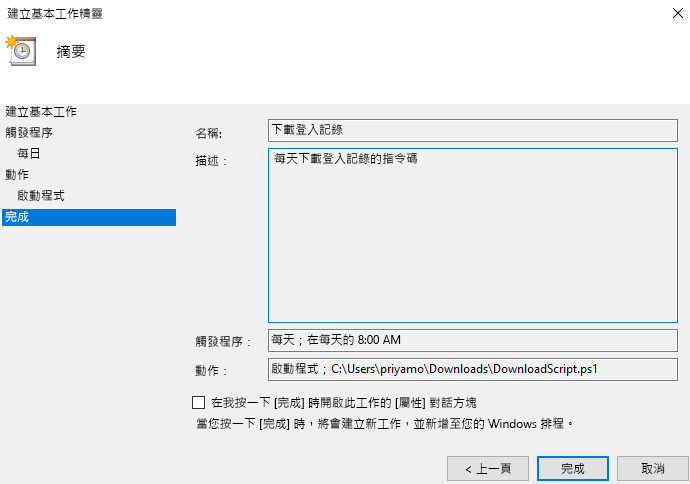

# 教學課程：如何下載和使用指令碼以便存取登入記錄

如果您想要在 Azure 入口網站以外使用登入活動資料，您可以下載該資料。 Azure 入口網站中的 [下載] 選項可建立內含 5000 筆最近記錄的 CSV 檔案。 如果您需要更多的彈性，例如，您想要一次下載超過 5000 筆記錄，或是想要以排定的間隔下載記錄，則可以使用 [指令碼] 按鈕來產生 PowerShell 指令碼，以下載資料。

在本教學課程中，您會了解如何產生指令碼，以便下載過去 24 小時內的所有登入記錄，並將指令碼排程為每天執行。 

## 必要條件

您需要

* 具有進階 (P1/P2) 授權的 Azure Active Directory 租用戶。 請注意，如果您在升級前沒有任何活動資料，則在升級至進階授權之後，報告需要幾天的時間才會顯示出資料。 
* 所擔任的租用戶角色為**全域系統管理員**、**安全性系統管理員**、**安全性讀取者**或**報告讀取者** 的使用者。 此外，任何使用者都可以存取自己的登入資訊。 
* 如果您想要在 Windows 10 機器上執行所下載的指令碼，請[設定 Azure PowerShell 模組並設定執行原則](concept-sign-ins.md#running-the-script-on-a-windows-10-machine)。

## 教學課程

1. 瀏覽至 [Azure 入口網站](https://portal.azure.com)，然後選取您的目錄。
2. 選取 [Azure Active Directory]，然後從 [監視] 區段選取 [登入]。 
3. 使用 [日期範圍] 篩選下拉式清單，然後選取 [24 小時] 以取得過去 24 小時內的資料。 
4. 選取 [套用]，然後確認篩選器是否如預期般套用。 
5. 從頂端功能表選取 [指令碼]，以下載具有所套用篩選器的 Powershell 指令碼。

     
     
6. 在 Windows 電腦上開啟**工作排程器**應用程式，然後選取 [建立基本工作]。
7. 輸入工作的名稱和描述，然後按 [下一步]。
8. 選取 [每日] 選項按鈕讓工作每日執行，並輸入開始日期和時間。
9. 在 [動作] 功能表中，選取 [啟動程式]，然後選取所下載的指令碼，並選取 [下一步]。 
10. 檢閱排定的工作，然後選取 [完成] 來建立工作。

     

現在，您的工作會每天執行，並且會將過去 24 小時內的登入記錄儲存至格式為 **AAD_SignInReport_YYYYMMDD_HHMMSS.csv** 的檔案。 您也可以編輯所下載的 PowerShell 指令碼，使其另存為不同的檔案名稱，或修改所下載的記錄數目。 

## 後續步驟

* [Azure Active Directory 報告保留原則](reference-reports-data-retention.md)
* [透過 Azure Active Directory 報告 API 開始入門](concept-reporting-api.md)
* [使用憑證存取報告 API](tutorial-access-api-with-certificates.md)
