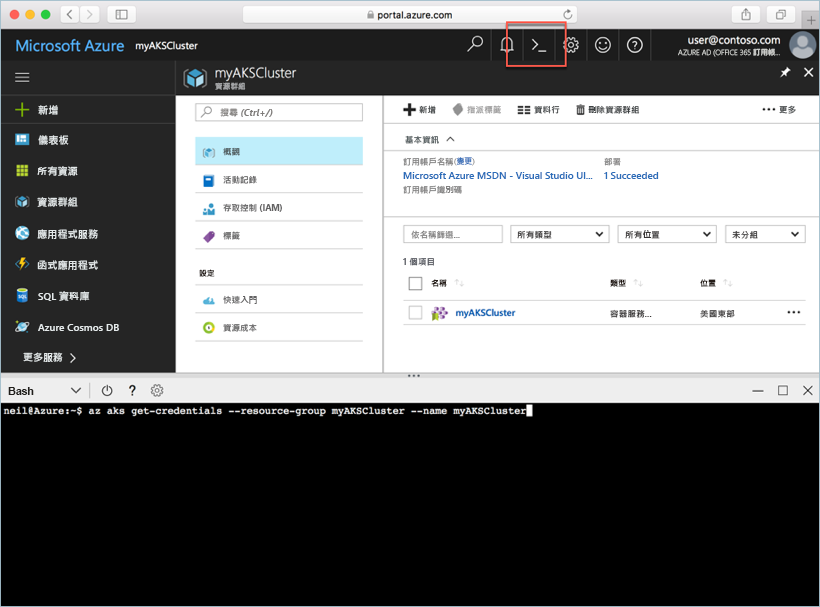

# <a name="deploy-an-azure-container-service-aks-cluster"></a>部署 Azure Container Service (AKS) 叢集

在本快速入門中，您會使用 Azure 入口網站來部署 AKS 叢集。 接著，在叢集上執行包含 Web 前端和 Redis 執行個體的多容器應用程式。 完成後，即可透過網際網路來存取應用程式。


本快速入門假設您已有 Kubernetes 概念的基本知識。 如需有關 Kubernetes 的詳細資訊，請參閱 [Kubernetes 文件][kubernetes-documentation]。

## <a name="sign-in-to-azure"></a>登入 Azure

登入 Azure 入口網站 (網址是 http://portal.azure.com)。

## <a name="create-service-principal"></a>建立服務主體

在 Azure 入口網站中建立 AKS 叢集之前，您必須建立服務主體。 Azure 會使用此服務主體來管理與 AKS 叢集相關聯的基礎結構。

選取 [Azure Active Directory] > [應用程式註冊] > [新應用程式註冊]。

輸入應用程式的名稱 (可以是任何值)。 選取 [Web 應用程式/API] 作為應用程式類型。 輸入作為**登入 URL** 的值；這可以是任何有效 URL 格式的值，但不需要是真正的端點。

完成後，請選取 [建立]。


選取新建立的應用程式註冊，並記下應用程式識別碼。 建立 AKS 叢集時會需要這個值。


接著，您必須為服務主體建立密碼。 選取 [所有設定] > [金鑰]，並在金鑰描述中輸入任何值。 選取持續時間，也就是服務主體的有效期限。

按一下 [儲存]，並記下密碼值。 建立 AKS 叢集時會需要此密碼。


## <a name="create-aks-cluster"></a>建立 AKS 叢集

選取 [建立資源] > [容器] > [Azure Container Service - AKS (預覽)]。

為叢集提供叢集名稱、DNS 前置詞、資源群組名稱、位置和 Kubernetes 版本。 記下叢集名稱和資源群組名稱，連線到叢集時會需要這些資訊。

完成時選取 [確定]。


在設定表單上，輸入下列內容：

- 使用者 - 叢集節點上的系統管理帳戶名稱。
- SSH 公開金鑰 - 與用來存取叢集節點的金鑰建立關聯。
- 服務主體用戶端識別碼 - 您稍早在本文件中建立的服務主體應用程式識別碼。
- 服務主體用戶端密碼 - 您稍早在本文件中建立的服務主體密碼。
- 節點計數 - 建要立的 AKS 節點數目。
- 節點虛擬機器大小 - AKS 節點的虛擬機器大小
- 作業系統磁碟大小 - AKS 節點的作業系統磁碟大小。

完成時選取 [確定]，驗證完成之後再按一次 [確定]。


短暫的等候之後，AKS 叢集已完成部署且可供使用。

## <a name="connect-to-the-cluster"></a>連接到叢集

若要管理 Kubernetes 叢集，請使用 Kubernetes 命令列用戶端：[kubectl][kubectl]。 Kubectl 用戶端會預先安裝在 Azure Cloud Shell 中。

使用 Azure 入口網站右上角上的按鈕開啟 Cloud Shell。



若要設定 kubectl 來連線到 Kubernetes 叢集，請使用 [az aks get-credentials][az-aks-get-credentials] 命令。

複製以下命令並貼到 Cloud Shell 中。 視需要修改資源群組與叢集名稱。

```azurecli-interactive
az aks get-credentials --resource-group myAKSCluster --name myAKSCluster
```

若要驗證叢集的連線，請使用 [kubectl get][kubectl-get] 命令來傳回叢集節點的清單。

```azurecli-interactive
kubectl get nodes
```

輸出：

```
NAME                       STATUS    ROLES     AGE       VERSION
aks-agentpool-14693408-0   Ready     agent     6m        v1.8.1
aks-agentpool-14693408-1   Ready     agent     6m        v1.8.1
aks-agentpool-14693408-2   Ready     agent     7m        v1.8.1
```

## <a name="run-the-application"></a>執行應用程式

Kubernetes 資訊清單檔會定義所需的叢集狀態，包括哪些容器映像應在執行中。 以此範例來說，您會使用資訊清單來建立執行 Azure 投票應用程式所需的所有物件。

建立名為 `azure-vote.yaml` 的檔案，然後將下列 YAML 程式碼複製到其中。 如果您在 Azure Cloud Shell 中作業，您可以使用 vi 或 Nano 建立檔案，猶如使用虛擬或實體系統。

```yaml
apiVersion: apps/v1beta1
kind: Deployment
metadata:
  name: azure-vote-back
spec:
  replicas: 1
  template:
    metadata:
      labels:
        app: azure-vote-back
    spec:
      containers:
      - name: azure-vote-back
        image: redis
        ports:
        - containerPort: 6379
          name: redis
---
apiVersion: v1
kind: Service
metadata:
  name: azure-vote-back
spec:
  ports:
  - port: 6379
  selector:
    app: azure-vote-back
---
apiVersion: apps/v1beta1
kind: Deployment
metadata:
  name: azure-vote-front
spec:
  replicas: 1
  template:
    metadata:
      labels:
        app: azure-vote-front
    spec:
      containers:
      - name: azure-vote-front
        image: microsoft/azure-vote-front:v1
        ports:
        - containerPort: 80
        env:
        - name: REDIS
          value: "azure-vote-back"
---
apiVersion: v1
kind: Service
metadata:
  name: azure-vote-front
spec:
  type: LoadBalancer
  ports:
  - port: 80
  selector:
    app: azure-vote-front
```

使用 [kubectl create][kubectl-create] 命令來執行應用程式。

```azurecli-interactive
kubectl create -f azure-vote.yaml
```

輸出：

```
deployment "azure-vote-back" created
service "azure-vote-back" created
deployment "azure-vote-front" created
service "azure-vote-front" created
```

## <a name="test-the-application"></a>測試應用程式

執行應用程式時會建立 [Kubernetes 服務][kubernetes-service]，此服務會向網際網路公開前端應用程式。 此程序需要數分鐘的時間完成。

若要監視進度，請使用 [kubectl get service][kubectl-get] 命令搭配 `--watch` 引數。

```azurecli-interactive
kubectl get service azure-vote-front --watch
```

一開始，azure-vote-front 服務的 *EXTERNAL-IP* 會顯示為 pending。

```
NAME               TYPE           CLUSTER-IP   EXTERNAL-IP   PORT(S)        AGE
azure-vote-front   LoadBalancer   10.0.37.27   <pending>     80:30572/TCP   6s
```

當 *EXTERNAL-IP* 位址從 *pending* 變成一個 *IP 位址*之後，請使用 `CTRL-C` 來停止 kubectl 監看式流程。

```
azure-vote-front   LoadBalancer   10.0.37.27   52.179.23.131   80:30572/TCP   2m
```

您現在可以瀏覽至外部 IP 位址來查看 Azure 投票應用程式。


## <a name="delete-cluster"></a>刪除叢集

當不再需要叢集時，您可以刪除叢集資源群組，此動作會刪除所有相關聯的資源。 在 Azure 入口網站中選取資源群組，然後按一下 [刪除] 按鈕，即可完成此動作。 或者，您可以在 Cloud Shell 中使用 [az group delete][az-group-delete] 命令。

```azurecli-interactive
az group delete --name myAKSCluster --no-wait
```

## <a name="get-the-code"></a>取得程式碼

在本快速入門中，已使用預先建立的容器映像來建立 Kubernetes 部署。 相關的應用程式程式碼、Dockerfile 和 Kubernetes 資訊清單檔案，都可以在 GitHub 上取得。

[https://github.com/Azure-Samples/azure-voting-app-redis][azure-vote-app]

## <a name="next-steps"></a>後續步驟

在本快速入門中，您已部署 Kubernetes 叢集，並將多容器應用程式部署到此叢集。

若要深入了解 AKS，並逐步完成部署範例的完整程式碼，請繼續 Kubernetes 叢集教學課程。

> [!div class="nextstepaction"]
> [AKS 教學課程][aks-tutorial]

<!-- LINKS - external -->
[azure-vote-app]: https://github.com/Azure-Samples/azure-voting-app-redis.git
[kubectl]: https://kubernetes.io/docs/user-guide/kubectl/
[kubectl-create]: https://kubernetes.io/docs/reference/generated/kubectl/kubectl-commands#create
[kubectl-get]: https://kubernetes.io/docs/reference/generated/kubectl/kubectl-commands#get
[kubernetes-documentation]: https://kubernetes.io/docs/home/
[kubernetes-service]: https://kubernetes.io/docs/concepts/services-networking/service/

<!-- LINKS - internal -->
[az-aks-get-credentials]: /cli/azure/aks?view=azure-cli-latest#az_aks_get_credentials
[az-group-delete]: /cli/azure/group#delete
[aks-tutorial]: ./tutorial-kubernetes-prepare-app.md


