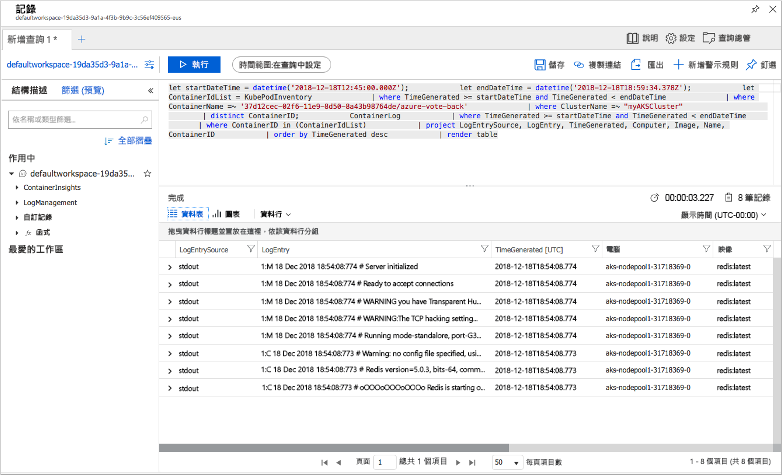

# <a name="quickstart-deploy-an-azure-kubernetes-service-aks-cluster-using-the-azure-cli"></a>快速入門：使用 Azure CLI 部署 Azure Kubernetes Service (AKS) 叢集

Azure Kubernetes Service (AKS) 是受控 Kubernetes 服務，可讓您快速部署及管理叢集。 在本快速入門中，您會使用 Azure CLI 來部署 AKS 叢集。 在叢集上執行包含 Web 前端和 Redis 執行個體的多容器應用程式。 然後，您會了解如何監視叢集的健康情況和執行您應用程式的 Pod。


本快速入門假設您已有 Kubernetes 概念的基本知識。 如需詳細資訊，請參閱 [Azure Kubernetes Services (AKS) 的 Kubernetes 核心概念][kubernetes-concepts]。

如果您沒有 Azure 訂用帳戶，請在開始前建立 [免費帳戶](https://azure.microsoft.com/free/?WT.mc_id=A261C142F) 。

[!INCLUDE [cloud-shell-try-it.md](../../includes/cloud-shell-try-it.md)]

如果您選擇在本機安裝和使用 CLI，本快速入門會要求您執行 Azure CLI 2.0.52 版或更新版本。 執行 `az --version` 以尋找版本。 如果您需要安裝或升級，請參閱[安裝 Azure CLI][azure-cli-install]。

## <a name="create-a-resource-group"></a>建立資源群組

Azure 資源群組是在其中部署與管理 Azure 資源的邏輯群組。 建立資源群組時，系統會要求您指定位置。 此位置是儲存資源群組中繼資料的位置，如果您未在資源建立期間指定另一個區域，此位置也會是您在 Azure 中執行資源的位置。 使用 [az group create][az-group-create] 命令來建立資源群組。

下列範例會在 eastus 位置建立名為 myResourceGroup 的資源群組。

```azurecli-interactive
az group create --name myResourceGroup --location eastus
```

下列範例輸出顯示已成功建立的資源群組：

```json
{
  "id": "/subscriptions/<guid>/resourceGroups/myResourceGroup",
  "location": "eastus",
  "managedBy": null,
  "name": "myResourceGroup",
  "properties": {
    "provisioningState": "Succeeded"
  },
  "tags": null
}
```

## <a name="create-aks-cluster"></a>建立 AKS 叢集

使用 [az aks create][az-aks-create] 命令來建立 AKS 叢集。 下列範例會建立名為 myAKSCluster 並包含一個節點的叢集。 使用 *--enable-addons monitoring* 參數也可啟用適用於容器的 Azure 監視器。

```azurecli-interactive
az aks create \
    --resource-group myResourceGroup \
    --name myAKSCluster \
    --node-count 1 \
    --enable-addons monitoring \
    --generate-ssh-keys
```

在幾分鐘之後，此命令就會完成，並以 JSON 格式傳回叢集的相關資訊。

## <a name="connect-to-the-cluster"></a>連接到叢集

若要管理 Kubernetes 叢集，請使用 Kubernetes 命令列用戶端：[kubectl][kubectl]。 如果您使用 Azure Cloud Shell，則 `kubectl` 已安裝。 若要在本機安裝 `kubectl`，請使用 [az aks install-cli][az-aks-install-cli] 命令：

```azurecli
az aks install-cli
```

若要設定 `kubectl` 來連線到 Kubernetes 叢集，請使用 [az aks get-credentials][az-aks-get-credentials] 命令。 此命令會下載憑證並設定 Kubernetes CLI 以供使用。

```azurecli-interactive
az aks get-credentials --resource-group myResourceGroup --name myAKSCluster
```

若要驗證叢集的連線，請使用 [kubectl get][kubectl-get] 命令來傳回叢集節點的清單。

```azurecli-interactive
kubectl get nodes
```

下列輸出範例會顯示上一個步驟中建立的單一節點。 請確定節點的狀態為 *Ready*：

```
NAME                       STATUS   ROLES   AGE     VERSION
aks-nodepool1-31718369-0   Ready    agent   6m44s   v1.9.11
```

## <a name="run-the-application"></a>執行應用程式

Kubernetes 資訊清單檔會定義所需的叢集狀態，例如要執行哪些容器映像。 在本教學課程中，資訊清單可用來建立執行 Azure 投票應用程式所需的所有物件。 此資訊清單包含兩個 [Kubernetes 部署][kubernetes-deployment]：一個適用於範例 Azure 投票 Python 應用程式，而另一個適用於 Redis 執行個體。 還會建立兩個 [Kubernetes 服務][kubernetes-service]：內部服務用於 Redis 執行個體，而外部服務用於從網際網路存取 Azure 投票應用程式。

> [!TIP]
> 在本快速入門中，您會以手動方式建立應用程式資訊清單，並將其部署至 AKS 叢集。 在更貼近現實的案例中，您可以使用 [Azure Dev Spaces][azure-dev-spaces] 快速地逐一查看程式碼，並直接在 AKS 叢集中進行偵錯。 您可以跨作業系統平台和開發環境來使用 Dev Spaces，並與小組中的其他人一起工作。

建立名為 `azure-vote.yaml` 的檔案，然後將下列 YAML 定義複製進來。 如果您使用 Azure Cloud Shell，可以使用 `vi` 或 `nano` 建立這個檔案，猶如使用虛擬或實體系統：

```yaml
apiVersion: apps/v1
kind: Deployment
metadata:
  name: azure-vote-back
spec:
  replicas: 1
  selector:
    matchLabels:
      app: azure-vote-back
  template:
    metadata:
      labels:
        app: azure-vote-back
    spec:
      containers:
      - name: azure-vote-back
        image: redis
        resources:
          requests:
            cpu: 100m
            memory: 128Mi
          limits:
            cpu: 250m
            memory: 256Mi
        ports:
        - containerPort: 6379
          name: redis
---
apiVersion: v1
kind: Service
metadata:
  name: azure-vote-back
spec:
  ports:
  - port: 6379
  selector:
    app: azure-vote-back
---
apiVersion: apps/v1
kind: Deployment
metadata:
  name: azure-vote-front
spec:
  replicas: 1
  selector:
    matchLabels:
      app: azure-vote-front
  template:
    metadata:
      labels:
        app: azure-vote-front
    spec:
      containers:
      - name: azure-vote-front
        image: microsoft/azure-vote-front:v1
        resources:
          requests:
            cpu: 100m
            memory: 128Mi
          limits:
            cpu: 250m
            memory: 256Mi
        ports:
        - containerPort: 80
        env:
        - name: REDIS
          value: "azure-vote-back"
---
apiVersion: v1
kind: Service
metadata:
  name: azure-vote-front
spec:
  type: LoadBalancer
  ports:
  - port: 80
  selector:
    app: azure-vote-front
```

使用 [kubectl apply][kubectl-apply] 命令來部署應用程式並指定 YAML 資訊清單的名稱：

```azurecli-interactive
kubectl apply -f azure-vote.yaml
```

下列範例輸出會顯示已成功建立的部署和服務：

```
deployment "azure-vote-back" created
service "azure-vote-back" created
deployment "azure-vote-front" created
service "azure-vote-front" created
```

## <a name="test-the-application"></a>測試應用程式

執行應用程式時，Kubernetes 服務會向網際網路公開前端應用程式。 此程序需要數分鐘的時間完成。

若要監視進度，請使用 [kubectl get service][kubectl-get] 命令搭配 `--watch` 引數。

```azurecli-interactive
kubectl get service azure-vote-front --watch
```

一開始，*azure-vote-front* 服務的 *EXTERNAL-IP* 會顯示為 *pending*。

```
NAME               TYPE           CLUSTER-IP   EXTERNAL-IP   PORT(S)        AGE
azure-vote-front   LoadBalancer   10.0.37.27   <pending>     80:30572/TCP   6s
```

當 *EXTERNAL-IP* 位址從 *pending* 變成實際的公用 IP 位址時，請使用 `CTRL-C` 停止 `kubectl` 監看式流程。 下列範例輸出會顯示已指派給服務的有效公用 IP 位址：

```
azure-vote-front   LoadBalancer   10.0.37.27   52.179.23.131   80:30572/TCP   2m
```

若要查看 Azure 投票應用程式的實際運作情況，請開啟網頁瀏覽器並瀏覽至服務的外部 IP 位址。


## <a name="monitor-health-and-logs"></a>監視健康情況和記錄檔

建立 AKS 叢集時，會啟用適用於容器的 Azure 監視器來擷取叢集節點和 pod 的健康狀態計量。 在 Azure 入口網站中可取得這些健康狀態度量。

若要查看目前的狀態、運作時間，以及 Azure 投票 pod 的資源使用量，請完成下列步驟：

1. 開啟網頁瀏覽器並移至 Azure 入口網站[https://portal.azure.com][azure-portal]。
1. 選取您的資源群組 (例如 myResourceGroup)，然後選取您的 AKS 叢集 (例如 myAKSCluster)。
1. 在左側的 [監視] 底下，選擇 [見解]
1. 在頂端選擇 [+ 新增篩選器]
1. 選取 [命名空間] 作為屬性，然後選擇 \<除了 kube-system 以外的所有項目\>
1. 選擇檢視**容器**。

系統會顯示 azure-vote-back 和 azure-vote-front 容器，如下列範例所示：


若要查看 `azure-vote-front` Pod 的記錄，請選取容器清單右側的 [檢視容器記錄] 連結。 這些記錄包含來自容器的 stdout 和 stderr 資料流。



## <a name="delete-cluster"></a>刪除叢集

若不再需要叢集，可使用 [az group delete][az-group-delete] 命令來移除資源群組、容器服務和所有相關資源。

```azurecli-interactive
az group delete --name myResourceGroup --yes --no-wait
```

> [!NOTE]
> 當您刪除叢集時，不會移除 AKS 叢集所使用的 Azure Active Directory 服務主體。 如需有關如何移除服務主體的步驟，請參閱[AKS 服務主體的考量和刪除][sp-delete]。

## <a name="get-the-code"></a>取得程式碼

在本快速入門中，預先建立的容器映像已用來建立 Kubernetes 部署。 相關的應用程式程式碼、Dockerfile 和 Kubernetes 資訊清單檔案，都可以在 GitHub 上取得。

[https://github.com/Azure-Samples/azure-voting-app-redis][azure-vote-app]

## <a name="next-steps"></a>後續步驟

在本快速入門中，您已部署 Kubernetes 叢集，並將多容器應用程式部署到此叢集。  [存取 Kubernetes Web 儀表板][kubernetes-dashboard]，以使用您剛才建立的叢集。

若要深入了解 AKS，並逐步完成部署範例的完整程式碼，請繼續 Kubernetes 叢集教學課程。

> [!div class="nextstepaction"]
> [AKS 教學課程][aks-tutorial]

<!-- LINKS - external -->
[azure-vote-app]: https://github.com/Azure-Samples/azure-voting-app-redis.git
[kubectl]: https://kubernetes.io/docs/user-guide/kubectl/
[kubectl-apply]: https://kubernetes.io/docs/reference/generated/kubectl/kubectl-commands#apply
[kubectl-get]: https://kubernetes.io/docs/reference/generated/kubectl/kubectl-commands#get
[azure-dev-spaces]: https://docs.microsoft.com/azure/dev-spaces/

<!-- LINKS - internal -->
[kubernetes-concepts]: concepts-clusters-workloads.md
[aks-monitor]: https://aka.ms/coingfonboarding
[aks-tutorial]: ./tutorial-kubernetes-prepare-app.md
[az-aks-browse]: /cli/azure/aks?view=azure-cli-latest#az-aks-browse
[az-aks-create]: /cli/azure/aks?view=azure-cli-latest#az-aks-create
[az-aks-get-credentials]: /cli/azure/aks?view=azure-cli-latest#az-aks-get-credentials
[az-aks-install-cli]: /cli/azure/aks?view=azure-cli-latest#az-aks-install-cli
[az-group-create]: /cli/azure/group#az-group-create
[az-group-delete]: /cli/azure/group#az-group-delete
[azure-cli-install]: /cli/azure/install-azure-cli
[sp-delete]: kubernetes-service-principal.md#additional-considerations
[azure-portal]: https://portal.azure.com
[kubernetes-deployment]: concepts-clusters-workloads.md#deployments-and-yaml-manifests
[kubernetes-service]: concepts-network.md#services
[kubernetes-dashboard]: kubernetes-dashboard.md
