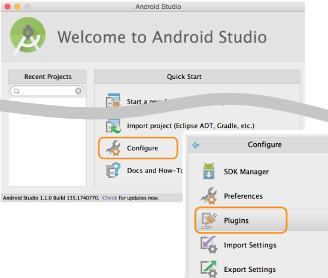
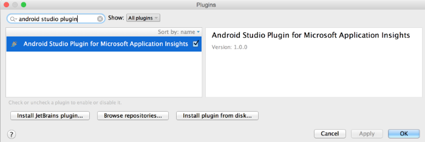
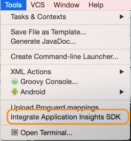
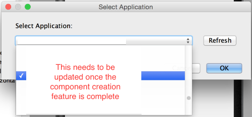

<properties 
    pageTitle="Android 應用程式適用的 Application Insights" 
    description="使用 Application Insights 分析您的 Android 應用程式的使用量和效能。" 
    services="application-insights" 
    documentationCenter="android"
    authors="alancameronwills" 
    manager="ronmart"/>

<tags 
    ms.service="application-insights" 
    ms.workload="mobile" 
    ms.tgt_pltfrm="mobile-android" 
    ms.devlang="na" 
    ms.topic="article" 
	ms.date="04/28/2015" 
    ms.author="awills"/>

# Android 應用程式適用的 Application Insights

Visual Studio Application Insights 可讓您監視行動應用程式的使用量、事件及當機。

## 需求

您需要：

* [Microsoft Azure](http://azure.com) 訂用帳戶。您使用 Microsoft 帳戶登入，可能是針對 Windows、XBox Live 或其他 Microsoft 雲端服務具備的帳戶。
* Android Studio
* Android SDK 版本 9 或更新版本。

## 建立 Application Insights 資源

在 [Azure 入口網站][portal] 中，建立新的 Application Insights 資源。選取 [Android] 選項。

![按一下 [新增]、[開發人員服務]、[Application Insights]](./media/app-insights-android/11-new.png)

開啟的刀鋒視窗是您要查看您的應用程式效能和使用量資料的位置。若要在下次登入 Azure 時回到此位置，您應該會在開始畫面上發現它的磚。或者按一下 [瀏覽] 以尋找它。

## 將 Application Insights 外掛程式安裝至 Android Studio

(如果您尚未執行這項操作。)

1.  啟動 Android Studio 並設定外掛程式

    

2.  選取並安裝 Application Insights Android Studio 外掛程式。

    

## <a name="sdk"></a>在應用程式中安裝 SDK


1.  選取 [工具] -> [整合 Application Insights]。

    
    
3.  在您的訂用帳戶中建立元件

    

    使用您從 Application Insights 資源取得的檢測金鑰。

4.  同步處理 gradle 以下載 SDK 並且與您的專案整合

    
    
    (其他資訊可以在[使用方式頁面](http://go.microsoft.com/fwlink/?LinkID=533220)取得。)
    
此時下列參考已加入至模組 build.gradle，`INTERNET` 和 `ACCESS_NETWORK_STATE` 的權限，以及包含元件檢測金鑰的中繼資料標記會加入至模組的 `AndroidManifest.xml`

```java

    dependencies {
    compile 'com.microsoft.azure:applicationinsights-android:+'
    }
```

```xml

    <manifest>
    <uses-permission android:name="android.permission.INTERNET" />
    <uses-permission android:name="android.permission.ACCESS_NETWORK_STATE" />
    
    <application>
        <meta-data
            android:name="com.microsoft.applicationinsights.instrumentationKey"
            android:value="${AI_INSTRUMENTATION_KEY}" />
    </application>
    </manifest>
```

#### 選擇性：在程式碼中設定檢測金鑰

也可以在程式碼中設定檢測金鑰。這會覆寫在 `AndroidManifest.xml` 中設定的金鑰。

```java

    AppInsights.setup(this, "<YOUR-IKEY-GOES-HERE>");
    AppInsights.start();
```


## 使用 SDK

初始化 SDK，並開始追蹤遙測。

將下列匯入新增至您的應用程式根活動

```java

     import com.microsoft.applicationinsights.TelemetryClient;
```

並且將下列程式碼新增至活動的 `onCreate` 回呼。

```java

    AppInsights.setup(this);
    AppInsights.start();
```

一旦呼叫 `AppInsights.start()`，SDK 就會開始追蹤 android 生命週期活動和任何未處理的例外狀況。

> [AZURE.NOTE]應用程式生命週期事件只會在 Android SDK 15 版以上 (冰淇淋三明治+) 收集。

此外，可以收集自訂事件、追蹤、度量和處理的例外狀況。使用任一個 [Application Insights API][api] 來傳送遙測。

* TrackEvent(eventName) 用於其他使用者動作
* TrackTrace(logEvent) 用於[診斷記錄][diagnostic]
* TrackHandledException(exception) 用在 catch 子句中
* TrackMetric(name, value) 用在背景工作，以傳送未附加到特定事件之度量的一般報告。

初始化和手動遙測集合的範例如下。

```java

    public class MyActivity extends Activity {

      @Override
      protected void onCreate(Bundle savedInstanceState) {
        
        AppInsights.setup(this);
        //... other initialization code ...//
        AppInsights.start();
        
        // track telemetry data
        TelemetryClient client = TelemetryClient.getInstance();
        HashMap<String, String> properties = new HashMap<String, String>();
        properties.put("property1", "my custom property");
        client.trackEvent("sample event", properties);
        client.trackTrace("sample trace");
        client.trackMetric("sample metric", 3);
        client.trackHandledException(new Exception("sample exception"));
      }
    }
```

## <a name="run"></a>執行專案

執行您的應用程式 (在 Windows 中按 SHIFT+F10、在 OS X 中按 CTRL+R) 以產生遙測。

## 在 Application Insights 中檢視資料

返回 http://portal.azure.com 並且瀏覽至您的 Application Insights 資源。

按一下 [搜尋] 以開啟[診斷搜尋][diagnostic] - 這是前幾個事件顯示的位置。如果您看不到任何資料，請稍做等待後再按一下 [重新整理]。

![按一下 [診斷搜尋]](./media/app-insights-android/21-search.png)

使用您的應用程式時，[概觀] 刀鋒視窗上會顯示資料。

![[概觀] 刀鋒視窗](./media/app-insights-android/22-oview.png)

按一下任何圖表以查看詳細資料。例如，當機：


## <a name="usage"></a>後續步驟

[追蹤應用程式的使用量][track]

[診斷搜尋][diagnostic]

[計量瀏覽器][metrics]

[疑難排解][qna]


<!--Link references-->

[api]: app-insights-api-custom-events-metrics.md
[diagnostic]: app-insights-diagnostic-search.md
[metrics]: app-insights-metrics-explorer.md
[portal]: http://portal.azure.com/
[qna]: app-insights-troubleshoot-faq.md
[track]: app-insights-custom-events-metrics-api.md

<!---HONumber=58-->