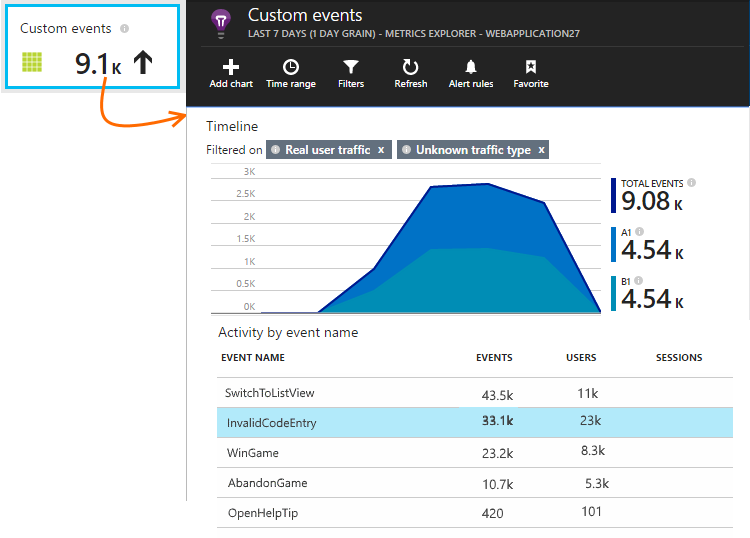
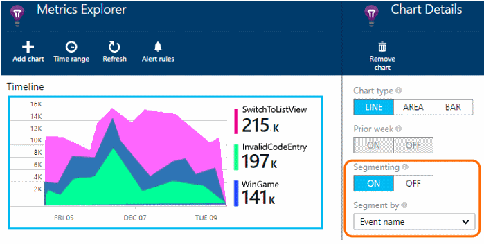

<properties 
	pageTitle="自訂事件和度量的 Application Insights API" 
	description="在您的裝置或桌面應用程式、網頁或服務中插入幾行程式碼，來追蹤使用狀況及診斷問題。" 
	services="application-insights"
	documentationCenter="" 
	authors="alancameronwills" 
	manager="ronmart"/>
 
<tags 
	ms.service="application-insights" 
	ms.workload="tbd" 
	ms.tgt_pltfrm="ibiza" 
	ms.devlang="na" 
	ms.topic="article" 
	ms.date="04/28/2015" 
	ms.author="awills"/>

# 自訂事件和度量的 Application Insights API 

*Application Insights 目前僅供預覽。*

在您的應用程式中插入幾行程式碼，以了解使用者對它進行的動作或協助診斷問題。您可以從裝置和桌面應用程式、Web 用戶端以及 Web 伺服器傳送遙測。

Application Insights 資料收集器會使用此 API 傳送標準遙測，例如頁面檢視和例外狀況報告，但是您也可以使用它來傳送您自己自訂的遙測。

## API summary

API 是跨所有平台統一的，除了一些小變化形式。

方法 | 用於
---|---
[`TrackPageView`](#page-views) | 頁面、螢幕、刀鋒視窗或表單
[`TrackEvent`](#track-event) | 使用者動作和其他事件。用來追蹤使用者行為，或監視效能。
[`TrackMetric`](#track-metric) | 效能度量，例如與特定事件不相關的佇列長度
[`TrackException`](#track-exception)|記錄診斷的例外狀況。追蹤與其他事件的發生相對位置，並且檢查堆疊追蹤。
[`TrackRequest`](#track-request)| 記錄伺服器要求的頻率和持續時間以進行效能分析。
[`TrackTrace`](#track-trace)|診斷記錄訊息。您也可以擷取第三方記錄檔。

您可以[附加屬性和度量](#properties)至這裡大部分的遙測呼叫。

## 開始之前

如果您尚未完成這些動作：

* 將 Application Insights SDK 加入至專案：
 * [ASP.NET 專案][greenbrown]
 * [Windows 專案][windows]
 * [Java 專案][java] 
 * [JavaScript 網頁][client]   

* 在裝置或 Web 伺服器程式碼中，加入：

    *C#:* `using Microsoft.ApplicationInsights;`

    *VB:* `Imports Microsoft.ApplicationInsights`

    *Java:* `import com.microsoft.applicationinsights.TelemetryClient;`

## 建構 TelemetryClient

建構 TelemetryClient 的執行個體 (除了在網頁中的 JavaScript)：

*C#:*

    private TelemetryClient telemetry = new TelemetryClient();

*VB:*

    Private Dim telemetry As New TelemetryClient

*Java*

    private TelemetryClient telemetry = new TelemetryClient();

我們建議對於 Web 應用程式中的每個要求或其他應用程式中的每個工作階段，使用 `TelemetryClient` 的執行個體。您可以設定如 `TelemetryClient.Context.User.Id` 的屬性以追蹤使用者和工作階段。這項資訊會附加至執行個體所傳送的所有事件。

TelemetryClient 具備執行緒安全。

## 追蹤事件

事件可以在[計量瀏覽器][metrics]顯示為彙總的計數，而且您也可以在[診斷搜尋][diagnostic]中顯示個別發生次數。

在您的程式碼中插入事件，以計算使用特定功能的頻率、達成特定目標的頻率，或進行特定選擇。

例如，在遊戲應用程式中，每當使用者贏得遊戲時傳送事件：

*JavaScript*

    appInsights.trackEvent("WinGame");

*C#*
    
    telemetry.TrackEvent("WinGame");

*VB*

    telemetry.TrackEvent("WinGame")

*Java*

    telemetry.trackEvent("WinGame");

在 [概觀] 刀鋒視窗上，按一下 [自訂事件] 磚：

逐一點選以查看概觀圖表和完整清單。

選取圖表，並且依據事件名稱分割，以查看最重要的事件的相對貢獻。

從圖表下方的清單中，選取事件名稱。逐一點選以查看事件的個別發生次數。

按一下任何發生以查看詳細資料。

## 使用屬性來篩選、搜尋和分割您的資料

您可以將屬性和測量附加至事件 (也可以附加至度量、頁面檢視和其他遙測資料)。

**屬性**是可在使用情況報告中用來篩選遙測的字串值。例如，如果您的應用程式提供數個遊戲，則您可以將遊戲的名稱附加至每個事件，以了解哪些遊戲較受歡迎。

字串長度有 1k 的限制。(如果您想要傳送大量的資料區塊，請使用訊息參數 [TrackTrace](#track-trace)。)

**度量**是可以用圖表方式呈現的數值。例如，您可能想要查看玩家達到的分數是否逐漸增加。圖表可以依據隨事件傳送的屬性分割，讓您可以針對不同遊戲取得個別或堆疊圖表。

度量值應該 > = 0，才能正確顯示。

*JavaScript*

    appInsights.trackEvent // or trackPageView, trackMetric, ...
      ("WinGame",
         // String properties:
         {Game: currentGame.name, Difficulty: currentGame.difficulty},
         // Numeric metrics:
         {Score: currentGame.score, Opponents: currentGame.opponentCount}
         );

*C#*

    // Set up some properties and metrics:
    var properties = new Dictionary <string, string> 
       {{"game", currentGame.Name}, {"difficulty", currentGame.Difficulty}};
    var metrics = new Dictionary <string, double>
       {{"Score", currentGame.Score}, {"Opponents", currentGame.OpponentCount}};

    // Send the event:
    telemetry.TrackEvent("WinGame", properties, metrics);

*VB*

    ' Set up some properties:
    Dim properties = New Dictionary (Of String, String)
    properties.Add("game", currentGame.Name)
    properties.Add("difficulty", currentGame.Difficulty)

    Dim metrics = New Dictionary (Of String, Double)
    metrics.Add("Score", currentGame.Score)
    metrics.Add("Opponents", currentGame.OpponentCount)

    ' Send the event:
    telemetry.TrackEvent("WinGame", properties, metrics)

*Java*
    
    Map<String, String> properties = new HashMap<String, String>();
    properties.put("game", currentGame.getName());
    properties.put("difficulty", currentGame.getDifficulty());
    
    Map<String, Double> metrics = new HashMap<String, Double>();
    metrics.put("Score", currentGame.getScore());
    metrics.put("Opponents", currentGame.getOpponentCount());
    
    telemetry.trackEvent("WinGame", properties, metrics2/7/2015 12:05:25 AM );

> [AZURE.NOTE]切勿在屬性中記錄個人識別資訊。

**如果您使用度量**，請開啟 [計量瀏覽器]，然後從自訂群組中選取度量：

*如果您的度量未顯示，請關閉選取刀鋒視窗、等候一段時間，然後按一下 [重新整理]。*

**如果您使用屬性和度量**，依據屬性分割度量：

![設定群組，然後在 [群組依據] 底下選取屬性](./media/app-insights-api-custom-events-metrics/04-segment-metric-event.png)

**在「診斷搜尋」中**，您可以檢視事件個別發生次數的屬性和度量。

![選取執行個體，然後選取 [...]](./media/appinsights/appinsights-23-customevents-4.png)

使用 [搜尋] 欄位來查看具有特定屬性值的事件出現次數。

![將詞彙輸入 [搜尋] 中](./media/appinsights/appinsights-23-customevents-5.png)

[深入了解搜尋字串][diagnostic]

#### 設定屬性和度量的替代方式

如果更加方便，您可以收集個別物件中事件的參數：

    var event = new EventTelemetry();

    event.Name = "WinGame";
    event.Metrics["processingTime"] = stopwatch.Elapsed.TotalMilliseconds;
    event.Properties["game"] = currentGame.Name;
    event.Properties["difficulty"] = currentGame.Difficulty;
    event.Metrics["Score"] = currentGame.Score;
    event.Metrics["Opponents"] = currentGame.Opponents.Length;

    telemetry.TrackEvent(event);

## 計時事件

有時候您想要繪製執行某些動作耗費多少時間的圖表。例如，您可能想要知道使用者在遊戲中思考選項時花費多少時間。

您可以將計時資料附加至事件。在 Web 用戶端中，請使用下列呼叫，而不是呼叫 trackEvent：

*Web 用戶端的 JavaScript*

    // At the start of the game:
    appInsights.startTrackEvent(game.id);

    // At the end of the game:
    appInsights.stopTrackEvent(game.id, {GameName: game.name}, {Score: game.score});

在開始和停止呼叫中，使用相同的字串做為第一個參數。

此功能未內建至其他 SDK。但是，您可以撰寫自己的程式碼，如下所示：

*C#*

    var stopwatch = System.Diagnostics.Stopwatch.StartNew();

    // ... perform the timed action ...

    stopwatch.Stop();

    var metrics = new Dictionary <string, double>
       {{"processingTime", stopwatch.Elapsed.TotalMilliseconds}};

    // Set up some properties:
    var properties = new Dictionary <string, string> 
       {{"signalSource", currentSignalSource.Name}};

    // Send the event:
    telemetry.TrackEvent("SignalProcessed", properties, metrics);

## 追蹤度量

使用 TrackMetric 傳送未附加至特定事件的度量。例如，您可以定期監視佇列長度。

度量會在計量瀏覽器中顯示為統計圖表，但不同於事件，您不能搜尋診斷搜尋中的個別發生次數。

度量值應該 > = 0，才能正確顯示。

*JavaScript*

    appInsights.trackMetric("Queue", queue.Length);

*C#*

    telemetry.TrackMetric("Queue", queue.Length);

*VB*

    telemetry.TrackMetric("Queue", queue.Length)

*Java*

    telemetry.trackMetric("Queue", queue.Length);

事實上，您可能會在背景執行緒中執行這個動作：

*C#*

    private void Run() {
     var appInsights = new TelemetryClient();
     while (true) {
      Thread.Sleep(60000);
      appInsights.TrackMetric("Queue", queue.Length);
     }
    }

若要查看結果，開啟 [計量瀏覽器] 並加入新的圖表。將它設定為顯示您的度量。

![加入新的圖表或選取圖表，並在 [自訂] 底下選取您的度量](./media/app-insights-api-custom-events-metrics/03-track-custom.png)

## 頁面檢視

在裝置或網頁應用程式中，每個畫面或頁面載入時預設會傳送頁面檢視遙測。但是，您可以變更為在其他或不同的時間追蹤頁面檢視。例如，在顯示索引標籤或刀鋒視窗的應用程式中，您可能想要在使用者每次開啟新的刀鋒視窗時追蹤「頁面」。

![[概觀] 刀鋒視窗上的使用方式透鏡](./media/appinsights/appinsights-47usage-2.png)

使用者和工作階段資料會與頁面檢視一起傳送為屬性，當有頁面檢視遙測時，讓使用者與工作階段圖表顯現。

#### 自訂頁面檢視

*JavaScript*

    appInsights.trackPageView("tab1");

*C#*

    telemetry.TrackPageView("GameReviewPage");

*VB*

    telemetry.TrackPageView("GameReviewPage")

如果您在不同的 HTML 網頁內有數個索引標籤，您也可以指定 URL：

    appInsights.trackPageView("tab1", "http://fabrikam.com/page1.htm");

#### 計時的頁面檢視

藉由使用此組方法呼叫，而不是 trackPageView，您可以分析使用者停留在頁面上的時間長度。

    // At the start of a page view:
    appInsights.startTrackPage(myPage.name);

    // At the completion of a page view:
    appInsights.stopTrackPage(myPage.name, "http://fabrikam.com/page", properties, measurements);

在開始和停止呼叫中，使用相同的字串做為第一個參數。

查看[計量瀏覽器][metrics]中的頁面持續時間度量。

## 追蹤要求

由伺服器 SDK 用來記錄 HTTP 要求。

如果您想要在沒有 Web 服務模組執行的內容中模擬要求，您也可以自行呼叫。

*C#*

    // At start of processing this request:

    // Operation Id is attached to all telemetry and helps you identify
    // telemetry associated with one request:
    telemetry.Context.Operation.Id = Guid.NewGuid().ToString();
    
    var stopwatch = System.Diagnostics.Stopwatch.StartNew();

    // ... process the request ...

    stopwatch.Stop();
    telemetryClient.TrackRequest(requestName, DateTime.Now,
       stopwatch.Elapsed, 
       "200", true);  // Response code, success

## 追蹤例外狀況

傳送例外狀況至 Application Insights：以[計算它們][metrics]，做為問題頻率的指示，以及[檢查個別發生次數][diagnostic]。

*C#*

    try
    {
        ...
    }
    catch (Exception ex)
    {
       telemetry.TrackException(ex);
    }

在 Windows 行動應用程式中，SDK 會攔截未處理的例外狀況，讓您不需要記錄。

## 追蹤 

使用此選項可協助您藉由將 'breadcrumb trail' 傳送至 Application Insights 來診斷問題。您可以傳送診斷資料區塊，並且在[診斷搜尋][diagnostic]中檢查。

 

[記錄配接器][trace]使用此 API 將第三方記錄傳送至入口網站。

*C#*

    telemetry.TrackTrace(message, SeverityLevel.Warning, properties);

`message` 上的大小限制比屬性上的限制高得多。您可以搜尋訊息內容，但是 (不同於屬性值) 您無法在其中進行篩選。

## 設定所有遙測的預設屬性

您可以設定全域初始設定式，使得所有新 TelemetryClients 會自動使用您的內容。

這包括平台特定遙測模組傳送的標準遙測，例如 Web 伺服器要求追蹤。

*C#*

    // Telemetry initializer class
    public class MyTelemetryInitializer : IContextInitializer
    {
        public void Initialize (TelemetryContext context)
        {
            context.Properties["AppVersion"] = "v2.1";
        }
    }

    // In the app initializer such as Global.asax.cs:

    protected void Application_Start()
    {
        // ...
        TelemetryConfiguration.Active.ContextInitializers
        .Add(new MyTelemetryInitializer());
    }

*Java*

    import com.microsoft.applicationinsights.extensibility.ContextInitializer;
    import com.microsoft.applicationinsights.telemetry.TelemetryContext;

    public class MyTelemetryInitializer implements ContextInitializer {
      @Override
      public void initialize(TelemetryContext context) {
        context.getProperties().put("AppVersion", "2.1");
      }
    }

    // load the context initializer
    TelemetryConfiguration.getActive().getContextInitializers().add(new MyTelemetryInitializer());

## 針對所有遙測在程式碼中設定檢測金鑰

而不是從組態檔取得檢測金鑰，您可以在程式碼中設定。您可能想要這樣做，例如，從測試安裝將遙測傳送至不同 Application Insights 資源，而不是即時應用程式的遙測。

在初始化方法中設定金鑰，例如 ASP.NET 服務中的 global.aspx.cs：

*C#*

    protected void Application_Start()
    {
      Microsoft.ApplicationInsights.Extensibility.
        TelemetryConfiguration.Active.InstrumentationKey = 
          // - for example -
          WebConfigurationManager.Settings["ikey"];
      ...

*JavaScript*

    appInsights.config.instrumentationKey = myKey; 

在網頁中，您可能想要從 Web 伺服器的狀態設定，而不是按其原義編碼至指令碼。例如，在 ASP.NET 應用程式中產生的網頁：

*Razor 中的 JavaScript*

    <script type="text/javascript">
    // Standard Application Insights web page script:
    var appInsights = window.appInsights || function(config){ ...
    // Modify this part:
    }({instrumentationKey:  
      // Generate from server property:
      @Microsoft.ApplicationInsights.Extensibility.
         TelemetryConfiguration.Active.InstrumentationKey"
    }) // ...

## 設定已選取自訂遙測的預設值

如果您只想為您撰寫的一些自訂事件設定預設屬性值，您可以在 TelemetryClient 中設定它們。它們會附加至從該用戶端傳送的每個遙測項目。

*C#*

    using Microsoft.ApplicationInsights.DataContracts;

    var gameTelemetry = new TelemetryClient();
    gameTelemetry.Context.Properties["Game"] = currentGame.Name;
    // Now all telemetry will automatically be sent with the context property:
    gameTelemetry.TrackEvent("WinGame");
    
*VB*

    Dim gameTelemetry = New TelemetryClient()
    gameTelemetry.Context.Properties("Game") = currentGame.Name
    ' Now all telemetry will automatically be sent with the context property:
    gameTelemetry.TrackEvent("WinGame")

*Java*

    import com.microsoft.applicationinsights.TelemetryClient;
    import com.microsoft.applicationinsights.TelemetryContext;
    ...

    TelemetryClient gameTelemetry = new TelemetryClient();
    TelemetryContext context = gameTelemetry.getContext();
    context.getProperties().put("Game", currentGame.Name);
    
    gameTelemetry.TrackEvent("WinGame");
    
個別遙測呼叫可以覆寫其屬性字典中的預設值。

## 設定已選取自訂遙測的檢測金鑰

*C#*
    
    var telemetry = new TelemetryClient();
    telemetry.Context.InstrumentationKey = "---my key---";
    // ...

## 停用標準遙測

您可以藉由編輯 `ApplicationInsights.config`，[停用所選部分的標準遙測][config]。例如，如果您想要傳送自己的 TrackRequest 資料，可以這麼做。

[深入了解][config]。

## 開發人員模式

偵錯期間，讓您的遙測透過管線加速很有用，如此您就可以立即看到結果。您也會取得額外的訊息，協助您追蹤任何遙測的問題。在生產環境中將它關閉，因為它可能會拖慢您的應用程式。

*C#*
    
    TelemetryConfiguration.Active.TelemetryChannel.DeveloperMode = true;

*VB*

    TelemetryConfiguration.Active.TelemetryChannel.DeveloperMode = True

## 參考文件

* [ASP.NET 參考](https://msdn.microsoft.com/library/dn817570.aspx)
* [Java 參考](http://dl.windowsazure.com/applicationinsights/javadoc/)

* *問：有 REST API 嗎？*

    是，但我們尚未發佈。

## 接續步驟

[搜尋事件和記錄檔][diagnostic]

[疑難排解][qna]

<!--Link references-->

[client]: app-insights-javascript.md
[config]: app-insights-configuration-with-applicationinsights-config.md
[diagnostic]: app-insights-diagnostic-search.md
[greenbrown]: app-insights-start-monitoring-app-health-usage.md
[java]: app-insights-java-get-started.md
[metrics]: app-insights-metrics-explorer.md
[qna]: app-insights-troubleshoot-faq.md
[trace]: app-insights-search-diagnostic-logs.md
[windows]: app-insights-windows-get-started.md

<!---HONumber=58-->