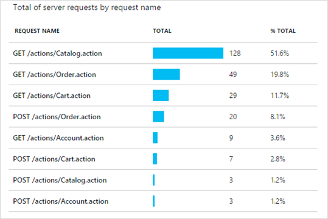
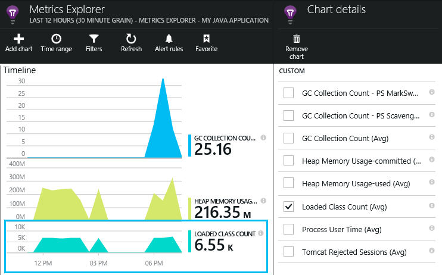

<properties 
	pageTitle="在 Java Web 專案中開始使用 Application Insights" 
	description="使用 Application Insights 監視 Java 網站的效能和使用量" 
	services="application-insights" 
    documentationCenter="java"
	authors="alancameronwills" 
	manager="ronmart"/>

<tags 
	ms.service="application-insights" 
	ms.workload="tbd" 
	ms.tgt_pltfrm="ibiza" 
	ms.devlang="na" 
	ms.topic="article" 
	ms.date="04/26/2015" 
	ms.author="awills"/>
 
# 在 Java Web 專案中開始使用 Application Insights

*Application Insights 目前僅供預覽。*

[AZURE.INCLUDE [app-insights-selector-get-started](../includes/app-insights-selector-get-started.md)]

透過將 Visual Studio Application Insights 加入到您的專案，您可以偵測並診斷效能問題和例外狀況。

此外，您可以設定 [Web 測試][availability]來監視應用程式的可用性，以及插入[程式碼到您的網頁][track]以了解使用模式。

您需要：

* Oracle JRE 1.6 或更新版本，或 Zulu JRE 1.6 或更新版本
* [Microsoft Azure](http://azure.microsoft.com/) 訂用帳戶。(您可以從[免費試用](http://azure.microsoft.com/pricing/free-trial/)開始。)

## 1.取得 Application Insights 檢測金鑰

1. 登入 [Microsoft Azure 入口網站](https://portal.azure.com)
2. 建立新 Application Insights 資源

    ![按一下 + 並選擇 [Application Insights]](./media/app-insights-java-get-started/01-create.png)
3. 將應用程式類型設定為 Java Web 應用程式。

    ![填寫名稱，選擇 [Java Web 應用程式]，然後按一下 [建立]](./media/app-insights-java-get-started/02-create.png)
4. 尋找新資源的檢測金鑰。您很快需要將此資訊貼上到程式碼專案中。

    ![在新資源概觀中，按一下 [屬性] 並複製檢測金鑰](./media/app-insights-java-get-started/03-key.png)

## 2.將 Java 適用的 Application Insights SDK 加入至專案

*選擇適合您的專案的方式。*

#### 如果您要在 Eclipse 中建立動態網站專案...

使用 [Java 適用的 Application Insights SDK 外掛程式][eclipse]。

#### 如果您使用 Maven...

如果您的專案已設定為使用 Maven 來建置，請將下列程式碼片段合併至 pom.xml 檔案。

然後重新整理專案相依性，以下載程式庫。

    <repositories>
       <repository>
          <id>central</id>
          <name>Central</name>
          <url>http://repo1.maven.org/maven2</url>
       </repository>
    </repositories>

    <dependencies>
      <dependency>
        <groupId>com.microsoft.azure</groupId>
        <artifactId>applicationinsights-web</artifactId>
        <!-- or applicationinsights-core for bare API -->
        <version>[0.9,)</version>
      </dependency>
    </dependencies>

* *建置或總和檢查碼驗證錯誤？ 嘗試使用特定版本：* `<version>0.9.3</version>`

#### 如果您使用 Gradle...

如果您的專案已設定為使用 Gradle 來建置，請將下列程式碼片段合併至 build.gradle 檔案。

然後重新整理專案相依性，以下載程式庫。

    repositories {
      mavenCentral()
    }

    dependencies {
      compile group: 'com.microsoft.azure', name: 'applicationinsights-web', version: '0.9.+'
      // or applicationinsights-core for bare API
    }

* *建置或總和檢查碼驗證錯誤？ 嘗試使用特定版本：* `version:'0.9.3'`

#### 否則...

手動加入 SDK：

1. 下載 [Azure Libraries for Java](http://dl.msopentech.com/lib/PackageForWindowsAzureLibrariesForJava.html)
2. 從 ZIP 檔案擷取下列二進位檔案，然後加入至您的專案：
 * applicationinsights-core
 * applicationinsights-web
 * commons-codec
 * commons-io
 * commons-lang
 * commons-logging
 * guava
 * httpclient
 * httpcore
 * jsr305

*`-core` 和 `-web` 元件之間有何關係？*

`applicationinsights-core` 提供不具自動遙測的單純 API。`applicationinsights-web` 則提供追蹤 HTTP 要求計數和回應時間的度量。

## 3.加入 Application Insights XML 檔案

將 ApplicationInsights.xml 加入專案的 resources 資料夾。複製到下列 XML。

替換為您從 Azure 入口網站取得的檢測金鑰。

    <?xml version="1.0" encoding="utf-8"?>
    <ApplicationInsights xmlns="http://schemas.microsoft.com/ApplicationInsights/2013/Settings" schemaVersion="2014-05-30">

      <!-- The key from the portal: -->

      <InstrumentationKey>** Your instrumentation key **</InstrumentationKey>

      <!-- HTTP request component (not required for bare API) -->

      <TelemetryModules>
        <Add type="com.microsoft.applicationinsights.web.extensibility.modules.WebRequestTrackingTelemetryModule"/>
        <Add type="com.microsoft.applicationinsights.web.extensibility.modules.WebSessionTrackingTelemetryModule"/>
        <Add type="com.microsoft.applicationinsights.web.extensibility.modules.WebUserTrackingTelemetryModule"/>
      </TelemetryModules>

      <!-- Events correlation (not required for bare API) -->
      <!-- These initializers add context data to each event -->

      <TelemetryInitializers>
        <Add   type="com.microsoft.applicationinsights.web.extensibility.initializers.WebOperationIdTelemetryInitializer"/>
        <Add type="com.microsoft.applicationinsights.web.extensibility.initializers.WebOperationNameTelemetryInitializer"/>
        <Add type="com.microsoft.applicationinsights.web.extensibility.initializers.WebSessionTelemetryInitializer"/>
        <Add type="com.microsoft.applicationinsights.web.extensibility.initializers.WebUserTelemetryInitializer"/>
        <Add type="com.microsoft.applicationinsights.web.extensibility.initializers.WebUserAgentTelemetryInitializer"/>

      </TelemetryInitializers>
    </ApplicationInsights>

* 檢測金鑰會隨著遙測的每個項目傳送，並告知 Application Insights 在您的資源中顯示它。
* HTTP 要求元件是選用的。它會自動將要求和回應時間的遙測傳送到入口網站。
* 事件相互關聯是 HTTP 要求元件的補充。它會指派識別碼給伺服器收到的每個要求，並將它加入為遙測的每個項目的屬性，作為 'Operation.Id' 屬性。它可讓您相互關聯與每個要求關聯的遙測，方法是在[診斷搜尋][diagnostic]中設定篩選器。

## 4.加入 HTTP 篩選器

上一個組態步驟可讓 HTTP 要求元件記錄每個 Web 要求。(如果您只需要單純的 API，則非必要。)

在專案中找到並開啟 web.xml 檔案，並合併 web-app 節點下的下列程式碼片段，在其中您可以設定應用程式篩選器。

為獲得最準確的結果，應該在其他所有篩選器之前先對應此篩選器。

    <filter>
      <filter-name>ApplicationInsightsWebFilter</filter-name>
      <filter-class>
        com.microsoft.applicationinsights.web.internal.WebRequestTrackingFilter
      </filter-class>
    </filter>
    <filter-mapping>
       <filter-name>ApplicationInsightsWebFilter</filter-name>
       <url-pattern>/*</url-pattern>
    </filter-mapping>

#### 如果您使用 MVC 3.1 或更新版本

編輯這些元素來併入 Application Insights 封裝：

    <context:component-scan base-package=" com.springapp.mvc, com.microsoft.applicationinsights.web.spring"/>

    <mvc:interceptors>
        <mvc:interceptor>
            <mvc:mapping path="/**"/>
            <bean class="com.microsoft.applicationinsights.web.spring.RequestNameHandlerInterceptorAdapter" />
        </mvc:interceptor>
    </mvc:interceptors>

#### 如果您使用 Struts 2

將此項目加入到 Struts 組態檔案 (通常名稱為 struts.xml 或 struts-default.xml)：

     <interceptors>
       <interceptor name="ApplicationInsightsRequestNameInterceptor" class="com.microsoft.applicationinsights.web.struts.RequestNameInterceptor" />
     </interceptors>
     <default-interceptor-ref name="ApplicationInsightsRequestNameInterceptor" />

(如果預設堆疊中定義了攔截器，可以將攔截器加入該堆疊。)

## 5.在 Application Insights 中檢視遙測

執行您的應用程式。

返回 Microsoft Azure 中的 Application Insights 資源。

[概觀] 分頁上會顯示 HTTP 要求資料。(如果沒有出現，請稍等片刻，然後按一下 [重新整理]。)

 

逐一點選任何圖表以查看更詳細的度量。

 

而檢視要求的屬性時，您可以查看與它關聯的遙測事件，例如要求和例外狀況。
 

[深入了解度量。][metrics]

#### 智慧型位址名稱計算

Application Insights 假設 MVC 應用程式的 HTTP 要求的格式為：`VERB controller/action`

例如，`GET Home/Product/f9anuh81`、`GET Home/Product/2dffwrf5` 和 `GET Home/Product/sdf96vws` 將會分組至 `GET Home/Product`。

這可提供要求有意義的彙總，例如要求數量和要求的平均執行時間。

## 5.效能計數器

按一下 [伺服器] 磚，您就會看到一些效能計數器。

### 自訂效能計數器收集

若要停用效能計數器標準集合的收集，請將下列程式碼片段加入 ApplicationInsights.xml 檔案的根節點下：

    <PerformanceCounters>
       <UseBuiltIn>False</UseBuiltIn>
    </PerformanceCounters>

### 收集其他效能計數器

您可以指定要收集的其他效能計數器。

#### JMX 計數器 (由虛擬機器公開)

    <PerformanceCounters>
      <Jmx>
        <Add objectName="java.lang:type=ClassLoading" attribute="TotalLoadedClassCount" displayName="Loaded Class Count"/>
        <Add objectName="java.lang:type=Memory" attribute="HeapMemoryUsage.used" displayName="Heap Memory Usage-used" type="composite"/>
      </Jmx>
    </PerformanceCounters>

*	`displayName` – Application Insights 入口網站中顯示的名稱。
*	`objectName` – JMX 物件名稱。
*	`attribute` – 要提取的 JMX 物件名稱的屬性
*	`type` (選用) - JMX 物件屬性的類型：
 *	預設值：簡易類型，例如 int 或 long。
 *	`composite`：效能計數器資料的格式為 'Attribute.Data'
 *	`tabular`：效能計數器資料的格式為資料表列

#### Windows (64 位元) 效能計數器 

每個 [Windows 效能計數器](https://msdn.microsoft.com/library/windows/desktop/aa373083.aspx)是類別的成員 (以欄位是類別成員的相同方式)。類別可以是全域，或可以有一定數量或指定的執行個體。

    <PerformanceCounters>
      <Windows>
        <Add displayName="Process User Time" categoryName="Process" counterName="%User Time" instanceName="__SELF__" />
        <Add displayName="Bytes Printed per Second" categoryName="Print Queue" counterName="Bytes Printed/sec" instanceName="Fax" />
      </Windows>
    </PerformanceCounters>

*	displayName – Application Insights 入口網站中顯示的名稱
*	categoryName – 與此效能計數器有關聯的效能計數器類別 (效能物件)
*	counterName – 效能計數器的名稱
*	instanceName – 效能計數器類別執行個體的名稱，或如果類別包含單一執行個體，則為空白字串 ("")。如果 categoryName 為 Process，而您要收集的效能計數器來自應用程式執行所在的目前 JVM 處理程序，請指定 `"__SELF__"`。

您的效能計數器會在[計量瀏覽器][metrics]中以自訂度量的形式顯示。

## 6.擷取記錄追蹤

您可以使用 Application Insights 將來自 Log4J、Logback 或其他記錄架構的記錄分解。您可以將記錄與 HTTP 要求和其他遙測相互關聯。[了解作法][javalogs]。

## 7.傳送您自己的遙測

既然您已安裝 SDK，您可以使用 API 來傳送自己的遙測。

* [追蹤自訂事件和度量][track]，以了解使用者正對應用程式進行的動作。
* [搜尋事件和記錄][diagnostic]以協助診斷問題。

此外，您可以將 Application Insights 的更多功能納入，以對準您的應用程式：

* [加入 Web 用戶端遙測][usage]，以監視頁面檢視和基本使用者度量。
* [設定 Web 測試][availability]，以確認應用程式處於線上狀態且能夠回應。

## 有疑問嗎？ 有問題嗎？

[疑難排解 Java](app-insights-java-troubleshoot.md)

<!--Link references-->

[availability]: app-insights-monitor-web-app-availability.md
[diagnostic]: app-insights-diagnostic-search.md
[eclipse]: app-insights-java-eclipse.md
[javalogs]: app-insights-java-trace-logs.md
[metrics]: app-insights-metrics-explorer.md
[track]: app-insights-custom-events-metrics-api.md
[usage]: app-insights-web-track-usage.md

<!--HONumber=54-->