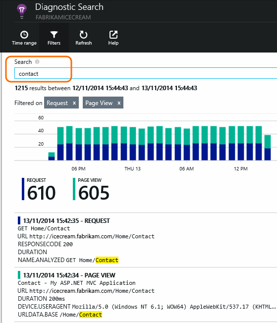

<properties title="Search diagnostic logs with Application Insights" pageTitle="搜尋診斷記錄 (英文)" description="搜尋使用 Trace、NLog 或 Log4Net 產生的記錄檔。" metaKeywords="analytics web test" authors="awills"  manager="kamrani" />

<tags ms.service="application-insights" ms.workload="tbd" ms.tgt_pltfrm="ibiza" ms.devlang="na" ms.topic="article" ms.date="2014-09-24" ms.author="awills" />
 
# Application Insights 中的診斷搜尋

大部分傳統的偵錯方法之一是插入幾行程式碼來發出追蹤記錄。[Application Insights][start] 可以擷取您的 Web 伺服器記錄檔，並協助您搜尋和篩選它們。如果您已經使用 log4Net、NLog 或 System.Diagnostics.Trace，則可以使用我們的配接器來擷取這些記錄檔。或者，您也可以使用內建於 Application Insights SDK 的 TrackTrace 和 TrackException 方法。

您的搜尋結果也可以包含一般的頁面檢視事件和要求事件 (用來建立[使用情況][usage]和[效能][perf]報告)，以及您所撰寫的任何[自訂 TrackEvent 呼叫][track]。

2. [安裝記錄架構的配接器嗎？](#capture)
+ [插入診斷記錄呼叫](#pepper)
+ [例外狀況](#exceptions)
+ [檢視記錄資料](#view)
+ [搜尋記錄資料](#search)
+ [疑難排解](#questions)
+ [後續步驟](#next)

##  安裝記錄架構的配接器嗎？

如果您尚未[在專案中安裝 Application Insights][start]，請立即安裝。

如果您將會使用內建的 Application Insights SDK Track*() 呼叫，則不需要配接器 - [請跳到下一節](#pepper)。

若要搜尋以 log4Net、NLog 或 System.Diagnostics.Trace 所產生的記錄，請安裝適當的配接器：

1. 如果您打算使用 log4Net 或 NLog，請將它安裝在您的專案。 
2. 在 [方案總管] 中，以滑鼠右鍵按一下您的專案並選擇 [**管理 NuGet 封裝**]。
3. 選取 [線上] > [全部]，選取 [**包括發行前版本**]，然後搜尋 "Microsoft.ApplicationInsights"

    

4. 選取適當的套件 - 下列其中一個：
  + Microsoft.ApplicationInsights.TraceListener (擷取 System.Diagnostics.Trace 呼叫)
  + Microsoft.ApplicationInsights.NLogTarget
  + Microsoft.ApplicationInsights.Log4NetAppender

NuGet 封裝會安裝必要的組件，並修改 web.config 或 app.config。

## 3. 插入診斷記錄呼叫

使用您選擇的記錄架構來插入事件記錄呼叫。 

例如，如果您使用 Application Insights SDK，您可能會插入：

    var telemetry = new Microsoft.ApplicationInsights.TelemetryClient();
    telemetry.TrackTrace("Slow response - database01");

或如果您使用 System.Diagnostics.Trace：

    System.Diagnostics.Trace.TraceWarning("Slow response - database01");

如果您偏好 log4net 或 NLog：

    logger.Warn("Slow response - database01");

以偵錯模式執行您的應用程式，或將它部署至您的 Web 伺服器。

### 例外狀況

若要將例外狀況傳送至記錄檔：

用戶端的 JavaScript

    try 
    { ...
    }
    catch (ex)
    {
      appInsights.TrackException(ex, "handler loc",
        {Game: currentGame.Name, 
         State: currentGame.State.ToString()});
    }

伺服器上的 C#

    var telemetry = new TelemetryClient();
    ...
    try 
    { ...
    }
    catch (Exception ex)
    {
       // Set up some properties:
       var properties = new Dictionary <string, string> 
         {{"Game", currentGame.Name}};

       var measurements = new Dictionary <string, double>
         {{"Users", currentGame.Users.Count}};

       // Send the exception telemetry:
       telemetry.TrackException(ex, properties, measurements);
    }

伺服器上的 VB

    Dim telemetry = New TelemetryClient
    ...
    Try
      ...
    Catch ex as Exception
      ' Set up some properties:
      Dim properties = New Dictionary (Of String, String)
      properties.Add("Game", currentGame.Name)

      Dim measurements = New Dictionary (Of String, Double)
      measurements.Add("Users", currentGame.Users.Count)
  
      ' Send the exception telemetry:
      telemetry.TrackException(ex, properties, measurements)
    End Try

屬性和度量的參數是選擇性，但很適用於篩選和加入額外的資訊。比方說，如果您有一個應用程式可以執行數個遊戲，則您可以找到與特定遊戲相關的所有例外狀況報告。您可以將許多項目加入至每個字典，且項目數量不限。

## 4. 檢視記錄資料

1. 在 Application Insights 中，開啟診斷搜尋。

    
   
2. 針對您想要查看的事件類型設定篩選。

    

事件類型包括：

* **追蹤** - 搜尋您已從 Web 伺服器擷取的診斷記錄。這包括 log4Net、NLog、System.Diagnostic.Trace 和 ApplicationInsights TrackTrace 呼叫。
* **要求** - 搜尋您 Web 應用程式的伺服器元件所收到的 HTTP 要求，包括網頁要求、資料要求、影像等。您將看到的事件是 Application Insights 伺服器 SDK 所傳送的遙測，這些事件用來建立要求計數報表。
* **頁面檢視** - 搜尋頁面檢視事件。這些事件由 Web 用戶端傳送，並用來建立頁面檢視報表。(如果您在這裡沒有看到任何項目，請設定 [Web 用戶端監視][usage]。)
* **自訂事件** - 如果您插入 TrackEvent() 和 TrackMetric() 呼叫來[監視使用情況][track]，您可以在這裡搜尋它們。

選取任何記錄事件來查看詳細資料。 

您可以使用單純字串 (無萬用字元) 來篩選項目內的欄位資料。

可用的欄位視記錄架構和您在呼叫中使用的參數而定。

## 5. 搜尋資料

設定時間範圍並搜尋詞彙。搜尋較短的範圍會比較快。 

請注意您是搜尋詞彙，而不是子字串。詞彙是英數字串，包含 '.' 和 '_' 之類的標點符號。例如：

<table>
  <tr><th>詞彙</th><th>「不」符合</th><th>但符合這些</th></tr>
  <tr><td>HomeController.About</td><td>about home</td><td>h*about home*</td></tr>
  <tr><td>IsLocal</td><td>local is *local</td><td>isl* islocal i*l</td></tr>
  <tr><td>New Delay</td><td>w d</td><td>new delay n* AND d*</td></tr>
</table>

以下是您可以使用搜尋運算式：

<table>
                    <tr>
                      <th>
                        
範例查詢

                      </th>
                      <th>
                        
效果

                      </th>
                    </tr>
                    <tr>
                      <td>
                        

                          slow
                        

                      </td>
                      <td>
                        
在日期範圍中尋找欄位含有詞彙 "slow" 的所有事件

                      </td>
                    </tr>
                    <tr>
                      <td>
                        

                          database??
                        

                      </td>
                      <td>
                        
符合 database01、databaseAB、...

                        
搜尋詞彙的開頭不允許為 ?。

                      </td>
                    </tr>
                     <tr>
                      <td>
                        

                          database*
                        

                      </td>
                      <td>
                        
符合 database、database01、databaseNNNN

                        
* 不允許出現在搜尋詞彙的開頭

                      </td>
                    </tr>
                   <tr>
                      <td>
                        

                          apple AND banana
                        

                      </td>
                      <td>
                        
尋找同時含有這兩個詞彙的事件。請使用大寫 "AND"，而不是 "and"。

                      </td>
                    </tr>
                    <tr>
                      <td>
                        

                          apple OR banana
                        

                        

                          apple banana
                        

                      </td>
                      <td>
                        
尋找含有任一詞彙的事件。請使用 "OR"，而不是 "or"。

                        
簡短格式。

                      </td>
                    </tr>
                    <tr>
                      <td>
                        

                          apple NOT banana
                        

                        

                          apple -banana
                        

                      </td>
                      <td>
                        
尋找含有一個詞彙但不含另一個詞彙的事件。

                        
簡短格式。

                      </td>
                    </tr>
                    <tr>
                      <td>
                        
app* AND banana NOT (grape OR pear)

                        

                          app* AND banana -(grape pear)
                        

                      </td>
                      <td>
                        
邏輯運算子和括號。

                        
簡短格式。

                      </td>
                    </tr>
       <!-- -- fielded search feature not ready yet --
                    <tr>
                      <td>
                        

                          message:slow
                        

                        

                          ipaddress:(10.0.0.* OR 192.168.0.*)
                        

                        

                          properties.logEventInfo.level:Error
                        

                      </td>
                      <td>
                        
符合指定的欄位。依預設會搜尋所有欄位。若要查看可用的欄位，請選取事件來查看詳細資料。

                      </td>
                    </tr>
 -->
</table>

## 問答集

### 我收到「檢測機碼不能是空白」的錯誤

您可能只安裝記錄配接器 Nuget 封裝，但未安裝 Application Insights。

在 [方案總管] 中，以滑鼠右鍵按一下 `ApplicationInsights.config`，然後選擇 [**Update Application Insights**]。將會出現對話方塊邀請您登入 Azure，並建立 Application Insights 資源或重複使用現有的資源。這樣應該可以解決。

### 保留多少資料？

每個應用程式每秒最多 500 個事件。事件會保留七天。

### 我可以...嗎？

- 在事件和例外狀況上設定警示
- 匯出記錄供進一步分析
- 搜尋特定屬性

不僅這些，這些功能全部都已準備推出。

## 後續步驟

* [設定可用性和回應性測試][availability]
* [疑難排解][qna]

[AZURE.INCLUDE [app-insights-learn-more](../includes/app-insights-learn-more.md)]

