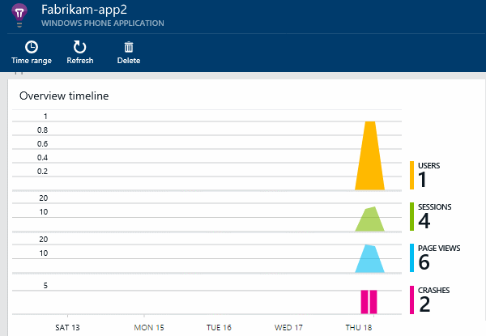

<properties 
	pageTitle="適用於 Windows Phone 和市集應用程式的 Application Insights" 
	description="使用 Application Insights 分析 Windows 裝置應用程式的使用情况和效能。" 
	services="application-insights" 
    documentationCenter="windows"
	authors="alancameronwills" 
	manager="keboyd"/>

<tags 
	ms.service="application-insights" 
	ms.workload="tbd" 
	ms.tgt_pltfrm="ibiza" 
	ms.devlang="na" 
	ms.topic="article" 
	ms.date="04/02/2015" 
	ms.author="awills"/>

# 適用於 Windows Phone 和市集應用程式的 Application Insights

*Application Insights 目前僅供預覽。*

[AZURE.INCLUDE [app-insights-selector-get-started](../includes/app-insights-selector-get-started.md)]

Visual Studio Application Insights 可讓您監視已發佈的應用程式在以下各方面的情況：

* [**使用量**][windowsUsage] - 了解您有多少使用者及他們如何使用您的應用程式。
* [**損毀**][windowsCrash] - 取得損毀的診斷報告，並了解損毀對使用者的影響。

對於許多應用程式類型，[Visual Studio 可以將 Application Insights 加入至您的應用程式](#ide)，而且您幾乎不會察覺。為了讓您清楚了解整個運作情形，本文將帶您手動完成這些步驟。

您需要：

* [Microsoft Azure][azure] 訂用帳戶。
* Visual Studio 2013 或更新版本。

## 1\.建立 Application Insights 資源 

在 [Azure 入口網站][portal] 中，建立新的 Application Insights 資源。

![選擇 \[新增\]、\[開發人員服務\]、\[Application Insights\]](./media/app-insights-windows-get-started/01-new.png)

Azure 中的[資源][roles]是服務的執行個體。此資源是來自您應用程式的遙測將經過分析並呈現的地方。

#### 複製檢測金鑰

此金鑰識別資源。您很快就需要用它來設定 SDK 將資料傳送給資源。

## 2\.將 Application Insights SDK 加入至應用程式

在 Visual Studio 中，將適當的 SDK 加入至專案。

如果是 Windows Universal 應用程式，請對 Windows Phone 專案與 Windows 專案重複這些步驟。

1. 在 \[方案總管\] 中以滑鼠右鍵按一下專案，然後選擇 \[**管理 NuGet 封裝**\]。

    

2. 選取 \[**線上**\]、\[**包括發行前版本**\]，然後搜尋 "Application Insights"。

    

3. 選取適當封裝的最新版本 - 下列其中一個：
   * 適用於 Windows 應用程式的 Application Insights - *適用於 Windows 市集應用程式*
   * 適用於 Windows Phone 應用程式的 Application Insights
   * 適用於 Web 應用程式的 Application Insights - *桌面應用程式使用此封裝* 
4. 編輯 ApplicationInsights.config \(已由 NuGet 安裝加入\)。在結尾標記前面插入此內容：

    `<InstrumentationKey>`\*您複製的金鑰\*`</InstrumentationKey>`

**Windows Universal 應用程式**：對 Phone 和市集專案重複這些步驟。

## 3.對應用程式啟用網路存取

如果應用程式尚未[要求連出網路存取](https://msdn.microsoft.com/library/windows/apps/hh452752.aspx)，您必須將此功能加入至它的資訊清單，當做[必要功能](https://msdn.microsoft.com/library/windows/apps/br211477.aspx)。

## 4.執行專案

[使用 F5 執行應用程式](http://msdn.microsoft.com/library/windows/apps/bg161304.aspx)並使用它，以產生一些遙測。

在 Visual Studio 中，您可以看見已接收到的事件計數。

在偵測模式下，遙測一產生就立即送出。在發行模式下，遙測會先儲存在裝置上，只在應用程式恢復時才傳送。

## 5.查看監視資料

從專案開啟 Application Insights。

剛開始的時候，您只會看見一或兩個資料點。例如：

如果您預期有更多資料，請在幾秒之後按一下 \[重新整理\]。

按一下任何圖表以查看詳細資料。

## 5.將應用程式發行至市集

[發佈應用程式](http://dev.windows.com/publish)，並觀察資料隨著使用者下載和使用它而累積。

## 自動化方式

如果您偏好使用 Visual Studio 執行設定步驟，您可以對 Windows Phone、Windows 市集和其他許多類型的應用程式這樣做。

###如果您要建立新的 Windows 應用程式專案...

在 \[新增專案\] 對話方塊中，選取 \[Application Insights\]。

如果系統要求您登入，請使用您的 Azure 帳戶的認證 \(不同於 Visual Studio Online 帳戶\)。

###或者，如果是現有的專案...

從 \[方案總管\] 加入 Application Insights。

## 後續步驟

[追蹤應用程式的使用量][windowsUsage]

[偵測和診斷應用程式中的損毀][windowsCrash]

[擷取和搜尋診斷記錄][diagnostic]

[使用 API 傳送自訂遙測][api]

[疑難排解][qna]

<!--Link references-->

[api]: app-insights-api-custom-events-metrics.md
[azure]: insights-perf-analytics.md
[diagnostic]: app-insights-diagnostic-search.md
[portal]: http://portal.azure.com/
[qna]: app-insights-troubleshoot-faq.md
[roles]: app-insights-resources-roles-access-control.md
[windowsCrash]: app-insights-windows-crashes.md
[windowsUsage]: app-insights-windows-usage.md

<!--HONumber=54-->