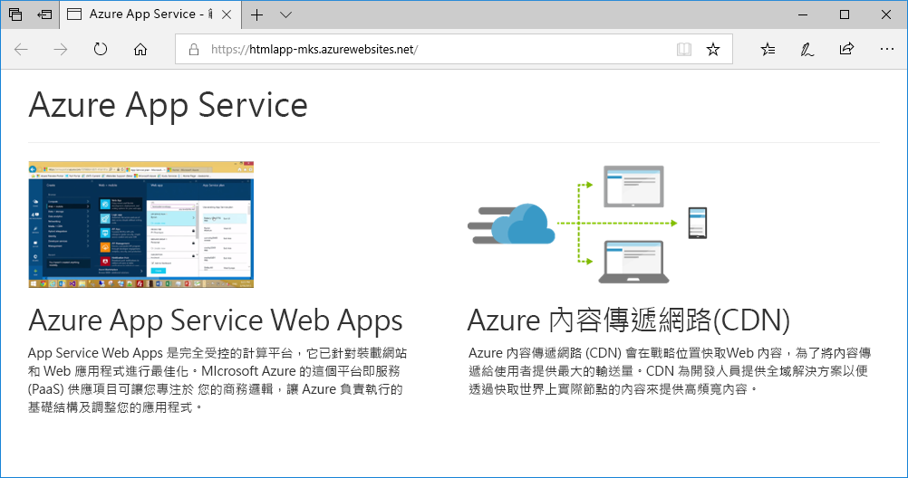
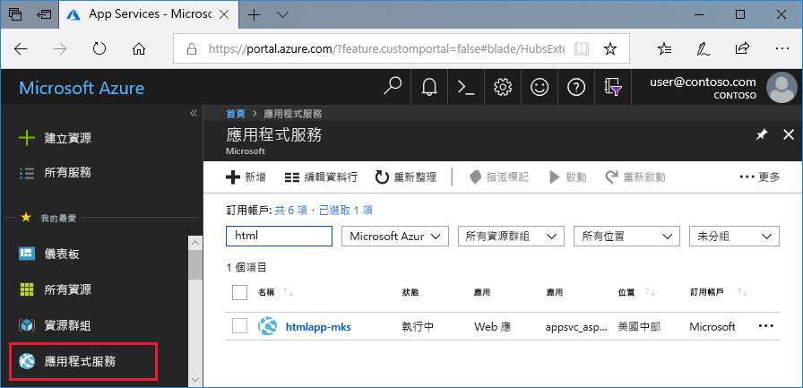
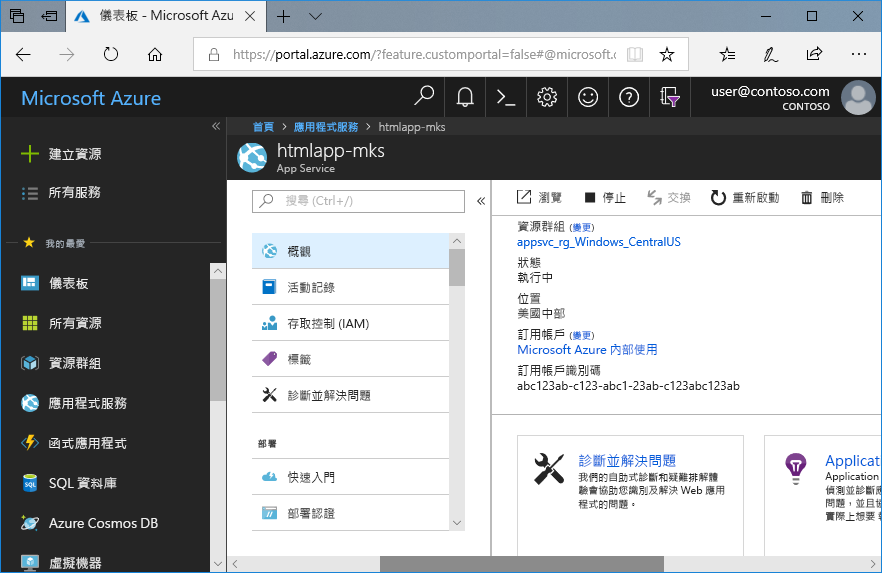

# <a name="create-a-static-html-web-app-in-azure"></a>在 Azure 中建立靜態 HTML Web 應用程式

[Azure App Service](overview.md) 可提供可高度擴充、自我修復的 Web 主控服務。 本快速入門顯示如何將基本 HTML+CSS 網站部署至 Azure App Service。 您將會在 [Cloud Shell](https://docs.microsoft.com/azure/cloud-shell/overview) 中完成本快速入門，但您也可以在本機使用 [Azure CLI](/cli/azure/install-azure-cli) 來執行這些命令。


[!INCLUDE [quickstarts-free-trial-note](../../includes/quickstarts-free-trial-note.md)]

[!INCLUDE [cloud-shell-try-it.md](../../includes/cloud-shell-try-it.md)]

## <a name="download-the-sample"></a>下載範例

在 Cloud Shell 中，建立快速入門目錄並變更為此目錄。

```bash
mkdir quickstart

cd $HOME/quickstart
```

下一步，執行下列命令，將範例應用程式存放庫複製到您的快速入門目錄。

```bash
git clone https://github.com/Azure-Samples/html-docs-hello-world.git
```

## <a name="create-a-web-app"></a>建立 Web 應用程式

變更為包含範例程式碼的目錄，並執行 `az webapp up` 命令。

在下列範例中，使用唯一的應用程式名稱取代 <app_name>。

```bash
cd html-docs-hello-world

az webapp up --location westeurope --name <app_name>
```

`az webapp up` 命令會執行下列動作：

- 建立預設的資源群組。

- 建立預設的 App Service 方案。

- 建立具有所指定名稱的應用程式。

- [以 Zip 檔進行部署](https://docs.microsoft.com/azure/app-service/deploy-zip)，將目前工作目錄中的檔案部署到 Web 應用程式。

此命令可能會花數分鐘執行。 執行上述命令時，會顯示類似下列範例的資訊：

```json
{
  "app_url": "https://<app_name>.azurewebsites.net",
  "location": "westeurope",
  "name": "<app_name>",
  "os": "Windows",
  "resourcegroup": "appsvc_rg_Windows_westeurope",
  "serverfarm": "appsvc_asp_Windows_westeurope",
  "sku": "FREE",
  "src_path": "/home/<username>/quickstart/html-docs-hello-world ",
  < JSON data removed for brevity. >
}
```

記下 `resourceGroup` 的值。 您在[清除資源](#clean-up-resources)一節將會用到此值。

## <a name="browse-to-the-app"></a>瀏覽至應用程式

在瀏覽器中，移至應用程式 URL：`http://<app_name>.azurewebsites.net`。

此頁面目前作為 Azure App Service Web 應用程式執行。


**恭喜！** 您已將第一個 HTML 應用程式部署至 App Service。

## <a name="update-and-redeploy-the-app"></a>更新和重新部署應用程式

在 Cloud Shell 中，輸入 `nano index.html`，以開啟 nano 文字編輯器。 在 `<h1>` 標題標記中，將「Azure App Service - 範例靜態 HTML 網站」變更為「Azure App Service」，如下所示。


儲存您的變更並結束 nano。 使用 `^O` 命令進行儲存，以及使用 `^X` 來結束作業。

您現在將使用相同的 `az webapp up` 命令重新部署應用程式。

```bash
az webapp up --location westeurope --name <app_name>
```

部署完成後，切換回在**瀏覽至應用程式**步驟中開啟的瀏覽器視窗，然後重新整理頁面。



## <a name="manage-your-new-azure-app"></a>管理新的 Azure 應用程式

請移至 <a href="https://portal.azure.com" target="_blank">Azure 入口網站</a>，以管理您所建立的 Web 應用程式。

按一下左側功能表中的 [應用程式服務]，然後按一下 Azure 應用程式的名稱。



您會看到 Web 應用程式的 [概觀] 頁面。 您可以在這裡執行基本管理工作，像是瀏覽、停止、啟動、重新啟動及刪除。



左側功能表提供不同的頁面來設定您的應用程式。

## <a name="clean-up-resources"></a>清除資源

在前述步驟中，您在資源群組中建立了 Azure 資源。 如果您在未來不需要這些資源，請在 Cloud Shell 中執行下列命令，以刪除資源群組。 切記，資源群組名稱已在[建立 Web 應用程式](#create-a-web-app)步驟中自動產生。

```bash
az group delete --name appsvc_rg_Windows_westeurope
```

此命令可能會花一分鐘執行。

## <a name="next-steps"></a>後續步驟

> [!div class="nextstepaction"]
> [對應自訂網域](app-service-web-tutorial-custom-domain.md)
