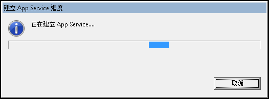
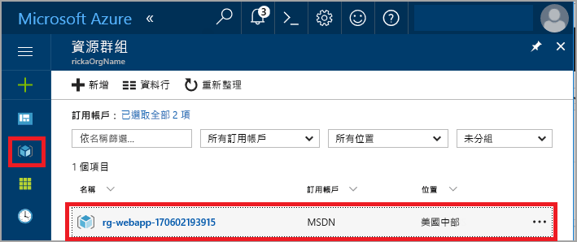
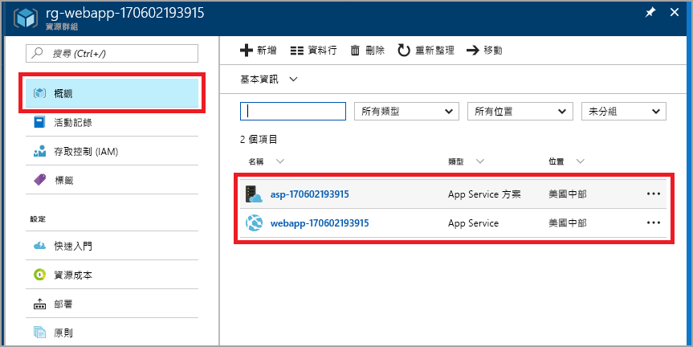
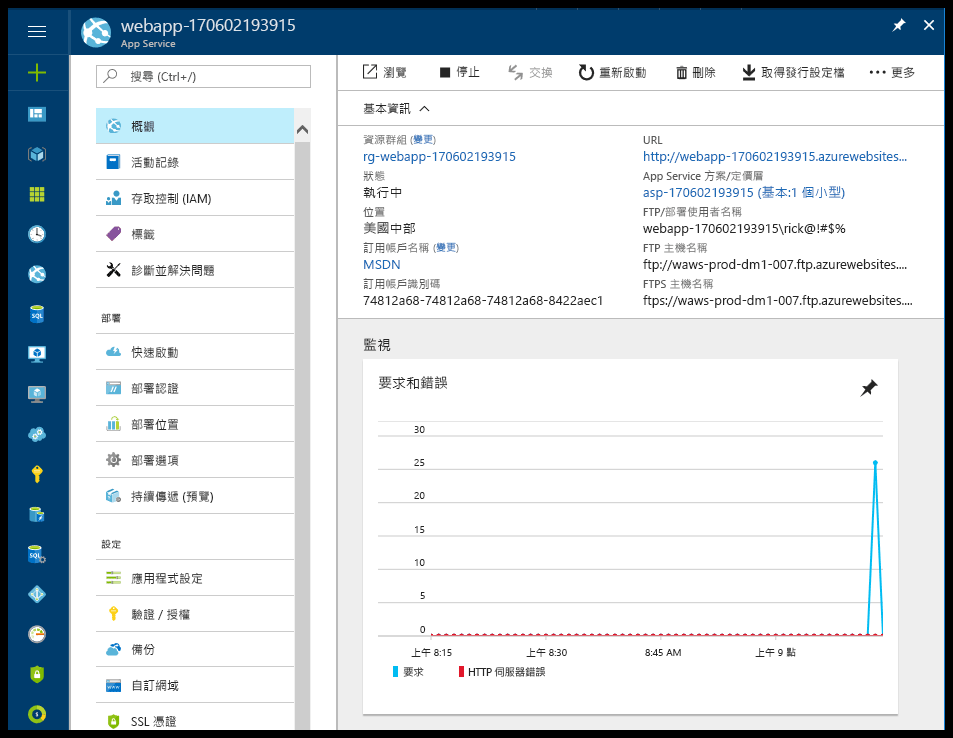

# <a name="create-your-first-java-web-app-in-azure"></a>在 Azure 中建立第一個 Java Web 應用程式

[Azure App Service](overview.md) 可提供可高度擴充、自我修復的 Web 主控服務。 本快速入門示範如何使用 [Eclipse IDE for Java EE Developers](https://www.eclipse.org/) 將 Java Web 應用程式部署到 App Service。

> [!NOTE]
>
> 本快速入門中的步驟示範如何使用 Eclipse IDE，來將 Java Web 應用程式發佈至 App Service，但是您也可以使用 IntelliJ IDEA Ultimate Edition 或 Community Edition。 如需詳細資訊，請參閱[使用 IntelliJ 建立 Azure Hello World Web 應用程式](/java/azure/intellij/azure-toolkit-for-intellij-create-hello-world-web-app)。
>

當您完成本快速入門，在網頁瀏覽器中檢視您的應用程式時，看起來會如下圖所示：


[!INCLUDE [quickstarts-free-trial-note](../../includes/quickstarts-free-trial-note.md)]

## <a name="prerequisites"></a>先決條件

若要完成本快速入門，請安裝：

* 免費的 <a href="https://www.eclipse.org/downloads/" target="_blank">Eclipse IDE for Java EE Developers</a>。 本快速入門使用 Eclipse Neon。
* <a href="/java/azure/eclipse/azure-toolkit-for-eclipse-installation" target="_blank">適用於 Eclipse 的 Azure 工具組</a>。

> [!NOTE]
>
> 您必須使用適用於 Eclipse 的 Azure 工具組登入您的 Azure 帳戶，以完成本快速入門中的步驟。 若要這麼做，請參閱[適用於 Eclipse 的 Azure 工具組的 Azure 登入指示](/java/azure/eclipse/azure-toolkit-for-eclipse-sign-in-instructions)。
>

## <a name="create-a-dynamic-web-project-in-eclipse"></a>在 Eclipse 中建立動態 Web 專案

在 Eclipse 中，選取 [檔案] > [新增] > [Dynamic Web Project]。

在 [新增動態 Web 專案] 對話方塊中，將專案命名為 **MyFirstJavaOnAzureWebApp**，然後選取 [完成]。
   


### <a name="add-a-jsp-page"></a>新增 JSP 頁面

如果未顯示 [專案總管]，請將它還原。


在 [專案總管] 中，展開 **MyFirstJavaOnAzureWebApp** 專案。
在 [WebContent] 上按一下滑鼠右鍵，然後選取 [新增] > [JSP 檔案]。


在 [新增 JSP 檔案] 對話方塊中：

* 將檔案命名為 **index.jsp**。
* 選取 [完成]。

  ![[新增 JSP 檔案] 對話方塊](./media/app-service-web-get-started-java/new-jsp-file-dialog-box-page-1.png)

在 index.jsp 檔案中，以下列標記取代 `<body></body>` 元素：

```jsp
<body>
<h1><% out.println("Hello Azure!"); %></h1>
</body>
```

儲存變更。

> [!NOTE]
>
> 如果您在第 1 行看到錯誤，指出有 Java Servlet 類別遺失，請直接忽略即可。
> 
> 
>

## <a name="publish-the-web-app-to-azure"></a>將 Web 應用程式發佈至 Azure

在 [專案總管] 中，以滑鼠右鍵按一下專案，然後選取 [Azure] > [發佈為 Azure Web 應用程式]。

![[發佈為 Azure Web 應用程式] 內容功能表](./media/app-service-web-get-started-java/publish-as-azure-web-app-context-menu.png)

如果出現 [Azure 登入] 對話方塊的提示，則必須依照[適用於 Eclipse 之 Azure 工具組的 Azure 登入指示](/java/azure/eclipse/azure-toolkit-for-eclipse-sign-in-instructions)一文中的步驟輸入您的認證。

### <a name="deploy-web-app-dialog-box"></a>部署 Web 應用程式對話方塊

在您登入 Azure 帳戶後，[部署 Web 應用程式] 對話方塊隨即出現。

選取 [建立] 。


### <a name="create-app-service-dialog-box"></a>建立 App Service 對話方塊

顯示的 [建立 App Service] 對話方塊會包含預設值。 下圖中顯示的數字 **170602185241** 不同於您的對話方塊。


在 [建立 App Service] 對話方塊中：

* 為您的 Web 應用程式名稱輸入唯一的名稱，或保留所產生的名稱。 此名稱在整個 Azure 中必須是唯一的。 名稱是 Web 應用程式 URL 位址的一部分。 例如：如果 Web 應用程式名稱是 **MyJavaWebApp**，URL 是 *myjavawebapp.azurewebsites.net*。
* 在本快速入門中，保留預設 Web 容器。
* 選取 Azure 訂用帳戶。
* 在 [App Service 方案] 索引標籤上：

  * **建立新項目**：保留預設值，這是 App Service 方案的名稱。
  * **位置**：選取 [西歐] 或您附近的區域。
  * **定價層**：選取免費選項。 如需詳細資訊，請參閱 [App Service 價格](https://azure.microsoft.com/pricing/details/app-service/?ref=microsoft.com&utm_source=microsoft.com&utm_medium=docs&utm_campaign=visualstudio)。

   

[!INCLUDE [app-service-plan](../../includes/app-service-plan.md)]

### <a name="resource-group-tab"></a>資源群組索引標籤

選取 [資源群組] 索引標籤。保留針對資源群組產生的預設值。


[!INCLUDE [resource-group](../../includes/resource-group.md)]

選取 [建立] 。

<!--
### The JDK tab

Select the **JDK** tab. Keep the default, and then select **Create**.


-->

Azure Toolkit 會建立 Web 應用程式並顯示進度對話方塊。



### <a name="deploy-web-app-dialog-box"></a>部署 Web 應用程式對話方塊

在 [部署 Web 應用程式] 對話方塊中，選取 [部署至根目錄]。 如果您有位於 wingtiptoys.azurewebsites.net 的應用程式服務，而您未將它部署至根目錄，則命名為 **MyFirstJavaOnAzureWebApp** 的 Web 應用程式會部署至 wingtiptoys.azurewebsites.net/MyFirstJavaOnAzureWebApp。


此對話方塊會顯示 Azure、JDK 和 Web 容器選取項目。

選取 [部署] 將 Web 應用程式發佈至 Azure。

當發佈完成時，選取 [Azure 活動記錄] 對話方塊中的 [已發佈] 連結。


恭喜！ 您已成功將 Web 應用程式部署至 Azure。 


## <a name="update-the-web-app"></a>更新 Web 應用程式

將範例 JSP 程式碼變更為不同的訊息。

```jsp
<body>
<h1><% out.println("Hello again Azure!"); %></h1>
</body>
```

儲存變更。

在 [專案總管] 中，以滑鼠右鍵按一下專案名稱，然後選取 [Azure] > [發佈為 Azure Web 應用程式]。

[部署 Web 應用程式] 對話方塊隨即出現，並顯示您先前建立的應用程式服務。 

> [!NOTE] 
> 每次發佈時都選取 [部署至根目錄]。 
> 

選取 Web 應用程式，然後選取 [部署] 來發佈變更。

當 [發佈] 連結出現時，請加以選取來瀏覽至 Web 應用程式並查看變更。

## <a name="manage-the-web-app"></a>管理 Web 應用程式

請移至 <a href="https://portal.azure.com" target="_blank">Azure 入口網站</a>，以查看您所建立的 Web 應用程式。

從左功能表，選取 [資源群組]。



選取資源群組。 此頁面會顯示您在本快速入門中建立的資源。



選取 Web 應用程式 (上圖中的 **webapp 170602193915**)。

[概觀] 頁面隨即出現。 此頁面可讓您檢視應用程式的執行方式。 您可以在這裡執行基本管理工作，像是瀏覽、停止、啟動、重新啟動及刪除。 頁面左側的索引標籤會顯示您可以開啟的各種組態。 



[!INCLUDE [clean-up-section-portal-web-app](../../includes/clean-up-section-portal-web-app.md)]

## <a name="next-steps"></a>後續步驟

> [!div class="nextstepaction"]
> [對應自訂網域](app-service-web-tutorial-custom-domain.md)
