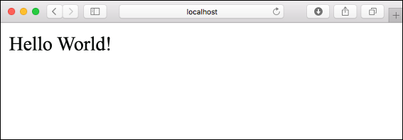
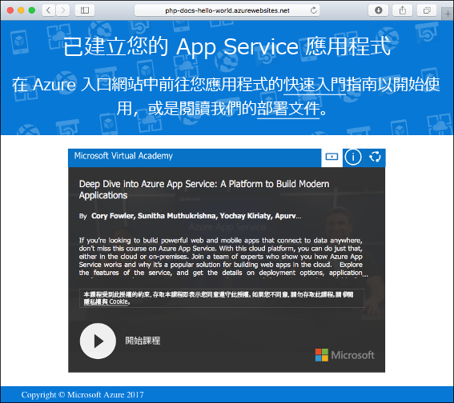
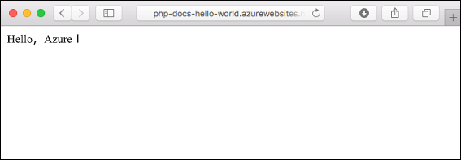

# <a name="create-a-php-web-app-in-azure"></a>在 Azure 中建立 PHP Web 應用程式

> [!NOTE]
> 本文會將應用程式部署至 Windows 上的 App Service。 若要部署至 _Linux_ 上的 App Service，請參閱[在 Linux 上的 App Service 中建立 PHP Web 應用程式](./containers/quickstart-php.md)。
>

[Azure Web Apps](app-service-web-overview.md) 提供可高度擴充、自我修復的 Web 主機服務。  本快速入門教學課程會顯示如何將 PHP 應用程式部署至 Azure Web Apps。 您將會在 Cloud Shell 中使用 [Azure CLI](https://docs.microsoft.com/cli/azure/get-started-with-azure-cli) 建立 Web 應用程式，並使用 [ZIP 檔案](app-service-deploy-zip.md)將 PHP 程式碼範例部署至 Web 應用程式。

![在 Azure 中執行的範例應用程式]](media/app-service-web-get-started-php/hello-world-in-browser.png)

您可以使用 Mac、Windows 或 Linux 機器，依照此處的步驟操作。 安裝先決條件後，大約需要 5 分鐘才能完成這些步驟。

[!INCLUDE [quickstarts-free-trial-note](../../includes/quickstarts-free-trial-note.md)]

## <a name="prerequisites"></a>先決條件

若要完成本快速入門：

* <a href="https://php.net" target="_blank">安裝 PHP</a>

## <a name="download-the-sample-locally"></a>將範例下載到本機

從 [https://github.com/Azure-Samples/php-docs-hello-world/archive/master.zip](https://github.com/Azure-Samples/php-docs-hello-world/archive/master.zip) 下載 PHP 專案範例，並將 ZIP 封存檔解壓縮。

在終端機視窗中，瀏覽至 PHP 專案範例的根目錄 (包含 _index.php_ 的目錄)。

## <a name="run-the-app-locally"></a>在本機執行應用程式

開啟終端機視窗並使用 `php` 命令來啟動內建 PHP Web 伺服器，以在本機執行應用程式。

```bash
php -S localhost:8080
```

開啟網頁瀏覽器，然後巡覽至位於 `http://localhost:8080` 的範例應用程式。

您會看到來自範例應用程式的 **Hello World!** 訊息顯示在網頁中。



在終端機視窗中，按 **Ctrl+C** 結束 web 伺服器。

[!INCLUDE [Create ZIP file](../../includes/app-service-web-create-zip.md)]

[!INCLUDE [cloud-shell-try-it.md](../../includes/cloud-shell-try-it.md)]

[!INCLUDE [Upload zip file](../../includes/app-service-web-upload-zip.md)]

[!INCLUDE [Create resource group](../../includes/app-service-web-create-resource-group.md)]

[!INCLUDE [Create app service plan](../../includes/app-service-web-create-app-service-plan.md)]

## <a name="create-a-web-app"></a>建立 Web 應用程式

在 Cloud Shell 中，使用 [`az webapp create`](/cli/azure/webapp?view=azure-cli-latest#az_webapp_create) 命令，在 `myAppServicePlan` App Service 方案中建立 Web 應用程式。 

在下列範,了中，使用全域唯一的應用程式名稱 (有效的字元為 `a-z`、`0-9` 和 `-`) 取代 `<app_name>`。 執行階段設定為 `PHP|7.0`。 若要查看所有支援的執行階段，請執行 [`az webapp list-runtimes`](/cli/azure/webapp?view=azure-cli-latest#az_webapp_list_runtimes)。 

```azurecli-interactive
az webapp create --resource-group myResourceGroup --plan myAppServicePlan --name <app_name> --runtime "PHP|7.0"
```

建立 Web 應用程式後，Azure CLI 會顯示類似下列範例的輸出：

```json
{
  "availabilityState": "Normal",
  "clientAffinityEnabled": true,
  "clientCertEnabled": false,
  "cloningInfo": null,
  "containerSize": 0,
  "dailyMemoryTimeQuota": 0,
  "defaultHostName": "<app_name>.azurewebsites.net",
  "enabled": true,
  < JSON data removed for brevity. >
}
```

瀏覽至您剛建立的 Web 應用程式。 以唯一的應用程式名稱取代 _&lt;app name>_。

```bash
http://<app name>.azurewebsites.net
```



[!INCLUDE [Deploy uploaded ZIP file](../../includes/app-service-web-deploy-zip.md)]

## <a name="browse-to-the-app"></a>瀏覽至應用程式

使用 web 瀏覽器瀏覽至已部署的應用程式。

```bash
http://<app_name>.azurewebsites.net
```

PHP 範例程式碼正在 Azure App Service Web 應用程式中執行。


**恭喜！** 您已將第一個 PHP 應用程式部署至 App Service。

## <a name="update-locally-and-redeploy-the-code"></a>在本機更新和重新部署程式碼

使用本機文字編輯器，開啟 PHP 應用程式內的 `index.php` 檔案，並且對 `echo` 旁邊字串內的文字進行小幅變更：

```php
echo "Hello Azure!";
```

在本機的終端機視窗中，瀏覽至應用程式的根目錄，然後為更新後的專案建立新的 ZIP 檔案。

```
# Bash
zip -r myUpdatedAppFiles.zip .

# PowerShell
Compress-Archive -Path * -DestinationPath myUpdatedAppFiles.zip
``` 

使用[上傳 ZIP 檔案](#upload-the-zip-file)中的相同步驟，將這個新的 ZIP 檔案上傳至 Cloud Shell。

然後，在 Cloud Shell 中再次部署您所上傳的 ZIP 檔案。

```azurecli-interactive
az webapp deployment source config-zip --resource-group myResouceGroup --name <app_name> --src clouddrive/myUpdatedAppFiles.zip
```

切換回在**瀏覽至應用程式**步驟中開啟的瀏覽器視窗，然後重新整理頁面。



## <a name="manage-your-new-azure-web-app"></a>管理新的 Azure Web 應用程式

請移至 <a href="https://portal.azure.com" target="_blank">Azure 入口網站</a>，以管理您所建立的 Web 應用程式。

按一下左側功能表中的 [應用程式服務]，然後按一下 Azure Web 應用程式的名稱。


您會看到 Web 應用程式的 [概觀] 頁面。 您可以在這裡執行基本管理工作，像是瀏覽、停止、啟動、重新啟動及刪除。


左側功能表提供不同的頁面來設定您的應用程式。 

[!INCLUDE [cli-samples-clean-up](../../includes/cli-samples-clean-up.md)]

## <a name="next-steps"></a>後續步驟

> [!div class="nextstepaction"]
> [PHP with MySQL](app-service-web-tutorial-php-mysql.md)
