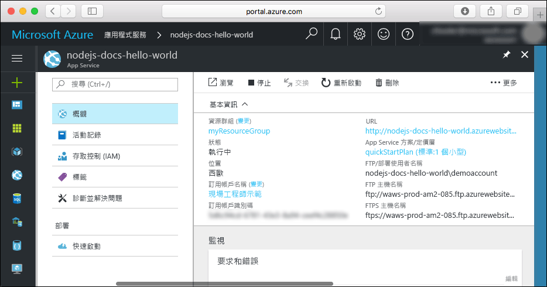

# <a name="create-a-python-web-app-in-azure"></a>在 Azure 中建立 Python Web 應用程式

[Azure Web Apps](app-service-web-overview.md) 提供可高度擴充、自我修復的 Web 主機服務。  本快速入門逐步解說如何開發 Python 應用程式及部署至 Azure Web Apps。 您可使用 [Azure CLI](https://docs.microsoft.com/cli/azure/get-started-with-azure-cli)建立 Web 應用程式，而且使用 Git 將範例 Python 程式碼部署至 Web 應用程式。


您可以使用 Mac、Windows 或 Linux 電腦，依照下面步驟操作。 安裝先決條件後，大約需要 5 分鐘才能完成這些步驟。

[!INCLUDE [quickstarts-free-trial-note](../../includes/quickstarts-free-trial-note.md)]

## <a name="prerequisites"></a>先決條件

若要完成本教學課程：

* <a href="https://git-scm.com/" target="_blank">安裝 Git</a>
* <a href="https://www.python.org/downloads/" target="_blank">安裝 Python</a>

## <a name="download-the-sample"></a>下載範例

在終端機視窗中執行下列命令，將範例應用程式存放庫複製到本機電腦。

```bash
git clone https://github.com/Azure-Samples/python-docs-hello-world
```

變更為包含範例程式碼的目錄。

```bash
cd python-docs-hello-world
```

## <a name="run-the-app-locally"></a>在本機執行應用程式

使用 `pip` 安裝必要的套件。

```bash
pip install -r requirements.txt
```

開啟終端機視窗並使用 `Python` 命令來啟動內建 Python Web 伺服器，以在本機執行應用程式。

```bash
python main.py
```

開啟網頁瀏覽器，然後巡覽至位於 `http://localhost:5000` 的範例應用程式。

您可以看到來自範例應用程式的 **Hello World** 訊息顯示在網頁中。


在終端機視窗中，按 **Ctrl+C** 結束 web 伺服器。

[!INCLUDE [cloud-shell-try-it.md](../../includes/cloud-shell-try-it.md)]

[!INCLUDE [Configure deployment user](../../includes/configure-deployment-user.md)]

[!INCLUDE [Create resource group](../../includes/app-service-web-create-resource-group.md)]

[!INCLUDE [Create app service plan](../../includes/app-service-web-create-app-service-plan.md)]

## <a name="create-a-web-app"></a>建立 Web 應用程式

[!INCLUDE [Create web app](../../includes/app-service-web-create-web-app-python-no-h.md)]

瀏覽至您剛建立的 Web 應用程式。 以唯一的應用程式名稱取代 _&lt;app name>_。

```bash
http://<app name>.azurewebsites.net
```


[!INCLUDE [Push to Azure](../../includes/app-service-web-git-push-to-azure.md)]

```bash
Counting objects: 18, done.
Delta compression using up to 4 threads.
Compressing objects: 100% (16/16), done.
Writing objects: 100% (18/18), 4.31 KiB | 0 bytes/s, done.
Total 18 (delta 4), reused 0 (delta 0)
remote: Updating branch 'master'.
remote: Updating submodules.
remote: Preparing deployment for commit id '44e74fe7dd'.
remote: Generating deployment script.
remote: Generating deployment script for python Web Site
remote: Generated deployment script files
remote: Running deployment command...
remote: Handling python deployment.
remote: KuduSync.NET from: 'D:\home\site\repository' to: 'D:\home\site\wwwroot'
remote: Deleting file: 'hostingstart.html'
remote: Copying file: '.gitignore'
remote: Copying file: 'LICENSE'
remote: Copying file: 'main.py'
remote: Copying file: 'README.md'
remote: Copying file: 'requirements.txt'
remote: Copying file: 'virtualenv_proxy.py'
remote: Copying file: 'web.2.7.config'
remote: Copying file: 'web.3.4.config'
remote: Detected requirements.txt.  You can skip Python specific steps with a .skipPythonDeployment file.
remote: Detecting Python runtime from site configuration
remote: Detected python-3.4
remote: Creating python-3.4 virtual environment.
remote: .................................
remote: Pip install requirements.
remote: Successfully installed Flask click itsdangerous Jinja2 Werkzeug MarkupSafe
remote: Cleaning up...
remote: .
remote: Overwriting web.config with web.3.4.config
remote:         1 file(s) copied.
remote: Finished successfully.
remote: Running post deployment command(s)...
remote: Deployment successful.
To https://<app_name>.scm.azurewebsites.net/<app_name>.git
 * [new branch]      master -> master
```

## <a name="browse-to-the-app"></a>瀏覽至應用程式

使用 web 瀏覽器瀏覽至已部署的應用程式。

```bash
http://<app_name>.azurewebsites.net
```

Python 範例程式碼正在 Azure App Service Web 應用程式中執行。


**恭喜！** 您已將第一個 Python 應用程式部署至 App Service。

## <a name="update-and-redeploy-the-code"></a>更新和重新部署程式碼

使用本機文字編輯器，在 Python 應用程式中開啟 `main.py` 檔案，並且對 `return` 陳述式旁邊的文字進行小幅變更：

```python
return 'Hello, Azure!'
```

在本機終端機視窗中，在 Git 中認可您的變更，然後將程式碼變更推送至 Azure。

```bash
git commit -am "updated output"
git push azure master
```

部署完成後，切換回在[瀏覽至應用程式](#browse-to-the-app)步驟中開啟的瀏覽器視窗，然後重新整理頁面。


## <a name="manage-your-new-azure-web-app"></a>管理新的 Azure Web 應用程式

請移至 <a href="https://portal.azure.com" target="_blank">Azure 入口網站</a>，以管理您所建立的 Web 應用程式。

按一下左側功能表中的 [應用程式服務]，然後按一下 Azure Web 應用程式的名稱。


您會看到 Web 應用程式的 [概觀] 頁面。 您可以在這裡執行基本管理工作，像是瀏覽、停止、啟動、重新啟動及刪除。



左側功能表提供不同的頁面來設定您的應用程式。

[!INCLUDE [cli-samples-clean-up](../../includes/cli-samples-clean-up.md)]

## <a name="next-steps"></a>後續步驟

> [!div class="nextstepaction"]
> [將現有的自訂 DNS 名稱對應至 Azure Web Apps](app-service-web-tutorial-custom-domain.md)
