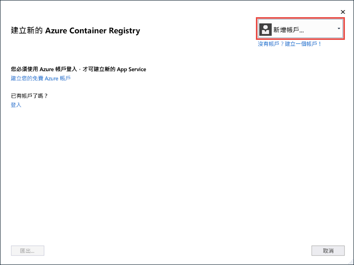
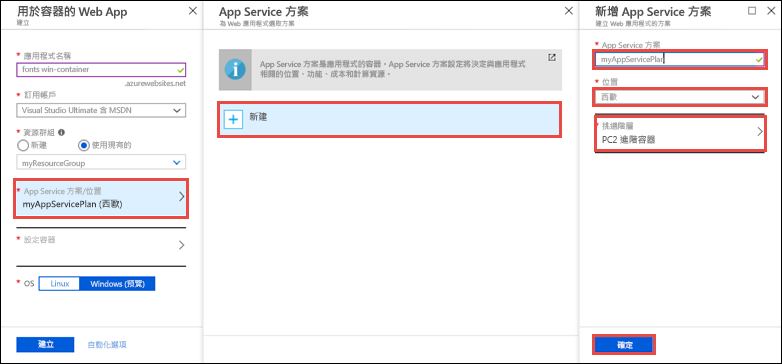

# <a name="migrate-an-aspnet-app-to-azure-app-service-using-a-windows-container-preview"></a>使用 Windows 容器將 ASP.NET 應用程式移轉至 Azure App Service (預覽)

[Azure App Service](overview.md) 會在 Windows 上提供預先定義的應用程式堆疊 (例如 ASP.NET 或 Node.js)，執行於 IIS 上。 預先設定的 Windows 環境會鎖定作業系統的系統管理存取、軟體安裝、對全域組件快取的變更等作業 (請參閱 [Azure App Service 上的作業系統功能](operating-system-functionality.md))。 但是，在 App Service 中使用自訂 Windows 容器可讓您進行應用程式所需的作業系統變更，因此能夠很容易地移轉需要自訂作業系統與軟體設定的內部部署應用程式。 此教學課程會示範如何將使用 Windows 字型庫中已安裝自訂字型的 ASP.NET 應用程式移轉至 App Service。 您會將自訂的 Windows 映像從 Visual Studio 部署到 [Azure Container Registry](https://docs.microsoft.com/azure/container-registry/)，然後在 App Service 中執行。


## <a name="prerequisites"></a>必要條件

若要完成本教學課程：

- <a href="https://hub.docker.com/" target="_blank">註冊 Docker Hub 帳戶</a>
- <a href="https://docs.docker.com/docker-for-windows/install/" target="_blank">安裝適用於 Windows 的 Docker</a>。
- <a href="https://docs.microsoft.com/virtualization/windowscontainers/quick-start/quick-start-windows-10" target="_blank">切換 Docker 以執行 Windows 容器</a>。
- <a href="https://www.visualstudio.com/downloads/" target="_blank">安裝 Visual Studio 2017</a>，記得包含 **ASP.NET 與網頁程式開發**與 **Azure 開發**工作負載。 若您已安裝 Visual Studio 2017：
    - 按一下 [說明] > [檢查更新] 以安裝最新的 Visual Studio 更新。
    - 按一下 [工具] > [取得工具與功能] 以在 Visual Studio 中新增工作負載。

## <a name="set-up-the-app-locally"></a>在本機設定應用程式

### <a name="download-the-sample"></a>下載範例

在此步驟中，您要設定本機 .NET 專案。

- [下載範例專案](https://github.com/Azure-Samples/custom-font-win-container/archive/master.zip)。
- 擷取 (解壓縮) *custom-font-win-container.zip* 檔案。

範例專案包含一個使用 Windows 字型庫中已安裝自訂字型的簡單 ASP.NET 應用程式。 您不需要安裝字型，但它是一個與底層 OS 整合的應用程式範例。 若要將此類應用程式移轉至 App Service，可以重新建構程式碼以移除整合，或在自訂 Windows 容器中原封不動進行移轉。

### <a name="install-the-font"></a>安裝字型

在 Windows 檔案總管中，瀏覽至 _custom-font-win-container-master/CustomFontSample_，以滑鼠右鍵按一下 _FrederickatheGreat-Regular.ttf_，然後選取 [安裝]。

可從 [Google Fonts](https://fonts.google.com/specimen/Fredericka+the+Great) 下載此字型。

### <a name="run-the-app"></a>執行應用程式

在 Visual Studio 中開啟 *custom-font-win-container/CustomFontSample.sln* 檔案。 

輸入 `Ctrl+F5` 以執行應用程式而不偵錯。 應用程式會在預設瀏覽器中顯示。 

![[新增 ASP.NET 專案] 對話方塊](media/app-service-web-tutorial-windows-containers-custom-fonts/local-app-in-browser.png)

由於該應用程式是使用已安裝的字型，因此無法在 App Service 沙箱中執行。 但是，可以改為使用 Windows 容器部署它，因為可以在 Windows 容器中安裝字型。

### <a name="configure-windows-container"></a>設定 Windows 容器

在 [方案總管] 中，以滑鼠右鍵按一下 **CustomFontSample** 專案，然後選取 [新增] > [容器協調流程支援]。

![[新增 ASP.NET 專案] 對話方塊](media/app-service-web-tutorial-windows-containers-custom-fonts/enable-container-orchestration.png)

選取 [Docker Compose] > [確定]。

您的專案現在已設定為在 Windows 容器中執行。 _Dockerfile_ 已新增至 **CustomFontSample** 專案，而且 **docker-compose** 專案已新增至解決方案。 

從 [方案總管] 開啟 **Dockerfile**。

您需要使用[支援的父映像](app-service-web-get-started-windows-container.md#use-a-different-parent-image)。 請使用下列程式碼取代 `FROM` 這一行，以變更父映像：

```Dockerfile
FROM microsoft/aspnet:4.7.1
```

在檔案結尾處加入以下這一行並儲存檔案：

```Dockerfile
RUN ${source:-obj/Docker/publish/InstallFont.ps1}
```

您可以在 **CustomFontSample** 專案中找到 _InstallFont.ps1_。 它是用於安裝字型的簡單指令碼。 您可以在 [Script Center](https://gallery.technet.microsoft.com/scriptcenter/fb742f92-e594-4d0c-8b79-27564c575133) 找到較複雜版本的指令碼。

## <a name="publish-to-azure-container-registry"></a>發佈至 Azure Container Registry

[Azure Container Registry](https://docs.microsoft.com/azure/container-registry/) 可儲存映像以用於容器部署。 您可以設定 App Service 使用 Azure Container Registry 中裝載的映像。

### <a name="open-publish-wizard"></a>開啟發佈精靈

在 [方案總管] 中，以滑鼠右鍵按一下 **CustomFontSample** 專案，然後選取 [發佈]。

![[新增 ASP.NET 專案] 對話方塊](media/app-service-web-tutorial-windows-containers-custom-fonts/open-publish-wizard.png)

### <a name="create-registry-and-publish"></a>建立登錄並發佈

在 [發佈精靈] 中，選取 [容器登錄] > [建立新的 Azure Container Registry] > [發佈]。

![[新增 ASP.NET 專案] 對話方塊](media/app-service-web-tutorial-windows-containers-custom-fonts/create-registry.png)

### <a name="sign-in-with-azure-account"></a>使用 Azure 帳戶登入

在 [建立新的 Azure Container Registry] 對話方塊中，選取 [新增帳戶]，然後登入您的 Azure 訂用帳戶。 如果您已登入，請從下拉式清單中選取包含所需訂用帳戶的帳戶。



### <a name="configure-the-registry"></a>設定登錄

依據下表建議的值設定新的容器登錄。 完成後，按一下 [建立]。

| 設定  | 建議的值 | 取得詳細資訊 |
| ----------------- | ------------ | ----|
|**DNS 首碼**| 保留產生的登錄名稱，或將它變更為其他唯一名稱。 |  |
|**資源群組**| 按一下 [新增]，輸入 **myResourceGroup**，然後按一下 [確定]。 |  |
|**SKU**| 基本 | [定價層](https://azure.microsoft.com/pricing/details/container-registry/)|
|**登錄位置**| 西歐 | |


此時會開啟終端機視窗並顯示映像部署進度。 等待部署完成。

## <a name="sign-in-to-azure"></a>登入 Azure

在 https://portal.azure.com 登入 Azure 入口網站。

## <a name="create-a-web-app"></a>建立 Web 應用程式

從左側功能表，選取 [建立資源] > [網路]  > [用於容器的 Web App]。

### <a name="configure-the-new-web-app"></a>設定新的 Web 應用程式

在建立介面中，依據下表進行設定：

| 設定  | 建議的值 | 取得詳細資訊 |
| ----------------- | ------------ | ----|
|**應用程式名稱**| 輸入唯一名稱。 | Web 應用程式的 URL 是 `http://<app_name>.azurewebsites.net`，其中 `<app_name>` 是您的應用程式名稱。 |
|**資源群組**| 選取 [使用現有的項目]，然後輸入 **myResourceGroup**。 |  |
|**作業系統**| Windows (預覽) | |

### <a name="configure-app-service-plan"></a>設定 App Service 方案

按一下 [App Service 方案/位置] > [新建]。 指定新方案的名稱，選取 [西歐] 作為位置，然後按一下 [確定]。



### <a name="configure-container"></a>設定容器

按一下 [設定容器] > [Azure Container Registry]。 選取您稍早在[發佈至 Azure Container Registry](#publish-to-azure-container-registry) 中建立的登錄、映像與標記，然後按一下 [確定]。


### <a name="complete-app-creation"></a>完成應用程式建立作業

按一下 [建立]，並等候 Azure 建立所需的資源。

## <a name="browse-to-the-web-app"></a>瀏覽至 Web 應用程式

Azure 作業完成時，會顯示通知方塊。


1. 按一下 [前往資源]。

2. 在應用程式頁面中，按一下 [URL] 下方的連結。

新的瀏覽器頁面隨即開啟，並顯示下列頁面：


等候幾分鐘並再試一次，直到獲得包含所需美麗字型的首頁為止。


**恭喜！** 您已運用 Windows 容器將 ASP.NET 應用程式移轉至 Azure App Service。

## <a name="see-container-start-up-logs"></a>檢視容器啟動記錄

Windows 容器載入可能需要一些時間。 若要查看進度，請將 *\<app_name>* 取代為您的應用程式名稱，以瀏覽至下列 URL。
```
https://<app_name>.scm.azurewebsites.net/api/logstream
```

串流處理的記錄會如下所示：

```
14/09/2018 23:16:19.889 INFO - Site: fonts-win-container - Creating container for image: customfontsample20180914115836.azurecr.io/customfontsample:latest.
14/09/2018 23:16:19.928 INFO - Site: fonts-win-container - Create container for image: customfontsample20180914115836.azurecr.io/customfontsample:latest succeeded. Container Id 329ecfedbe370f1d99857da7352a7633366b878607994ff1334461e44e6f5418
14/09/2018 23:17:23.405 INFO - Site: fonts-win-container - Start container succeeded. Container: 329ecfedbe370f1d99857da7352a7633366b878607994ff1334461e44e6f5418
14/09/2018 23:17:28.637 INFO - Site: fonts-win-container - Container ready
14/09/2018 23:17:28.637 INFO - Site: fonts-win-container - Configuring container
14/09/2018 23:18:03.823 INFO - Site: fonts-win-container - Container ready
14/09/2018 23:18:03.823 INFO - Site: fonts-win-container - Container start-up and configuration completed successfully
```

