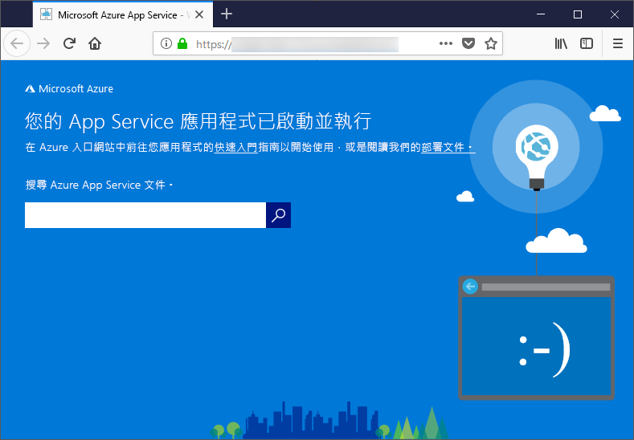

# <a name="configure-your-python-app-for-the-azure-app-service-on-linux"></a>針對 Linux 上的 Azure App Service 設定 Python 應用程式

本文說明 [Linux 上的 Azure App Service](app-service-linux-intro.md) 會如何執行 Python 應用程式，以及要如何在需要時自訂 App Service 的行為。

## <a name="set-python-version"></a>設定 Python 版本

有兩個基礎映像可供使用：Python 3.6 和 Python 3.7。 您可以使用所需的 Python 型映像來建立應用程式。 例如，若要使用 Python 3.7 建立應用程式，請在 Cloud Shell 中執行下列命令：

```azurecli-interactive
az webapp create --resource-group <group_name> --plan <plan_name> --name <app_name> --runtime "PYTHON|3.7"
```

例如，若要將 Python 版本 (型映像) 變更為 Python 3.6，請在 Cloud Shell 中執行下列命令：

```azurecli-interactive
az webapp config set --resource-group <group_name> --name <app_name> --linux-fx-version "PYTHON|3.6"
```

如果您需要不同的 Python 版本，則必須改為建置和部署您自己的容器映像。 如需詳細資訊，請參閱[針對用於容器的 Web App 使用自訂 Docker 映像](tutorial-custom-docker-image.md)。

## <a name="container-characteristics"></a>容器的特性

部署至 Linux 上 App Service 的 Python 應用程式，會在 GitHub 存放庫 ([Python 3.6](https://github.com/Azure-App-Service/python/tree/master/3.6.6) 或 [Python 3.7](https://github.com/Azure-App-Service/python/tree/master/3.7.0)) 中所定義的 Docker 容器內執行。

此容器具有下列特性︰

- 應用程式在執行時所使用的是 [Gunicorn WSGI HTTP 伺服器](https://gunicorn.org/)，並且會使用額外的引數 `--bind=0.0.0.0 --timeout 600`。

- 根據預設，基底映像包含 Flask Web 架構，但容器也可支援其他符合 WSGI 標準且相容於 Python 3.7 的架構，例如 Django。

- 若要安裝其他套件 (例如 Django)，請使用 `pip freeze > requirements.txt` 在專案的根目錄中建立 [*requirements.txt*](https://pip.pypa.io/en/stable/user_guide/#requirements-files) 檔案。 然後，使用 Git 部署將專案發佈至 App Service，該部署會在容器中自動執行 `pip install -r requirements.txt` 以安裝應用程式的相依性。

## <a name="container-startup-process-and-customizations"></a>容器的啟動程序和自訂

在啟動期間，Linux 容器上的 App Service 會執行下列步驟：

1. 請檢查並套用自訂的啟動命令 (如果有提供的話)。
2. 檢查 Django 應用程式的 wsgi.py 檔案是否存在，如果存在，則使用該檔案啟動 Gunicorn。
3. 檢查名為 application.py 的檔案，如果有找到，則使用 `application:app` 啟動 Gunicorn 以採用 Flask 應用程式。
4. 如果找不到其他應用程式，則請啟動容器內建的預設應用程式。

下列各節會提供每個選項的其他詳細資料。

### <a name="django-app"></a>Django 應用程式

針對 Django 應用程式，App Service 會尋找應用程式的程式碼內名為 `wsgi.py` 的檔案，然後使用下列命令執行 Gunicorn：

```bash
# <module> is the path to the folder containing wsgi.py
gunicorn --bind=0.0.0.0 --timeout 600 <module>.wsgi
```

如果您想要更加具體地控制啟動命令，請使用[自訂啟動命令](#custom-startup-command)，並將 `<module>` 替換為包含 wsgi.py 的模組名稱。

### <a name="flask-app"></a>Flask 應用程式

針對 Flask，App Service 會尋找名為 application.py 的檔案，並啟動 Gunicorn，如下所示：

```bash
gunicorn --bind=0.0.0.0 --timeout 600 application:app
```

如果主要的應用程式模組放在不同檔案內，請為該應用程式物件使用不同的名稱，如果您想要對 Gunicorn 提供額外的引數，則請使用[自訂啟動命令](#custom-startup-command)。 該節會提供 Flask 範例，該 Flask 會使用 hello.py 中的項目程式碼和名為 `myapp` 的 Flask 應用程式物件。

### <a name="custom-startup-command"></a>自訂啟動命令

您可以藉由提供自訂 Gunicorn 啟動命令來控制容器的啟動行為。 例如，如果您擁有的 Flask 應用程式，而其主要模組是 hello.py，且該檔案中的 Flask 應用程式物件名為 `myapp`，則命令如下所示：

```bash
gunicorn --bind=0.0.0.0 --timeout 600 hello:myapp
```

如果您的主要模組位於子資料夾中 (例如 `website`)，請使用 `--chdir` 引數指定該資料夾：

```bash
gunicorn --bind=0.0.0.0 --timeout 600 --chdir website hello:myapp
```

您也可以對命令新增任何額外的 Gunicorn 引數，例如 `--workers=4`。 如需詳細資訊，請參閱[執行 Gunicorn](https://docs.gunicorn.org/en/stable/run.html) (docs.gunicorn.org)。

若要提供自訂命令，請執行下列步驟：

1. 瀏覽至 Azure 入口網站上的[應用程式設定](../web-sites-configure.md?toc=%2fazure%2fapp-service%2fcontainers%2ftoc.json)頁面。

1. 在 [執行階段] 設定中，將 [堆疊] 選項設定為 [Python 3.7]，並直接在 [啟動檔案] 欄位中輸入命令。

    或者，您也可以將命令儲存到專案根目錄中的文字檔案 (使用 startup.txt 的名稱 (或任何您想要的名稱))。 然後，將該檔案部署至 App Service，並改為在 [啟動檔案] 欄位中指定檔名。 此選項可讓您在原始程式碼存放庫內管理命令，而不是透過 Azure 入口網站來管理。

1. 選取 [ **儲存**]。 App Service 會自動重新啟動，幾秒鐘之後，您應該就會看到已套用的自訂啟動命令。

> [!Note]
> App Service 會忽略 自訂命令檔在處理時所發生的任何錯誤，然後透過尋找 Django 和 Flask 應用程式來繼續其啟動程序。 如果您沒有看到您所預期的行為，請檢查啟動檔案是否已部署至 App Service，且未包含任何錯誤。

### <a name="default-behavior"></a>預設行為

如果 App Service 沒找到自訂命令、Django 應用程式或 Flask 應用程式，則會執行位於 opt/defaultsite 資料夾中的預設唯讀應用程式。 預設應用程式看起來會像下面這樣：



## <a name="troubleshooting"></a>疑難排解

- **您在部署自己的應用程式程式碼之後，卻看到預設應用程式。**  之所以出現預設應用程式，原因可能是您實際上並未將應用程式程式碼部署至 App Service，也可能是 App Service 找不到應用程式程式碼，而改為執行預設應用程式。
  - 重新啟動 App Service，等候 15 到 20 秒，然後再檢查一次應用程式。
  - 請確定您使用的是適用於 Linux 的 App Service，而不是以 Windows 為基礎的執行個體。 從 Azure CLI 執行 `az webapp show --resource-group <resource_group_name> --name <app_service_name> --query kind` 命令，並替換對應的 `<resource_group_name>` 和 `<app_service_name>`。 輸出應該會是 `app,linux`；若非如此，請重新建立 App Service 並選擇 Linux。
    - 使用 SSH 或 Kudu 主控台直接連線到 App Service，並確認檔案有在 site/wwwroot 底下。 如果檔案不存在，請檢閱部署程序，並重新部署應用程式。
  - 如果檔案存在，App Service 卻無法識別特定的啟動檔案。 請檢查應用程式的結構是否符合 App Service 對 [Django](#django-app) 或 [Flask](#flask-app) 的預期，或者，您也可以使用[自訂啟動命令](#custom-startup-command)。
  
- **您在瀏覽器中看到「服務無法使用」訊息。** 瀏覽器在等候 App Service 的回應時逾時，這表示 App Service 已啟動 Gunicorn 伺服器，但用來指定應用程式程式碼的引數不正確。
  - 重新整理瀏覽器，如果您使用 App Service 方案中的最低定價層，更應該如此。 舉例來說，如果您使用免費層，應用程式可能需要更久的時間才能啟動，在您重新整理瀏覽器後，應用程式便會有回應。
  - 請檢查應用程式的結構是否符合 App Service 對 [Django](#django-app) 或 [Flask](#flask-app) 的預期，或者，您也可以使用[自訂啟動命令](#custom-startup-command)。
  - 使用 SSH 或 Kudu 主控台連線到 App Service，然後檢查 LogFiles 資料夾中儲存的診斷記錄。 如需關於記錄的詳細資訊，請參閱[在 Azure App Service 中針對 Web 應用程式啟用診斷記錄](../web-sites-enable-diagnostic-log.md)。
