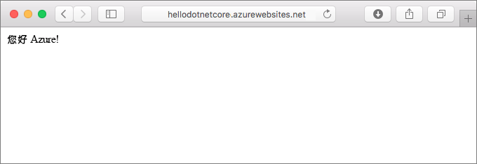
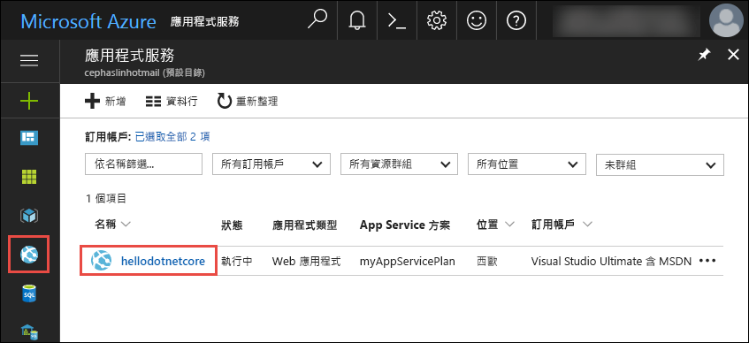
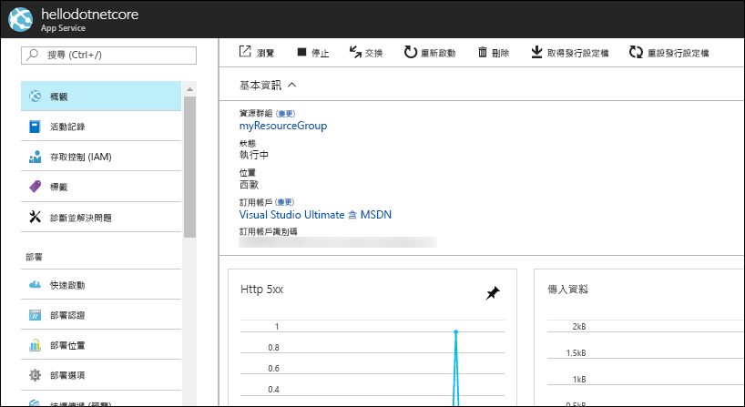

# <a name="create-a-net-core-web-app-in-app-service-on-linux"></a>在 Linux 上的 App Service 中建立.NET Core Web 應用程式

> [!NOTE]
> 本文會將應用程式部署至 Linux 上的 App Service。 若要在 _Windows_ 上部署 App Service，請參閱[在 Azure 中建立 ASP.NET Core Web 應用程式](../app-service-web-get-started-dotnet.md)。
>

[Linux 上的 App Service](app-service-linux-intro.md) 使用 Linux 作業系統提供可高度擴充、自我修復的 Web 主機服務。 本快速入門示範如何在 Linux 上的 App Service上建立 [.NET Core](https://docs.microsoft.com/aspnet/core/) 應用程式。 您可使用 [Azure CLI](https://docs.microsoft.com/cli/azure/get-started-with-azure-cli)建立 Web 應用程式，而且使用 Git 將 .NET Core 程式碼部署至 Web 應用程式。


您可以使用 Mac、Windows 或 Linux 機器，依照本文中的步驟操作。

[!INCLUDE [quickstarts-free-trial-note](../../../includes/quickstarts-free-trial-note.md)]

## <a name="prerequisites"></a>必要條件

若要完成本快速入門：

* <a href="https://git-scm.com/" target="_blank">安裝 Git</a>
* <a href="https://www.microsoft.com/net/core/" target="_blank">安裝 .NET Core</a>

## <a name="create-the-app-locally"></a>在本機建立應用程式

在您電腦上的終端機視窗中，建立名為 `hellodotnetcore` 的目錄，並將目前的目錄變更為該目錄。

```bash
md hellodotnetcore
cd hellodotnetcore
```

建立新的.NET Core Web 應用程式。

```bash
dotnet new web
```

## <a name="run-the-app-locally"></a>在本機執行應用程式

在本機執行應用程式，以便您查看它在部署至 Azure 時的樣貌。 

還原 NuGet 套件，並執行應用程式。

```bash
dotnet run
```

開啟網頁瀏覽器，然後巡覽至位於 `http://localhost:5000` 的應用程式。

您會看到來自範例應用程式的 **Hello World** 訊息顯示在網頁中。


在終端機視窗中，按 **Ctrl+C** 結束 web 伺服器。 初始化 .NET Core 專案的 Git 存放庫。

```bash
git init
git add .
git commit -m "first commit"
```

[!INCLUDE [cloud-shell-try-it.md](../../../includes/cloud-shell-try-it.md)]

[!INCLUDE [Configure deployment user](../../../includes/configure-deployment-user.md)]

[!INCLUDE [Create resource group](../../../includes/app-service-web-create-resource-group-linux.md)]

[!INCLUDE [Create app service plan](../../../includes/app-service-web-create-app-service-plan-linux.md)]

## <a name="create-a-web-app"></a>建立 Web 應用程式

[!INCLUDE [Create web app](../../../includes/app-service-web-create-web-app-dotnetcore-linux-no-h.md)]

瀏覽至您剛建立的 Web 應用程式。 以您的 Web 應用程式名稱取代 _&lt;app name>_。

```bash
http://<app name>.azurewebsites.net
```

新的 Web 應用程式看起來應該像這樣：


[!INCLUDE [Push to Azure](../../../includes/app-service-web-git-push-to-azure.md)] 

```bash
Counting objects: 22, done.
Delta compression using up to 8 threads.
Compressing objects: 100% (18/18), done.
Writing objects: 100% (22/22), 51.21 KiB | 3.94 MiB/s, done.
Total 22 (delta 1), reused 0 (delta 0)
remote: Updating branch 'master'.
remote: Updating submodules.
remote: Preparing deployment for commit id '741f16d1db'.
remote: Generating deployment script.
remote: Project file path: ./hellodotnetcore.csproj
remote: Generated deployment script files
remote: Running deployment command...
remote: Handling ASP.NET Core Web Application deployment.
remote: ...............................................................................................
remote:   Restoring packages for /home/site/repository/hellodotnetcore.csproj...
remote: ....................................
remote:   Installing System.Xml.XPath 4.0.1.
remote:   Installing System.Diagnostics.Tracing 4.1.0.
remote:   Installing System.Threading.Tasks.Extensions 4.0.0.
remote:   Installing System.Reflection.Emit.ILGeneration 4.0.1.
remote:   ...
remote: Finished successfully.
remote: Running post deployment command(s)...
remote: Deployment successful.
To https://cephalin-dotnetcore.scm.azurewebsites.net/cephalin-dotnetcore.git
 * [new branch]      master -> master
```

## <a name="browse-to-the-app"></a>瀏覽至應用程式

使用 web 瀏覽器瀏覽至已部署的應用程式。

```bash
http://<app_name>.azurewebsites.net
```

.NET Core 範例程式碼在具有內建映像的 Web 應用程式中執行。


**恭喜！** 您已將第一個 .NET Core 應用程式部署至 Linux 上的 App Service。

## <a name="update-and-redeploy-the-code"></a>更新和重新部署程式碼

在本機目錄中，開啟 _Startup.cs_ 檔案。 在方法呼叫 `context.Response.WriteAsync` 中對文字進行小幅變更：

```csharp
await context.Response.WriteAsync("Hello Azure!");
```

在 Git 中認可您的變更，然後將程式碼變更推送至 Azure。

```bash
git commit -am "updated output"
git push azure master
```

部署完成後，切換回在「瀏覽至應用程式」步驟中開啟的瀏覽器視窗，然後按 [重新整理]。



## <a name="manage-your-new-azure-web-app"></a>管理新的 Azure Web 應用程式

請移至 <a href="https://portal.azure.com" target="_blank">Azure 入口網站</a>，以管理您所建立的 Web 應用程式。

按一下左側功能表中的 [應用程式服務]，然後按一下 Azure Web 應用程式的名稱。



您會看到 Web 應用程式的 [概觀] 頁面。 您可以在這裡執行基本管理工作，像是瀏覽、停止、啟動、重新啟動及刪除。 



左側功能表提供不同的頁面來設定您的應用程式。 

[!INCLUDE [cli-samples-clean-up](../../../includes/cli-samples-clean-up.md)]

## <a name="next-steps"></a>後續步驟

> [!div class="nextstepaction"]
> [在 Linux 上的 Azure App Service 中建置 .NET Core 和 SQL Database Web 應用程式](tutorial-dotnetcore-sqldb-app.md)
