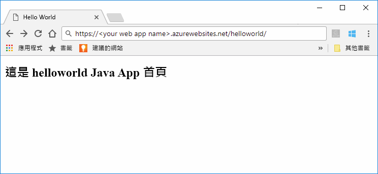

# <a name="quickstart-create-a-java-web-app-in-app-service-on-linux"></a>快速入門：在 Linux 上的 App Service 中建立 Java Web 應用程式

Linux 上的 App Service 目前提供一項預覽功能來支援 Java web 應用程式。 如需預覽版的詳細資訊，請參閱 [Microsoft Azure 預覽版增補使用條款](https://azure.microsoft.com/support/legal/preview-supplemental-terms/)。 

[Linux 上的 App Service](app-service-linux-intro.md) 使用 Linux 作業系統提供可高度擴充、自我修復的 Web 主機服務。 本快速入門說明如何使用 [Azure CLI](https://docs.microsoft.com/cli/azure/get-started-with-azure-cli) 搭配[適用於 Azure Web Apps 的 Maven 外掛程式 (預覽)](https://github.com/Microsoft/azure-maven-plugins/tree/develop/azure-webapp-maven-plugin)，以內建的 Linux 映像部署 Java Web 應用程式。



[使用 Azure Toolkit for IntelliJ 將 Java Web 應用程式部署至雲端的 Linux 容器](https://docs.microsoft.com/java/azure/intellij/azure-toolkit-for-intellij-hello-world-web-app-linux)是將 Java 應用程式部署到自己的容器的替代方法。

[!INCLUDE [quickstarts-free-trial-note](../../../includes/quickstarts-free-trial-note.md)]


## <a name="prerequisites"></a>先決條件

若要完成本快速入門： 

* 本機安裝 [Azure CLI 2.0 或更新版本](https://docs.microsoft.com/cli/azure/install-azure-cli?view=azure-cli-latest)。
* [Apache Maven](http://maven.apache.org/)。


## <a name="create-a-java-app"></a>建立 Java 應用程式

使用 Maven 執行下列命令以建立新的 helloworld Web 應用程式：  

    mvn archetype:generate -DgroupId=example.demo -DartifactId=helloworld -DarchetypeArtifactId=maven-archetype-webapp

切換到新的 helloworld 專案目錄，並使用下列命令建置所有模組：

    mvn verify

此命令會確認並建立所有的模組，包括 helloworld/target 子目錄中的 helloworld.war 檔案。


## <a name="deploying-the-java-app-to-app-service-on-linux"></a>將 Java 應用程式部署至 Linux 上的 App Service

您有多個部署選項可將 Java Web 應用程式部署至 Linux 上的 App Service。 這些選項包含︰

* [透過適用於 Azure Web Apps 的 Maven 外掛程式部署](https://github.com/Microsoft/azure-maven-plugins/tree/develop/azure-webapp-maven-plugin)
* [透過 ZIP 或 WAR 部署](https://docs.microsoft.com/azure/app-service/app-service-deploy-zip)
* [透過 FTP 部署](https://docs.microsoft.com/azure/app-service/app-service-deploy-ftp)

在快速入門中，您將使用適用於 Azure Web Apps 的 Maven 外掛程式。 它的優點在於很容易經由 Maven 使用，並為您建立所需的 Azure 資源 (資源群組、應用程式服務方案及 Web 應用程式)。

### <a name="deploy-with-maven"></a>使用 Maven 進行部署

若要從 Maven 部署，在 pom.xml 檔案的 `<build>` 元素內新增下列外掛程式定義：

```xml
    <plugins>
      <plugin>
        <groupId>com.microsoft.azure</groupId> 
        <artifactId>azure-webapp-maven-plugin</artifactId> 
        <version>1.1.0</version>
        <configuration> 
          <resourceGroup>YOUR_RESOURCE_GROUP</resourceGroup> 
          <appName>YOUR_WEB_APP</appName> 
          <linuxRuntime>tomcat 9.0-jre8</linuxRuntime>
          <deploymentType>ftp</deploymentType> 
          <resources> 
              <resource> 
                  <directory>${project.basedir}/target</directory> 
                  <targetPath>webapps</targetPath> 
                  <includes> 
                      <include>*.war</include> 
                  </includes> 
                  <excludes> 
                      <exclude>*.xml</exclude> 
                  </excludes> 
              </resource> 
          </resources> 
        </configuration>
      </plugin>
    </plugins>
```    

更新外掛程式組態中的下列預留位置：

| Placeholder | 說明 |
| ----------- | ----------- |
| `YOUR_RESOURCE_GROUP` | 要在其中建立 Web 應用程式的新資源群組名稱。 將應用程式的所有資源放在群組中，藉此同時管理。 例如，刪除資源群組會刪除所有與應用程式相關聯的資源。 使用唯一的新資源群組名稱來更新此值，例如 TestResources。 您在下一節中會使用此資源群組名稱來清除所有的 Azure 資源。 |
| `YOUR_WEB_APP` | 應用程式名稱會成為 Web 應用程式在部署至 Azure 時的部分主機名稱 (YOUR_WEB_APP.azurewebsites.net)。 將此值更新為新 Azure Web 應用程式的唯一名稱 (例如 contoso)，它將會主控您的 Java 應用程式。 |

組態的 `linuxRuntime` 元素會控制您的應用程式搭配使用哪個內建 Linux 映像。

執行下列命令並遵循所有指示來向 Azure CLI 驗證：

    az login

使用下列命令將您的 Java 應用程式部署至 Web 應用程式：

    mvn clean package azure-webapp:deploy


完成部署後，在網頁瀏覽器中使用下列 URL，瀏覽至已部署的應用程式。

```bash
http://<app_name>.azurewebsites.net/helloworld
```

Java 程式碼範例正在具有內建映像的 Web 應用程式中執行。


**恭喜！** 您已將第一個 Java 應用程式部署至 Linux 上的 App Service。


[!INCLUDE [cli-samples-clean-up](../../../includes/cli-samples-clean-up.md)]


## <a name="next-steps"></a>後續步驟

本快速入門中，您已使用 Maven 建立 Java Web 應用程式，然後將 Java Web 應用程式部署至 Linux 上的 App Service。 若要深入了解如何使用 Java 搭配 Azure，請遵循下面的連結。

> [!div class="nextstepaction"]
> [適用於 Java 開發人員的 Azure](https://docs.microsoft.com/java/azure/)

