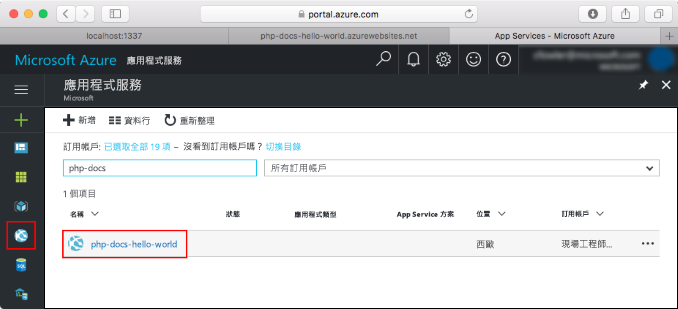

# <a name="deploy-a-python-web-app-in-web-app-for-containers"></a>在 Web App for Containers 中部署 Python Web 應用程式

[Linux 上的 App Service](app-service-linux-intro.md) 使用 Linux 作業系統提供可高度擴充、自我修復的 Web 主機服務。 本快速入門說明如何建立 Web 應用程式，並使用自訂 Docker Hub 映像為其部署簡單的 Flask 應用程式。 [使用 Azure CLI 建立 Web 應用程式](https://docs.microsoft.com/cli/azure/get-started-with-azure-cli)


[!INCLUDE [quickstarts-free-trial-note](../../../includes/quickstarts-free-trial-note.md)]

## <a name="prerequisites"></a>必要條件

若要完成本教學課程：

* <a href="https://git-scm.com/" target="_blank">安裝 Git</a>
* <a href="https://www.docker.com/community-edition" target="_blank">安裝 Docker Community 版本</a>
* <a href="https://hub.docker.com/" target="_blank">註冊 Docker Hub 帳戶</a>

## <a name="download-the-sample"></a>下載範例

在終端機視窗中執行下列命令，將應用程式範例複製到本機電腦，並瀏覽至包含範例程式碼的目錄。

```bash
git clone https://github.com/Azure-Samples/python-docs-hello-world
cd python-docs-hello-world
```

此存放庫在 _/app_ 資料夾中包含簡單的 Flask 應用程式，以及指定三個項目的 _Dockerfile_：

- 使用 [tiangolo/uwsgi-nginx-flask:python3.6-alpine3.7](https://hub.docker.com/r/tiangolo/uwsgi-nginx-flask/) 基底映像。
- 容器應在連接埠 8000 上接聽。
- 將 `/app` 目錄複製到容器的 `/app` 目錄。

組態會遵循[基底映像的指示](https://hub.docker.com/r/tiangolo/uwsgi-nginx-flask/)。

## <a name="run-the-app-locally"></a>在本機執行應用程式

在 Docker 容器中執行應用程式。

```bash
docker build --rm -t flask-quickstart .
docker run --rm -it -p 8000:8000 flask-quickstart
```

開啟網頁瀏覽器，然後巡覽至位於 `http://localhost:8000` 的範例應用程式。

您可以看到來自範例應用程式的 **Hello World** 訊息顯示在網頁中。


在終端機視窗中按 **Ctrl+C**，以停止容器。

## <a name="deploy-image-to-docker-hub"></a>將映像部署至 Docker Hub

登入您的 Docker Hub 帳戶。 依照提示輸入您的 Docker Hub 認證。

```bash
docker login
```

標記您的映像，並將其推送至您 Docker Hub 帳戶新的_公開_存放庫，名為 `flask-quickstart`。 請將 *\<dockerhub_id>* 取代為您的 Docker Hub 識別碼。

```bash
docker tag flask-quickstart <dockerhub_id>/flask-quickstart
docker push <dockerhub_id>/flask-quickstart
```

> [!NOTE]
> 如果找不到指定的存放庫，`docker push` 會建立公用存放庫。 本快速入門採用 Docker Hub 中的公用存放庫。 如果您想要推送至私人存放庫，則必須稍後在 Azure App Service 中設定您的 Docker Hub 認證。 請參閱[建立 Web 應用程式](#create-a-web-app)。

映像推送完成後，您即可在 Azure Web 應用程式中加以使用。

[!INCLUDE [cloud-shell-try-it.md](../../../includes/cloud-shell-try-it.md)]

[!INCLUDE [Create resource group](../../../includes/app-service-web-create-resource-group-linux.md)]

[!INCLUDE [Create app service plan](../../../includes/app-service-web-create-app-service-plan-linux.md)]

## <a name="create-a-web-app"></a>建立 Web 應用程式

使用 [az webapp create](/cli/azure/webapp?view=azure-cli-latest#az-webapp-create) 命令，在 `myAppServicePlan` App Service 方案中建立 [Web 應用程式](../app-service-web-overview.md)。 請將 *\<app name>* 取代為全域唯一的應用程式名稱，並將 *\<dockerhub_id>* 取代為您的 Docker Hub 識別碼。

```azurecli-interactive
az webapp create --resource-group myResourceGroup --plan myAppServicePlan --name <app name> --deployment-container-image-name <dockerhub_id>/flask-quickstart
```

建立 Web 應用程式後，Azure CLI 會顯示類似下列範例的輸出：

```json
{
  "availabilityState": "Normal",
  "clientAffinityEnabled": true,
  "clientCertEnabled": false,
  "cloningInfo": null,
  "containerSize": 0,
  "dailyMemoryTimeQuota": 0,
  "defaultHostName": "<app name>.azurewebsites.net",
  "deploymentLocalGitUrl": "https://<username>@<app name>.scm.azurewebsites.net/<app name>.git",
  "enabled": true,
  < JSON data removed for brevity. >
}
```

如果您先前上傳至私人存放庫，則還必須在 App Service 中設定 Docker Hub 認證。 如需詳細資訊，請參閱[從 Docker Hub 使用私人映像](tutorial-custom-docker-image.md#use-a-private-image-from-docker-hub-optional)。

### <a name="specify-container-port"></a>指定容器連接埠

如 _Dockerfile_ 中所指定，您的容器會在連接埠 8000 上接聽。 若要讓 App Service 將您的要求路由至正確的連接埠，您必須設定 *WEBSITES_PORT* 應用程式設定。

在 Cloud Shell 中，執行 [`az webapp config appsettings set`](/cli/azure/webapp/config/appsettings?view=azure-cli-latest#az-webapp-config-appsettings-set) 命令。


```azurecli-interactive
az webapp config appsettings set --name <app_name> --resource-group myResourceGroup --settings WEBSITES_PORT=8000
```

## <a name="browse-to-the-app"></a>瀏覽至應用程式

```bash
http://<app_name>.azurewebsites.net/
```


> [!NOTE]
> Web 應用程式需要一些時間才能啟動，因為在第一次要求應用程式時必須下載並執行 Docker Hub 映像。 如果您在長時間後先看到錯誤，請重新整理頁面。

**恭喜！** 您已將執行 Python 應用程式的自訂 Docker Hub 映像部署至 Web App for Containers。

## <a name="update-locally-and-redeploy"></a>在本機更新和重新部署

使用本機文字編輯器，在 Python 應用程式中開啟 `app/main.py` 檔案，並且對 `return` 陳述式旁邊的文字進行小幅變更：

```python
return 'Hello, Azure!'
```

重建映像，並再次將其推送至 Docker Hub。

```bash
docker build --rm -t flask-quickstart .
docker tag flask-quickstart <dockerhub_id>/flask-quickstart
docker push <dockerhub_id>/flask-quickstart
```

在 Cloud Shell 中重新啟動應用程式。 重新啟動應用程式可確保會套用所有設定，以及從登錄提取最新容器。

```azurecli-interactive
az webapp restart --resource-group myResourceGroup --name <app_name>
```

請等候約 15 秒，讓 App Service 提取更新的映像。 切換回在**瀏覽至應用程式**步驟中開啟的瀏覽器視窗，然後重新整理頁面。


## <a name="manage-your-azure-web-app"></a>管理您的 Azure Web 應用程式

請移至 [Azure 入口網站](https://portal.azure.com)，以查看您所建立的 Web 應用程式。

按一下左側功能表中的 [應用程式服務]，然後按一下 Azure Web 應用程式的名稱。



根據預設，入口網站會顯示 Web 應用程式的 [概觀] 分頁。 此頁面可讓您檢視應用程式的執行方式。 您也可以在這裡執行基本管理工作，像是瀏覽、停止、啟動、重新啟動及刪除。 分頁左側的索引標籤會顯示您可開啟的各種設定分頁。


[!INCLUDE [Clean-up section](../../../includes/cli-script-clean-up.md)]

## <a name="next-steps"></a>後續步驟

> [!div class="nextstepaction"]
> [Python with PostgreSQL](tutorial-docker-python-postgresql-app.md)

> [!div class="nextstepaction"]
> [使用自訂映像](tutorial-custom-docker-image.md)