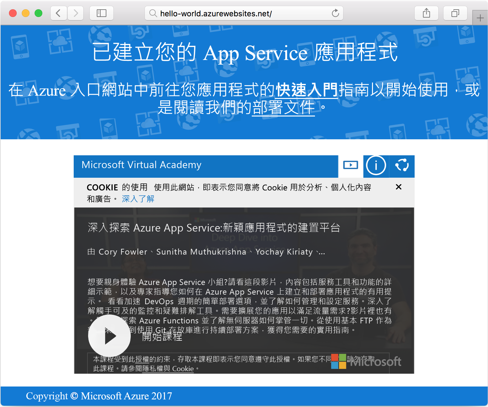

# <a name="create-a-ruby-app-in-app-service-on-linux"></a>在 Linux 上的 App Service 中建立 Ruby 應用程式

[Linux 上的 App Service](app-service-linux-intro.md) 提供可高度擴充、自我修復的 Web 主機服務。 本快速入門示範如何建立基本的 Ruby on Rails 應用程式，然後將它當作 Linux 上的 Web 應用程式部署至 Azure。


## <a name="prerequisites"></a>必要條件

* <a href="https://www.ruby-lang.org/en/documentation/installation/#rubyinstaller" target="_blank">安裝 Ruby 2.4.1 或更高版本</a>
* <a href="https://git-scm.com/" target="_blank">安裝 Git</a>

[!INCLUDE [quickstarts-free-trial-note](../../../includes/quickstarts-free-trial-note.md)]

## <a name="download-the-sample"></a>下載範例

在終端機視窗中執行下列命令，將範例應用程式存放庫複製到本機電腦：

```bash
git clone https://github.com/Azure-Samples/ruby-docs-hello-world
```

## <a name="run-the-application-locally"></a>在本機執行應用程式

執行 Rails 伺服器，讓應用程式得以運作。 變更為 hello-world 目錄，然後 `rails server` 命令會啟動伺服器。

```bash
cd hello-world\bin
rails server
```

使用網頁瀏覽器，瀏覽至 `http://localhost:3000`，在本機測試應用程式。


## <a name="modify-app-to-display-welcome-message"></a>修改應用程式以顯示歡迎使用訊息

修改應用程式，使其顯示歡迎使用訊息。 首先，您必須設定路由，請修改 *~/workspace/ruby-docs-hello-world/config/routes.rb* 檔案，加入名稱為 `hello` 的路由。

  ```ruby
  Rails.application.routes.draw do
      #For details on the DSL available within this file, see http://guides.rubyonrails.org/routing.html
      root 'application#hello'
  end
  ```

變更應用程式的控制站，使其將訊息當作 HTML 傳回至瀏覽器。 

開啟 ~/workspace/hello-world/app/controllers/application_controller.rb 進行編輯。 修改 `ApplicationController` 類型，使其看起來類似下列程式碼範例：

  ```ruby
  class ApplicationController > ActionController :: base
    protect_from_forgery with: :exception
    def hello
      render html: "Hello, world from Azure Web App on Linux!"
    end
  end
  ```

現在已設定好您的應用程式。 使用網頁瀏覽器，瀏覽至 `http://localhost:3000`，確認根登陸頁面。


[!INCLUDE [Try Cloud Shell](../../../includes/cloud-shell-try-it.md)]

[!INCLUDE [Configure deployment user](../../../includes/configure-deployment-user.md)]

## <a name="create-a-ruby-web-app-on-azure"></a>在 Azure 上建立 Ruby Web 應用程式

需要以資源群組納入 Web 應用程式所需的資產。 若要建立資源群組，請使用 [az group create]() 命令。

```azurecli-interactive
az group create --location westeurope --name myResourceGroup
```

使用 [az appservice plan create](https://docs.microsoft.com/cli/azure/appservice/plan#az_appservice_plan_create) 命令，建立 Web 應用程式的應用程式服務方案。

```azurecli-interactive
az appservice plan create --name myAppServicePlan --resource-group myResourceGroup --is-linux
```

接下來，發出 [az webapp create](https://docs.microsoft.com/cli/azure/webapp) 命令以建立使用新建服務方案的 Web 應用程式。 請注意，執行階段設定為 `ruby|2.3`。 別忘了以唯一的應用程式名稱取代 `<app name>`。

```azurecli-interactive
az webapp create --resource-group myResourceGroup --plan myAppServicePlan --name <app name> \
--runtime "ruby|2.3" --deployment-local-git
```

命令的輸出會顯示新建立的 Web 應用程式和部署 URL 的資訊。 看起來應該如下所示： 請複製 URL，以便稍後在本教學課程中使用。

```bash
https://<deployment user name>@<app name>.scm.azurewebsites.net/<app name>.git
```

建立 Web 應用程式後，[概觀] 頁面即可供檢視。 瀏覽到該頁面。 隨即出現下列啟動顯示畫面：




## <a name="deploy-your-application"></a>部署應用程式

執行下列命令，將本機應用程式部署至您的 Azure 網站：

```bash
git remote add azure <Git deployment URL from above>
git add -A
git commit -m "Initial deployment commit"
git push azure master
```

確認遠端部署作業報告成功。 此命令會產生類似下列文字的輸出：

```bash
remote: Using sass-rails 5.0.6
remote: Updating files in vendor/cache
remote: Bundle gems are installed into ./vendor/bundle
remote: Updating files in vendor/cache
remote: ~site/repository
remote: Finished successfully.
remote: Running post deployment command(s)...
remote: Deployment successful.
To https://<your web app name>.scm.azurewebsites.net/<your web app name>.git
  579ccb....2ca5f31  master -> master
myuser@ubuntu1234:~workspace/<app name>$
```

一旦部署完成後，使用 [az webapp restart](https://docs.microsoft.com/cli/azure/webapp#az_webapp_restart) 命令來重新啟動 Web 應用程式，部署才會生效，如下所示：

```azurecli-interactive
az webapp restart --name <app name> --resource-group myResourceGroup
```

瀏覽至您的網站並確認結果。

```bash
http://<app name>.azurewebsites.net
```


> [!NOTE]
> 當應用程式重新啟動時，嘗試瀏覽網站會導致 HTTP 狀態碼 `Error 503 Server unavailable`。 可能需要幾分鐘才能完全重新啟動。
>

[!INCLUDE [Clean-up section](../../../includes/cli-script-clean-up.md)]

## <a name="next-steps"></a>後續步驟

[Linux 上的 Azure App Service 常見問題集](https://docs.microsoft.com/azure/app-service-web/app-service-linux-faq)
