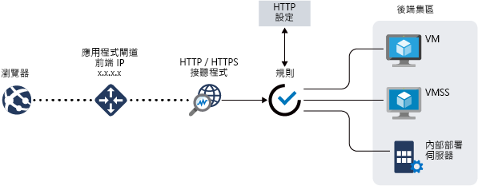
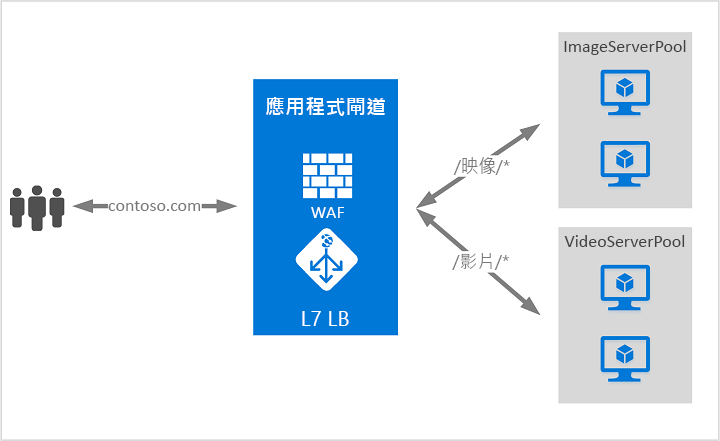

# 什麼是 Azure 應用程式閘道？

Azure 應用程式閘道是網路流量負載平衡器，可讓您管理 Web 應用程式的流量。 傳統負載平衡器會在傳輸層 (OSI 層 4 - TCP 和 UDP) 上運作，並根據來源 IP 位址和連接埠，將流量路由傳送到目的地 IP 位址和連接埠。

但是使用應用程式閘道可讓作業變得更明確。 例如，您可以根據傳入 URL 路由傳送流量。 因此，如果 `/images` 在傳入的 URL 中，您可以將流量路由傳送至一組針對影像設定的特定伺服器 (也稱為集區)。 如果 `/video` 在此 URL 中，該流量就會路由傳送至另一個針對影片最佳化的集區。

這類型的路由也稱為應用程式層 (OSI 層 7) 負載平衡。 Azure 應用程式閘道可以進行 URL 型路由等作業。 

Azure 應用程式閘道包含下列功能︰

## 自動調整公開預覽版

除了本文所述的功能外，應用程式閘道也提供新 SKU [Standard_V2] 的公開預覽版，其中提供自動調整和其他重要效能的增強功能。

- **自動調整** - 自動調整 SKU 下的「應用程式閘道」或 WAF 部署可以根據變動的流量負載模式來相應增加或相應減少。 自動調整規模也可讓您在佈建時，無須選擇部署大小或執行個體計數。 

- **區域備援** - 「應用程式閘道」或 WAF 部署可以跨多個「可用性區域」，讓您無須使用「流量管理員」在每個區域中佈建及運轉個別的「應用程式閘道」執行個體。

- **靜態 VIP** - 應用程式閘道 VIP 現已可獨佔地支援靜態 VIP 類型。 這可確保與應用程式閘道相關的 VIP 即使在重新啟動後也不會變更。

- **更快速的部署和更新時間** (相較於正式運作的 SKU)。 

- **提升 5 倍的 SSL 卸載效能** (相較於正式運作的 SKU)。

如需應用程式閘道公開預覽版功能的詳細資訊，請參閱[自動調整和區域備援應用程式閘道 (公開預覽)](application-gateway-autoscaling-zone-redundant.md)。

## 安全通訊端層 (SSL) 終止

應用程式閘道支援在閘道上終止 SSL，之後流量通常會以未加密狀態流至後端伺服器。 這項功能可讓 Web 伺服器不必再負擔昂貴的加密和解密成本。 不過，有時候無法對伺服器進行未加密的通訊。 可能是因為安全性需求、合規性需求，或應用程式可能只接受安全連線。 對於這些應用程式，應用程式閘道可支援端對端 SSL 加密。

## Azure Kubernetes Service (AKS) 輸入控制器預覽 

應用程式閘道輸入控制器會以 Pod 的形式在 AKS 叢集中運作，並允許應用程式閘道作為 AKS 叢集的輸入。 

如需詳細資訊，請參閱 [Azure 應用程式閘道輸入控制器](https://azure.github.io/application-gateway-kubernetes-ingress/)。

## 清空連線

清空連線可協助您在已規劃的服務更新期間，毫無錯誤地移除後端集區成員。 此設定會透過後端 http 設定啟用，而且可以在規則建立期間套用至後端集區的所有成員。 啟用之後，應用程式閘道可確保所有取消註冊的後端集區執行個體不會再接收任何新要求，但允許在已設定的時間限制內完成現有要求。 這適用於透過 API 呼叫從後端集區中確實移除的後端執行個體，以及根據健康情況探查的判斷，而回報為狀況不良的後端執行個體。

## 自訂錯誤頁面
應用程式閘道可讓您建立自訂的錯誤頁面，而不是顯示預設的錯誤頁面。 您可以使用自訂錯誤頁面來搭配您自己的商標和版面配置。

如需詳細資訊，請參閱[建立應用程式閘道的自訂錯誤頁面](custom-error.md)。

## Web 應用程式防火牆

Web 應用程式防火牆 (WAF) 是一項應用程式閘道功能，可提供 Web 應用程式的集中式保護，免於遭遇常見的攻擊和弱點。 WAF 會根據 [OWASP (Open Web Application Security Project) 核心規則集](https://www.owasp.org/index.php/Category:OWASP_ModSecurity_Core_Rule_Set_Project) 3.0 或 2.2.9 中的規則提供保護。 

Web 應用程式已逐漸成為利用常見已知弱點的惡意攻擊目標。 這些攻擊中最常見的是 SQL 插入式攻擊、跨網站指令碼攻擊等等。 想要防止應用程式的程式碼受到這類攻擊會非常困難，而且可能需要對許多層次的應用程式拓撲執行嚴格的維護、修補和監視工作。 集中式 Web 應用程式防火牆有助於簡化安全性管理作業，且更加確保應用程式管理員能夠對抗威脅或入侵。 相較於保護每個個別的 Web 應用程式，WAF 方案還可透過在中央位置修補已知弱點，更快地因應安全性威脅。 現有的應用程式閘道可以輕易地轉換成已啟用 Web 應用程式防火牆的應用程式閘道。

## URL 型路由

URL 路徑型路由可讓您根據要求的 URL 路徑，將流量路由傳送至後端伺服器集區。 有一個案例是將對於不同內容類型的要求路由傳送至不同的集區。

例如，對 `http://contoso.com/video/*` 的要求會路由傳送至 VideoServerPool，而對 `http://contoso.com/images/*` 的要求則會路由傳送至 ImageServerPool。 如果沒有任何路徑模式相符，則會選取 DefaultServerPool。

## 多網站裝載

多網站裝載可讓您在相同的應用程式閘道執行個體上設定多個網站。 此功能可讓您將最多 100 個網站新增到一個應用程式閘道，為您的部署設定更有效率的拓撲。 每個網站都可以導向到自己的集區。 例如，應用程式閘道可以從兩個伺服器集區 (名為 ContosoServerPool 和 FabrikamServerPool) 為 `contoso.com` 和 `fabrikam.com` 處理流量。

對 `http://contoso.com` 的要求會路由傳送至 ContosoServerPool，而對 `http://fabrikam.com` 的要求則會路由傳送至 FabrikamServerPool。

同樣地，相同父系網域的兩個子網域也可以裝載在相同的應用程式閘道部署上。 使用子網域的範例可能包括單一應用程式閘道部署上裝載的 `http://blog.contoso.com` 和 `http://app.contoso.com`。

## 重新導向

許多 Web 應用程式的常見案例是支援自動 HTTP 至 HTTPS 的重新導向，以確保應用程式與其使用者之間的通訊會透過加密的路徑進行。 

在過去，您會使用一些技巧 (例如建立專屬集區)，其唯一目的是要將其在 HTTP 上接收的要求重新導向至 HTTPS。 應用程式閘道支援在應用程式閘道上重新導向流量的功能。 這可簡化應用程式組態、將資源使用量最佳化，並支援新的重新導向案例，包括全域和路徑式重新導向。 應用程式閘道重新導向支援不只限於 HTTP 至 HTTPS 重新導向。 這是一般重新導向機制，因此您可以從使用規則定義的任何連接埠重新導向，或是重新導向至使用規則定義的任何連接埠。 它也支援重新導向至外部網站。

應用程式閘道重新導向提供下列功能：

- 從閘道上的一個連接埠到另一個連接埠的全域重新導向。 這允許在網站上進行 HTTP 至 HTTPS 重新導向。
- 路徑式重新導向。 這類型的重新導向只允許在特定網站區域上進行 HTTP 至 HTTPS 重新導向，例如以 `/cart/*` 表示的購物車區域。
- 重新導向至外部網站。

## 工作階段親和性

當您想要在同一個後端保留使用者工作階段時，以 Cookie 為基礎的工作階段親和性非常有用。 使用受閘道管理的 Cookie，應用程式閘道即可將來自使用者工作階段的後續流量導向至同一部伺服器進行處理。 當使用者工作階段的工作階段狀態儲存在伺服器本機時，這項功能很重要。

## Websocket 和 HTTP/2 流量

應用程式閘道可對 WebSocket 和 HTTP/2 通訊協定提供原生支援。 使用者無法進行設定來選擇要啟用或停用 WebSocket 支援。 可以使用 Azure PowerShell 來啟用 HTTP/2 支援。

WebSocket 和 HTTP/2 通訊協定都可透過長時間執行的 TCP 連線，讓伺服器與用戶端之間能進行全雙工通訊。 此功能可讓網頁伺服器和用戶端之間進行互動性更高的通訊，此通訊可以是雙向的，而不需要像 HTTP 型實作所要求的進行輪詢。 不同於 HTTP，這些通訊協定的負荷很低，而且可以對多個要求/回應重複使用相同的 TCP 連線，進而提升資源使用效率。 這些通訊協定設計為透過傳統 HTTP 連接埠 80 和 443 進行運作。

## 重新撰寫 HTTP 標頭 (公開預覽)

HTTP 標頭允許用戶端和伺服器透過要求或回應傳遞其他資訊。 重新撰寫這些 HTTP 標頭可幫助您完成數個重要的狀況，例如新增與安全性相關的標頭欄位 (例如 HSTS/ X-XSS-Protection) 或刪除可能會揭露機密資訊 (例如後端伺服器的名稱) 的回應標頭欄位。 

應用程式閘道現在支援重新撰寫內送 HTTP 要求以及外送 HTTP 回應之標頭的能力。 當要求/回應封包在用戶端與後端集區之間移動時，您將能夠新增、移除或更新 HTTP 要求和回應標頭。 您可以重新撰寫這兩個標準 (定義於 [RFC 2616](https://www.ietf.org/rfc/rfc2616.txt) \(英文\) 中) 以及非標準的標頭欄位。  

如需此公開預覽功能的詳細資訊，請參閱[重新撰寫 HTTP 標頭](rewrite-http-headers.md)。

## 後續步驟

視需求和環境而定，您可以使用 Azure 入口網站、Azure PowerShell 或 Azure CLI 來建立測試應用程式閘道：

- [快速入門：使用 Azure 應用程式閘道引導網路流量 - Azure 入口網站](quick-create-portal.md)。
- [快速入門：使用 Azure 應用程式閘道引導網路流量 - Azure PowerShell](quick-create-powershell.md)
- [快速入門：使用 Azure 應用程式閘道引導網路流量 - Azure CLI](quick-create-cli.md)
