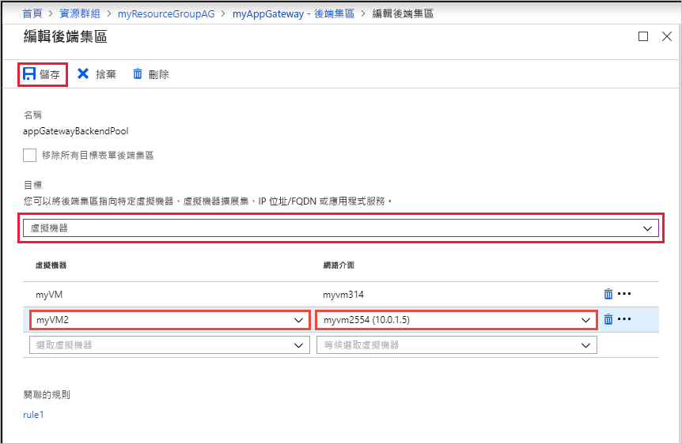

# <a name="quickstart-direct-web-traffic-with-azure-application-gateway---azure-portal"></a>快速入門：使用 Azure 應用程式閘道引導網路流量 - Azure 入口網站

本快速入門會示範如何使用 Azure 入門網站，建立應用程式閘道。  建立應用程式閘道之後，您要加以測試，確定它可正常運作。 您會使用 Azure 應用程式閘道，將接聽程式指派給連接埠、建立規則，以及將資源新增至後端集區，來將應用程式網路流量導向至特定資源。 為了簡單起見，本文使用簡單的設定，包括公用前端 IP、在此應用程式閘道上裝載單一網站的基本接聽程式、用於後端集區的兩部虛擬機器，以及基本的要求路由規則。

如果您沒有 Azure 訂用帳戶，請在開始前建立 [免費帳戶](https://azure.microsoft.com/free/?WT.mc_id=A261C142F) 。


[!INCLUDE [updated-for-az](../../includes/updated-for-az.md)]

## <a name="sign-in-to-azure"></a>登入 Azure

使用您的 Azure 帳戶登入 [Azure 入口網站](https://portal.azure.com) 。

## <a name="create-an-application-gateway"></a>建立應用程式閘道

Azure 需要虛擬網路才能在您所建立的資源之間進行通訊。 您可以建立新的虛擬網路，或使用現有的虛擬網路。 在此範例中，我們會建立新的虛擬網路。 您建立應用程式閘道時，可以同時建立虛擬網路。 在不同的子網路中，建立應用程式閘道執行個體。 在此範例中您會建立兩個子網路：一個用於應用程式閘道，另一個用於後端伺服器。

1. 在 Azure 入口網站的左側功能表上選取 [建立資源]。 [新增] 視窗隨即出現。

2. 在 [精選] 清單中選取 [網路]，然後選取 [應用程式閘道]。

### <a name="basics-page"></a>基本頁面

1. 在 [基本] 頁面上，為下列應用程式閘道設定輸入這些值：

   - **名稱**：輸入 myAppGateway 作為應用程式閘道的名稱。
   - **資源群組**：選取 **myResourceGroupAG** 作為資源群組。 如果資源群組不存在，請選取 [新建] 加以建立。

     

2. 接受其他設定的預設值，然後選取 [確定]。

### <a name="settings-page"></a>設定頁面

1. 在 [設定] 頁面的 [子網路組態] 下方，選取 [選擇虛擬網路]。 <br>

2. 在 [選擇虛擬網路] 頁面上選取 [新建]，然後輸入下列虛擬網路設定的值：

   - **名稱**：輸入 myVNet 作為虛擬網路的名稱。

   - **位址空間**：輸入 10.0.0.0/16 作為虛擬網路位址空間。

   - **子網路名稱**：輸入 myAGSubnet 作為子網路名稱。<br>應用程式閘道子網路只能包含應用程式閘道。 不允許任何其他資源。

   - **子網路位址範圍**︰輸入 10.0.0.0/24 作為子網路位址範圍。

     

3. 選取 [確定] 以返回 [設定] 頁面。

4. 選擇 [前端 IP 設定]。 在 [前端 IP 組態] 下方，確認 [IP 位址類型] 設為 [公用]。 在 [公用 IP 位址] 下方，確認已選取 [新建]。 <br>您可以根據自己的使用案例，設定為公用或私人前端 IP。 在此範例中，我們會選擇公用前端 IP。 

5. 輸入 myAGPublicIPAddress 作為公用 IP 位址名稱。 

6. 接受其他設定的預設值，然後選取 [確定]。<br>為求簡化，我們在本文將選擇預設值，但您可以根據自己的使用案例，設定其他設定的自訂值 

### <a name="summary-page"></a>摘要頁面

檢閱 [摘要] 頁面上的設定，然後選取 [確定] 以建立網路資源、公用 IP 位址和應用程式閘道。 Azure 建立應用程式閘道可能需要幾分鐘的時間。 請等候部署成功完成後，再繼續進行至下一節。

## <a name="add-backend-pool"></a>新增後端集區

後端集區可用來將要求路由至能為要求提供服務的後端伺服器。 後端集區可以包含 NIC、虛擬機器擴展集、公用 IP、內部 IP、完整的網域名稱 (FQDN)，以及如 Azure App Service 的多租用戶後端。 您需要將自己的後端目標新增至後端集區。

在此範例中，我們會將虛擬機器作為目標後端。 我們可以使用現有的虛擬機器，或建立新的虛擬機器。 在此範例中，我們會建立兩個虛擬機器，供 Azure 作為應用程式閘道的後端伺服器。 若要這麼做：

1. 建立新的子網路 (*myBackendSubnet*)，以在其中建立新的 VM。 
2. 建立 2 個新的 VM (*myVM* 與 *myVM2*)，以作為後端伺服器。
3. 在虛擬機器上安裝 IIS，以確認成功建立應用程式閘道。
4. 將後端伺服器新增至後端集區。

### <a name="add-a-subnet"></a>新增子網路

依照下列步驟將子網路新增至您建立的虛擬網路：

1. 在 Azure 入口網站的左側功能表上選取 [所有資源]，並在搜尋方塊中輸入 myVNet，然後從搜尋結果中選取 [myVNet]。

2. 從左側功能表中選取 [子網路]，然後選取 [+ 子網路]。 

   

3. 在 [新增子網路] 頁面中輸入 myBackendSubnet 作為子網路的 [名稱]，然後選取 [確定]。

### <a name="create-a-virtual-machine"></a>建立虛擬機器

1. 在 Azure 入口網站上，選取 [建立資源]。 [新增] 視窗隨即出現。
2. 選取 [計算]，然後選取 [精選] 清單中的 [Windows Server 2016 Datacenter]。 [建立虛擬機器] 頁面隨即出現。<br>應用程式閘道可將流量路由至其後端集區中所用任何類型的虛擬機器。 在此範例中，您會使用 Windows Server 2016 Datacenter。
3. 在 [基本] 索引標籤中，為下列虛擬機器設定輸入這些值：

    - **資源群組**：選取 **myResourceGroupAG** 作為資源群組名稱。
    - **虛擬機器名稱**：輸入 myVM 作為虛擬機器的名稱。
    - **使用者名稱**：輸入 azureuser 作為系統管理員使用者名稱。
    - **密碼**：輸入Azure123456! 作為系統管理員密碼。
4. 接受其他預設值，然後選取 [下一步：**磁碟]**。  
5. 接受 [磁碟] 索引標籤的預設值，然後選取 [下一步：網路功能]。
6. 在 [網路] 索引標籤上，確認已選取 [myVNet] 作為[虛擬網路]，且 [子網路] 設為 [myBackendSubnet]。 接受其他預設值，然後選取 [下一步：**管理]**。<br>「應用程式閘道」可與其虛擬網路外的執行個體進行通訊，但我們需要確保具有 IP 連線能力。 
7. 在 [管理] 索引標籤上，將 [開機診斷] 設為 [關閉]。 接受其他預設值，然後選取 [檢閱 + 建立]。
8. 在 [檢閱 + 建立] 索引標籤上檢閱設定，並更正任何驗證錯誤，然後選取 [建立]。
9. 請等候虛擬機器建立完成，再繼續操作。

### <a name="install-iis-for-testing"></a>安裝 IIS 進行測試

在此範例中，我們在虛擬機器上安裝 IIS，只是為了驗證 Azure 已成功建立應用程式閘道。 

1. 開啟 [Azure PowerShell](https://docs.microsoft.com/azure/cloud-shell/quickstart-powershell)。 若要這樣做，請從 Azure 入口網站的頂端導覽列中選取 [Cloud Shell]，然後從下拉式清單中選取 [PowerShell]。 

    

2. 執行下列命令以在虛擬機器上安裝 IIS： 

    ```azurepowershell-interactive
    Set-AzVMExtension `
      -ResourceGroupName myResourceGroupAG `
      -ExtensionName IIS `
      -VMName myVM `
      -Publisher Microsoft.Compute `
      -ExtensionType CustomScriptExtension `
      -TypeHandlerVersion 1.4 `
      -SettingString '{"commandToExecute":"powershell Add-WindowsFeature Web-Server; powershell Add-Content -Path \"C:\\inetpub\\wwwroot\\Default.htm\" -Value $($env:computername)"}' `
      -Location EastUS
    ```

3. 建立第二個虛擬機器，並使用您先前完成的步驟來安裝 IIS。 請使用 myVM2 作為虛擬機器名稱，並作為 **Set-AzVMExtension** Cmdlet 的 **VMName** 設定。

### <a name="add-backend-servers-to-backend-pool"></a>將後端伺服器新增至後端集區

1. 選取 [所有資源]，然後選取 [myAppGateway]。

2. 從左側功能表中中選取 [後端集區]。 當您建立應用程式閘道時，Azure 已自動建立預設集區 **appGatewayBackendPool**。 

3. 選取 **appGatewayBackendPool**。

4. 在 [目標] 下方，從下拉式清單中選取 [虛擬機器]。

5. 在 [虛擬機器] 和 [網路介面] 下方，從下拉式清單中選取 **myVM** 和 **myVM2** 虛擬機器及其相關聯的網路介面。

    

6. 選取 [ **儲存**]。

## <a name="test-the-application-gateway"></a>測試應用程式閘道

雖然不需要 IIS 即可建立應用程式閘道，但您仍會在本快速入門中加以安裝，以確認 Azure 是否已成功建立應用程式閘道。 使用 IIS 測試應用程式閘道：

1. 在 [概觀] 頁面上尋找應用程式閘道的公用 IP 位址。或者，您可以選取 [所有資源]，並在搜尋方塊中輸入 *myAGPublicIPAddress*，然後在搜尋結果中加以選取。 Azure 會在 [概觀] 頁面上顯示公用 IP 位址。
2. 將公用 IP 位址複製並貼到您瀏覽器的網址列。
3. 檢查回應。 有效的回應會確認應用程式閘道已成功建立，並能與後端順利連線。


## <a name="clean-up-resources"></a>清除資源

當您不再需要先前為應用程式閘道建立的資源時，請移除資源群組。 藉由移除資源群組，您也可以移除應用程式閘道及其所有相關資源。 

若要移除資源群組：
1. 在 Azure 入口網站的左側功能表上，選取 [資源群組]。
2. 在 [資源群組] 頁面上，在清單中搜尋 **myResourceGroupAG** 並加以選取。
3. 在 [資源群組] 頁面上，選取 [刪除資源群組]。
4. 針對 [輸入資源群組名稱] 輸入 myResourceGroupAG，然後選取 [刪除]

## <a name="next-steps"></a>後續步驟

> [!div class="nextstepaction"]
> [使用 Azure CLI 以應用程式閘道管理網路流量](./tutorial-manage-web-traffic-cli.md)
