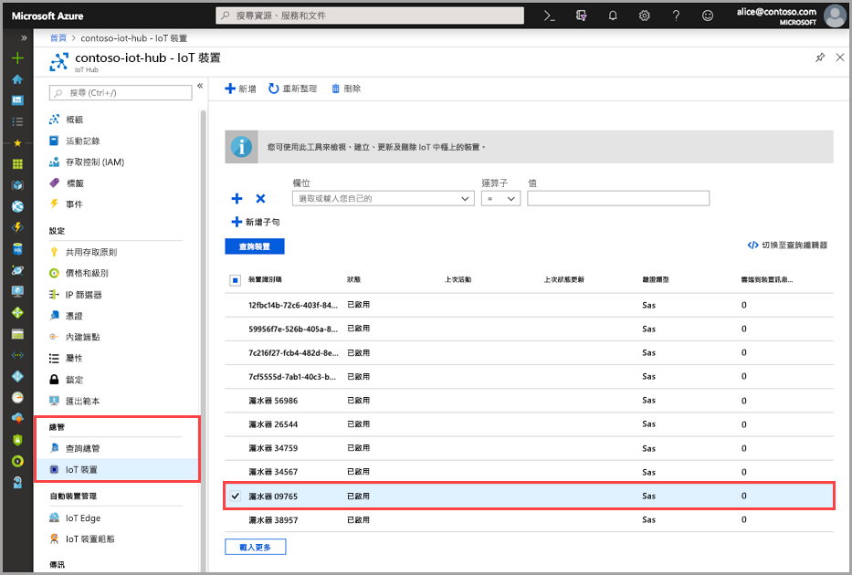
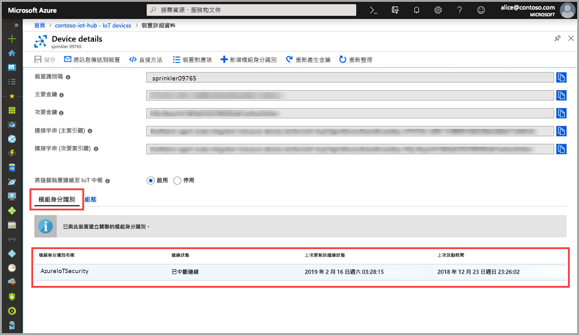

# 快速入門：為 IoT 模組對應項建立適用於 IoT 的 ASC

> [!IMPORTANT]
> 適用於 IoT 的 ASC 目前為公開預覽狀態。 此預覽版本是在沒有服務等級協定的情況下提供，不建議用於生產工作負載。 可能不支援特定功能，或可能已經限制功能。 如需詳細資訊，請參閱 [Microsoft Azure 預覽版增補使用條款](https://azure.microsoft.com/support/legal/preview-supplemental-terms/)。

本快速入門說明如何為新的裝置建立個別的適用於 IoT 的 ASC 模組對應項，或是如何為 IoT 中樞內的所有裝置批次建立模組對應項。  

## 了解適用於 IoT 的 ASC 模組對應項 

對 Azure 內所建置的 IoT 解決方案來說，裝置對應項在裝置管理和程序自動化中同時扮演重要的角色。 

適用於 IoT 的 ASC 可與您現有的 IoT 裝置管理平台完全整合，讓您能夠管理裝置的安全性狀態，以及利用現有的裝置控制功能。 利用 IoT 中樞的對應項機制，即可實現適用於 IoT 的 ASC 整合。  

若要深入了解 Azure IoT 中樞內模組對應項的一般概念，請參閱 [IoT 中樞模組對應項](https://docs.microsoft.com/azure/iot-hub/iot-hub-devguide-module-twins)。 
 
適用於 IoT 的 ASC 會利用模組對應項機制，並為您的每個裝置保留安全性模組對應項。 安全性模組對應項會保存與每個裝置的裝置安全性相關的所有資訊。 
 
若要充分利用適用於 IoT 的 ASC 功能，您必須在服務中為每個裝置建立、設定和使用這些安全性模組對應項。  

## 建立適用於 IoT 的 ASC 模組對應項 

您可以使用預設組態以批次模式建立適用於 IoT 的 ASC 模組對應項，也可以使用特定組態為每個裝置建立適用於 IoT 的 ASC 模組對應項。 若要為新的裝置或沒有模組對應項的裝置批次建立，請使用[模組批次指令碼](https://aka.ms/iot-security-github-create-module)。 

>[!NOTE] 
> 使用批次方法並不會覆寫現有的模組對應項。 使用批次方法「只會」為還沒有模組對應項的裝置建立新的模組對應項。 

若要了解如何修改或變更現有模組對應項的組態，請參閱[修改安全性模組對應項](how-to-modify-security-module-twin.md)。 

若要為裝置建立新的適用於 IoT 的 ASC 模組對應項，請使用下列指示： 

1. 在 IoT 中樞內，找出並選取您想要為其建立安全性模組對應項的裝置。 
1. 在 [Microsoft 身分識別名稱] 欄位中，輸入 **ascforiotsecurity**。
1. 按一下 [檔案] 。 

## 確認模組對應項的建立

若要確認特定裝置是否已有安全性模組對應項：

1. 在 Azure IoT 中樞內，從 [總管] 功能表選取 [IoT 裝置]。    
1. 輸入裝置識別碼，或選取 [查詢裝置欄位] 中的選項，然後按一下 [查詢裝置]。 
    
1. 選取該裝置，或對其按兩下以開啟 [裝置詳細資料] 頁面。 
1. 選取 [模組身分識別] 功能表，然後確認與裝置相關聯的模組身分識別清單中是否存在 **ascforiotsecurity** 模組，且 [連線狀態] 為 [已連線]。 
    

若要深入了解如何自訂適用於 IoT 的 ASC 模組對應項的屬性，請參閱[代理程式設定](concept-agent-configuration.md)。

## 後續步驟

請前往下一篇文章，以了解如何設定自訂警示...

> [!div class="nextstepaction"]
> [設定自訂警示](quickstart-create-custom-alerts.md)
