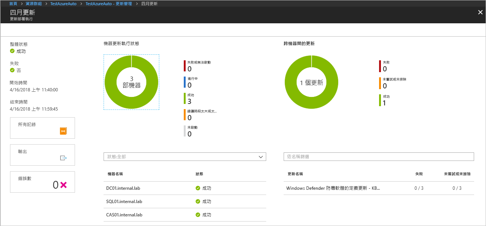

# <a name="manage-windows-updates-with-azure-automation"></a>使用 Azure 自動化來管理 Windows 更新

更新管理可讓您管理虛擬機器的更新和修補程式。
在本教學課程中，您會了解如何快速評估可用更新的狀態、排程何時安裝必要的更新、檢閱部署結果，以及建立警示以確認更新已成功套用。

如需價格資訊，請參閱[更新管理的自動化價格](https://azure.microsoft.com/pricing/details/automation/)

在本教學課程中，您了解如何：

> [!div class="checklist"]
> * 將 VM 上架以進行更新管理
> * 檢視更新評估
> * 設定警示
> * 排定更新部署
> * 檢視部署的結果

## <a name="prerequisites"></a>先決條件

若要完成本教學課程，您需要：

* Azure 訂用帳戶。 如果您還沒有這類帳戶，可以[啟用 VIsual Studio 訂閱者的每月 Azure 點數](https://azure.microsoft.com/pricing/member-offers/msdn-benefits-details/)，或註冊[免費帳戶](https://azure.microsoft.com/free/?WT.mc_id=A261C142F)。
* [自動化帳戶](automation-offering-get-started.md)可保存監看員和動作 Runbook，以及監看員工作。
* 要上架的[虛擬機器](../virtual-machines/windows/quick-create-portal.md)。

## <a name="log-in-to-azure"></a>登入 Azure

在 https://portal.azure.com 上登入 Azure 入口網站。

## <a name="enable-update-management"></a>啟用更新管理

在本教學課程中，您必須先啟用 VM 的更新管理。

1. 在 Azure 入口網站的左側功能表上，選取 [虛擬機器]，然後從清單中選取 VM
2. 在 VM 頁面中，按一下 [作業] 區段下的 [更新管理]。 [啟用更新管理] 頁面隨即開啟。

將會執行驗證來判斷此 VM 是否已啟用更新管理。 此驗證包括檢查 Log Analytics 工作區及連結的自動化帳戶，以及更新管理解決方案是否在工作區中。

[Log Analytics](../log-analytics/log-analytics-overview.md?toc=%2fazure%2fautomation%2ftoc.json) 工作區可用來收集功能和服務 (例如更新管理) 所產生的資料。 工作區提供單一位置來檢閱和分析來自多個來源的資料。

驗證程序也會檢查 VM 是否以 Microsoft Monitoring Agent (MMA) 和自動化混合式 Runbook 背景工作角色佈建。
此代理程式可用來與 Azure 自動化通訊，並取得更新狀態的相關資訊。 此代理程式需要以開啟的連接埠 443 與 Azure 自動化服務通訊，以及下載更新。

如果在上線期間遺漏下列任何必要條件，就會自動新增：

* [Log Analytics](../log-analytics/log-analytics-overview.md?toc=%2fazure%2fautomation%2ftoc.json) 工作區
* [自動化帳戶](./automation-offering-get-started.md)
* VM 上已啟用 [Hybrid Runbook 背景工作角色](./automation-hybrid-runbook-worker.md)

[更新管理] 畫面隨即開啟。 設定位置、Log Analytics 工作區以及要使用的自動化帳戶，然後按一下 [啟用]。 如果欄位呈現灰色，就表示已啟用 VM 的另一個自動化解決方案，且必須使用相同的工作區和自動化帳戶。

![[啟用更新] 管理解決方案視窗](./media/automation-tutorial-update-management/manageupdates-update-enable.png)

啟用解決方案可能需要幾分鐘的時間。 在此期間，請勿關閉瀏覽器視窗。
啟用解決方案之後，有關在 VM 上遺漏更新的相關資訊會流向 Log Analytics。
可能需要 30 分鐘到 6 小時，資料才可供分析。

## <a name="view-update-assessment"></a>檢視更新評量

啟用 [更新管理] 之後，隨即會顯示 [更新管理] 畫面。
如果遺失任何更新，您在 [遺失更新] 索引標籤上就會看到遺失的更新清單。

選取更新上的 [資訊連結]，即可在新視窗開啟更新的支援文章。 您可以在這裡了解關於更新的重要資訊。


按一下更新的任何其他地方，即可開啟所選更新的 [記錄搜尋] 視窗。 記錄搜尋的查詢是針對該特定更新所預先定義的。 您可以修改此查詢或建立您自己的查詢，來檢視部署的更新或您環境中遺失項目的詳細資訊。


## <a name="configure-alerting"></a>設定警示

在此步驟中，您會設定警示，以便得知更新是否成功部署。 您所建立的警示會以 Log Analytics 查詢為基礎。 您可以為其他警示撰寫任何自訂查詢，以涵蓋許多不同的情況。 在 Azure 入口網站中，瀏覽至 [監視器]，然後按一下 [建立警示]。 此選項會開啟 [建立規則] 頁面。

在 [1. 定義警示條件] 下，按一下 [+ 選取目標]。 在 [依資源類型篩選] 下，選取 [Log Analytics]。 選擇您的 Log Analytics 工作區，然後按一下 [完成]。


按一下 [+ 新增準則] 按鈕，以開啟 [設定訊號邏輯] 頁面。 在資料表中選擇 [自訂記錄搜尋]。 在 [搜尋查詢] 文字方塊中，輸入下列查詢。 此查詢會傳回在指定的時間範圍內完成的電腦和更新執行名稱。

```loganalytics
UpdateRunProgress
| where InstallationStatus == 'Succeeded'
| where TimeGenerated > now(-10m)
| summarize by UpdateRunName, Computer
```

輸入 **1** 作為警示邏輯的**閾值**。 完成後，請按一下 [完成]。


在 **2.定義警示詳細資料**下，為警示指定易記名稱和說明。 將 [嚴重性] 設定為 [資訊 (嚴重性 2)]，因為警示是在執行時發出的。


在 [3. 定義動作群組] 下，按一下 [+ 新增動作群組]。 動作群組是一組可讓您跨多個警示使用的動作。 其中可包括 (但不限於) 電子郵件通知、Runbook、Webhook 和等多種項目。 若要深入了解動作群組，請參閱[建立及管理動作群組](../monitoring-and-diagnostics/monitoring-action-groups.md)

在 [動作群組名稱] 方塊中，為它提供易記名稱和簡短名稱。 使用這個群組傳送通知時，會使用簡短名稱來取代完整的動作群組名稱。

在 [動作] 下，為動作提供易記名稱 (例如**電子郵件通知**)，並在 [動作類型] 下選取 [電子郵件/SMS/推播/語音]。 在 [詳細資料] 下，選取 [編輯詳細資料]。

在 [電子郵件/SMS/推播/語音] 頁面上為其命名。 請勾選 [電子郵件] 核取方塊，並輸入要使用的有效電子郵件地址。


在 [電子郵件/SMS/推播/語音] 頁面上按一下 [確定] 加以關閉，然後按一下 [確定] 以關閉 [新增動作群組] 頁面。

您可以在 [建立規則] 頁面的 [自訂動作] 下按一下 [電子郵件主旨]，以自訂所傳送的電子郵件主旨。 完成後，請按一下 [建立警示規則]。 這會建立規則，以在更新部署成功時對您發出警示，並告知有哪些機器包含在該更新部署執行中。

## <a name="schedule-an-update-deployment"></a>排定更新部署

警示現已完成設定，接著請將部署排定在發行排程和服務時段之後，以安裝更新。
您可以選擇要在部署中包含的更新類型。
例如，您可以包含重大更新或安全性更新，並排除更新彙總套件。

> [!WARNING]
> 當更新需要重新開機時，VM 就會自動重新啟動。

排程 VM 的新更新部署，方法是瀏覽回到 [更新管理]，並選取畫面頂端的 [排程更新部署]。

在 [新增更新部署] 畫面上，指定下列資訊：

* **名稱**提供更新部署的唯一名稱。

* **作業系統** - 選擇要進行更新部署的目標 OS。

* **更新分類** - 選取更新部署在部署中包含的軟體類型。 此教學課程中，將所有類型保留選取。

  分類類型包括：

   |作業系統  |類型  |
   |---------|---------|
   |Windows     | 重大更新</br>安全性更新</br>更新彙總套件</br>Feature Pack</br>Service Pack</br>定義更新</br>工具</br>更新        |
   |Linux     | 重大和安全性更新</br>其他更新       |

   如需分類類型的說明，請參閱[更新分類](automation-update-management.md#update-classifications)。

* **排程設定** - 這會開啟 [排程設定] 頁面。 預設開始時間為目前時間之後的 30 分鐘。 您可以將其設為 10 分鐘以後的任何時間。

   您也可以指定部署是否為發生一次，或設定週期性排程。
   在 [週期性] 下選取 [一次]。 將預設值保留為 1 天，然後按一下 [確定]。 這樣會設定週期性的排程。

* **維護期間 (分鐘)** - 將這個值保留為預設值。 您可以指定需要執行更新部署的時段。 此設定有助於確保在您定義的服務時段內執行變更。


完成設定排程之後，請按一下 [建立] 按鈕。 您會回到狀態儀表板。 選取 [排程更新部署] 可顯示您所建立的部署排程。

## <a name="view-results-of-an-update-deployment"></a>檢視更新部署的結果

已排程的部署開始之後，您就可以在 [更新管理] 畫面的 [更新部署] 索引標籤上看到該部署的狀態。
當該部署目前正在執行時，狀態就會顯示為 [進行中]。
當它完成時，如果成功，狀態就會變更為 [成功]。
當部署中發生一或多個更新失敗時，狀態就會是 [部分失敗]。
按一下已完成的更新部署，即可查看該更新部署的儀表板。



在 [更新結果] 磚中，會有摘要提供 VM 上的更新總數和部署結果。
右邊的表格會顯示每個更新的詳細明細及安裝結果。
下列清單會顯示可用的值：

* **未嘗試** - 未安裝更新，因為在已定義的維護時段內，沒有足夠的時間可用。
* **成功** - 更新已順利完成
* **失敗** - 更新失敗

按一下 [所有記錄] 以查看部署已建立的所有記錄項目。

按一下 [輸出] 磚，以查看負責在目標 VM 上管理更新部署之 Runbook 的作業串流。

按一下 [錯誤]，即可查看部署所傳回之任何錯誤的詳細資訊。

在更新部署成功後，系統會傳送類似於下圖的電子郵件，以指出部署成功。


## <a name="next-steps"></a>後續步驟

在本教學課程中，您已了解如何：

> [!div class="checklist"]
> * 將 VM 上架以進行更新管理
> * 檢視更新評估
> * 設定警示
> * 排定更新部署
> * 檢視部署的結果

繼續閱讀更新管理解決方案的概觀。

> [!div class="nextstepaction"]
> [更新管理解決方案](../operations-management-suite/oms-solution-update-management.md?toc=%2fazure%2fautomation%2ftoc.json)
