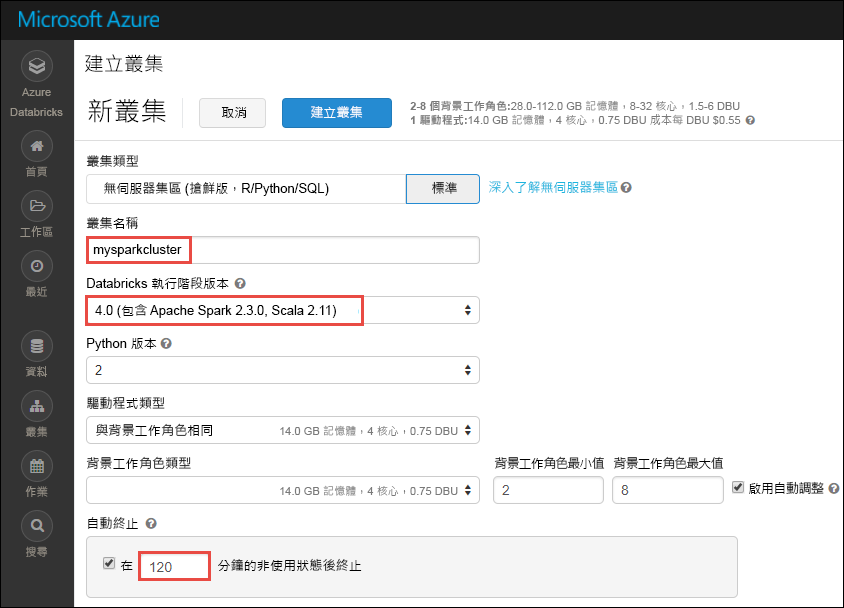

# <a name="quickstart-get-started-with-azure-databricks-using-the-azure-portal"></a>快速入門：使用 Azure 入口網站來開始使用 Azure Databricks

此快速入門會說明如何建立 Azure Databricks 工作區，以及該工作區內的 Apache Spark 叢集。 最後，您會了解如何在 Databricks 叢集上執行 Spark 作業。 如需 Azure Databricks 的詳細資訊，請參閱[何謂 Azure Databricks？](what-is-azure-databricks.md)

## <a name="log-in-to-the-azure-portal"></a>登入 Azure 入口網站

登入 [Azure 入口網站](https://portal.azure.com)。

## <a name="create-a-databricks-workspace"></a>建立 Databricks 工作區

在本節中，您會使用 Azure 入口網站建立 Azure Databricks 工作區。 

1. 在 Azure 入口網站中，依序按一下 **+**、[資料 + 分析] 和 [Azure Databricks (預覽)]。 在 [Azure Databricks] 底下，按一下 [建立]。

    > [!NOTE]
    > Azure Databricks 目前以有限預覽形式提供。 如果您想讓您的 Azure 訂用帳戶加入到預覽版的允許清單考慮對象，您必須填寫[報名表單](https://databricks.azurewebsites.net/)。

2. 在 [Azure Databricks 服務] 底下，提供下列值：

    

    * 針對 [工作區名稱]，請提供您 Databricks 工作區的名稱。
    * 針對 [訂用帳戶]，請從下拉式清單中選取您的 Azure 訂用帳戶。
    * 針對 [資源群組]，指定您是否要建立新的資源群組，或使用現有的資源群組。 資源群組是存放 Azure 方案相關資源的容器。 如需詳細資訊，請參閱 [Azure 資源群組概觀](../azure-resource-manager/resource-group-overview.md)。
    * 針對 [位置]，請選取 [美國東部 2]。 如需其他可用的區域，請參閱[依區域提供的 Azure 服務](https://azure.microsoft.com/regions/services/)。

3. 按一下 [建立] 。

## <a name="create-a-spark-cluster-in-databricks"></a>在 Databricks 中建立 Spark 叢集

1. 在 Azure 入口網站中，移至您所建立的 Databricks 工作區，然後按一下 [初始化工作區]。

2. 系統會將您重新導向至 Azure Databricks 入口網站。 在入口網站中按一下 [叢集]。

    

3. 在 [新增叢集] 頁面上，提供值以建立叢集。

    

    * 輸入叢集的名稱。
    * 請確定您有選取 [在活動 ___ 分鐘後終止] 核取方塊。 請提供用來終止叢集的叢集未使用持續時間 (以分鐘為單位)。
    * 接受所有其他預設值。 
    * 按一下 [建立叢集]。 叢集在執行後，您就可以將 Notebook 連結至叢集，並執行 Spark 作業。

如需如何建立叢集的詳細資訊，請參閱[在 Azure Databricks 建立 Spark 叢集](https://docs.azuredatabricks.net/user-guide/clusters/create.html)。

## <a name="run-a-spark-sql-job"></a>執行 Spark SQL 作業

開始本節之前，您必須先完成下列各項作業：

* [建立 Azure 儲存體帳戶](../storage/common/storage-create-storage-account.md#create-a-storage-account)。 
* [從 GitHub](https://github.com/Azure/usql/blob/master/Examples/Samples/Data/json/radiowebsite/small_radio_json.json) 下載 JSON 檔案範例。 
* 將 JSON 檔案範例上傳至您建立的 Azure 儲存體帳戶。 您可以使用 [Microsoft Azure 儲存體總管](../vs-azure-tools-storage-manage-with-storage-explorer.md)來上傳檔案。

請執行下列步驟，在 Databricks 中建立 Notebook，將 Notebook 設定為從 Azure Blob 儲存體帳戶讀取資料，然後對資料執行 Spark SQL 作業。

1. 在左窗格中，按一下 [工作區]。 從 [工作區] 下拉式清單按一下 [建立]，然後按一下 [Notebook]。

    

2. 在 [建立 Notebook] 對話方塊中輸入名稱，選取 [Scala] 做為語言，然後選取您先前建立的 Spark 叢集。

    

    按一下 [建立] 。

3. 在下列程式碼片段中，將 `{YOUR STORAGE ACCOUNT NAME}` 取代為您建立的 Azure 儲存體帳戶名稱，並將 `{YOUR STORAGE ACCOUNT ACCESS KEY}` 取代為儲存體帳戶存取金鑰。 在 Notebook 的空白資料格中貼上程式碼片段，然後按下 SHIFT + ENTER 鍵以執行此程式碼資料格。 這個程式碼片段會將 Notebook 設定為從 Azure Blob 儲存體讀取資料。

       spark.conf.set("fs.azure.account.key.{YOUR STORAGE ACCOUNT NAME}.blob.core.windows.net", "{YOUR STORAGE ACCOUNT ACCESS KEY}")
    
    如需如何擷取儲存體帳戶金鑰的指示，請參閱[管理儲存體存取金鑰](../storage/common/storage-create-storage-account.md#manage-your-storage-account)

    > [!NOTE]
    > 您也可以在 Azure Databricks 上搭配使用 Azure Data Lake Store 與 Spark 叢集。 如需指示，請參閱[搭配使用 Data Lake Store 與 Azure Databricks](https://docs.azuredatabricks.net/spark/latest/data-sources/azure/azure-storage.html#azure-data-lake-store)。

4. 執行 SQL 陳述式，以使用 JSON 資料檔案範例 **small_radio_json.json** 中的資料建立暫存資料表。 在下列程式碼片段中，將預留位置值取代為您的容器名稱和儲存體帳戶名稱。 在 Notebook 的程式碼資料格中貼上程式碼片段，然後按下 SHIFT + ENTER 鍵。 在此程式碼片段中，`path` 代表您上傳至 Azure 儲存體帳戶之 JSON 檔案範例的位置。

    ```sql
    %sql 
    CREATE TEMPORARY TABLE radio_sample_data
    USING json
    OPTIONS (
     path "wasbs://{YOUR CONTAINER NAME}@{YOUR STORAGE ACCOUNT NAME}.blob.core.windows.net/small_radio_json.json"
    )
    ```

    在命令順利完成後，您就會將 JSON 檔案中的所有資料變成 Databricks 叢集中的資料表。

    `%sql` 語言的 magic 命令可讓您從 Notebook 執行 SQL 程式碼，即使該 Notebook 屬於其他類型也是如此。 如需詳細資訊，請參閱[在 Notebook 中混合使用語言](https://docs.azuredatabricks.net/user-guide/notebooks/index.html#mixing-languages-in-a-notebook)。

5. 讓我們看看 JSON 資料範例的快照集，以便進一步了解我們所執行的查詢。 將下列程式碼片段貼到程式碼資料格中，然後按下 **SHIFT + ENTER**。

    ```sql
    %sql 
    SELECT * from radio_sample_data
    ```

6. 您會看到如下列螢幕擷取畫面所示的表格式輸出 (僅顯示某些資料行)：

    

    至於其他細節，資料範例會擷取電台頻道的聽眾性別 (資料行名稱為**性別**)，以及其擁有的是免費或付費訂閱 (資料行名稱為**層級**)。

7. 您現在可以建立這項資料的視覺呈現，以顯示每種性別、多少使用者擁有免費帳戶，以及多少使用者是付費訂閱者。 從表格式輸出底部，按一下 [長條圖] 圖示，然後再按一下 [繪圖選項]。

    

8. 在 [自訂繪圖] 中，如螢幕擷取畫面所示的方式拖放值。

    

    * 將 [索引鍵] 設定為 [性別]。
    * 將 [數列群組] 設定為 [層級]。
    * 將 [值] 設定為 [層級]。
    * 將 [彙總] 設定為 [計數]。

    按一下 [Apply (套用)] 。

9. 輸出會顯示這些值的視覺呈現，如下列螢幕擷取畫面所示：

     

## <a name="clean-up-resources"></a>清除資源

在建立 Spark 叢集時，如果您已選取 [在活動 ___ 分鐘後終止] 核取方塊，則當叢集已有一段指定的時間未活動時，該叢集就會自動終止。

如果您未選取該核取方塊，則必須手動終止叢集。 若要這樣做，請從 Azure Databricks 工作區的左窗格中，按一下 [叢集]。 對於您想要終止的叢集，將游標移到 [動作] 資料行底下的省略符號上，然後按一下 [終止] 圖示。


## <a name="next-steps"></a>後續步驟

在本文中，您已在 Azure Databricks 建立 Spark 叢集，並於 Azure 儲存體中使用資料執行 Spark 作業。 您也可以查看 [Spark 資料來源](https://docs.azuredatabricks.net/spark/latest/data-sources/index.html)，以了解如何從其他資料來源將資料匯入到 Azure Databricks。 請前往下一篇文章，以了解如何搭配使用 Azure Data Lake Store 與 Azure Databricks。

> [!div class="nextstepaction"]
>[搭配使用 Data Lake Store 與 Azure Databricks](https://docs.azuredatabricks.net/spark/latest/data-sources/azure/azure-storage.html#azure-data-lake-store)