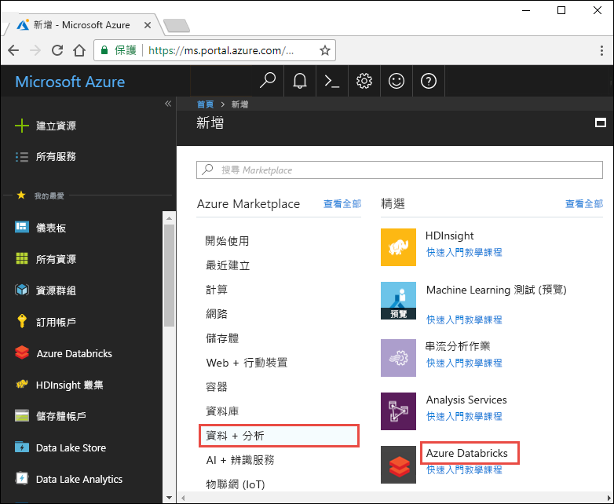
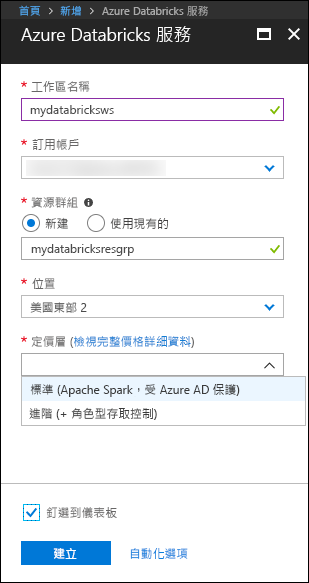
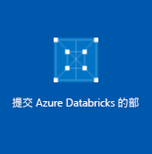

# <a name="quickstart-run-a-spark-job-on-azure-databricks-using-the-azure-portal"></a>快速入門：使用 Azure 入口網站在 Azure Databricks 上執行 Spark 作業

此快速入門會說明如何建立 Azure Databricks 工作區，以及該工作區內的 Apache Spark 叢集。 最後，您會了解如何在 Databricks 叢集上執行 Spark 作業。 如需 Azure Databricks 的詳細資訊，請參閱[何謂 Azure Databricks？](what-is-azure-databricks.md)

在本快速入門中，您會透過 Spark 作業分析電台頻道訂閱資料，以根據人口統計資料深入了解免費/付費的使用方式。

如果您沒有 Azure 訂用帳戶，請在開始之前先[建立免費帳戶](https://azure.microsoft.com/free/)。

## <a name="log-in-to-the-azure-portal"></a>登入 Azure 入口網站

登入 [Azure 入口網站](https://portal.azure.com)。

## <a name="create-an-azure-databricks-workspace"></a>建立 Azure Databricks 工作區

在本節中，您會使用 Azure 入口網站建立 Azure Databricks 工作區。

1. 在 Azure 入口網站中，選取 [建立資源] > [資料 + 分析] > [Azure Databricks]。

    

2. 在 [Azure Databricks 服務] 底下，提供值以建立 Databricks 工作區。

    

    提供下列值：
    
    |屬性  |說明  |
    |---------|---------|
    |**工作區名稱**     | 提供您 Databricks 工作區的名稱        |
    |**訂用帳戶**     | 從下拉式清單中選取您的 Azure 訂用帳戶。        |
    |**資源群組**     | 指定您是要建立新的資源群組，還是使用現有資源群組。 資源群組是存放 Azure 方案相關資源的容器。 如需詳細資訊，請參閱 [Azure 資源群組概觀](../azure-resource-manager/resource-group-overview.md)。 |
    |**位置**     | 選取 [美國東部 2]。 如需其他可用的區域，請參閱[依區域提供的 Azure 服務](https://azure.microsoft.com/regions/services/)。        |
    |定價層     |  選擇 [標準] 或 [進階]。 如需這些定價層的詳細資訊，請參閱 [Databricks 定價頁面](https://azure.microsoft.com/pricing/details/databricks/)。       |

    選取 [釘選到儀表板]，然後按一下 [建立]。

4. 工作區建立需要幾分鐘的時間。 建立工作區期間，入口網站右側會顯示 [提交 Azure Databricks 部署] 圖格。 您可能需要在儀表板上向右捲動以查看此圖格。 另外在畫面頂端附近還會顯示一個進度列。 您可以查看任何進度區域。

    

## <a name="create-a-spark-cluster-in-databricks"></a>在 Databricks 中建立 Spark 叢集

> [!NOTE]
> 若要使用免費帳戶建立 Azure Databricks 叢集，在建立叢集之前，請先移至您的設定檔，並將訂用帳戶變更為**隨用隨付**。 如需詳細資訊，請參閱 [Azure 免費帳戶](https://azure.microsoft.com/free/)。

1. 在 Azure 入口網站中，移至您所建立的 Databricks 工作區，然後按一下 [啟動工作區]。

2. 系統會將您重新導向至 Azure Databricks 入口網站。 在入口網站中按一下 [叢集]。

    

3. 在 [新增叢集] 頁面上，提供值以建立叢集。

    

    接受下列值以外的所有其他預設值：

    * 輸入叢集的名稱。
    * 針對本文，使用 **4.0** 執行階段建立叢集。
    * 請確定您已選取 [在活動\_\_分鐘後終止] 核取方塊。 請提供用來終止叢集的叢集未使用持續時間 (以分鐘為單位)。
    
    選取 [建立叢集]。 叢集在執行後，您就可以將 Notebook 連結至叢集，並執行 Spark 作業。

如需如何建立叢集的詳細資訊，請參閱[在 Azure Databricks 建立 Spark 叢集](https://docs.azuredatabricks.net/user-guide/clusters/create.html)。


## <a name="download-a-sample-data-file"></a>下載範例資料檔案
下載範例 JSON 資料檔案，並將其儲存到 Azure Blob 儲存體中。

1. 將此範例 JSON 資料檔案[從 Github](https://raw.githubusercontent.com/Azure/usql/master/Examples/Samples/Data/json/radiowebsite/small_radio_json.json) 下載到本機電腦上。 按一下滑鼠右鍵，再按一下 [另存新檔]，將原始檔案儲存在本機上。

2. 如果您還沒有儲存體帳戶，請建立一個。
    - 在 Azure 入口網站中，選取 [建立資源]。 選取 [儲存體] 類別，然後選取 [儲存體帳戶]
    - 提供儲存體帳戶的唯一名稱。
    - 選取 [帳戶類型]：[Blob 儲存體]
    - 選取 [資源群組] 名稱。 請使用您在 Databricks 工作區中建立的相同資源群組。
    
    如需詳細資訊，請參閱[建立 Azure Blob 儲存體帳戶](../storage/common/storage-quickstart-create-account.md)。

3. 在 Blob 儲存體帳戶中建立儲存體容器，並將範例 JSON 檔案上傳至容器中。 您可以使用 Azure 入口網站或 [Microsoft Azure 儲存體總管](../vs-azure-tools-storage-manage-with-storage-explorer.md)來上傳檔案。

    - 在 Azure 入口網站中開啟儲存體帳戶。
    - 選取 [Blob] 。
    - 選取 [+ 容器] 以建立新的空容器。
    - 提供容器的 [名稱]，例如 `databricks`。
    - 選取 [私人 (非匿名存取)\] 存取層級。
    - 在容器建立後，選取容器名稱。
    - 選取 [上傳] 按鈕。
    - 在 [檔案] 頁面上，選取 [資料夾] 圖示以進行瀏覽，並選取範例檔案 `small_radio_json.json` 加以上傳。
    - 選取 [上傳] 以上傳檔案。

## <a name="run-a-spark-sql-job"></a>執行 Spark SQL 作業
請執行下列工作，在 Databricks 中建立 Notebook，將 Notebook 設定為從 Azure Blob 儲存體帳戶讀取資料，然後對資料執行 Spark SQL 作業。

1. 在左窗格中，按一下 [工作區]。 從 [工作區] 下拉式清單按一下 [建立]，然後按一下 [Notebook]。

    

2. 在 [建立 Notebook] 對話方塊中輸入名稱，選取 [Scala] 做為語言，然後選取您先前建立的 Spark 叢集。

    

    按一下頁面底部的 [新增] 。

3. 在此步驟中，讓 Azure 儲存體帳戶與 Databricks Spark 叢集產生關聯。 有兩種方式可完成此關聯。 您可以將 Azure 儲存體帳戶掛接至 Databricks Filesystem (DBFS)，或直接從您建立的應用程式存取 Azure 儲存體帳戶。

    > [!IMPORTANT]
    >本文使用**掛接儲存體與 DBFS 的方法**。 這個方法可確保已掛接的儲存體與叢集檔案系統本身相關聯。 因此，任何存取叢集的應用程式也能使用相關聯的儲存體。 直接存取方法受限於您用來設定存取權的應用程式。
    >
    > 若要使用掛接方法，您必須使用 Databricks 執行階段版本 **4.0** (也就是您在本文中所選的版本) 建立 Spark 叢集。

    在下列程式碼片段中，將 `{YOUR CONTAINER NAME}`、`{YOUR STORAGE ACCOUNT NAME}` 和 `{YOUR STORAGE ACCOUNT ACCESS KEY}` 取代為您的 Azure 儲存體帳戶適用的值。 在 Notebook 的空白資料格中貼上程式碼片段，然後按下 SHIFT + ENTER 鍵以執行此程式碼資料格。

    * **掛接儲存體帳戶與 DBFS (建議)**。 在此程式碼片段中，Azure 儲存體帳戶路徑會掛接至 `/mnt/mypath`。 因此，在您用來存取 Azure 儲存體帳戶的所有未來，您不需要授與的完整路徑。 您正好可以使用 `/mnt/mypath`。

          dbutils.fs.mount(
            source = "wasbs://{YOUR CONTAINER NAME}@{YOUR STORAGE ACCOUNT NAME}.blob.core.windows.net/",
            mountPoint = "/mnt/mypath",
            extraConfigs = Map("fs.azure.account.key.{YOUR STORAGE ACCOUNT NAME}.blob.core.windows.net" -> "{YOUR STORAGE ACCOUNT ACCESS KEY}"))

    * **直接存取儲存體帳戶**

          spark.conf.set("fs.azure.account.key.{YOUR STORAGE ACCOUNT NAME}.blob.core.windows.net", "{YOUR STORAGE ACCOUNT ACCESS KEY}")

    如需如何擷取儲存體帳戶金鑰的指示，請參閱[管理儲存體存取金鑰](../storage/common/storage-account-manage.md#access-keys)。

    > [!NOTE]
    > 您也可以在 Azure Databricks 上搭配使用 Azure Data Lake Store 與 Spark 叢集。 如需指示，請參閱[搭配使用 Data Lake Store 與 Azure Databricks](https://go.microsoft.com/fwlink/?linkid=864084)。

4. 執行 SQL 陳述式，以使用 JSON 資料檔案範例 **small_radio_json.json** 中的資料建立暫存資料表。 在下列程式碼片段中，將預留位置值取代為您的容器名稱和儲存體帳戶名稱。 在 Notebook 的程式碼資料格中貼上程式碼片段，然後按下 SHIFT + ENTER 鍵。 在此程式碼片段中，`path` 代表您上傳至 Azure 儲存體帳戶之 JSON 檔案範例的位置。

    ```sql
    %sql
    DROP TABLE IF EXISTS radio_sample_data;
    CREATE TABLE radio_sample_data
    USING json
    OPTIONS (
     path "/mnt/mypath/small_radio_json.json"
    )
    ```

    在命令順利完成後，您就會將 JSON 檔案中的所有資料變成 Databricks 叢集中的資料表。

    `%sql` 語言的 magic 命令可讓您從 Notebook 執行 SQL 程式碼，即使該 Notebook 屬於其他類型也是如此。 如需詳細資訊，請參閱[在 Notebook 中混合使用語言](https://docs.azuredatabricks.net/user-guide/notebooks/index.html#mixing-languages-in-a-notebook)。

5. 讓我們看看 JSON 資料範例的快照集，以便進一步了解您所執行的查詢。 將下列程式碼片段貼到程式碼資料格中，然後按下 **SHIFT + ENTER**。

    ```sql
    %sql
    SELECT * from radio_sample_data
    ```

6. 您會看到如下列螢幕擷取畫面所示的表格式輸出 (僅顯示某些資料行)：

    

    至於其他細節，資料範例會擷取電台頻道的聽眾性別 (資料行名稱為**性別**)，以及其擁有的是免費或付費訂閱 (資料行名稱為**層級**)。

7. 您現在可以建立這項資料的視覺呈現，以顯示每種性別、多少使用者擁有免費帳戶，以及多少使用者是付費訂閱者。 從表格式輸出底部，按一下 [長條圖] 圖示，然後再按一下 [繪圖選項]。

    

8. 在 [自訂繪圖] 中，如螢幕擷取畫面所示的方式拖放值。

    

    * 將 [索引鍵] 設定為 [性別]。
    * 將 [數列群組] 設定為 [層級]。
    * 將 [值] 設定為 [層級]。
    * 將 [彙總] 設定為 [計數]。

    按一下 [套用]。

9. 輸出會顯示這些值的視覺呈現，如下列螢幕擷取畫面所示：

    

## <a name="clean-up-resources"></a>清除資源

在完成本文後，您可以終止叢集。 若要這樣做，請從 Azure Databricks 工作區的左窗格中選取 [叢集]。 對於您想要終止的叢集，將游標移到 [動作] 資料行底下的省略符號上，然後選取 [終止] 圖示。


如果您不手動終止叢集，叢集將會自動停止，但前提是您已在建立叢集時選取 [在停止活動\_\_分鐘後終止] 核取方塊。 在這種情況下，叢集將會在停止運作達指定時間後自動停止。

## <a name="next-steps"></a>後續步驟

在本文中，您已在 Azure Databricks 建立 Spark 叢集，並於 Azure 儲存體中使用資料執行 Spark 作業。 您也可以查看 [Spark 資料來源](https://docs.azuredatabricks.net/spark/latest/data-sources/index.html)，以了解如何從其他資料來源將資料匯入到 Azure Databricks。 前往下一篇文章，以了解如何使用 Azure Databricks 執行 ETL 作業 (擷取、轉換及載入資料)。

> [!div class="nextstepaction"]
>[使用 Azure Databrick 擷取、轉換和載入資料](databricks-extract-load-sql-data-warehouse.md)
