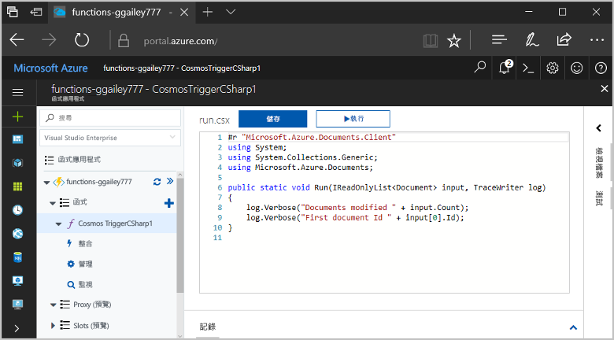
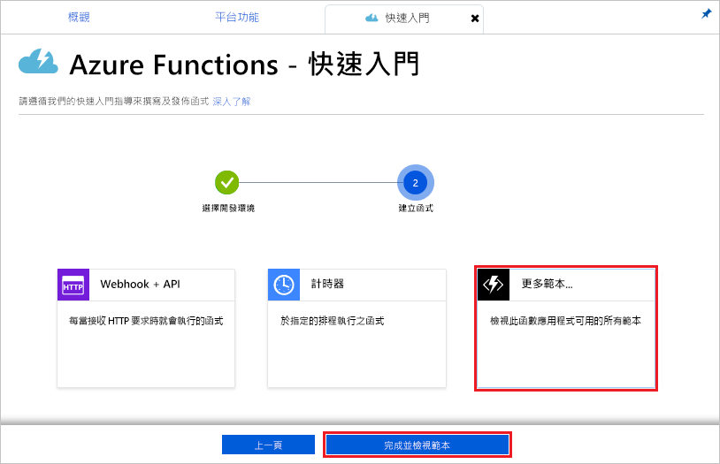
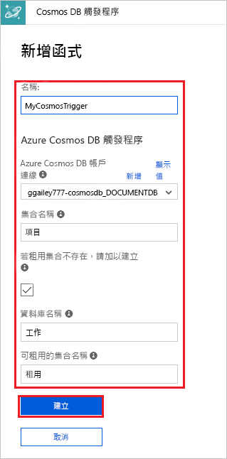
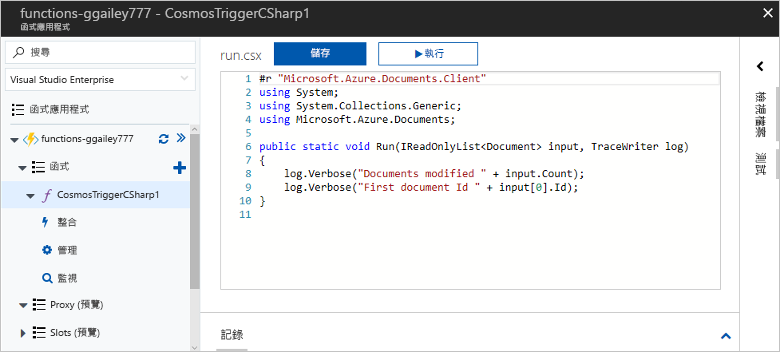
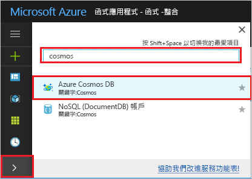
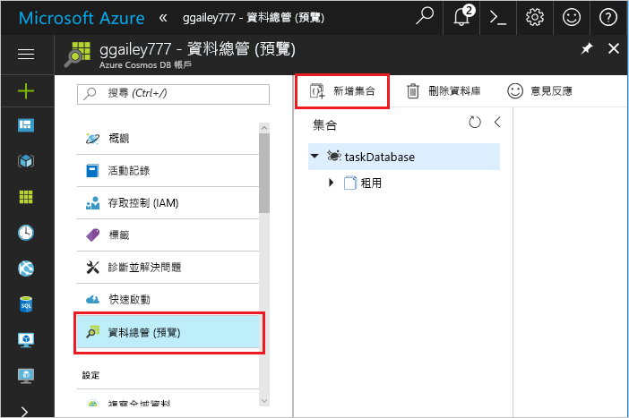
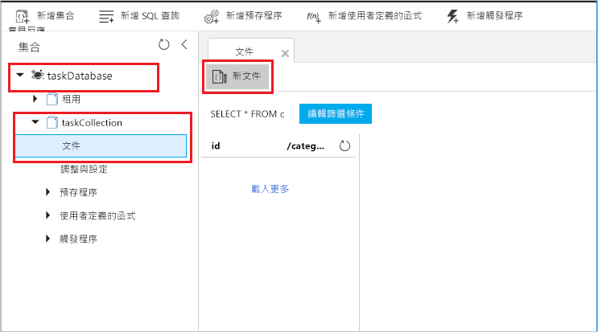

# 建立 Azure Cosmos DB 所觸發的函式

了解如何建立在 Azure Cosmos DB 中新增或變更資料時觸發的函式。 如需 Azure Cosmos DB 的詳細資訊，請參閱 [Azure Cosmos DB：使用 Azure Functions 的無伺服器資料庫計算](..\cosmos-db\serverless-computing-database.md)。

## 先決條件

若要完成本教學課程：

+ 如果您沒有 Azure 訂用帳戶，請在開始前建立 [免費帳戶](https://azure.microsoft.com/free/?WT.mc_id=A261C142F) 。

[!INCLUDE [functions-portal-favorite-function-apps](../../includes/functions-portal-favorite-function-apps.md)]

## 建立 Azure 函數應用程式

[!INCLUDE [Create function app Azure portal](../../includes/functions-create-function-app-portal.md)]

接下來，您要在新的函式應用程式中建立函式。

## 建立 Azure Cosmos DB 觸發程序

1. 展開函式應用程式，然後按一下 [Functions] 旁的 [+] 按鈕。 如果這是您函式應用程式中的第一個函式，請選取 [自訂函式]。 這會顯示一組完整的函式範本。

    

2. 在 [搜尋] 欄位中，輸入 `cosmos`，然後選擇您需要的 Azure Cosmos DB 觸發程序範本語言。

    

3. 使用下圖下方之表格內指定的設定來設定新的觸發程序。

    
    
    | 設定      | 建議的值  | 說明                                |
    | ------------ | ---------------- | ------------------------------------------ |
    | **名稱** | 預設值 | 使用範本所建議的預設函式名稱。 |
    | **集合名稱** | 項目 | 要監視的集合名稱。 |
    | **建立租用集合 (如果不存在)** | 已檢查 | 集合尚未存在，因此加以建立。 |
    | **資料庫名稱** | 工作 | 含有要監視之集合的資料庫名稱。 |

4. 選取 [Azure Cosmos DB 帳戶連線] 標籤旁的 [新增]，然後選擇現有 Cosmos DB 帳戶或 [+ 建立新的]。 
 
    

6. 建立新的 Cosmos DB 帳戶時，使用表格中所指定的 [新增帳戶] 設定。

    | 設定      | 建議的值  | 說明                                |
    | ------------ | ---------------- | ------------------------------------------ |
    | **識別碼** | 資料庫名稱 | Azure Cosmos DB 資料庫的唯一識別碼  |
    | **API** | SQL | 本主題會使用 SQL API。  |
    | **訂用帳戶** | Azure 訂閱 | 位於新建立的 Cosmos DB 帳戶下的訂用帳戶。  |
    | **資源群組** | myResourceGroup |  使用含有您的函式應用程式的現有資源群組。 |
    | **位置**  | WestEurope | 選取您的函式應用程式或其他使用已儲存文件的應用程式附近的位置。  |

6. 按一下 [確定]  以建立資料庫。 建立資料庫可能需要幾分鐘的時間。 建立資料庫之後，資料庫連接字串會儲存為函式應用程式設定。 此應用程式設定的名稱會插入在 **Azure Cosmos DB 帳戶連線**中。 

7. 按一下 [建立]，以建立 Azure Cosmos DB 觸發的函式。 建立函式之後，會顯示以範本為基礎的函式程式碼。  

    

    此函式範本會將文件數和第一個文件識別碼寫入記錄。 

接下來，連接到您的 Azure Cosmos DB 帳戶，並在資料庫中建立 [工作] 集合。 

## 建立項目集合

1. 在瀏覽器的新索引標籤中，開啟 [Azure 入口網站](https://portal.azure.com)的第二個執行個體。 

2. 在入口網站的左側，展開圖示列，在搜尋欄位中輸入 `cosmos`，然後選取 [Azure Cosmos DB]。

    

2. 選擇您的 Azure Cosmos DB 帳戶，然後選取 [資料總管]。 
 
3. 在 [集合] 中，選擇 [taskDatabase]，然後選取 [新增集合]。

    

4. 在 [新增集合] 中，使用下圖下方之表格中所示的設定。 
 
    
 
    | 設定|建議的值|說明 |
    | ---|---|--- |
    | **資料庫識別碼** | 工作 |新資料庫的名稱。 這必須符合您函式繫結中定義的名稱。 |
    | **集合識別碼** | 項目 | 新集合的名稱。 這必須符合您函式繫結中定義的名稱。  |
    | **儲存體容量** | 固定 (10 GB)|使用預設值。 此值是資料庫的儲存體容量。 |
    | **輸送量** |400 RU| 使用預設值。 如果您想要降低延遲，稍後可以相應增加輸送量。 |
    | **[分割區索引鍵](../cosmos-db/partition-data.md#design-for-partitioning)** | /類別|可將資料平均分散到每個資料分割的資料分割索引鍵。 選取正確的資料分割索引鍵對於建立高效能集合來說很重要。 | 

1. 按一下 [確定] 以建立 [工作] 集合。 集合可能會在很短的時間內建立。

當函式繫結中指定的集合存在之後，您就能將文件新增至這個新集合，藉以測試函式。

## 測試函式

1. 在 [資料總管] 中展開新的 [taskCollection] 集合、選擇 [文件]，然後選取 [新增文件]。

    

2. 使用以下內容來取代新文件的內容，然後選擇 [儲存]。

        {
            "id": "task1",
            "category": "general",
            "description": "some task"
        }

1. 切換至第一個瀏覽器索引標籤，其中包含您在入口網站中的函式。 展開函式記錄，並確認新文件已經觸發函式。 查看已將 `task1` 文件識別碼值寫入記錄。 

    

4. (選擇性) 返回您的文件、進行變更，然後按一下 [更新]。 接著，返回函式記錄，並確認更新也已觸發函式。

## 清除資源

[!INCLUDE [Next steps note](../../includes/functions-quickstart-cleanup.md)]

## 後續步驟

您已建立要在 Azure Cosmos DB 中新增或修改文件時執行的函式。

[!INCLUDE [Next steps note](../../includes/functions-quickstart-next-steps.md)]

如需 Azure Cosmos DB 觸發程序的詳細資訊，請參閱[適用於 Azure Functions 的 Azure Cosmos DB 繫結](functions-bindings-cosmosdb.md)。
