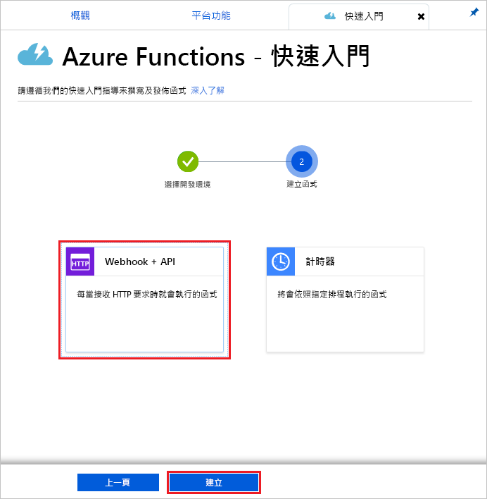

# 建立您的第一個 Azure 函式
## Overview
Azure Functions 是事件取向的隨選計算體驗並擴充了現有的 Azure 應用程式平台，使其可實作其他 Azure 服務、SaaS 產品和內部部署系統內事件所觸發的程式碼。 透過 Azure Functions，您的應用程式會根據需求調整，而您只需要支付所用資源的費用。 Azure Functions 可您建立以各種程式設計語言實作的已排程或觸發的程式碼單位。 若要深入了解 Azure Functions，請參閱 [Azure Functions 概觀](functions-overview.md)。

本主題說明如何在入口網站中使用 Azure Functions 快速入門，建立由 HTTP 觸發程序叫用的簡單 "hello world" Node.js 函式。 您也可以觀賞短片，了解如何在入口網站中執行這些步驟。

## 觀賞影片
下列影片顯示如何在本教學課程中執行基本步驟： 

> [!VIDEO https://channel9.msdn.com/Series/Windows-Azure-Web-Sites-Tutorials/Create-your-first-Azure-Function-simple/player]
> 
> 

## 從快速入門建立函式
函式應用程式可在 Azure 中主控函式的執行。 請遵循下列步驟來建立新的函式應用程式以及新的函式。 新的函式應用程式以會預設組態建立。 如需如何明確建立函式應用程式的範例，請參閱 [其他 Azure Functions 快速入門教學課程](functions-create-first-azure-function-azure-portal.md)。

您必須先具備有效的 Azure 帳戶，才可以建立第一個函式。 如果您還沒有 Azure 帳戶， [可以使用免費帳戶](https://azure.microsoft.com/free/)。

1. 移至 [Azure Functions 入口網站](https://functions.azure.com/signin) ，然後以您的 Azure 帳戶登入。
2. 輸入新函式應用程式的唯一 [名稱] 或接受所產生的名稱，選取您偏好的 [區域]，然後按一下 [建立 + 開始]。 
3. 在 [快速入門] 索引標籤中，按一下 [WebHook + API] 及 [JavaScript]，然後按一下 [建立函式]。 隨即建立新的預先定義的 Node.js 函式。 
   
    
4. (選擇性) 此時，您可以在快速入門中，選擇在入口網站中進行 Azure Functions 功能的快速導覽。    一旦完成或跳過本教學課程，您可以使用 HTTP 觸發程序來測試新函式。

## 測試函式
由於 Azure Functions 快速入門包含功能程式碼，您可以立即測試您的新函式。

1. 在 [開發] 索引標籤中，檢閱 [程式碼] 視窗，並請注意此 Node.js 程式碼預期 HTTP 要求有在訊息內文中或在查詢字串中傳遞的 name 值。 此函式執行時，回應訊息中會傳回這個值。
   
    
2. 向下捲動至 [要求本文] 文字方塊，將 name 屬性的值變更為您的名稱，然後按一下 [執行]。 您會看到執行是由測試 HTTP 要求所觸發，資訊會寫入至串流記錄檔，而 "hello" 回應會顯示在 [輸出] 中。 
3. 若要從另一個瀏覽器視窗或索引標籤觸發相同函式的執行，請從 [開發] 索引標籤複製 [函式 URL] 值並貼到瀏覽器網址列中，然後附加查詢字串值 `&name=yourname` 並按 Enter 鍵。 相同的資訊會寫入至記錄檔，而瀏覽器會像之前一樣顯示 "hello" 回應。

## 後續步驟
本快速入門示範非常簡單的基本 HTTP 觸發函式執行。 如需有關在您的應用程式中運用 Azure Functions 功能的詳細資訊，請參閱下列主題。

* [Azure Functions 開發人員參考](functions-reference.md)  
   可供程式設計人員撰寫函數程式碼及定義觸發程序和繫結時參考。
* [測試 Azure Functions](functions-test-a-function.md)  
   說明可用於測試函式的各種工具和技巧。
* [如何調整 Azure 函式](functions-scale.md)  
   討論 Azure Functions 可用的服務方案，包括動態服務方案，以及如何選擇正確的方案。 
* [什麼是 Azure 應用程式服務？](../app-service/app-service-value-prop-what-is.md)  
   Azure Functions 會利用 Azure App Service 平台執行核心功能，例如部署、環境變數和診斷。 

[!INCLUDE [Getting Started Note](../../includes/functions-get-help.md)]

<!--HONumber=Nov16_HO2-->

