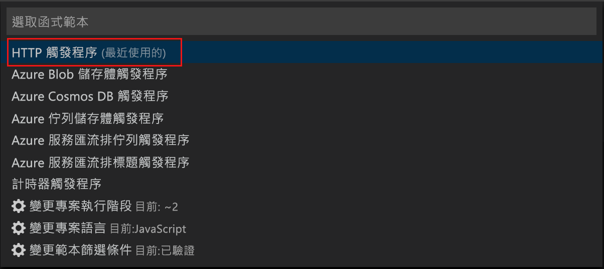

# 使用 Visual Studio Code 建立第一個函式

Azure Functions 可讓您在[無伺服器](https://azure.microsoft.com/solutions/serverless/)環境中執行程式碼，而不需要先建立 VM 或發佈 Web 應用程式。

在本文中，您將了解如何使用[適用於 Visual Studio Code 的 Azure Functions 擴充功能]，在使用 Microsoft Visual Studio Code 的本機電腦上建立和測試 "hello world" 函式。 然後將函式程式碼從 Visual Studio Code 發佈至 Azure。

擴充功能目前支援 C#、JavaScript 和 Java 函式。 本文中的步驟可能會因為您為 Azure Functions 專案選擇的語言不同而有所差異。 此擴充功能目前為預覽狀態。 若要進一步了解，請參閱[適用於 Visual Studio Code 的 Azure Functions 擴充功能]的擴充功能頁面。

## 必要條件

若要完成本快速入門：

* 在其中一個[支援的平台](https://code.visualstudio.com/docs/supporting/requirements#_platforms)上安裝 [Visual Studio Code](https://code.visualstudio.com/)。 本文已在執行 macOS (High Sierra) 的裝置上進行開發與測試。

* 安裝 2.x 版的 [Azure Functions Core Tools](functions-run-local.md#v2) (仍是預覽版)。

* 安裝所選語言的特定需求：

    | 語言 | 分機 |
    | -------- | --------- |
    | **C#** | [C# for Visual Studio Code](https://marketplace.visualstudio.com/items?itemName=ms-vscode.csharp) [.NET Core CLI 工具](https://docs.microsoft.com/dotnet/core/tools/?tabs=netcore2x)*   |
    | **Java** | [適用於 Java 的偵錯工具](https://marketplace.visualstudio.com/items?itemName=vscjava.vscode-java-debug) [Java 8](https://aka.ms/azure-jdks) [Maven 3+](https://maven.apache.org/) |
    | **JavaScript** | [Node 8.0+](https://nodejs.org/)  |

    \* 也是 Core Tools 的必要條件。

[!INCLUDE [quickstarts-free-trial-note](../../includes/quickstarts-free-trial-note.md)]

[!INCLUDE [functions-install-vs-code-extension](../../includes/functions-install-vs-code-extension.md)]

[!INCLUDE [functions-create-function-app-vs-code](../../includes/functions-create-function-app-vs-code.md)]

## 建立由 HTTP 觸發的函式

1. 從 [Azure：函式] 中，選擇 [建立函式] 圖示。

    

1. 選取具有函式應用程式專案的資料夾，然後選取 [HTTP 觸發程序] 函式範本。

    

1. 輸入 `HTTPTrigger` 作為函式名稱，並按下 Enter，然後選取 [匿名] 驗證。

    

    系統隨即會使用由 HTTP 觸發的函式範本，以您所選的語言來建立函式。

    

您可以藉由修改 function.json 檔案，將輸入和輸出繫結新增至您的函式。 如需詳細資訊，請參閱 [Azure Functions 觸發程序和繫結概念](functions-triggers-bindings.md)。

您現在已建立函式專案和 HTTP 觸發的函式，可以在本機電腦上進行測試。

## 在本機測試函式

Azure Functions Core Tools 可讓您在本機開發電腦上執行 Azure Functions 專案。 第一次從 Visual Studio Code 啟動函式時，系統會提示您安裝這些工具。  

1. 若要測試您的函式，可在函式程式碼中設定中斷點，並按 F5 以啟動函式應用程式專案。 Core Tools 的輸出會顯示在**終端機**面板中。

1. 在**終端機**面板中，複製 HTTP 觸發函式的 URL 端點。

    

1. 將 HTTP 要求的 URL 貼到瀏覽器的網址列。 將查詢字串 `?name=<yourname>` 附加至此 URL 並執行要求。 觸及中斷點時，執行就會暫停。

    

1. 當您繼續此執行時，下圖顯示瀏覽器中對 GET 要求所做出的回應︰

    

1. 若要停止偵錯，請按 Shift + F1。

確認函式在本機電腦上正確執行之後，就可以將專案發佈到 Azure。

[!INCLUDE [functions-sign-in-vs-code](../../includes/functions-sign-in-vs-code.md)]

[!INCLUDE [functions-publish-project-vscode](../../includes/functions-publish-project-vscode.md)]

## 在 Azure 中測試您的函式

1. 從 [輸出] 面板中複製 HTTP 觸發程序的 URL。 如同以往，務必將查詢字串 `?name=<yourname>` 新增至此 URL 的結尾並執行要求。

    呼叫 HTTP URL 觸發函式的 URL 應採用下列格式：

        http://<functionappname>.azurewebsites.net/api/<functionname>?name=<yourname> 

1. 將 HTTP 要求的新 URL 貼到瀏覽器的網址列。 下圖顯示瀏覽器中對於函式傳回之遠端 GET 要求所做出的回應︰ 

    

## 後續步驟

您已透過 Visual Studio Code，使用簡單的 HTTP 觸發函式建立函式應用程式。 若要深入了解如何以特定語言開發函式，請參閱 [JavaScript](functions-reference-node.md)、[.NET](functions-dotnet-class-library.md) 或 [Java](functions-reference-java.md) 的語言參考指南。

接下來您可以深入了解如何從終端機或命令提示字元中使用 Azure Functions Core Tools 來進行本機測試和偵錯。

> [!div class="nextstepaction"]
> [程式碼和本機測試](functions-run-local.md)

[Azure Functions Core Tools]: functions-run-local.md
[適用於 Visual Studio Code 的 Azure Functions 擴充功能]: https://marketplace.visualstudio.com/items?itemName=ms-azuretools.vscode-azurefunctions
