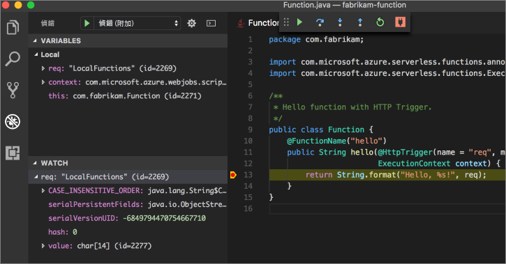

# <a name="create-your-first-function-with-java-and-maven-preview"></a>使用 Java 和 Maven 建立您的第一個函式 (預覽)

> [!NOTE] 
> 適用於 Azure Functions 的 Java 目前為預覽版。

本快速入門引導您使用 Maven 建立[無伺服器](https://azure.microsoft.com/overview/serverless-computing/)函式專案、在本機進行測試，並將它部署到 Azure Functions。 當您完成時，就會有 HTTP 觸發的函式應用程式在 Azure 中執行。


[!INCLUDE [quickstarts-free-trial-note](../../includes/quickstarts-free-trial-note.md)]

## <a name="prerequisites"></a>先決條件
若要使用 Java 開發函式應用程式，您必須安裝下列項目：

-  [Java Developer Kit](https://www.azul.com/downloads/zulu/)第 8 版。
-  [Apache Maven](https://maven.apache.org) 3.0 版或更高版本。
-  [Azure CLI](https://docs.microsoft.com/cli/azure)

> [!IMPORTANT] 
> JAVA_HOME 環境變數必須設定為 JDK 的安裝位置，才能完成本快速入門。

## <a name="install-the-azure-functions-core-tools"></a>安裝 Azure Functions Core Tools

[Azure Functions Core Tools 2.0](https://www.npmjs.com/package/azure-functions-core-tools) 提供撰寫、執行和偵錯 Azure Functions 的本機開發環境。 

若要安裝，請瀏覽[安裝](https://github.com/azure/azure-functions-core-tools#installing)區段，並尋找您所選作業系統 (Windows、Linux、Mac) 的特定指示。

您也可以在安裝下列需求後，使用 [npm](https://www.npmjs.com/) (隨附於 [Node.js](https://nodejs.org/)) 來手動安裝：

-  [.NET Core](https://www.microsoft.com/net/core) 最新版本。
-  [Node.js](https://nodejs.org/download/) 8.6 版或更高版本。

若要繼續以 npm 為基礎的安裝，請執行：

```
npm install -g azure-functions-core-tools@core
```

> [!NOTE]
> 如果您無法安裝 Azure Functions Core Tools 2.0 版，請參閱[版本 2.x 執行階段](/azure/azure-functions/functions-run-local#version-2x-runtime)。

## <a name="generate-a-new-functions-project"></a>產生新的 Functions 專案

在空的資料夾中，執行下列命令以從 [Maven 原型](https://maven.apache.org/guides/introduction/introduction-to-archetypes.html) \(英文\) 產生 Functions 專案。

### <a name="linuxmacos"></a>Linux/MacOS

```bash
mvn archetype:generate \
    -DarchetypeGroupId=com.microsoft.azure \
    -DarchetypeArtifactId=azure-functions-archetype 
```

### <a name="windows-cmd"></a>Windows (CMD)
```cmd
mvn archetype:generate ^
    -DarchetypeGroupId=com.microsoft.azure ^
    -DarchetypeArtifactId=azure-functions-archetype
```

Maven 會提示您提供完成產生專案所需的值。 如需 _groupId_、_artifactId_ 和 _version_ 值，請參閱 [Maven 命名慣例](https://maven.apache.org/guides/mini/guide-naming-conventions.html) \(英文\) 參考。 _appName_ 值必須在整個 Azure 中是唯一的，Maven 才能根據先前輸入的 _artifactId_ 作為預設值產生應用程式名稱。 _packageName_ 值決定產生的函式程式碼的 Java 封裝。

```Output
Define value for property 'groupId': com.fabrikam.functions
Define value for property 'artifactId' : fabrikam-functions
Define value for property 'version' 1.0-SNAPSHOT : 
Define value for property 'package': com.fabrikam.functions
Define value for property 'appName' fabrikam-functions-20170927220323382:
Confirm properties configuration: Y
```

Maven 會以 _artifactId_ 名稱在新的資料夾中建立專案檔。 在專案中產生的程式碼是回應要求本文的簡單 [HTTP 觸發](/azure/azure-functions/functions-bindings-http-webhook)函式：

```java
public class Function {
    /**
     * This function listens at endpoint "/api/hello". Two ways to invoke it using "curl" command in bash:
     * 1. curl -d "HTTP Body" {your host}/api/hello
     * 2. curl {your host}/api/hello?name=HTTP%20Query
     */
    @FunctionName("hello")
    public HttpResponseMessage<String> hello(
            @HttpTrigger(name = "req", methods = {"get", "post"}, authLevel = AuthorizationLevel.ANONYMOUS) HttpRequestMessage<Optional<String>> request,
            final ExecutionContext context) {
        context.getLogger().info("Java HTTP trigger processed a request.");

        // Parse query parameter
        String query = request.getQueryParameters().get("name");
        String name = request.getBody().orElse(query);

        if (name == null) {
            return request.createResponse(400, "Please pass a name on the query string or in the request body");
        } else {
            return request.createResponse(200, "Hello, " + name);
        }
    }
}

```

## <a name="run-the-function-locally"></a>在本機執行函式

將目錄變更為新建立的專案資料夾，並且使用 Maven 建置和執行函式：

```
cd fabrikam-function
mvn clean package 
mvn azure-functions:run
```

> [!NOTE]
> 如果您遇到下列例外狀況：使用 Java 9 時的 `javax.xml.bind.JAXBException`，請參閱 [GitHub](https://github.com/jOOQ/jOOQ/issues/6477) 上的因應措施。

函式執行時，您會看到以下輸出：

```Output
Listening on http://localhost:7071
Hit CTRL-C to exit...

Http Functions:

   hello: http://localhost:7071/api/hello
```

在新的終端機中使用 curl 從命令列觸發函式：

```
curl -w '\n' -d LocalFunction http://localhost:7071/api/hello
```

```Output
Hello LocalFunction!
```

在終端機中使用 `Ctrl-C` 可停止函式程式碼。

## <a name="deploy-the-function-to-azure"></a>將函式部署到 Azure

部署到 Azure Functions 的程序從 Azure CLI 使用帳戶認證。 [使用 Azure CLI 登入](/cli/azure/authenticate-azure-cli?view=azure-cli-latest)，然後使用 `azure-functions:deploy` Maven 目標將您的程式碼部署到新的函式應用程式。

```
az login
mvn azure-functions:deploy
```

部署完成時，您會看到可用來存取 Azure 函式應用程式的 URL：

```output
[INFO] Successfully deployed Function App with package.
[INFO] Deleting deployment package from Azure Storage...
[INFO] Successfully deleted deployment package fabrikam-function-20170920120101928.20170920143621915.zip
[INFO] Successfully deployed Function App at https://fabrikam-function-20170920120101928.azurewebsites.net
[INFO] ------------------------------------------------------------------------
```

使用 curl 測試在 Azure 上執行的函式應用程式：

```
curl -w '\n' https://fabrikam-function-20170920120101928.azurewebsites.net/api/hello -d AzureFunctions
```

```Output
Hello AzureFunctions!
```

## <a name="next-steps"></a>後續步驟

您已經建立一個包含簡單 HTTP 觸發程序的 Java 函式應用程式，並部署到 Azure Functions。

- 檢閱 [Java 函式開發人員指南](functions-reference-java.md)以了解開發 Java 函式的詳細資訊。
- 使用 `azure-functions:add`Maven 目標，將具有不同觸發程序的其他函式新增至您的專案。
- 使用 Visual Studio Code 在本機對函式進行偵錯。 安裝 [Java 延伸套件](https://marketplace.visualstudio.com/items?itemName=vscjava.vscode-java-pack) \(英文\) 並在 Visual Studio Code 中開啟 Functions 專案，[連接偵錯工具](https://code.visualstudio.com/Docs/editor/debugging#_launch-configurations)到 5005 連接埠。 然後在編輯器中設定中斷點，當函式在本機執行時觸發函式：
- 使用 Visual Studio Code 從遠端對函式進行偵錯。 請查看[撰寫無伺服器 Java 應用程式](https://code.visualstudio.com/docs/java/java-serverless#_remote-debug-functions-running-in-the-cloud)文件的指示。
