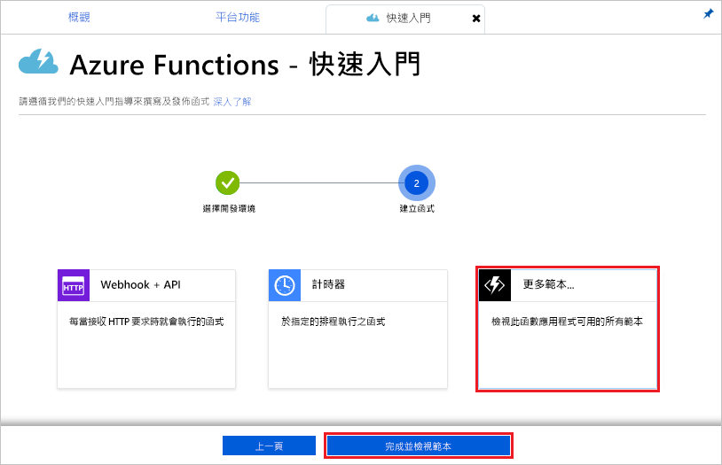
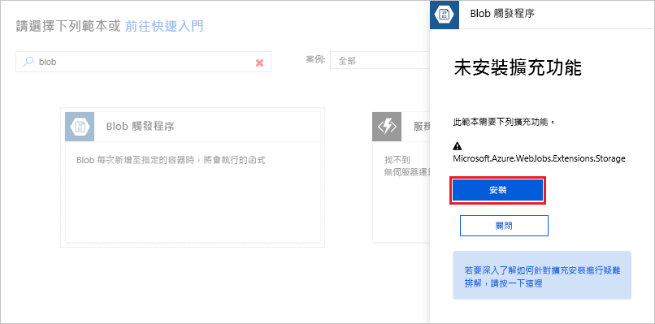
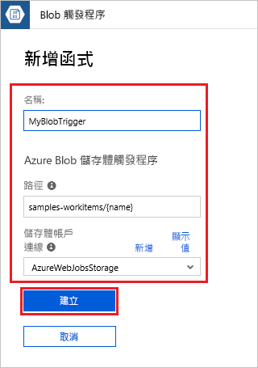
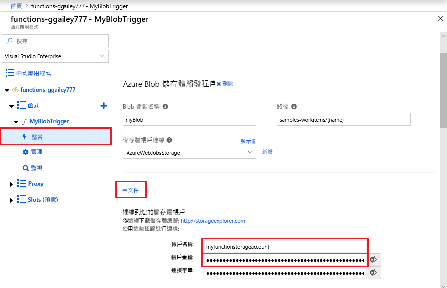
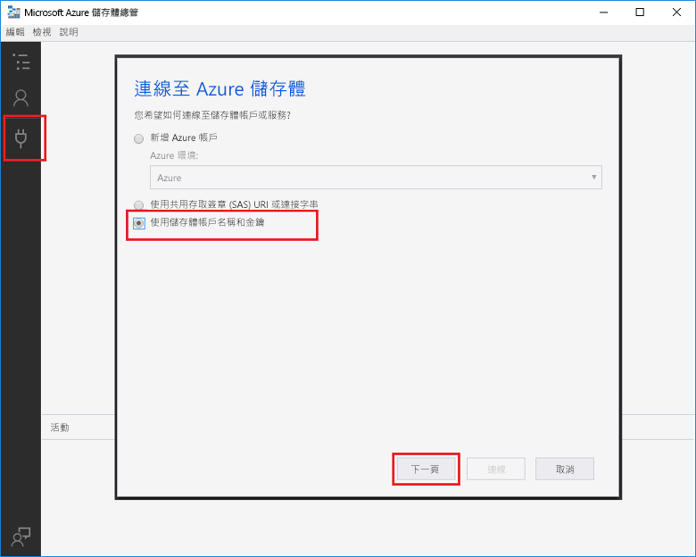
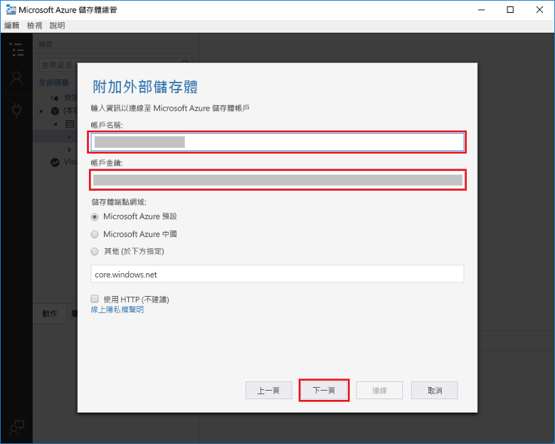
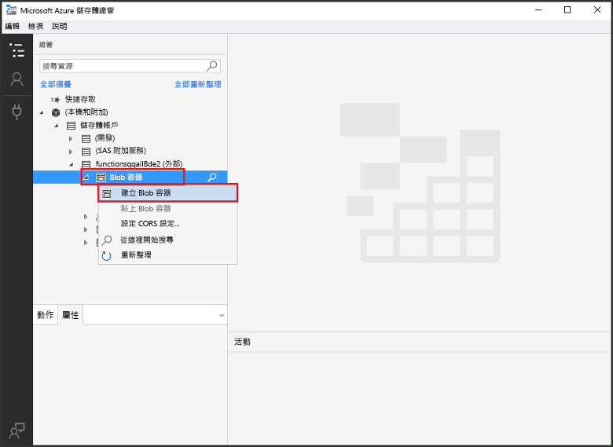
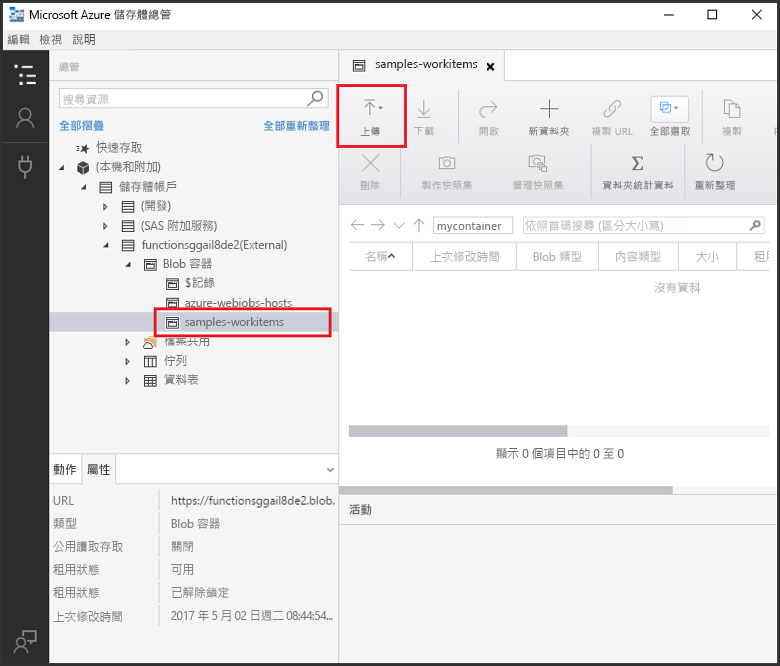
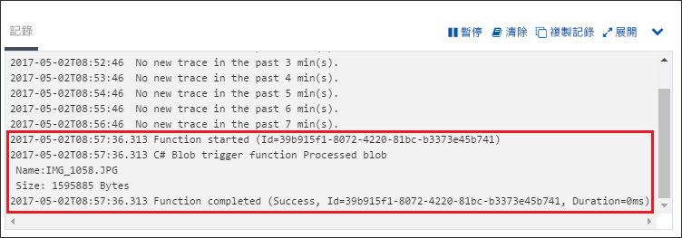

# 建立 Azure Blob 儲存體所觸發的函式

了解如何建立函式，並讓此函式在檔案上傳至 Azure Blob 儲存體時或 Azure Blob 儲存體中的檔案更新時觸發。

## 先決條件

+ 下載並安裝 [Microsoft Azure 儲存體總管](http://storageexplorer.com/)。
+ Azure 訂用帳戶。 如果您沒有 Azure 訂用帳戶，請在開始前建立[免費帳戶](https://azure.microsoft.com/free/?WT.mc_id=A261C142F)。

## 建立 Azure 函數應用程式

[!INCLUDE [Create function app Azure portal](../../includes/functions-create-function-app-portal.md)]

接下來，您要在新的函式應用程式中建立函式。

## 建立由 Blob 儲存體所觸發的函式

1. 展開函式應用程式，然後按一下 [Functions] 旁的 [+] 按鈕。 如果這是您函式應用程式中的第一個函式，請選取 [自訂函式]。 這會顯示一組完整的函式範本。

    

2. 在 [搜尋] 欄位中，輸入 `blob`，然後選擇您需要的 blob 儲存體觸發程序範本語言。

    
 
3. 使用影像下方資料表中所指定的設定。

    

    | 設定 | 建議的值 | 說明 |
    |---|---|---|
    | **名稱** | 函式應用程式中的唯一名稱 | 這個由 blob 所觸發之函式的名稱。 |
    | **路徑**   | samples-workitems/{name}    | 受監視 Blob 儲存體中的位置。 在繫結中，Blob 的檔案名稱會以「名稱」參數的形式來傳遞。  |
    | **儲存體帳戶連線** | AzureWebJobsStorage | 您可以使用應用程式函式已在使用的儲存體帳戶連線，或建立新的連線。  |

3. 按一下 [建立] 可建立函式。

接下來，您要連線到 Azure 儲存體帳戶並建立 **samples-workitems** 容器。

## 建立容器

1. 在您的函式中，按一下 [整合]，展開 [文件]，然後複製**帳戶名稱**和**帳戶金鑰**。 您會使用這些認證來連線至儲存體帳戶。 如果您已連線至儲存體帳戶，請跳至步驟 4。

    

1. 執行 [Microsoft Azure 儲存體總管](http://storageexplorer.com/)工具，按一下左側的 [連線] 圖示，選擇 [使用儲存體帳戶名稱和金鑰]，然後按 [下一步]。

    

1. 輸入從步驟 1 得到的 [帳戶名稱] 和 [帳戶金鑰]，按 [下一步]，然後按一下 [連線]。 

    

1. 展開連結的儲存體帳戶，以滑鼠右鍵按一下 [Blob 容器]，按一下 [建立 Blob 容器]，輸入 `samples-workitems`，然後按 Enter 鍵。

    

您已擁有 Blob 容器，接下來您可以將檔案上傳至容器以測試函式。

## 測試函式

1. 回到 Azure 入口網站，瀏覽至您的函式，展開頁面底部的 [記錄]，並確定記錄串流並未暫停。

1. 在儲存體總管中，依序展開您的儲存體帳戶、[Blob 容器] 和 [samples-workitems]。 依序按一下 [上傳] 和 [上傳檔案...]。

    

1. 在 [上傳檔案] 對話方塊中，按一下 [檔案] 欄位。 瀏覽至本機電腦上的檔案 (例如影像檔)，加以選取，然後依序按一下 [開啟] 和 [上傳]。

1. 返回您的函式記錄，並確認系統已讀取 Blob。

   

    >[!NOTE]
    > 當函式應用程式以預設的取用方案執行時，從有 Blob 新增或更新到系統觸發函式，中間可能會延遲好幾分鐘。 如果您不想讓 Blob 所觸發的函式延遲太久，請考慮在 App Service 方案執行函式應用程式。

## 清除資源

[!INCLUDE [Next steps note](../../includes/functions-quickstart-cleanup.md)]

## 後續步驟

您已建立了函式，並讓它在 Blob 儲存體中有 Blob 新增或更新時執行。 

[!INCLUDE [Next steps note](../../includes/functions-quickstart-next-steps.md)]

如需 Blob 儲存體觸發程序的詳細資訊，請參閱 [Azure Functions Blob 儲存體繫結](functions-bindings-storage-blob.md)。
