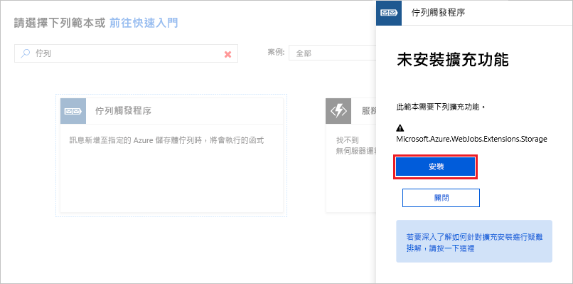
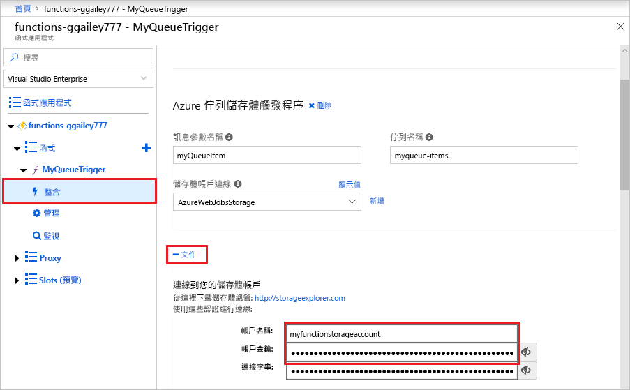
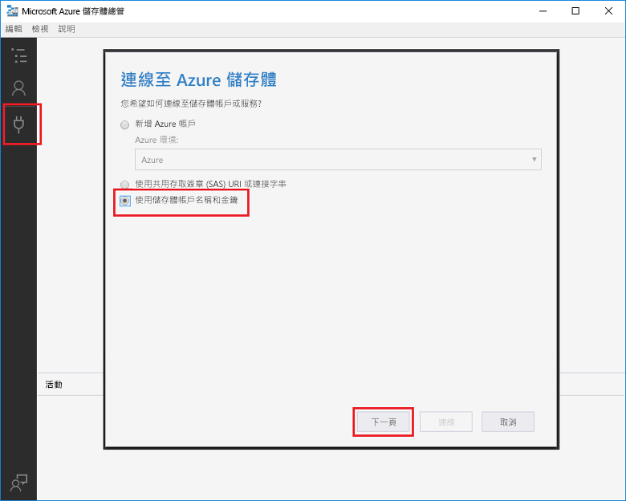
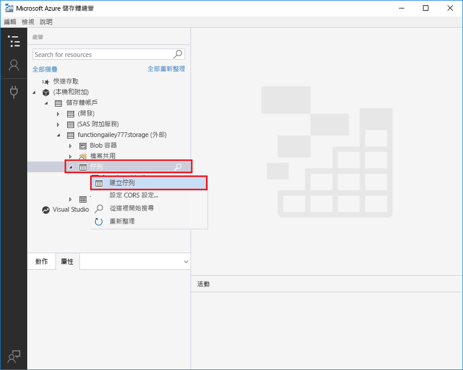
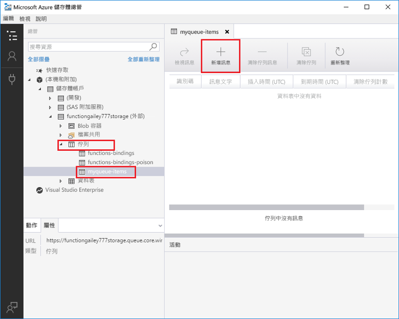

# 建立 Azure 佇列儲存體所觸發的函式

了解如何建立函式，並讓此函式在訊息提交至 Azure 儲存體佇列時觸發。

## 必要條件

- 下載並安裝 [Microsoft Azure 儲存體總管](http://storageexplorer.com/)。

- Azure 訂用帳戶。 如果您沒有 Azure 訂用帳戶，請在開始前建立[免費帳戶](https://azure.microsoft.com/free/?WT.mc_id=A261C142F)。

## 建立 Azure 函數應用程式

[!INCLUDE [Create function app Azure portal](../../includes/functions-create-function-app-portal.md)]

接下來，您要在新的函式應用程式中建立函式。

## 建立由佇列觸發的函式

1. 展開函式應用程式，然後按一下 [Functions] 旁的 [+] 按鈕。 如果這是函式應用程式中的第一個函式，請依序選取 [入口網站內] 和 [繼續]。 否則，請移至步驟三。

   

1. 依序選擇 [更多範本] 和 [完成並檢視範本]。

    

1. 在搜尋欄位中，輸入 `queue`，然後選擇 [佇列觸發程序] 範本。

1. 如果出現提示，請選取 [安裝]，以在函式應用程式中安裝 Azure 儲存體延伸模組的任何相依性。 安裝成功之後，請選取 [繼續]。

    

1. 使用影像下方資料表中所指定的設定。

    

    | 設定 | 建議的值 | 說明 |
    |---|---|---|
    | **名稱** | 函式應用程式中的唯一名稱 | 這個由佇列所觸發之函式的名稱。 |
    | **佇列名稱**   | myqueue-items    | 儲存體帳戶中的連線目標佇列名稱。 |
    | **儲存體帳戶連線** | AzureWebJobStorage | 您可以使用應用程式函式已在使用的儲存體帳戶連線，或建立新的連線。  |    

1. 按一下 [建立] 可建立函式。

接下來，您要連線到 Azure 儲存體帳戶並建立 **myqueue-items** 儲存體佇列。

## 建立佇列

1. 在您的函式中，按一下 [整合]，展開 [文件]，然後複製**帳戶名稱**和**帳戶金鑰**。 您會使用這些認證來連線至 Azure 儲存體總管中的儲存體帳戶。 如果您已連線至儲存體帳戶，請跳至步驟 4。

    

1. 執行 [Microsoft Azure 儲存體總管](http://storageexplorer.com/)工具，按一下左側的 [連線] 圖示，選擇 [使用儲存體帳戶名稱和金鑰]，然後按 [下一步]。

    

1. 輸入從步驟 1 得到的 [帳戶名稱] 和 [帳戶金鑰]，按 [下一步]，然後按一下 [連線]。

    

1. 展開連結的儲存體帳戶、以滑鼠右鍵按一下 [佇列]、按一下 [建立佇列]、鍵入 `myqueue-items`，然後按 Enter 鍵。

    

您已擁有儲存體佇列，接下來您可以在佇列中新增訊息以測試函式。

## 測試函式

1. 回到 Azure 入口網站，並瀏覽至您的函式，然後展開頁面底部的 [記錄]，再確定記錄串流並未暫停。

1. 在儲存體總管中，依序展開您的儲存體帳戶、[佇列] 和 [myqueue-items]，然後按一下 [新增訊息]。

    

1. 將您的 "Hello World!" 輸入 在 [訊息文字] 訊息中，然後按一下 [確定]。

1. 等候幾秒鐘，然後回到您的函式記錄，並確認系統已從佇列中讀取新訊息。

    

1. 回到儲存體總管，按一下 [重新整理]，然後確認系統已處理訊息，佇列中已沒有該訊息。

## 清除資源

[!INCLUDE [Next steps note](../../includes/functions-quickstart-cleanup.md)]

## 後續步驟

您已建立了函式，並讓它在儲存體佇列中有訊息新增時執行。

[!INCLUDE [Next steps note](../../includes/functions-quickstart-next-steps.md)]

如需佇列儲存體觸發程序的詳細資訊，請參閱 [Azure Functions 儲存體佇列繫結](functions-bindings-storage-queue.md)。
