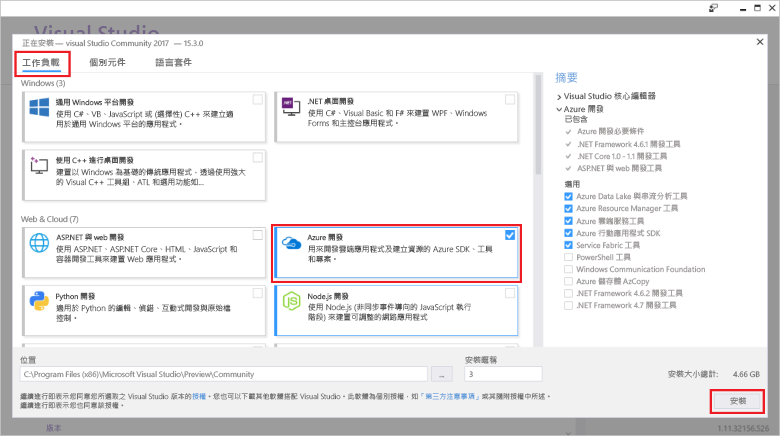

# 使用 Visual Studio 建立第一個函式

Azure Functions 可讓您在[無伺服器](https://azure.microsoft.com/overview/serverless-computing/)環境中執行程式碼，而不需要先建立 VM 或發佈 Web 應用程式。

在本主題中，您將了解如何使用 Visual Studio 2017 Tools for Azure Functions 在本機建立及測試 "hello world" 函式。 您接著會將函式程式碼發行至 Azure。 這些工具可在 Visual Studio 2017 15.3 版或更新版本的 Azure 開發工作負載中取得。

## 必要條件

若要完成本教學課程，請安裝：

* [Visual Studio 2017 15.4 版](https://www.visualstudio.com/vs/)或更新版本，包括 **Azure 開發**工作負載。

    
    
[!INCLUDE [quickstarts-free-trial-note](../../includes/quickstarts-free-trial-note.md)] 

## 在 Visual Studio 中建立 Azure Functions 專案

[!INCLUDE [Create a project using the Azure Functions template](../../includes/functions-vstools-create.md)]

您現在已建立專案，即可建立第一個函式。

## 建立函式

1. 在 [方案總管] 中，於專案節點上按一下滑鼠右鍵，然後選取 [新增] > [新增項目]。 選取 [Azure Function]，在 [名稱] 中輸入 `HttpTriggerCSharp.cs`，然後按一下 [新增]。

2. 選取 [HttpTrigger]，針對 [存取權限] 選取 [匿名]，然後按一下 [確定]。 建立的函式會由任何用戶端的 HTTP 要求存取。 

    

    這會將一個程式碼檔案新增至您的專案，其中包含實作函式程式碼的類別。 此程式碼是以範本為基礎，會接收名稱值並將其回應回去。 **FunctionName** 屬性會設定您的函式名稱。 **HttpTrigger** 屬性表示觸發函式的訊息。 

    

您現在已建立 HTTP 觸發的函式，可以在本機電腦上進行測試。

## 在本機測試函式

Azure Functions Core Tools 可讓您在本機開發電腦上執行 Azure Functions 專案。 第一次從 Visual Studio 啟動函式時，系統會提示您安裝這些工具。  

1. 若要測試您的函式，請按 F5。 如果出現提示，接受來自 Visual Studio 之下載及安裝 Azure Functions Core (CLI) 工具的要求。  您可能也需要啟用防火牆例外狀況，工具才能處理 HTTP 要求。

2. 從 Azure Functions 執行階段輸出複製函式的 URL。  

    

3. 將 HTTP 要求的 URL 貼到瀏覽器的網址列。 將查詢字串 `?name=<yourname>` 附加至此 URL 並執行要求。 下圖顯示瀏覽器中對於函式傳回之本機 GET 要求所做出的回應︰ 

    

4. 若要停止偵錯，請按一下 Visual Studio 工具列上的 [停止] 按鈕。

確認函式在本機電腦上正確執行之後，就可以將專案發佈到 Azure。

## 將專案發佈到 Azure

您的 Azure 訂用帳戶中必須具有函式應用程式，才可以發佈您的專案。 您可以直接從 Visual Studio 建立函式應用程式。

[!INCLUDE [Publish the project to Azure](../../includes/functions-vstools-publish.md)]

## 在 Azure 中測試您的函式

1. 從發行設定檔頁面複製函式應用程式的基底 URL。 使用新的基底 URL，取代在本機測試函式時所使用之 URL 的 `localhost:port` 部分。 如同以往，務必將查詢字串 `?name=<yourname>` 附加至此 URL 並執行要求。

    呼叫 HTTP URL 觸發函式的 URL 如下所示：

        http://<functionappname>.azurewebsites.net/api/<functionname>?name=<yourname> 

2. 將 HTTP 要求的新 URL 貼到瀏覽器的網址列。 下圖顯示瀏覽器中對於函式傳回之遠端 GET 要求所做出的回應︰ 

    
 
## 後續步驟

您已透過 Visual Studio，使用簡單的 HTTP 觸發函式建立 C# 函式應用程式。 

+ 若要了解如何設定專案以支援其他類型的觸發程序和繫結，請參閱 [Azure Functions Tools for Visual Studio](functions-develop-vs.md) 中的[設定專案以進行本機開發](functions-develop-vs.md#configure-the-project-for-local-development)一節。
+ 若要深入了解如何使用 Azure Functions Core Tools 進行本機測試和偵錯，請參閱[在本機編碼和測試 Azure Functions](functions-run-local.md)。 
+ 若要深入了解如何將函式開發為 .NET 類別庫，請參閱[搭配使用 .NET 類別庫與 Azure Functions](functions-dotnet-class-library.md)。 

