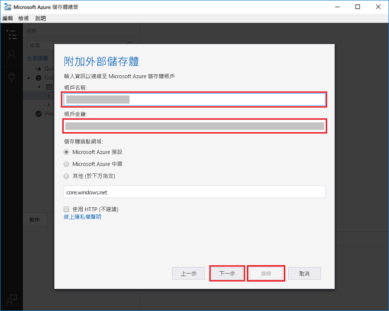
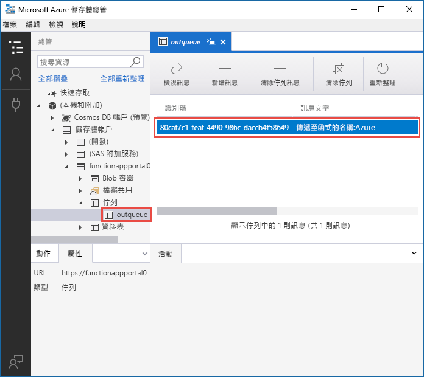

# <a name="add-messages-to-an-azure-storage-queue-using-functions"></a>使用 Functions 在 Azure 儲存體佇列中新增訊息

在 Azure Functions 中，輸入和輸出繫結會提供宣告式方法，以便從函式連線到外部服務資料。 在本主題中，請學習如何新增會將訊息傳送至 Azure 佇列儲存體的輸出繫結，以更新現有函式。  


## <a name="prerequisites"></a>必要條件 

[!INCLUDE [Previous topics](../../includes/functions-quickstart-previous-topics.md)]

* 安裝 [Microsoft Azure 儲存體總管](http://storageexplorer.com/)。

## <a name="add-binding"></a>新增輸出繫結
 
1. 展開函式應用程式和函式。

2. 選取 [整合] 和 [+ 新輸出]，然後選擇 [Azure 佇列儲存體] 和 [選取]。
    
    

3. 使用表格中所指定的設定︰ 

    

    | 設定      |  建議的值   | 說明                              |
    | ------------ |  ------- | -------------------------------------------------- |
    | **佇列名稱**   | myqueue-items    | 儲存體帳戶中的連線目標佇列名稱。 |
    | **儲存體帳戶連線** | AzureWebJobStorage | 您可以使用應用程式函式已在使用的儲存體帳戶連線，或建立新的連線。  |
    | **訊息參數名稱** | outputQueueItem | 輸出繫結參數的名稱。 | 

4. 按一下 [儲存] 來新增繫結。
 
您已定義了輸出繫結，接下來您需要將程式碼更新為使用繫結來對佇列新增訊息。  

## <a name="update-the-function-code"></a>更新函式程式碼

1. 選取函式以在編輯器中顯示函式程式碼。 

2. 若為 C# 函式，請依下面的方式更新函式定義，以新增 **outputQueueItem** 儲存體繫結參數。 若為 JavaScript 函式，請略過此步驟。

    ```cs   
    public static async Task<HttpResponseMessage> Run(HttpRequestMessage req, 
        ICollector<string> outputQueueItem, TraceWriter log)
    {
        ....
    }
    ```

3. 在方法傳回前，對函式新增下列程式碼。 請使用您的函式語言所適用的程式碼片段。

    ```javascript
    context.bindings.outputQueueItem = "Name passed to the function: " + 
                (req.query.name || req.body.name);
    ```

    ```cs
    outputQueueItem.Add("Name passed to the function: " + name);     
    ```

4. 選取 [儲存] 來儲存變更。

傳遞至 HTTP 觸發程序的值會包含在新增至佇列的訊息中。
 
## <a name="test-the-function"></a>測試函式 

1. 儲存程式碼的變更後，選取 [執行]。 

    

2. 檢查記錄以確定函式已成功。 您第一次使用輸出繫結時，Functions 執行階段會在儲存體帳戶中建立名為 **outqueue** 的新佇列。

接下來，您可以連線到儲存體帳戶，以便驗證新佇列和您對佇列新增的訊息。 

## <a name="connect-to-the-queue"></a>連線至佇列

如果您已經安裝儲存體總管並將它連線至儲存體帳戶，請略過前三個步驟。    

1. 在您的函式中，選擇 [整合] 和新的 **Azure 佇列儲存體**輸出繫結，然後展開 [文件]。 複製**帳戶名稱**和**帳戶金鑰**。 您會使用這些認證來連線至儲存體帳戶。
 
    

2. 執行 [Microsoft Azure 儲存體總管](http://storageexplorer.com/)工具，選取左側的 [連線] 圖示，選擇 [使用儲存體帳戶名稱和金鑰]，然後選取 [下一步]。

    
    
3. 將步驟 1 中的**帳戶名稱**和**帳戶金鑰**貼到其對應的欄位中，然後選取 [下一步] 和 [連線]。 
  
    

4. 展開連結的儲存體帳戶，展開 [佇列]，並確認有名為 **myqueue-items** 的佇列存在。 您也應該會看到佇列中已有訊息。  
 
    
 

## <a name="clean-up-resources"></a>清除資源

[!INCLUDE [Next steps note](../../includes/functions-quickstart-cleanup.md)]

## <a name="next-steps"></a>後續步驟

您已在現有函式中新增輸出繫結。 

[!INCLUDE [Next steps note](../../includes/functions-quickstart-next-steps.md)]

如需佇列儲存體繫結的詳細資訊，請參閱 [Azure Functions 儲存體佇列繫結](functions-bindings-storage-queue.md)。 


