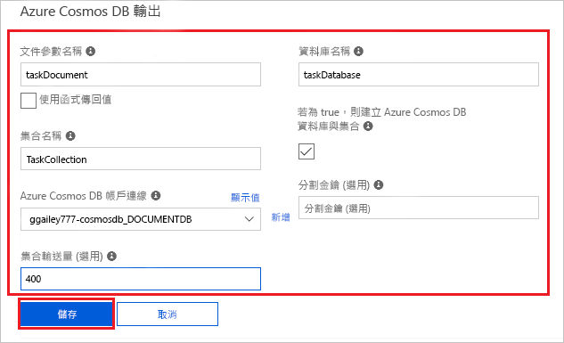
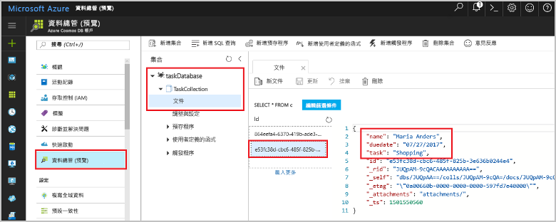

# <a name="store-unstructured-data-using-azure-functions-and-cosmos-db"></a>使用 Azure Functions 和 Cosmos DB 儲存非結構化資料

Azure Cosmos DB 是儲存非結構化和 JSON 資料的好方法。 Cosmos DB 與 Azure Functions 結合，能夠讓儲存資料輕鬆快速，所使用的程式碼比起在關聯式資料庫中儲存資料所需的程式碼更少。

本教學課程會逐步解說如何使用 Azure 入口網站以建立 Azure Functions，它會儲存 Cosmos DB 文件中的非結構化資料。 

## <a name="prerequisites"></a>必要條件

[!INCLUDE [Previous quickstart note](../../includes/functions-quickstart-previous-topics.md)]

[!INCLUDE [functions-portal-favorite-function-apps](../../includes/functions-portal-favorite-function-apps.md)]

## <a name="create-a-function"></a>建立函式

建立新的 C# 泛型 WebHook，名稱為 `MyTaskList`。

1. 展開您現有的函式清單，然後按一下加號 (+) 來建立新的函式
1. 選取 GenericWebHook-CSharp，並將它命名為 `MyTaskList`


## <a name="add-an-output-binding"></a>新增輸出繫結

Azure 函式可以包含一個觸發程序和任意數目的輸入或輸出繫結。 在此範例中，我們將使用 HTTP 要求觸發程序和 Cosmos DB 文件作為輸出繫結。

1. 按一下函式的 [整合] 索引標籤來檢視或修改函式的觸發程序和繫結。
1. 選擇頁面右上方的 [新輸出] 連結。

注意︰已設定 HTTP 要求觸發程序，不過，您必須新增 Cosmos DB 文件繫結。


1. 輸入必要資訊以建立繫結。 使用下表來判斷值。



|  欄位 | 值  |
|---|---|
| 文件參數名稱 | 該名稱參考程式碼中的 Cosmos DB 物件 |
| 資料庫名稱 | 在其中儲存文件的資料庫名稱 |
| 集合名稱 | Cosmos DB 資料庫的群組名稱 |
| 您想要系統為您建立 Cosmos DB 和集合 | 是或否 |
| Cosmos DB 帳戶連線 | 連接字串，指向 Cosmos DB 資料庫 |

您也必須設定與 Cosmos DB 資料庫的連線。

1. 按一下 [Cosmos DB 文件連線] 標籤旁的 [新增] 連結。
1. 填寫欄位，然後選取建立 Cosmos DB 文件所需的適當選項。


|  欄位 | 值  |
|---|---|
| 識別碼 | Cosmos DB 資料庫的唯一識別碼  |
| NoSQL API | Cosmos DB 或 MongoDB  |
| 訂用帳戶 | MSDN 訂用帳戶  |
| 資源群組  | 建立新的群組或選取現有的群組。  |
| 位置  | WestEurope  |

1. 按一下 [確定] 按鈕。 當 Azure 建立資源時，您可能需要等候幾分鐘的時間。
1. 按一下 [儲存]  按鈕。

## <a name="update-the-function-code"></a>更新函式程式碼

使用下列程式碼取代函式的範本程式碼：

請注意，此範例的程式碼僅限使用 C#。

```csharp
using System.Net;

public static HttpResponseMessage Run(HttpRequestMessage req, out object taskDocument, TraceWriter log)
{
    string name = req.GetQueryNameValuePairs()
        .FirstOrDefault(q => string.Compare(q.Key, "name", true) == 0)
        .Value;

    string task = req.GetQueryNameValuePairs()
        .FirstOrDefault(q => string.Compare(q.Key, "task", true) == 0)
        .Value;

    string duedate = req.GetQueryNameValuePairs()
        .FirstOrDefault(q => string.Compare(q.Key, "duedate", true) == 0)
        .Value;

    taskDocument = new {
        name = name,
        duedate = duedate.ToString(),
        task = task
    };

    if (name != "" && task != "") {
        return req.CreateResponse(HttpStatusCode.OK);
    }
    else {
        return req.CreateResponse(HttpStatusCode.BadRequest);
    }
}

```

此程式碼範例會讀取 HTTP 要求查詢字串，並將它們指派為 `taskDocument` 物件的成員。 `taskDocument` 物件會自動儲存 Cosmos DB 資料庫中的資料，甚至會在第一次使用時建立資料庫。

## <a name="test-the-function-and-database"></a>測試函式和資料庫

1. 在 [函式] 索引標籤中，按一下入口網站右邊的 [測試] 連結，然後輸入下列 HTTP 查詢字串︰

| 查詢字串 | 值 |
|---|---|
| 名稱 | Chris P. Bacon |
| 工作 | 製作 BLT 三明治 |
| 到期日 | 05/12/2017 |

1. 按一下 [執行] 連結。
1. 確認函式是否傳回「HTTP 200 OK」回應碼。


確認項目已在 Cosmos DB 資料庫中製作。

1. 在 Azure 入口網站中尋找您的資料庫，並且選取它。
1. 選取 [資料總管] 選項。
1. 展開節點，直到您觸達文件的項目為止。
1. 確認資料庫項目。 資料庫中除了您的資料，還會有其他中繼資料。



如果資料是在文件中，則您已成功建立 Azure 函式，該函式會儲存 Cosmos DB 資料庫中的非結構化資料。

## <a name="clean-up-resources"></a>清除資源

[!INCLUDE [Next steps note](../../includes/functions-quickstart-cleanup.md)]

## <a name="next-steps"></a>後續步驟

如需 Azure Functions 的詳細資訊，請參閱下列主題：

[!INCLUDE [Getting help note](../../includes/functions-get-help.md)]

[!INCLUDE [functions-quickstart-next-steps](../../includes/functions-quickstart-next-steps.md)]

