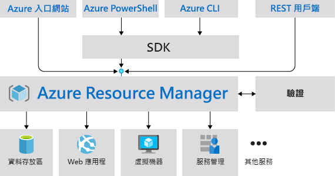
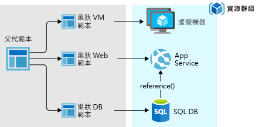
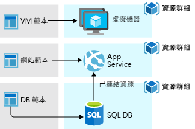

# <a name="azure-resource-manager-overview"></a>Azure Resource Manager 概觀
應用程式的基礎結構通常由許多元件所組成 – 或許是虛擬機器、儲存體帳戶和虛擬網路，或者 web 應用程式、資料庫、資料庫伺服器和第三方服務。 您看不到這些元件作為個別的實體，而是看到它們作為單一實體相關且彼此相依的組件。 您會想要將其當成群組來部署、管理和監視。 Azure Resource Manager 可讓您將方案中的資源作為群組使用。 您可以透過單一、協調的作業來部署、更新或刪除方案的所有資源。 您會使用部署的範本，且該範本可以用於不同的環境，例如測試、預備和生產環境。 Resource Manager 會提供安全性、稽核和標記功能，以協助您在部署後管理您的資源。 

## <a name="consistent-management-layer"></a>一致的管理層
Resource Manager 會提供一致的管理層，以透過 Azure PowerShell、Azure CLI、Azure 入口網站、REST API 和用戶端 SDK 執行工作。 透過 Azure PowerShell、Azure CLI、Azure REST API 和用戶端 SDK 也使用 Azure 入口網站中的所有可用功能。 一開始透過 API 發行的功能將會在初次發行的 180 天內呈現在入口網站中。

選擇最適合您的工具和 API - 它們具有相同的功能並提供一致的結果。

下圖顯示這些工具如何與相同的 Azure Resource Manager API 互動。 API 將要求傳遞給 Resource Manager 服務，由其驗證和授權要求。 然後，Resource Manager 將要求路由傳送到適當的資源提供者。



## <a name="terminology"></a>術語
如果您不熟悉 Azure Resource Manager，則您可能不熟悉一些詞彙。

* **資源** - 透過 Azure 提供的可管理項目。 部分常見資源有虛擬機器、儲存體帳戶、Web 應用程式、資料庫和虛擬網路，但這只是其中一小部分。
* **資源群組** - 保留 Azure 方案相關資源的容器。 資源群組可以包含方案的所有資源，或只包含您要以群組方式管理的資源。 您可決定如何根據對組織最有利的方式，將資源配置到資源群組。 請參閱 [資源群組](#resource-groups)。
* **資源提供者** - 提供可透過 Resource Manager 部署及管理之資源的一項服務。 每個資源提供者都會提供作業，以便能運用所部署的資源。 部分常見資源提供者有 Microsoft.Compute (提供虛擬機器資源)、Microsoft.Storage (提供儲存體帳戶資源) 和 Microsoft.Web (提供與 Web 應用程式相關的資源)。 請參閱 [資源提供者](#resource-providers)。
* **Resource Manager 範本** - 定義一或多個要部署至資源群組之資源的 JavaScript 物件標記法 (JSON) 檔案。 它也會定義所部署資源之間的相依性。 範本可用來以一致性方式重複部署資源。 請參閱 [範本部署](#template-deployment)。
* **宣告式語法** - 可讓您陳述「以下是我想要建立的項目」而不需要撰寫一連串程式設計命令來加以建立的語法。 Resource Manager 範本便是宣告式語法的其中一個範例。 在該檔案中，您可以定義要部署至 Azure 之基礎結構的屬性。 

## <a name="the-benefits-of-using-resource-manager"></a>使用 Resource Manager 的優點
Resource Manager 會提供數個優點：

* 您可以以群組形式部署、管理及監視方案的所有資源，而不是個別處理這些資源。
* 您可以在整個方案週期重複部署方案，並確信您的資源會部署在一致的狀態中。
* 您可以透過宣告式範本而非指令碼來管理基礎結構。
* 您可以定義之間的相依性，使得以正確的順序部署資源。
* 因為角色型存取控制 (RBAC) 會原生整合至管理平台，您可以將存取控制套用至資源群組中的所有服務。
* 您可以將標籤套用至資源，以便以邏輯方式組織訂用帳戶中的所有資源。
* 您可以檢視共用相同標籤之資源群組的成本，以釐清您的組織的計費方式。  

Resource Manager 提供一個部署和管理方案的新方式。 如果您使用較舊的部署模型並想要了解這些變更，請參閱 [瞭解資源管理員部署和傳統部署](resource-manager-deployment-model.md)。

## <a name="guidance"></a>指引
下列建議可協助您在使用您的方案時充分利用 Resource Manager。

1. 透過 Resource Manager 範本中的宣告式語法定義和部署基礎結構，而非透過命令式指令。
2. 在範本中定義所有的部署和設定步驟。 您在設定方案時應該沒有手動步驟。
3. 執行命令式指令來管理您的資源，例如啟動或停止應用程式或機器。
4. 利用與資源群組中相同的生命週期排列資源。 將標記用於資源的所有其他組織方式。

如需關於企業如何使用 Resource Manager 有效地管理訂用帳戶的指引，請參閱 [Azure 企業 Scaffold - 規定的訂用帳戶治理](/azure/architecture/cloud-adoption-guide/subscription-governance)。

## <a name="resource-groups"></a>資源群組
定義資源群組時，必須考慮一些重要因素：

1. 群組中的所有資源應該共用相同的生命週期。 您可一起部署、更新和刪除它們。 如果類似資料庫伺服器這樣的資源必須存在於不同的部署週期，它應該位於另一個資源群組中。
2. 每個資源只能存在於一個資源群組中。
3. 您可以隨時在資源群組中新增或移除資源。
4. 您可以將資源從一個資源群組移動到另一個群組。 如需詳細資訊，請參閱 [將資源移動到新的資源群組或訂用帳戶](resource-group-move-resources.md)。
5. 資源群組可以包含位於不同區域中的資源。
6. 資源群組可以用來設定系統管理動作的存取控制範圍。
7. 資源可與其他資源群組中的資源互動。 此互動常見於兩個資源彼此連結，但未共用相同的生命週期 (例如，連接至某個資料庫的 Web 應用程式) 時。

建立資源群組時，您需要提供該資源群組的位置。 您可能會想：「為什麼資源群組需要位置？ 而且，如果資源可以有不同於資源群組的位置，為什麼資源群組位置這麼重要？」 資源群組會儲存資源相關中繼資料。 因此，當您指定資源群組的位置時，您便是指定中繼資料的儲存位置。 基於相容性理由，您可能需要確保您的資料存放在特定區域中。

## <a name="resource-providers"></a>資源提供者
每個資源提供者都會提供一組資源和作業，以便能運用 Azure 服務。 例如，如果想要儲存金鑰和密碼，您會使用 **Microsoft.KeyVault** 資源提供者。 此資源提供者會提供稱為**保存庫**的資源類型來建立金鑰保存庫。 

資源類型名稱的格式：**{resource-provider}/{resource-type}**。 例如，金鑰保存庫類型是 **Microsoft.KeyVault/vaults**。

在開始部署資源之前，您應該先了解可用的資源提供者。 了解資源提供者和資源的名稱可協助您定義想要部署至 Azure 的資源。 此外，您需要知道有效的位置，以及每個資源類型的 API 版本。 如需詳細資訊，請參閱[資源提供者和類型](resource-manager-supported-services.md)。

## <a name="template-deployment"></a>範本部署
利用 Resource Manager，您可以建立可定義 Azure 方案之基礎結構和組態的範本 (以 JSON 格式)。 透過範本，您可以在整個生命週期中重複部署方案，並確信您的資源會以一致的狀態部署。 當您從入口網站建立方案，方案會自動包含部署範本。 您不必從頭建立您的範本，因為您可以從方案的範本開始，並自訂範本以符合您的特定需求。 匯出資源群組的目前狀態，或檢視特定部署所用的範本，即可擷取現有資源群組的範本。 檢視[匯出的範本](resource-manager-export-template.md)有助於了解範本語法。

若要了解範本格式和其建構方式，請參閱[建立第一個 Azure Resource Manager 範本](resource-manager-create-first-template.md)。 若要檢視資源類型的 JSON 語法，請參閱[在 Azure Resource Manager 範本中定義資源](/azure/templates/)。

Resource Manager 處理範本的方式會和處理其他任何要求一樣 (請參閱[一致的管理層](#consistent-management-layer)影像)。 它會剖析範本，並將其語法轉換成適當的資源提供者所需的 REST API 作業。 例如，當 Resource Manager 收到具有下列資源定義的範本︰

```json
"resources": [
  {
    "apiVersion": "2016-01-01",
    "type": "Microsoft.Storage/storageAccounts",
    "name": "mystorageaccount",
    "location": "westus",
    "sku": {
      "name": "Standard_LRS"
    },
    "kind": "Storage",
    "properties": {
    }
  }
]
```

它會將定義轉換成下列 REST API 作業，該作業會再傳送給 Microsoft.Storage 資源提供者︰

```HTTP
PUT
https://management.azure.com/subscriptions/{subscriptionId}/resourceGroups/{resourceGroupName}/providers/Microsoft.Storage/storageAccounts/mystorageaccount?api-version=2016-01-01
REQUEST BODY
{
  "location": "westus",
  "properties": {
  }
  "sku": {
    "name": "Standard_LRS"
  },   
  "kind": "Storage"
}
```

範本和資源群組的定義方式全由您決定，方案的管理方式也是如此。 比方說，您可以透過單一範本在單一資源群組中部署三層式應用程式。


但您不需要在單一的範本中定義整個基礎結構。 通常的合理作法是將您的部署需求分成一組有目標及特定目的的範本。 您可以輕鬆地將這些份本重複使用於不同的方案。 若要部署特定的方案，您會建立連結所有必要範本的主版範本。 下圖顯示如何透過包含三個巢狀範本的父範本部署三層式方案。



如果您想像的階層有不同的生命週期，您可以將這三個階層部署到不同的資源群組。 請注意，資源仍可連結至其他資源群組中的資源。



如需巢狀範本的相關資訊，請參閱[透過 Azure Resource Manager 使用連結的範本](resource-group-linked-templates.md)。

Azure Resource Manager 會分析相依性，確保以正確的順序建立資源。 如果某個資源依賴另一個資源的值 (例如需要儲存體帳戶以供磁碟使用的虛擬機器)，您必須設定相依性。 如需詳細資訊，請參閱 [定義 Azure Resource Manager 範本中的相依性](resource-group-define-dependencies.md)。

您也可以使用範本進行基礎結構的更新。 例如，您可以將資源新增至您的方案，並將組態規則新增至已部署的資源。 如果此範本指定建立資源，但該資源已經存在，Azure Resource Manager 會執行更新，而不必建立新資產。 Azure Resource Manager 會將現有資產更新為和新資產相同的狀態。  

當您需要其他作業 (例如安裝不包含在安裝程式的特定軟體) 時，Resource Manager 會提供案例的延伸模組。 如果您已經使用組態管理服務，例如 DSC、Chef 或 Puppet，您可以透過使用擴充功能繼續使用該服務。 如需虛擬機器擴充功能的相關資訊，請參閱[有關虛擬機器擴充功能和功能](../virtual-machines/windows/extensions-features.md?toc=%2fazure%2fvirtual-machines%2fwindows%2ftoc.json)。 

最後，範本會成為應用程式原始碼的一部分。 您可以檢查您的原始程式碼存放庫，並隨著您的應用程式發展加以更新。 您可以透過 Visual Studio 編輯範本。

在定義範本之後，您就可以開始將資源部署至 Azure。 如需用來部署資源的命令，請參閱︰

* [使用 Resource Manager 範本與 Azure PowerShell 來部署資源](resource-group-template-deploy.md)
* [使用 Resource Manager 範本與 Azure CLI 部署資源](resource-group-template-deploy-cli.md)
* [使用 Resource Manager 範本與 Azure 入口網站來部署資源](resource-group-template-deploy-portal.md)
* [使用 Resource Manager 範本和 Resource Manager REST API 部署資源](resource-group-template-deploy-rest.md)

## <a name="tags"></a>標記
Resource Manager 提供標記的功能，可讓您根據管理或計費需求將資源分類。 當您有複雜的資源群組和資源集合，而且必須以對您最有意義的方式視覺化資產時，請使用標籤。 例如，您可以標記在組織中具有類似角色，或屬於相同部門的資源。 如果不使用標籤，貴組織中的使用者可建立多個資源，如此對於日後的身分識別及管理來說可能很困難。 例如，您可能想要刪除特定專案的所有資源。 如果未對此專案標記這些資源，您必須手動尋找它們。 標記是降低訂用帳戶不必要成本的重要方法。 

資源不需要位於相同的資源群組即可共用標記。 您可以建立自己的標記分類，以確保組織中的所有使用者都使用常見的標記，而不是使用者意外套用稍有不同的標記 (例如 "dept" 而不是 "department")。

下列範例顯示套用到虛擬機器的標籤。

```json
"resources": [    
  {
    "type": "Microsoft.Compute/virtualMachines",
    "apiVersion": "2015-06-15",
    "name": "SimpleWindowsVM",
    "location": "[resourceGroup().location]",
    "tags": {
        "costCenter": "Finance"
    },
    ...
  }
]
```

若要擷取所有具有標籤值的資源，請使用下列 PowerShell Cmdlet：

```powershell
Find-AzureRmResource -TagName costCenter -TagValue Finance
```

或是下列 Azure CLI 2.0 命令：

```azurecli
az resource list --tag costCenter=Finance
```

您也可以透過 Azure 入口網站檢視已加上標籤的資源。

訂用帳戶的[使用報告](../billing/billing-understand-your-bill.md)包含標籤名稱和值，可讓您依標籤細分成本。 如需標記的詳細資訊，請參閱 [使用標記來組織您的 Azure 資源](resource-group-using-tags.md)。

## <a name="access-control"></a>存取控制
Resource Manager 可讓您控制哪些人能存取組織的特定動作。 以原生方式將角色型存取控制 (RBAC) 整合至管理平台，並將存取控制套用至資源群組中的所有服務。 

在使用角色型存取控制時，請了解兩個主要概念︰

* 角色定義 - 描述一組權限，並可用於許多指派。
* 角色指派 - 為定義與特定範圍 (訂用帳戶、資源群組或資源) 的身分識別 (使用者或群組) 建立關聯。 較低的範圍會繼承指派。

您可以將使用者新增到預先定義的平台和資源專用的角色。 例如，您可以利用名為「讀取者」的預先定義角色，以允許使用者檢視資源，但不能加以變更。 您在組織中新增的使用者需要「讀取者」角色的這類存取，並將該角色套用至訂用帳戶、資源群組或資源。

Azure 提供下列四個平台角色︰

1. 擁有者 - 可以管理所有項目，包括存取
2. 參與者 - 可以管理存取以外的所有內容
3. 讀取者 - 可以檢視所有項目，但是無法進行變更
4. 使用者存取管理員 - 可管理使用者對 Azure 資源的存取權

Azure 也提供數個資源特有的角色。 一些常見的角色有︰

1. 虛擬機器參與者 - 可以管理虛擬機器，但不能授與對它們的存取權，而且無法管理它們所連接的虛擬網路或儲存體帳戶
2. 網路參與者 - 可以管理所有網路資源，但不能授與對它們的存取權
3. 儲存體帳戶參與者 - 可以管理儲存體帳戶，但不能授與對它們的存取權
4. SQL Server 參與者 - 可以管理 SQL Server 和資料庫，但是無法管理它們的安全性相關原則
5. 網站參與者 - 可以管理網站，但是不能管理它們連接的 Web 方案

如需角色和允許動作的完整清單，請參閱 [RBAC：內建角色](../role-based-access-control/built-in-roles.md)。 如需角色型存取控制的詳細資訊，請參閱 [Azure 角色型存取控制](../role-based-access-control/role-assignments-portal.md)。 

在某些情況下，您會想要執行程式碼或指令碼來存取資源，但不想透過使用者的認證來執行。 相反地，您會想要建立稱為應用程式服務主體的身分識別，並為服務主體指派適當的角色。 Resource Manager 可讓您建立應用程式認證，並以程式設計方式驗證應用程式。 若要了解如何建立服務主體，請參閱下列其中一個主題︰

* [使用 Azure PowerShell 建立用來存取資源的服務主體](resource-group-authenticate-service-principal.md)
* [使用 Azure CLI 建立用來存取資源的服務主體](resource-group-authenticate-service-principal-cli.md)
* [使用入口網站來建立可存取資源的 Azure Active Directory 應用程式和服務主體](resource-group-create-service-principal-portal.md)

您也可以明確地鎖定重要的資源，以防止使用者刪除或修改它們。 如需詳細資訊，請參閱[使用 Azure Resource Manager 來鎖定資源](resource-group-lock-resources.md)。

## <a name="activity-logs"></a>活動記錄
Resource Manager 會記錄所有建立、修改或刪除資源的作業。 您可以使用活動記錄在進行疑難排解時發現錯誤，或是監視貴組織使用者修改資源的方式。 您可以透過許多不同的值篩選記錄，包括哪位使用者起始了作業。 如需使用活動記錄的相關資訊，請參閱[檢視活動記錄以管理 Azure 資源](resource-group-audit.md)。

## <a name="customized-policies"></a>自訂的原則
Resource Manager 可讓您建立自訂的原則，以便管理您的資源。 您所建立的原則類型可以包含各種案例。 您可以強制執行資源的的命名慣例、限制可以部署的資源類型和執行個體，或限制可以裝載某個資源類型的區域。 您可以要求資源的標籤值，以便依照部門組織計費方式。 您可建立原則來協助降低成本，並維護訂用帳戶中的一致性。 

您需要使用 JSON 來定義原則，然後將這些原則套用到您的訂用帳戶或資源群組內。 原則會套用到資源類型，因此不同於角色型存取控制。

下列範例顯示了某個原則，其藉由指定所有資源都包含 costCenter 標籤，來確保標籤的一致性。

```json
{
  "if": {
    "not" : {
      "field" : "tags",
      "containsKey" : "costCenter"
    }
  },
  "then" : {
    "effect" : "deny"
  }
}
```

您還可以建立其他類型的原則。 如需詳細資訊，請參閱[何謂 Azure 原則？](../azure-policy/azure-policy-introduction.md)。

## <a name="sdks"></a>SDK
Azure SDK 可供多個語言和平台使用。 這些語言實作都是透過其生態系統的套件管理員和 GitHub 提供。

以下是開放原始碼 SDK 存放庫。

* [Azure SDK for .NET](https://github.com/Azure/azure-sdk-for-net)
* [適用於 Java 的 Azure 管理程式庫](https://github.com/Azure/azure-sdk-for-java)
* [Azure SDK for Node.js](https://github.com/Azure/azure-sdk-for-node)
* [Azure SDK for PHP](https://github.com/Azure/azure-sdk-for-php)
* [Azure SDK for Python](https://github.com/Azure/azure-sdk-for-python)
* [Azure SDK for Ruby](https://github.com/Azure/azure-sdk-for-ruby)

如需使用這些語言搭配您的資源的相關資訊，請參閱：

* [適用於 .NET 開發人員的 Azure](/dotnet/azure/?view=azure-dotnet)
* [適用於 Java 開發人員的 Azure](/java/azure/)
* [適用於 Node.js 開發人員的 Azure](/nodejs/azure/)
* [適用於 Python 開發人員的 Azure](/python/azure/)

> [!NOTE]
> 如果 SDK 未提供必要的功能，您也可以直接呼叫 [Azure REST API](https://docs.microsoft.com/rest/api/resources/) 。
> 
> 

## <a name="next-steps"></a>後續步驟
* 若要深入了解如何使用匯出的範本， [從現有資源匯出 Azure Resource Manager 範本](resource-manager-export-template.md)。
* 如需更詳細的建立範本逐步解說，請參閱[建立第一個 Azure Resource Manager 範本](resource-manager-create-first-template.md)。
* 若要了解您可以在範本中使用的函式，請參閱 [範本函式](resource-group-template-functions.md)
* 如需有關如何搭配使用 Visual Studio 與 Resource Manager 的相關資訊，請參閱 [透過 Visual Studio 建立和部署 Azure 資源群組](vs-azure-tools-resource-groups-deployment-projects-create-deploy.md)。

以下是此概觀的示範影片。

>[!VIDEO https://channel9.msdn.com/Blogs/Azure-Documentation-Shorts/Azure-Resource-Manager-Overview/player]


[powershellref]: https://docs.microsoft.com/powershell/resourcemanager/azurerm.resources/v3.2.0/azurerm.resources
