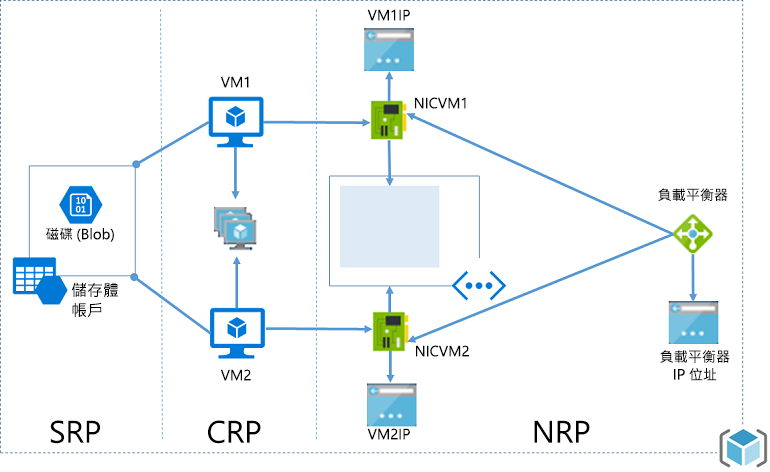
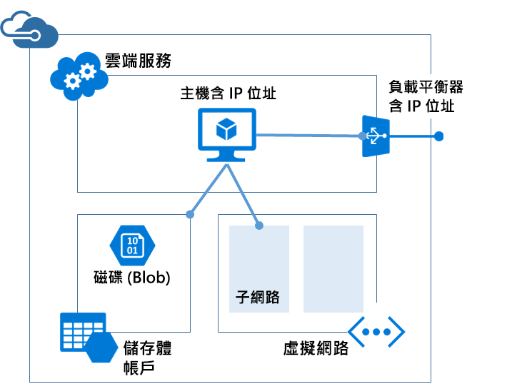

# <a name="azure-resource-manager-vs-classic-deployment-understand-deployment-models-and-the-state-of-your-resources"></a>Azure Resource Manager vs. 傳統部署：了解資源的部署模型和狀態
本主題中，您會了解 Azure Resource Manager 和傳統部署模型、您的資源的狀態，以及您的資源相互部署的原因。 Resource Manager 和傳統部署模型代表部署和管理 Azure 解決方案的兩個不同方式。 您會透過兩個不同的 API 集使用它們，而所部署的資源可能包含重要的差異。 兩個模型彼此無法完全相容。 本主題說明這些差異。

為了簡化資源的部署和管理，Microsoft 建議您針對所有新資源使用 Resource Manager。 可能的話，Microsoft 建議您透過 Resource Manager 重新部署現有的資源。

如果您是 Resource Manager 的新使用者，您可能想要先檢閱 [Azure Resource Manager 概觀](resource-group-overview.md)中定義的詞彙。

## <a name="history-of-the-deployment-models"></a>部署模型的歷程記錄
Azure 原本指提供傳統部署模型。 在此模型中，每個資源會獨立存在；沒辦法將相關的資源群組在一起。 因此，您必須手動追蹤哪些資源組成您的解決方案或應用程式，並記得要以協調的方法進行管理。 若要部署解決方案，您必須透過傳統入口網站個別建立每個資源，或建立會以正確的順序部署所有資源的指令碼。 若要刪除解決方案，您必須個別刪除每個資源。 您無法輕易套用和更新相關資源的存取控制原則。 最後，您無法將標記套用至資源，以可協助您監視資源和管理計費的詞彙標示資源。

在 2014 年，Azure 引進了新增資源群組概念的 Resource Manager。 資源群組是共用共同生命週期的資源容器。 「資源管理員」部署模型提供數個優點：

* 您可以以群組形式部署、管理及監視方案的所有服務，而不是個別處理這些服務。
* 您可以在整個生命週期中重複部署方案，並確信您的資源會以一致的狀態部署。
* 您可以將存取控制套用至資源群組中的所有資源，而新資源加入至資源群組時，會自動套用這些原則。
* 您可以將標籤套用至資源，以便以邏輯方式組織訂用帳戶中的所有資源。
* 您可以使用 JavaScript 物件標記法 (JSON) 來定義您的解決方案的基礎結構。 JSON 檔案也稱為 Resource Manager 範本。
* 您可以定義之間的相依性，使得以正確的順序部署資源。

加入資源管理員時，所有資源會追溯地加入至預設資源群組。 如果您現在透過傳統部署建立資源，資源會自動在該服務的預設資源群組內建立，即使您在部署時未指定該資源群組。 不過，只是存在於資源群組內並不表示該資源已轉換成資源管理員模型。 我們將在下一節中說明每個服務如何處理這兩種部署模型。 

## <a name="understand-support-for-the-models"></a>了解模型支援
決定要用於您的資源的部署模型時，請留意以下三個案例︰

1. 服務支援 Resource Manager 且只提供單一類型。
2. 服務支援 Resource Manager，但提供兩個類型 - 一個用於 Resource Manager，一個用於傳統。 此案例只適用於虛擬機器、儲存體帳戶和虛擬網路。
3. 服務不支援 Resource Manager。

若要探索服務是否支援 Resource Manager，請參閱 [Resource Manager 支援的提供者](resource-manager-supported-services.md)。

如果您想要使用的服務不支援 Resource Manager，您必須繼續使用傳統部署。

如果服務支援 Resource Manager 且 **不是** 虛擬機器、儲存體帳戶或虛擬網路，您可以直接使用 Resource Manager。

若為虛擬機器、儲存體帳戶和虛擬網路，如果資源是透過傳統部署建立，您必須繼續透過傳統作業來運作。 如果虛擬機器、儲存體帳戶或虛擬網路是透過 Resource Manager 部署建立，您必須繼續使用 Resource Manager 作業。 當您的訂用帳戶包含透過 Resource Manager 和傳統部署建立的各種資源時，此區別可能讓您困惑。 此資源的組合可能建立非預期的結果，因為資源不支援相同的作業。

在某些情況下，Resource Manager 命令可以擷取透過傳統部署建立之資源的相關資訊，或可以執行系統管理工作 (例如將傳統資源移至另一個資源群組)。 但這些情況下，不應讓您認為該類型支援 Resource Manager 作業。 例如，假設您的資源群組包含使用傳統部署所建立的虛擬機器。 若您執行下列 Resource Manager PowerShell 命令：

```powershell
Get-AzureRmResource -ResourceGroupName ExampleGroup -ResourceType Microsoft.ClassicCompute/virtualMachines
```

它會傳回虛擬機器：

```powershell
Name              : ExampleClassicVM
ResourceId        : /subscriptions/{guid}/resourceGroups/ExampleGroup/providers/Microsoft.ClassicCompute/virtualMachines/ExampleClassicVM
ResourceName      : ExampleClassicVM
ResourceType      : Microsoft.ClassicCompute/virtualMachines
ResourceGroupName : ExampleGroup
Location          : westus
SubscriptionId    : {guid}
```

不過， **Get-AzureRmVM** 只會傳回透過 Resource Manager 部署的虛擬機器。 下列命令不會傳回透過傳統部署所建立的虛擬機器。

```powershell
Get-AzureRmVM -ResourceGroupName ExampleGroup
```

只有透過資源管理員建立的資源支援標記。 您無法將標籤套用到傳統資源。

## <a name="resource-manager-characteristics"></a>資源管理員特性
為了協助您了解兩個模型，讓我們來檢閱 Resource Manager 類型的特性︰

* 透過 [Azure 入口網站](https://portal.azure.com/)建立。
  
     
  
     針對計算、儲存體及網路資源，您可以選擇使用資源管理員或傳統部署。 選擇 **資源管理員**。
  
     
* 使用 Azure PowerShell Cmdlet 的 Resource Manager 版本建立。 這些命令的格式是 *Verb-AzureRmNoun*。

  ```powershell
  New-AzureRmResourceGroupDeployment
  ```

* 透過適用於 REST 作業的 [Azure Resource Manager REST API](https://docs.microsoft.com/rest/api/resources/) 建立。
* 透過在 **arm** 模式中執行的 Azure CLI 命令建立。
  
  ```azurecli
  azure config mode arm
  azure group deployment create
  ```

* 資源類型的名稱中不包括 **(傳統)** 。 下圖顯示的類型為**儲存體帳戶**。
  
    

## <a name="classic-deployment-characteristics"></a>傳統部署特性
您可能也知道傳統部署模型也就是服務管理模型。

在傳統部署模型中建立的資源都具有下列特性：

* 透過 [傳統入口網站](https://manage.windowsazure.com)
  
     
  
     或者，安裝 Azure 入口網站並指定進行 **傳統** 部署 (範圍包括計算、儲存體及網路)
  
     
* 透過 Azure PowerShell cmdlet 的服務管理版本建立。 這些命令名稱的格式是 *Verb-AzureNoun*。

  ```powershell
  New-AzureVM
  ```

* 透過 REST 作業的 [服務管理 REST API](https://msdn.microsoft.com/library/azure/ee460799.aspx) 建立。
* 透過在 **asm** 模式中執行的 Azure CLI 命令建立。

  ```azurecli
  azure config mode asm
  azure vm create
  ```
   
* 資源類型的名稱中包括 **(傳統)** 。 下圖顯示的類型為**儲存體帳戶 (傳統)**。
  
    

您可以使用 Azure 入口網站，來管理透過傳統部署所建立的資源。

## <a name="changes-for-compute-network-and-storage"></a>計算、網路和儲存體的變更
下圖顯示部署透過 Resource Manager 的計算、網路和儲存體資源。



請注意資源之間的下列關聯性：

* 資源群組內存在的所有資源。
* 虛擬機器取決於定義於儲存體資源提供者的特定儲存體帳戶，以將其磁碟儲存於 Blob 儲存體中。
* 虛擬機器會參考定義於網路資源提供者的特定 NIC (必要)，以及定義於計算資源提供者的可用性設定組 (選擇性)。
* NIC 會參考虛擬機器指派的 IP 位址 (必要)、虛擬機器之虛擬網路的子網路 (必要)，以及網路安全性群組 (選擇性)。
* 虛擬網路內的子網路會參考網路安全性群組 (選擇性)。
* 負載平衡器執行個體會參考 IP 位址的後端集區，其中包含虛擬機器的 NIC (選擇性)，以及參考負載平衡器的公用或私人 IP 位址 (選擇性)。

以下是傳統部署的元件及其關聯性：



裝載虛擬機器的傳統解決方案包括：

* 用來做為裝載虛擬機器 (計算) 之容器所需的雲端服務。 虛擬機器是利用網路介面卡 (NIC) 和 Azure 所指派的 IP 位址自動提供。 此外，雲端服務包含外部負載平衡器執行個體、共用 IP 位址及預設端點，以允許 Windows 架構虛擬機器的遠端桌面與遠端 PowerShell 流量，以及 Linux 架構虛擬機器的安全殼層 (SSH) 流量。
* 儲存虛擬機器之 VHD 所需的儲存體帳戶，包括作業系統、暫存磁碟及其他資料磁碟 (儲存體)。
* 可用來做為額外容器的選擇性虛擬網路，您可以在其中建立子網路的結構，並指定虛擬機器所在的子網路 (網路)。

下表描述計算、網路和儲存體資源提供者互動方式的變更：

| 項目 | 傳統 | Resource Manager |
| --- | --- | --- |
| 虛擬機器的雲端服務 |雲端服務是一種容器，專門保管那些要求平台和負載平衡可用性的虛擬機器。 |使用新模型建立虛擬機器時，雲端服務已經不是必要的物件了。 |
| 虛擬網路 |虛擬網路是虛擬機器的選用項目。 如果包含，即無法使用 Resource Manager 部署虛擬網路。 |虛擬機器需要已使用 Resource Manager 部署的虛擬網路。 |
| 儲存體帳戶 |虛擬機器需要能儲存作業系統的 VHD、暫存磁碟及其他資料磁碟的儲存體帳戶。 |虛擬機器需要儲存體帳戶，才能將其磁碟儲存在 Blob 儲存體。 |
| 可用性設定組 (Availability Sets) |在虛擬機器上設定相同的 "AvailabilitySetName" 之後，即表示平台的可用性。 容錯網域的最大個數為 2。 |「可用性設定組」是 Microsoft.Compute 提供者公開的資源。 需要高可用性的虛擬機器必須包含在「可用性設定組」中。 容錯網域的最大個數現在是 3。 |
| 同質群組 |建立虛擬網路時需要同質群組。 不過，隨著區域虛擬網路引進，就再也不需要了。 |簡而言之，透過 Azure Resource Manager 而公開的 API，其實不存在同質群組這種概念。 |
| 負載平衡 |雲端服務的建立，為部署的虛擬機器提供隱含的負載平衡器。 |負載平衡器是 Microsoft.Network 提供者所公開的資源。 虛擬機器如果需要平衡負載，其主要網路介面應該參考負載平衡器。 負載平衡器可以放在內部或外部。 負載平衡器執行個體會參考 IP 位址的後端集區，其中包含虛擬機器的 NIC (選擇性)，以及參考負載平衡器的公用或私人 IP 位址 (選擇性)。 [閱讀更多。](../virtual-network/resource-groups-networking.md) |
| 虛擬 IP 位址 |將 VM 新增到雲端服務後，雲端服務會得到預設的 VIP (虛擬 IP 位址)。 虛擬 IP 位址是隱含性負載平衡器的相關位址。 |公用 IP 位址是 Microsoft.Network 提供者所公開的資源。 公用 IP 位址可以是靜態 (保留) 或動態。 動態公用 IP 可以指派至負載平衡器。 使用安全性群組可以保護公用 IP。 |
| 保留 IP 位址 |您可以將 IP 位址保留在 Azure 中，然後與雲端服務建立關聯，確保 IP 位址不會變動。 |您可以在「靜態」模式中建立公用 IP 位址，然後它就具備「保留的 IP 位址」一樣的功能。 靜態公用 IP 現在只能指派至負載平衡器。 |
| 每一個 VM 的公用 IP 位址 (PIP) |公用 IP 位址也可以直接與 VM 建立關聯。 |公用 IP 位址是 Microsoft.Network 提供者所公開的資源。 公用 IP 位址可以是靜態 (保留) 或動態。 不過，只有動態公用 IP 才可以指派至網路介面，以立即取得每一個 VM 的公用 IP。 |
| 端點 |輸入端點需要在開放特定連接埠連線的虛擬機器上設定。 設定輸入端點之後，就能完成幾個常見的虛擬機器連線模式之一。 |您可以在負載平衡器上設定「傳入 NAT 規則」，以達到啟用特定連接埠上的端點以連線至 VM 的相同功能。 |
| DNS 名稱 |雲端服務會取得隱含的全域唯一 DNS 名稱。 例如： `mycoffeeshop.cloudapp.net`。 |DNS 名稱是可以在公用 IP 位址資源上指定的選用參數。 FQDN 的格式如下 - `<domainlabel>.<region>.cloudapp.azure.com`。 |
| 網路介面 |主要和次要網路介面與其屬性會定義為虛擬機器的網路組態。 |網路介面是 Microsoft.Network 提供者所公開的資源。 網路介面的生命週期與虛擬機器無關。 它會參考虛擬機器指派的 IP 位址 (必要)、虛擬機器之虛擬網路的子網路 (必要)，以及網路安全性群組 (選擇性)。 |

若要了解從不同部署模型連接虛擬網路，請參閱[在入口網站中從不同部署模型連接虛擬網路](../vpn-gateway/vpn-gateway-connect-different-deployment-models-portal.md)。

## <a name="migrate-from-classic-to-resource-manager"></a>從傳統移轉至 Resource Manager
如果您準備好將資源從傳統部署移轉至 Resource Manager 部署，請參閱：

1. [平台支援的從傳統移轉至 Azure Resource Manager 的技術深入探討](../virtual-machines/virtual-machines-windows-migration-classic-resource-manager-deep-dive.md)
2. [支援將 IaaS 資源從傳統移轉至 Azure Resource Manager 的平台](../virtual-machines/virtual-machines-windows-migration-classic-resource-manager.md)
3. [使用 Azure PowerShell 將 IaaS 資源從傳統移轉至 Azure Resource Manager](../virtual-machines/virtual-machines-windows-ps-migration-classic-resource-manager.md)
4. [使用 Azure CLI 將 IaaS 資源從傳統移轉至 Azure Resource Manager](../virtual-machines/virtual-machines-linux-cli-migration-classic-resource-manager.md)

## <a name="frequently-asked-questions"></a>常見問題集
**我可以使用 Azure Resource Manager 來建立虛擬機器，以在使用傳統部署所建立的虛擬網路中進行部署嗎？**

不支援此做法。 您無法使用 Azure Resource Manager 來將虛擬機器部署到使用傳統部署建立的虛擬網路。

**我可以使用 Azure Resource Manager 透過使用 Azure Service 管理 API 建立的使用者映像建立虛擬機器嗎？**

不支援此做法。 不過，您可以複製使用 Service Management API 所建立之儲存體帳戶中的 VHD 檔案，並將檔案複製到透過 Azure Resource Manager 建立的新帳戶。

**對訂閱的配額有何影響？**

虛擬機器、虛擬網路和透過新 Azure Resource Manager API 建立的儲存體帳戶的配額，與其他配額是分開的。 每個訂用帳戶會得到配額，然後就可以使用新的 API 建立資源。 如需其他配額的詳細資訊，請參閱 [這裡](../azure-subscription-service-limits.md)。

**我可以透過 Resource Manager API，繼續使用自動指令碼佈建虛擬機器、虛擬網路、儲存體帳戶嗎？**

所有您建立的自動化和指令碼，仍然適用於 Azure 服務管理模式下建立的現有虛擬機器和虛擬網路。 不過，您必須更新指令碼，才能使用新的結構描述並透過 Resource Manager 模式建立相同的資源。

**哪裡可以找到 Azure Resource Manager 範本的範例？**

一組完整的入門範本可在 [Azure 資源管理員快速入門範本](https://azure.microsoft.com/documentation/templates/)中找到。

## <a name="next-steps"></a>後續步驟
* 針對定義虛擬機器、儲存體帳戶和虛擬網路的範本，若需該範本的建立逐步解說，請參閱 [Resource Manager 範本逐步解說](resource-manager-template-walkthrough.md)。
* 若要查看部署範本的命令，請參閱 [使用 Azure 資源管理員範本部署應用程式](resource-group-template-deploy.md)。


<!--HONumber=Nov16_HO3-->


