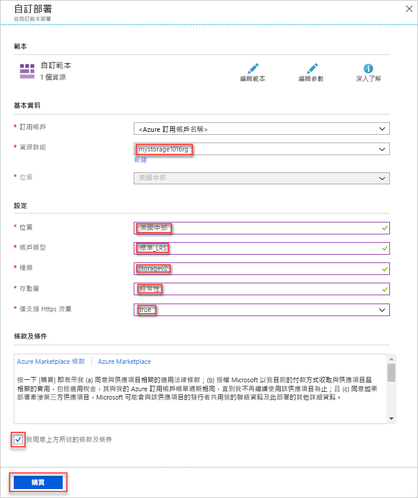
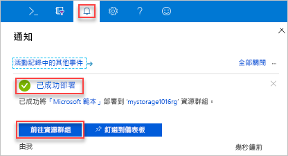
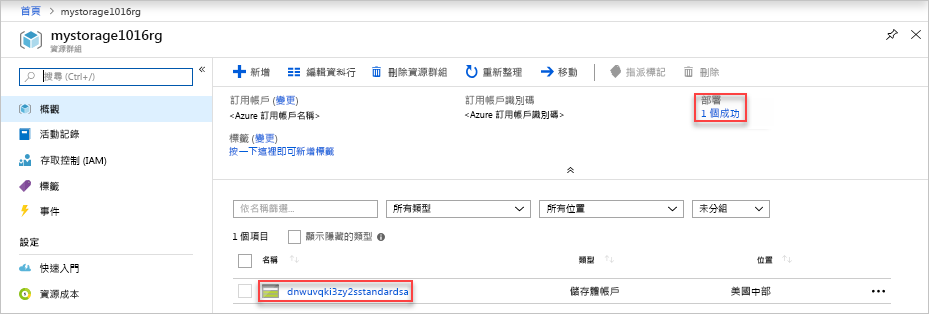

# <a name="quickstart-create-and-deploy-azure-resource-manager-templates-by-using-the-azure-portal"></a>快速入門：使用 Azure 入口網站建立及部署 Azure Resource Manager 範本

了解如何使用 Azure 入口網站產生並建立您的第一個 Azure Resource Manager 範本，以及從 Azure 入口網站編輯和部署該範本的程序。 Resource Manager 範本是 JSON 檔案，該檔案定義您需要為您的解決方案部署的資源。 本教學課程中的指示會建立 Azure 儲存體帳戶。 您可以使用相同的程序來建立其他 Azure 資源。

如果您沒有 Azure 訂用帳戶，請在開始之前先[建立免費帳戶](https://azure.microsoft.com/free/)。

## <a name="generate-a-template-using-the-portal"></a>使用入口網站產生範本

在本節中，您會使用 Azure 入口網站建立儲存體帳戶。 在部署儲存體帳戶之前，您可以選擇根據組態瀏覽入口網站所產生的範本。 您可以儲存範本，並在未來重複加以使用。

1. 登入 [Azure 入口網站](https://portal.azure.com)。
2. 選取 [建立資源] > [儲存體] > [儲存體帳戶 - Blob、檔案、資料表、佇列]。

    
3. 輸入以下資訊： 

    - **資源群組**：以您選擇的名稱建立新的 Azure 資源群組。 在螢幕擷取畫面上，資源群組名稱為 mystorage1016rg。
    - **名稱**：為儲存體帳戶指定唯一名稱。 在螢幕擷取畫面上，名稱為 mystorage1016。

    您可以對其餘屬性使用預設值。

    

    > [!NOTE]
    > 部分已匯出的範本必須先進行某些編輯才可供部署。

4. 選取螢幕底部的 [檢閱 + 建立]。 
5. 選取螢幕底部的 [下載範本以便自動化]。 入口網站會顯示所產生的範本：

    

    主窗格會顯示範本。 這是具有四個最上層元素的 JSON 檔案 - `schema`、`contentVersion`、`parameters` 和 `resources`。 如需詳細資訊，請參閱[了解 Azure Resource Manager 範本的結構和語法](./resource-group-authoring-templates.md)

    已定義六個參數。 其中一個稱為**storageAccountName**。 第二個醒目提示的部分會示範如何使用範本中的這個參數。 在下一節中，您會編輯此範本，以使用為儲存體帳戶所產生的名稱。

    範本中已定義一個 Azure 資源。 類型為 [Microsoft.Storage/storageAccounts]。 請參閱該資源的定義方式，以及定義結構。
6. 選取 [下載]。 將已下載套件中的 **template.json** 儲存到您的電腦。 在下一節中，您會使用範本部署工具來編輯範本。
7. 選取 [參數] 索引標籤，查看您所提供的參數值。 記下這些值，您在下一節中部署範本時需要用到。

    

    您可以同時使用範本和參數檔案，來建立 Azure 儲存體帳戶。

## <a name="edit-and-deploy-the-template"></a>編輯和部署範本

Azure 入口網站可用來執行一些基本範本編輯作業。 在本快速入門中，您會使用名為「範本部署」的入口網站工具。 若要編輯更複雜的範本，請考慮使用提供更多樣化編輯功能的 [Visual Studio Code](./resource-manager-quickstart-create-templates-use-visual-studio-code.md)。

Azure 會要求每個 Azure 服務都必須有唯一名稱。 如果您輸入已存在的儲存體帳戶名稱，部署將會失敗。 若要避免發生此問題，您可以使用範本函式呼叫 `uniquestring()` 來產生唯一的儲存體帳戶名稱。

1. 在 Azure 入口網站中，選取 [建立資源]。
2. 在 [搜尋 Marketplace] 中，輸入**範本部署**，然後按 **ENTER**。
3. 選取 [範本部署]。

    
4. 選取 [建立] 。
5. 選取 [在編輯器中組建您自己的範本]。
6. 選取 [載入檔案]，然後依照指示來載入您在上一節中下載的 template.json。
7. 新增一個變數，如下列螢幕擷取畫面所示：

    ```json
    "storageAccountName": "[concat(uniquestring(resourceGroup().id), 'standardsa')]"
    ```
    

    此處使用兩個函式：`concat()` 和 `uniqueString()`。

8. 移除在先前的螢幕擷取畫面中醒目提示的 **storageAccountName** 參數。
9. 更新 **Microsoft.Storage/storageAccounts** 資源的名稱元素，以使用新定義的變數，而不使用參數：

    ```json
    "name": "[variables('storageAccountName')]",
    ```

    最終範本應顯示如下：

    ```json
    {
        "$schema": "http://schema.management.azure.com/schemas/2015-01-01/deploymentTemplate.json#",
        "contentVersion": "1.0.0.0",
        "parameters": {
            "location": {
                "type": "string"
            },
            "accountType": {
                "type": "string"
            },
            "kind": {
                "type": "string"
            },
            "accessTier": {
                "type": "string"
            },
            "supportsHttpsTrafficOnly": {
                "type": "bool"
            }
        },
        "variables": {
            "storageAccountName": "[concat(uniquestring(resourceGroup().id), 'standardsa')]"
        },
        "resources": [
            {
                "name": "[variables('storageAccountName')]",
                "type": "Microsoft.Storage/storageAccounts",
                "apiVersion": "2018-07-01",
                "location": "[parameters('location')]",
                "properties": {
                    "accessTier": "[parameters('accessTier')]",
                    "supportsHttpsTrafficOnly": "[parameters('supportsHttpsTrafficOnly')]"
                },
                "dependsOn": [],
                "sku": {
                    "name": "[parameters('accountType')]"
                },
                "kind": "[parameters('kind')]"
            }
        ],
        "outputs": {}
    }
    ```
7. 選取 [ **儲存**]。
8. 輸入下列值：

    - **資源群組**：將您的資源群組命名為唯一名稱。
    - **位置**：選取資源群組的位置。
    - **位置**：選取儲存體帳戶的位置。  您可以使用與資源群組相同的位置。
    - **帳戶類型**：在本快速入門中請輸入 **Standard_LRS**。
    - **種類**：在本快速入門中輸入 **StorageV2**。
    - **存取層**：在本快速入門中輸入 **Hot**。
    - **僅啟用 HTTPS 流量**。  在本快速入門中請選取 **true**。
    - **我同意上方所述的條款及條件**：(選取)

    以下是範例部署的螢幕擷取畫面：

    

10. 選取 [購買]。
11. 從畫面頂端選取鈴鐺圖示 (通知)，以查看部署狀態。 請等候部署完成。

    

12. 在 [通知] 窗格中選取 [移至資源群組]。 您應該會看到類似下方的畫面：

    

    您可以看到部署狀態為成功，且資源群組中只有一個儲存體帳戶。 儲存體帳戶名稱是範本所產生的唯一字串。 若要深入了解如何使用 Azure 儲存體帳戶，請參閱[快速入門：使用 Azure 入口網站上傳、下載及列出 Blob](../storage/blobs/storage-quickstart-blobs-portal.md)。

## <a name="clean-up-resources"></a>清除資源

不再需要 Azure 資源時，可藉由刪除資源群組來清除您所部署的資源。

1. 在 Azure 入口網站中，選取左側功能表上的 [資源群組]。
2. 在 [依名稱篩選] 欄位中輸入資源群組名稱。
3. 選取資源群組名稱。  您應該會看到資源群組中的儲存體帳戶。
4. 選取頂端功能表中的 [刪除資源群組]。

## <a name="next-steps"></a>後續步驟

在本教學課程中，您已了解如何從 Azure 入口網站產生範本，以及如何使用入口網站部署範本。 本快速入門中使用的範本，是具有單一 Azure 資源的簡單範本。 如果是複雜的範本，則使用 Visual Studio Code 或 Visual Studio 會較容易開發範本。 下一個快速入門也會說明如何使用 Azure PowerShell 和 Azure 命令列介面 (CLI) 來部署範本。

> [!div class="nextstepaction"]
> [使用 Visual Studio Code 建立範本](./resource-manager-quickstart-create-templates-use-visual-studio-code.md)
