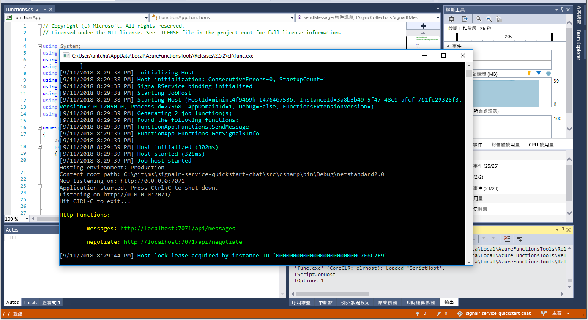

# <a name="quickstart-create-a-chat-room-with-azure-functions-and-signalr-service-using-c"></a>快速入門：使用 C\# 搭配 Azure Functions 與 SignalR 服務來建立聊天室

Azure SignalR 服務可讓您輕鬆地新增即時功能到您的應用程式。 Azure Functions 是無伺服器平台，可讓您在不需要管理任何基礎結構的情況下執行您的程式碼。 在此快速入門中，了解如何使用 SignalR 服務與 Functions 來建置無伺服器的即時聊天應用程式。

## <a name="prerequisites"></a>必要條件

如果尚未安裝 Visual Studio 2017，您可以下載並使用**免費的** [Visual Studio 2017 Community 版本](https://www.visualstudio.com/downloads/)。 務必在 Visual Studio 設定期間啟用 **Azure 開發**。

您也可以使用 [Azure Functions Core Tools (v2)](https://github.com/Azure/azure-functions-core-tools#installing)、[.NET Core SDK](https://dotnet.microsoft.com/download) 和您慣用的程式碼編輯器，在命令列上 (macOS、Windows 或 Linux) 執行本教學課程。

[!INCLUDE [quickstarts-free-trial-note](../../includes/quickstarts-free-trial-note.md)]

## <a name="log-in-to-azure"></a>登入 Azure

使用您的 Azure 帳戶登入 Azure 入口網站 (<https://portal.azure.com/>)。

[!INCLUDE [Create instance](includes/signalr-quickstart-create-instance.md)]

[!INCLUDE [Clone application](includes/signalr-quickstart-clone-application.md)]

## <a name="configure-and-run-the-azure-function-app"></a>設定及執行 Azure Function 應用程式

1. 啟動 Visual Studio (或其他的程式碼編輯器)，並開啟複製之存放庫的 *src/chat/csharp* 資料夾中的方案。

1. 在開啟 Azure 入口網站的瀏覽器中，透過在入口網站頂端的搜尋方塊中搜尋您稍早部署的 SignalR 服務執行個體名稱，以確認該執行個體已成功建立。 選取該執行個體以開啟它。

    

1. 選取 [金鑰] 以檢視 SignalR 服務執行個體的連接字串。

1. 選取並複製主要連接字串。

1. 返回 Visual Studio，在 [方案總管] 中，將 *local.settings.sample.json* 重新命名為 *local.settings.json*。

1. 在 **local.settings.json** 中，將連接字串貼到 **AzureSignalRConnectionString** 設定的值中。 儲存檔案。

1. 開啟 **Functions.cs**。 此函數應用程式中有兩個 HTTP 觸發的函式：

    - **GetSignalRInfo** - 使用 *SignalRConnectionInfo* 輸入繫結來產生並傳回有效的連線資訊。
    - **SendMessage** - 在要求主體中接收聊天訊息，並使用 *SignalR* 輸出繫結來將訊息廣播給所有已連線的用戶端應用程式。

1. 請使用下列其中一個選項在本機啟動 Azure 函式應用程式。

    - **Visual Studio**：在 [偵錯] 功能表中，選取 [開始偵錯] 以執行應用程式。

        

    - **命令列**：執行下列命令以啟動函式主機。

        ```bash
        func start
        ```

[!INCLUDE [Run web application](includes/signalr-quickstart-run-web-application.md)]

[!INCLUDE [Cleanup](includes/signalr-quickstart-cleanup.md)]

## <a name="next-steps"></a>後續步驟

在此快速入門中，您已在 Visual Studio 中建置並執行即時無伺服器應用程式。 接下來，深入了解如何使用 Visual Studio 來開發和部署 Azure Functions。

> [!div class="nextstepaction"]
> [使用 Visual Studio 來開發 Azure Functions](../azure-functions/functions-develop-vs.md)