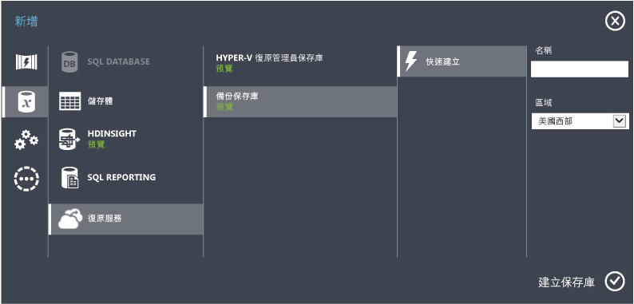
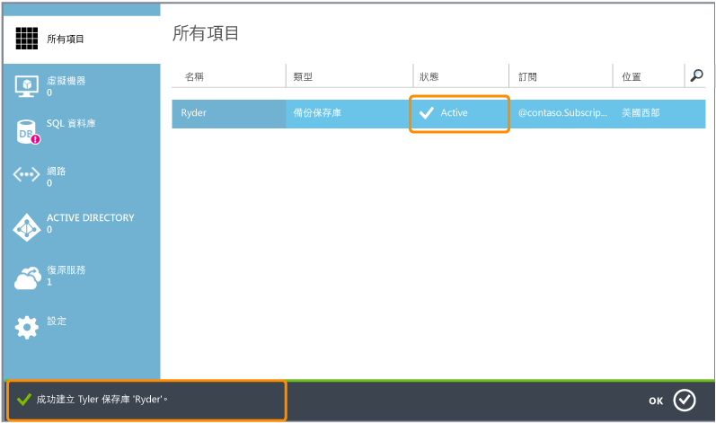
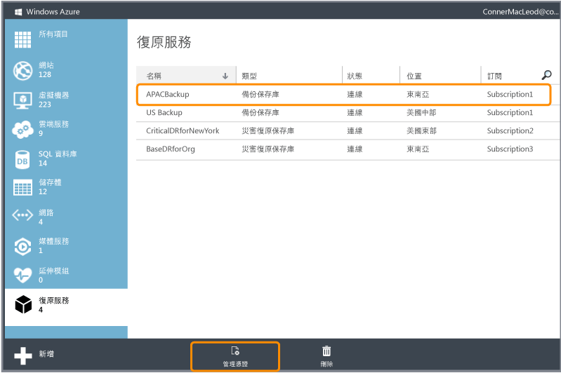
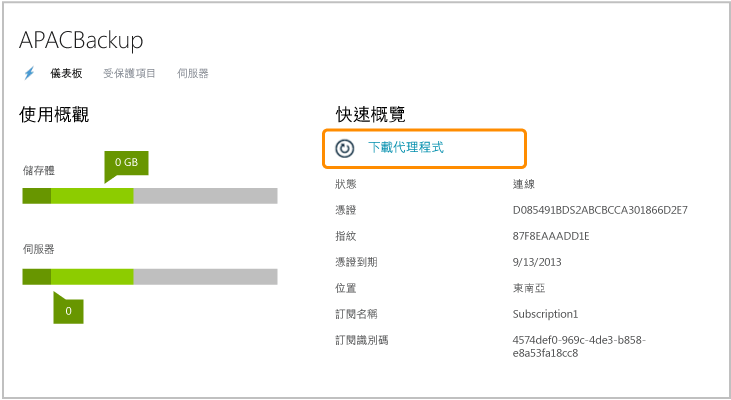
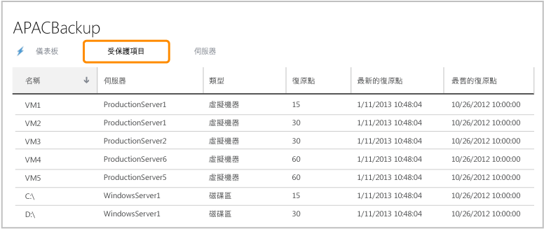

<properties  linkid="manage-services-recovery-configure-backup-vault" urlDisplayName="Configure a Backup Vault" pageTitle="Configure Azure Recovery Services to quickly and easily back-up Windows Server" metaKeywords="disaster recovery" description="Use this tutorial to learn how to use the Backup service in Microsoft's Azure cloud offering to back up Windows Server to the cloud." metaCanonical="" services="recovery-services" documentationCenter="" title="Configure Azure Backup to quickly and easily back-up Windows Server" authors="starra" solutions="" manager="cynthn" editor="tysonn" />

<h1>設定 Azure 備份以輕鬆迅速地備份 Windows Server</h1>

 
<strong>注意</strong>
 

若要完成此教學課程，您需要已啟用 Azure 備份功能的 Azure 帳戶。

<ul> 
<li>如果您沒有帳戶，只需要幾分鐘的時間就可以建立免費試用帳戶。如需詳細資訊，請參閱 <a  href="/en-us/pricing/free-trial/">Azure 免費試用</a>。</li> 
 
<li>如果您現已有帳戶，但需要啟用 Azure 備份預覽版，則請參閱<a  href="/en-us/develop/net/tutorials/create-a-windows-azure-account/#enable" target="_blank">啟用 Azure 預覽功能</a>。</li>
</ul>
 

在您要求加入備份預覽版方案之後，請等待您的狀態變成作用中。我們會自動核准所有客戶，因此這將不需要很長時間即可完成。
 

 若要將 Windows Server 中的檔案與資料備份至 Azure，您必須在要將這些資料儲存於的地區建立一個備份保存庫。本教學課程將逐步引導您建立要用來儲存備份的保存庫、將憑證上傳至該保存庫、安裝備份代理程式，並大致介紹可透過管理入口網站使用的備份管理工作。

 
<strong>開始之前</strong> 

若要順利完成本教學課程，您必須擁有 X.509 第 3 版憑證，才能向備份保存庫註冊您的伺服器。此憑證至少必須具有 2048 個位元的金鑰長度，而且應該位於您本機電腦的個人憑證存放區中。安裝到您伺服器上的憑證應該要包含憑證的私密金鑰。若要將憑證上傳至 Azure 管理入口網站，您必須將公用金鑰匯出為 .cer 格式檔案。
 

您可以使用：
 
<ul>
<li>自己用 makecert 工具建立的自我簽署憑證，或</li> 

<li>由 Microsoft 信任的憑證授權單位 (CA) 所簽發、且其根憑證是透過 Microsoft 根憑證計劃來配送的任何有效 SSL 憑證。如需此計劃的詳細資訊，請參閱 <a  href="http://go.microsoft.com/fwlink/p/?LinkId=294666">Windows 根憑證計劃成員 (機器翻譯)</a>。</li>
</ul> 

您需要確保憑證具有的其他一些屬性包括：
 

<ul>
<li>具有有效的 ClientAuthentication EKU</li>

<li>目前仍然有效，且有效期間不超過 3 年</li>  
</ul>

若要使用自我簽署憑證，請依照下列步驟執行： 

<ol>
<li>下載 <a  href="http://go.microsoft.com/fwlink/p/?LinkID=294662">憑證建立工具 (MakeCert.exe)</a> (英文)。</li>  

<li>以系統管理員權限開啟命令提示字元 (cmd.exe)，然後執行下列命令 （請將其中的 <i>CertificateName</i> 取代為憑證的名稱，並在 -e 之後指定憑證的實際到期日)：<code>makecert.exe -r -pe -n CN=CertificateName -ss my -sr localmachine -eku 1.3.6.1.5.5.7.3.2 -len 2048 -e 01/01/2016 CertificateName.cer</code></li>
</ol>

如果您要註冊的伺服器與用來建立憑證的伺服器不同，您需要匯出 .pfx 檔 (其中包含私密金鑰)、將它複製至要註冊的伺服器，然後將它匯入至該伺服器的個人憑證存放區。 

如需保存庫憑證上傳程序的逐步指示，以及關於匯出與匯入 .pfx 檔案的詳細資訊，請參閱<a  href="http://go.microsoft.com/fwlink/p/?LinkID=294662">管理保存庫憑證</a> (英文)。
 

 <h2>建立備份保存庫</h2>

1.  登入[管理入口網站][1]。
    
    [WACOM.INCLUDE [disclaimer](../includes/disclaimer.md)]

2.  按一下 **Recovery Services**、然後按一下 **新建**、指向 **備份保存庫**，然後按一下 **快速建立**。
    
    

3.  在 **名稱** 中，輸入易記名稱來識別備份保存庫。

4.  在 **地區** 中，選取備份保存庫的地區。

5.  在 **訂閱** 中，輸入要與備份保存庫搭配使用的 Azure 訂閱。

6.  按一下 **Create Backup vault**。
    
    要等備份保存庫建立好，可能需要一些時間。若要查看狀態，您可以隨時留意入口網站底部的通知。建立好備份保存庫之後，將有一則訊息告訴您已順立建立保存庫，而且該保存庫將以 **線上** 狀態列在復原服務的資源中。
    
    

<h2>上傳憑證</h2>

1.  登入[管理入口網站][1]。

2.  按一下 **Recovery Services**，再按一下憑證將會識別的備份保存庫名稱，然後按一下 **管理憑證**。
    
    

3.  在 **管理憑證** 對話方塊中，按一下 [Browse Your Computer]，以尋找要與此備份保存庫搭配使用的 .cer 檔案。
  <h2>下載並安裝備份代理程式</h2>
    

4.  登入[管理入口網站][1]。

5.  按一下 **Recovery Services**，然後按一下備份保存庫的名稱來檢視保存庫儀表板。

6.  按一下 **安裝代理程式**
    
    

7.  您將會看到一個對話方塊，您可以在其中選擇要下載的代理程式：
    * Agent for Windows Server 2012 and System Center 2012 SP1 - Data Protection Manager
    * Agent for Windows Server 2012 Essentials

8.  選取適當的代理程式。您將被重新導向至 Microsoft 下載中心來下載代理程式軟體。如需詳細資訊，請參閱：
    
    * [安裝 Azure Backup Agent for Windows Server 2012 and System Center 2012 SP1 - Data Protection Manager][2]
    * [安裝 Azure Backup Agent for Windows Server 2012 Essentials][3]

安裝好代理程式後，您就可以使用適當的本機管理介面 (例如 Microsoft Management Console 嵌入式管理單元、System Center Data Protection Manager 主控台，或 Windows Server Essentials 儀表板)，來設定伺服器的備份原則。

<h2>管理備份保存庫與伺服器</h2>

1.  登入[管理入口網站][1]。

2.  按一下 **Recovery Services**，然後按一下備份保存庫的名稱來檢視保存庫儀表板。您可以在其中執行下列工作：
    * **管理憑證**。用來更新先前上傳的憑證。
    * **刪除**。刪除目前的備份保存庫。如果您有不再使用的備份保存庫，可將之刪除來釋出儲存空間。只有在從保存庫中刪除了所有已註冊的伺服器之後，**刪除** 才會啟用。

3.  按一下 **受保護項目**，以檢視已從伺服器備份的項目。此清單僅做提供資訊之用。  
    

4.  按一下 **伺服器**，以檢視已註冊至此保存庫的伺服器名稱。您可以在其中執行下列工作：
    * **允許重新註冊**。為伺服器選取此選項時，您可以使用代理程式中的註冊精靈，再次向備份保存庫註冊伺服器。如果憑證中有錯誤，或必須重建伺服器，您可能需要重新註冊。每個伺服器名稱僅能重新註冊一次。
    * **刪除**。從備份保存庫中刪除伺服器。所有與該伺服器相關聯的已儲存資料都將立即刪除。
      
      

<h2>後續步驟</h2>

* 若要深入了解 Azure 備份，請參閱 [Azure 備份概觀][4] (英文)。

* 造訪 [Azure 備份論壇][5] (英文)。

[1]: https://manage.windowsazure.com
[2]: http://technet.microsoft.com/en-us/library/hh831761.aspx#BKMK_installagent
[3]: http://technet.microsoft.com/en-us/library/jj884318.aspx
[4]: http://go.microsoft.com/fwlink/p/?LinkId=222425
[5]: http://go.microsoft.com/fwlink/p/?LinkId=290933