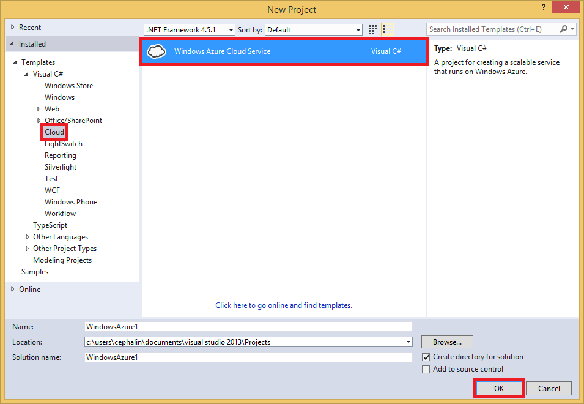
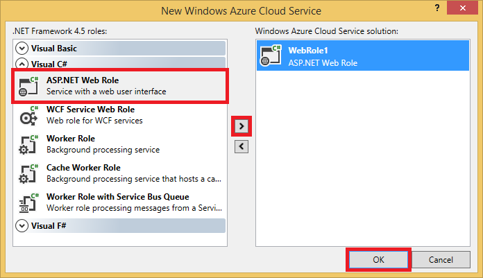
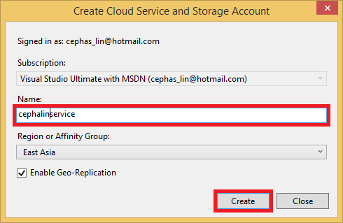
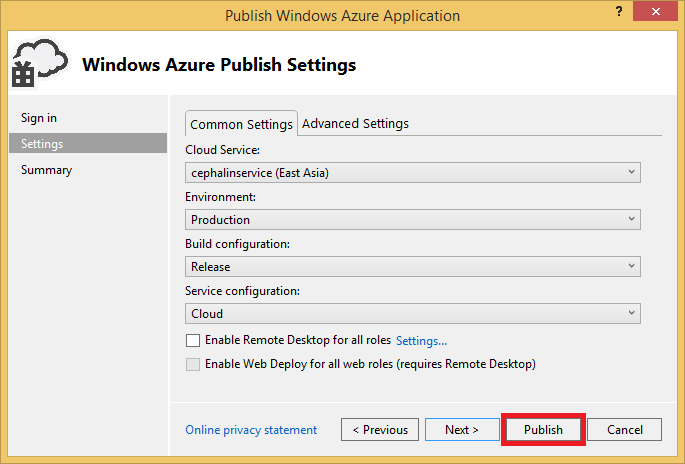
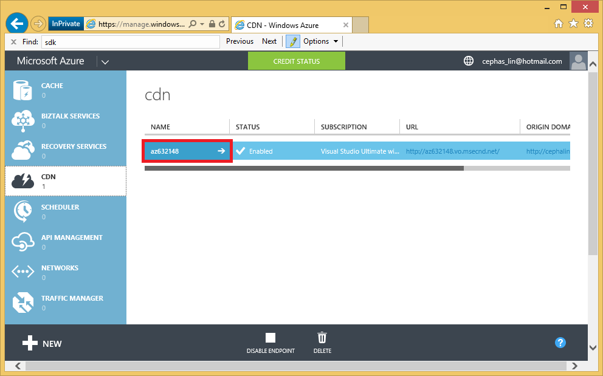
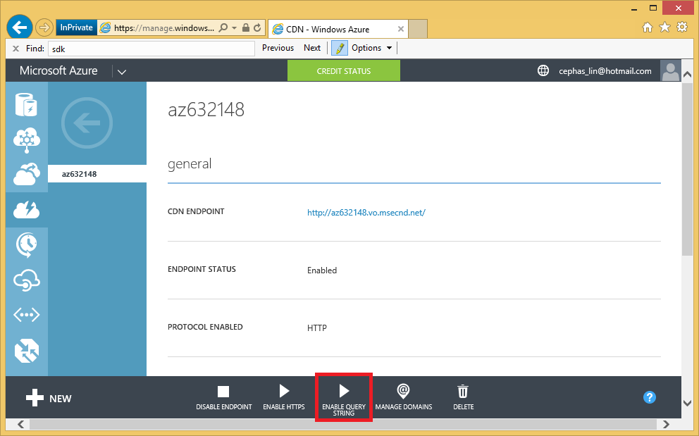
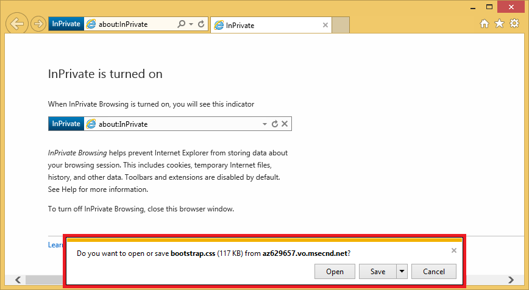
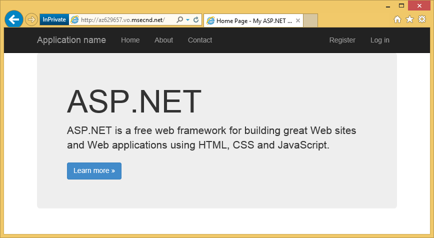
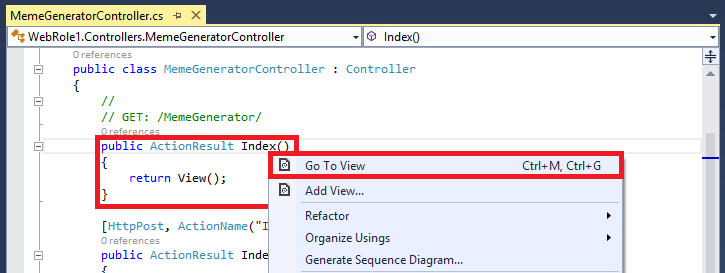
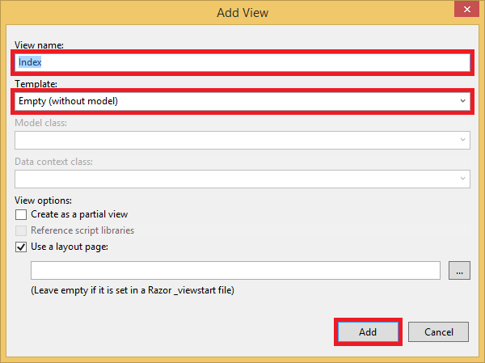

<properties urlDisplayName="Integrate a cloud service with Azure CDN" pageTitle="整合雲端服務與 Azure CDN" metaKeywords="Azure tutorial, Azure web app tutorial, ASP.NET, CDN, MVC, cloud service" description="教導您如何部署從整合式 Azure CDN 端點提供內容之雲端服務的教學課程" metaCanonical="" services="cdn,cloud-services" documentationCenter=".NET" title="Integrate a cloud service with Azure CDN" authors="cephalin" solutions="" manager="wpickett" editor="tysonn" />

<tags ms.service="cdn" ms.workload="tbd" ms.tgt_pltfrm="na" ms.devlang="dotnet" ms.topic="article" ms.date="10/02/2014" ms.author="cephalin" />

# 整合雲端服務與 Azure CDN #

雲端服務可以與 Azure CDN 整合，從雲端服務的 `~/CDN` 路徑提供任何內容。此方法提供下列優點：

- 輕鬆地在雲端服務的專案目錄中部署和更新影像、指令碼和樣式表
- 輕鬆地升級雲端服務中的 NuGet 套件，例如 jQuery 或 Bootstrap 版本 
- 完全從相同的 Visual Studio 介面來管理 Web 應用程式和 CDN 提供的內容
- Web 應用程式和 CDN 提供的內容採用統一的部署工作流程
- 整合 ASP.NET 統合和縮製與 Azure CDN

## 學習目標 ##

在本教學課程中，您將了解如何：

-	[整合 Azure CDN 端點與雲端服務，並從 Azure CDN 提供網頁的靜態內容] (#deploy)
-	[在雲端服務中設定靜態內容的快取設定](#caching)
-	[透過 Azure CDN 從控制器動作提供內容](#controller)
-	[透過 Azure CDN 提供統合和縮製的內容，同時保留 Visual Studio 中的指令碼偵錯體驗](#bundling)
-	[設定當 Azure CDN 離線時後援的指令碼和 CSS](#fallback) 

## 將建置的項目 ##

您將使用預設 ASP.NET MVC 範本來部署雲端服務 Web 角色、加入程式碼從整合式 Azure CDN 提供內容，例如影像、控制器動作結果及預設 JavaScript 和 CSS 檔案，也會撰寫程式碼來為 CDN 離線時提供的套件組合設定後援機制。

## 必要條件 ##

本教學課程有下列先決條件：

-	使用中的 [Microsoft Azure 帳戶](http://azure.microsoft.com/zh-tw/account/)
-	Visual Studio 2013 (含 [Azure SDK])(http://go.microsoft.com/fwlink/p/?linkid=323510&clcid=0x409)

  
  <h5>You need an Azure account to complete this tutorial:</h5>
  <ul>
    <li>You can <a href="http://azure.microsoft.com/zh-tw/pricing/free-trial/?WT.mc_id=A261C142F">open an Azure account for free</a> - You get credits you can use to try out paid Azure services, and even after they're used up you can keep the account and use free Azure services, such as Websites.</li>
    <li>You can <a href="http://azure.microsoft.com/zh-tw/pricing/member-offers/msdn-benefits-details/?WT.mc_id=A261C142F">activate MSDN subscriber benefits</a> - Your MSDN subscription gives you credits every month that you can use for paid Azure services.</li>
  <ul>

## 部署具有整合式 CDN 端點的雲端服務 ##

在本節中，您將在 Visual Studio 2013 中將預設 ASP.NET MVC 應用程式範本部署至雲端服務 Web 角色，然後將它與新的 CDN 端點整合。請遵循下列指示：

1. 在 Visual Studio 2013 中，從功能表列中移至 [檔案] > [新增] > [專案] > [雲端] > [Microsoft Azure 雲端服務]，以建立新的 Azure 雲端服務。命名並按一下 [確定]。

	

2. 選取 [ASP.NET Web 角色]，然後按一下 [>] 按鈕。按一下 [確定]。

	

3. 選取 [MVC]，按一下 [確定]。

	

4. 現在，將此 Web 角色發行至 Azure 雲端服務。在雲端服務專案上按一下滑鼠右鍵，然後選取 [發行]。

	

5. 如果您尚未登入 Microsoft Azure，請按一下 [登入] 按鈕。

	

6. 在登入頁面中，使用您用來啟用 Azure 帳戶的 Microsoft 帳戶登入。
7. 登入後，按 [下一步]。

	

8. 如果您未建立雲端服務或儲存體帳戶，Visual Studio 會協助您建立兩者。在 [建立雲端服務與帳戶] 對話方塊中，輸入想要的服務名稱。然後按一下 [建立]。

	

9. 在發行設定頁面中確認組態，然後按一下 [發行]。

	

	>[WACOM.NOTE] 雲端服務的發行程序會花費相當長的時間。[啟用所有 Web 角色的 Web Deploy] 選項可快速 (但暫時) 提供更新給 Web 角色，加速偵測您的雲端服務。如需有關此選項的詳細資訊，請參閱[使用 Azure Tools 發行雲端服務](http://msdn.microsoft.com/zh-tw/library/ff683672.aspx).

	當 [Windows Azure 活動記錄] 顯示發行狀態為 [已完成] 時，您將建立與此雲端服務整合的 CDN 端點。 

1. 若要建立 CDN 端點，請登入「Azure 管理入口網站」(http://manage.windowsazure.com/)。 
2. 按一下 [新增] > [應用程式服務] > [CDN] > [快速建立]。選取 [http://*&lt;servicename>*.cloudapp.net/cdn/]，然後按一下 [建立]。

	

	>[WACOM.NOTE] 建立 CDN 端點之後，Azure 入口網站會顯示其 URL 及與它整合的原始網域。不過，需要花費一些時間，新的 CDN 端點的設定才能完全傳播至所有 CDN 節點位置。 

	請注意，CDN 端點會繫結至雲端服務的路徑 **cdn/**。您可以在 [WebRole1] 專案中建立 [cdn] 資料夾，或使用 URL 重寫來刪除此路徑的所有連入連結。在本教學課程中，您將採取後者的作法。

3. 回到 Azure 入口網站，在 [CDN] 索引標籤中，按一下您剛建立之 CDN 端點的名稱。

	

3. 按一下 [啟用查詢字串]，以在 CDN 快取中啟用查詢字串。啟用此選項後，將以個別項目來快取以不同查詢字串存取的相同連結。

	

	>[WACOM.NOTE] 雖然本節教學課程並不需要啟用查詢字串，但為了方便起見，請儘早這樣做，因為此處的任何變更需要花費很長時間才能傳播至所有 CDN 節點，您不希望任何未啟用查詢字串的內容塞滿 CDN 快取 (稍後會討論更新 CDN 內容)。

3. Ping 您的 CDN 端點，確定已傳播至 CDN 節點。可能要等待將近 1 小時，Ping 才有回應。

	

2. 回到 Visual Studio 2013，開啟 [WebRole1] 專案中的 [Web.config]，將下列程式碼加入至 `<system.webServer>` 標記：  
	<pre class="prettyprint">
	&lt;system.webServer&gt;
	  <mark>&lt;rewrite&gt;
	    &lt;rules&gt;
	      &lt;rule name=&quot;RewriteIncomingCdnRequest&quot; stopProcessing=&quot;true&quot;&gt;
	        &lt;match url=&quot;^cdn/(.*)$&quot;/&gt;
	        &lt;action type=&quot;Rewrite&quot; url=&quot;{R:1}&quot;/&gt;
	      &lt;/rule&gt;
	    &lt;/rules&gt;
	  &lt;/rewrite&gt;</mark>
      ...
	&lt;/system.webServer&gt;
	</pre>

4. 重新發行雲端服務。在雲端服務專案上按一下滑鼠右鍵，然後選取 [發行]。

	

1. 當發行狀態為 [已完成] 時，開啟瀏覽器視窗並瀏覽至 **http://*&lt;cdnName>*.vo.msecnd.net/Content/bootstrap.css**。在我的設定中，此 URL 為：

		http://az632148.vo.msecnd.net/Content/bootstrap.css

	對應至 CDN 端點上的下列原始 URL：

		http://cephalinservice.cloudapp.net/cdn/Content/bootstrap.css

	當我的 Web 應用程式中經過 URL 重寫之後，實際放入 CDN 快取中的檔案為：

		http://cephalinservice.cloudapp.net/Content/bootstrap.css

	瀏覽至 **http://*&lt;cdnName>*.vo.msecnd.net/Content/bootstrap.css** 時，系統將提示您下載來自您發行之 Web 應用程式的 bootstrap.css。 

	

同樣地，您也可以直接從 CDN 端點，存取在 **http://*&lt;serviceName>*.cloudapp.net/** 的任何可公開存取的 URL。例如：

-	/Script 路徑中的 .js 檔案
-	/Content 路徑中的任何內容檔案
-	任何控制器/動作 
-	任何含有查詢字串的 URL (若 CDN 端點已啟用查詢字串的話)

實際上，以上述組態來說，您可以從 **http://*&lt;cdnName>*.vo.msecnd.net/** 託管整個雲端服務。如果我瀏覽至 **http://az632148.vo.msecnd.net/**，就會從 Home/Index 取得動作結果。

然而，這不表示透過 Azure CDN 來提供整個雲端服務一定是好辦法 (或通常是好辦法)。有幾點需要注意：

-	此作法需要公開整個網站，因為 Azure CDN 無法提供任何私人內容。
-	如果 CDN 端點因故離線 (不論是排定的維護或使用者錯誤)，則除非能夠將客戶重新導向至原始 URL **http://*&lt;serviceName>*.cloudapp.net/**，否則整個雲端服務都會離線。 
-	即使使用自訂的 Cache-Control 設定 (請參閱[在雲端服務中設定靜態檔案的快取選項](#caching))，CDN 端點也無法改善高度動態內容的效能。如果您嘗試從 CDN 端點載入首頁，如上所示，請注意，第一次載入預設首頁 (非常簡單的頁面) 至少需要 5 秒。設想，如果此頁面包含必須每分鐘更新的動態內容，客戶體驗有何影響。從 CDN 端點提供動態內容需要有較短的快取到期時間，這也說明 CDN 端點經常會發生快取遺漏。這會降低雲端服務的效能，也會折損 CDN 的效用。

替代方法是在雲端服務中依個別情況決定從 Azure CDN 提供什麼內容。總之，您已了解如何從 CDN 端點存取個別的內容檔案。我將在[透過 Azure CDN 從控制器動作提供內容](#controller)中，示範如何透過 CDN 端點提供特定的控制器動作。

您可以指定更嚴格的 URL 重寫規則，以限制可透過 CDN 端點存取的內容。例如，若要將 URL 重寫限制在 [\Scripts] 資料夾，請依下列方式變更上述重寫規則：   
<pre class="prettyprint">
&lt;rule name=&quot;RewriteIncomingCdnRequest&quot; stopProcessing=&quot;true&quot;&gt;
  &lt;match url=&quot;^cdn/<mark>Scripts/</mark>(.*)$&quot;/&gt;
  &lt;action type=&quot;Rewrite&quot; url=&quot;<mark>Scripts/</mark>{R:1}&quot;/&gt;
&lt;/rule&gt;
</pre>

## 在雲端服務中設定靜態檔案的快取選項 ##

利用雲端服務中的 Azure CDN 整合，您可以指定如何在 CDN 端點中快取靜態內容。若要這樣做，請從 Web 角色專案 (例如 WebRole1) 開啟 *Web.config*，將 `<staticContent>` 元素加入至 `<system.webServer>`。下列 XML 將快取設為 3 天過期。  
<pre class="prettyprint">
&lt;system.webServer&gt;
  <mark>&lt;staticContent&gt;
    &lt;clientCache cacheControlMode=&quot;UseMaxAge&quot; cacheControlMaxAge=&quot;3.00:00:00&quot;/&gt;
  &lt;/staticContent&gt;</mark>
  ...
&lt;/system.webServer&gt;
</pre>

這樣做時，雲端服務中的所有靜態檔案會在您的 CDN 快取中遵守相同規則。若要對快取設定進行更細微的控制，請將 *Web.config* 檔案加入至資料夾，並在該處新增您的設定。例如，將 *Web.config* 檔案加入至 [\Content] 資料夾，並以下列 XML 取代其內容：

	<?xml version="1.0"?>
	<configuration>
	  <system.webServer>
	    <staticContent>
	      <clientCache cacheControlMode="UseMaxAge" cacheControlMaxAge="15.00:00:00"/>
	    </staticContent>
	  </system.webServer>
	</configuration>

此設定會將 [\Content] 資料夾中的所有靜態檔案快取達 15 天。

如需有關如何設定 `<clientCache>` 元素的詳細資訊，請參閱[用戶端快取 &lt;clientCache>](http://www.iis.net/configreference/system.webserver/staticcontent/clientcache)。

在[透過 Azure CDN 從控制器動作提供內容](#controller)中，我也會示範如何在 CDN 快取中設定控制器動作結果的快取設定。

## 透過 Azure CDN 從控制器動作提供內容 ##

整合雲端服務 Web 角色與 Azure CDN 時，透過 Azure CDN 從控制器動作提供內容就非常簡單。[Maarten Balliauw](https://twitter.com/maartenballiauw) 在[使用 Windows Azure CDN 縮短網路延遲時間](http://channel9.msdn.com/events/TechDays/Techdays-2014-the-Netherlands/Reducing-latency-on-the-web-with-the-Windows-Azure-CDN)中，示範如何使用一個有趣的 MemeGenerator 控制器來進行這項操作，而不直接透過 Azure CDN 提供雲端服務 (如以上所示)。我在這裡簡單地重述一次。

假設您想在雲端服務中利用查克羅禮士 (Chuck Norris) 年輕時的一張相片 ([Alan Light](http://www.flickr.com/photos/alan-light/218493788/) 拍攝) 來引起網路瘋傳：

您有一個簡單的 `Index` 動作可讓客戶在相片上指定笑梗，再傳給此動作來引起網路瘋傳。因為是查克羅禮士，您預期此頁面一定會在全球造成一股旋風。這就是利用 Azure CDN 來提供半動態內容的一個最佳例子。 

請依照上述步驟來設定此控制器動作：

1. 在 [\Controllers] 資料夾中，建立一個稱為 *MemeGeneratorController.cs* 的新 .cs 檔案，並以下列程式碼取代其內容。請務必以您的 CDN 名稱取代醒目提示的部分。  
	<pre class="prettyprint">
	using System;
	using System.Collections.Generic;
	using System.Diagnostics;
	using System.Drawing;
	using System.IO;
	using System.Net;
	using System.Web.Hosting;
	using System.Web.Mvc;
	using System.Web.UI;
	
	namespace WebRole1.Controllers
	{
	    public class MemeGeneratorController : Controller
	    {
	        static readonly Dictionary&lt;string, Tuple&lt;string ,string&gt;&gt; Memes = new Dictionary&lt;string, Tuple&lt;string, string&gt;&gt;();

	        public ActionResult Index()
	        {
	            return View();
	        }
	
	        [HttpPost, ActionName(&quot;Index&quot;)]
        	public ActionResult Index_Post(string top, string bottom)
	        {
	            var identifier = Guid.NewGuid().ToString();
	            if (!Memes.ContainsKey(identifier))
	            {
	                Memes.Add(identifier, new Tuple&lt;string, string&gt;(top, bottom));
	            }
	
	            return Content(&quot;&lt;a href=\&quot;&quot; + Url.Action(&quot;Show&quot;, new {id = identifier}) + &quot;\&quot;&gt;here&#39;s your meme&lt;/a&gt;&quot;);
	        }

	        [OutputCache(VaryByParam = &quot;*&quot;, Duration = 1, Location = OutputCacheLocation.Downstream)]
	        public ActionResult Show(string id)
	        {
	            Tuple&lt;string, string&gt; data = null;
	            if (!Memes.TryGetValue(id, out data))
	            {
	                return new HttpStatusCodeResult(HttpStatusCode.NotFound);
	            }
	
	            if (Debugger.IsAttached) // Preserve the debug experience
	            {
	                return Redirect(string.Format(&quot;/MemeGenerator/Generate?top={0}&bottom={1}&quot;, data.Item1, data.Item2));
	            }
	            else // Get content from Azure CDN
	            {
	                return Redirect(string.Format(&quot;http://<mark>&lt;yourCdnName&gt;</mark>.vo.msecnd.net/MemeGenerator/Generate?top={0}&amp;bottom={1}&quot;, data.Item1, data.Item2));
	            }
	        }

	        [OutputCache(VaryByParam = "*", Duration = 3600, Location = OutputCacheLocation.Downstream)]
	        public ActionResult Generate(string top, string bottom)
	        {
	            string imageFilePath = HostingEnvironment.MapPath(&quot;<mark>~/Content/chuck.bmp</mark>&quot;);
	            Bitmap bitmap = (Bitmap)Image.FromFile(imageFilePath);
	
	            using (Graphics graphics = Graphics.FromImage(bitmap))
	            {
	                SizeF size = new SizeF();
	                using (Font arialFont = FindBestFitFont(bitmap, graphics, top.ToUpperInvariant(), new Font("Arial Narrow", 100), out size))
	                {
	                    graphics.DrawString(top.ToUpperInvariant(), arialFont, Brushes.White, new PointF(((bitmap.Width - size.Width) / 2), 10f));
	                }
	                using (Font arialFont = FindBestFitFont(bitmap, graphics, bottom.ToUpperInvariant(), new Font("Arial Narrow", 100), out size))
	                {
	                    graphics.DrawString(bottom.ToUpperInvariant(), arialFont, Brushes.White, new PointF(((bitmap.Width - size.Width) / 2), bitmap.Height - 10f - arialFont.Height));
	                }
	            }
	
	            MemoryStream ms = new MemoryStream();
	            bitmap.Save(ms, System.Drawing.Imaging.ImageFormat.Png);
	            return File(ms.ToArray(), &quot;image/png&quot;);
	        }
	
	        private Font FindBestFitFont(Image i, Graphics g, String text, Font font, out SizeF size)
	        {
	            // Compute actual size, shrink if needed
	            while (true)
	            {
	                size = g.MeasureString(text, font);
	
	                // It fits, back out
	                if (size.Height &lt; i.Height &amp;&amp;
	                     size.Width &lt; i.Width) { return font; }
	
	                // Try a smaller font (90% of old size)
	                Font oldFont = font;
	                font = new Font(font.Name, (float)(font.Size * .9), font.Style);
	                oldFont.Dispose();
	            }
	        }
	    }
	}
	</pre>

2. 在預設的 `Index()` 動作上按一下滑鼠右鍵，然後選取 [加入檢視]。

	

3.  接受下方的設定，然後按一下 [加入]。

	

4. 開啟新的 *Views\MemeGenerator\Index.cshtml*，以下列簡單的 HTML 取代其內容來提交笑梗：

		<h2>Meme Generator</h2>
		
		<form action="" method="post">
		    <input type="text" name="top" placeholder="Enter top text here" />
		     
		    <input type="text" name="bottom" placeholder="Enter bottom text here" />
		     
		    <input class="btn" type="submit" value="Generate meme" />
		</form>

5. 重新發行雲端服務，然後在瀏覽器中瀏覽至 **http://*&lt;serviceName>*.cloudapp.net/MemeGenerator/Index**。 

當您將表單值提交給 `/MemeGenerator/Index` 時，Index_Post 動作方法會傳回 `Show` 動作方法的連結，以及個別的輸入識別碼。按一下連結時，就會執行下列程式碼：  
<pre class="prettyprint">
[OutputCache(VaryByParam = &quot;*&quot;, Duration = 1, Location = OutputCacheLocation.Downstream)]
public ActionResult Show(string id)
{
    Tuple&lt;string, string&gt; data = null;
    if (!Memes.TryGetValue(id, out data))
    {
        return new HttpStatusCodeResult(HttpStatusCode.NotFound);
    }

    if (Debugger.IsAttached) // Preserve the debug experience
    {
        return Redirect(string.Format(&quot;/MemeGenerator/Generate?top={0}&bottom={1}&quot;, data.Item1, data.Item2));
    }
    else // Get content from Azure CDN
    {
        return Redirect(string.Format(&quot;http://<mark>&lt;cdnName&gt;</mark>.vo.msecnd.net/MemeGenerator/Generate?top={0}&amp;bottom={1}&quot;, data.Item1, data.Item2));
    }
}
</pre>

如果已附加本機偵錯程式，您將經由本機重新導向而享有一般的偵錯體驗。如果是在雲端服務中執行，則會重新導向至：

	http://<yourCDNName>.vo.msecnd.net/MemeGenerator/Generate?top=<formInput>&bottom=<formInput>

對應至 CDN 端點上的下列原始 URL：

	http://<youCloudServiceName>.cloudapp.net/cdn/MemeGenerator/Generate?top=<formInput>&bottom=<formInput>

先前套用 URL 重寫規則之後，實際快取至 CDN 端點的檔案為：

	http://<youCloudServiceName>.cloudapp.net/MemeGenerator/Generate?top=<formInput>&bottom=<formInput>

然後，您可以在 `Generate` 方法上使用 `OutputCacheAttribute` 屬性，以指定如何快取 Azure CDN 將接受的動作結果。以下程式碼指定快取到期時間 1 小時 (3,600 秒)。

    [OutputCache(VaryByParam = "*", Duration = 3600, Location = OutputCacheLocation.Downstream)]

同樣地，您可以在雲端服務中透過 Azure CDN，並指定想要的快取選項，從任何控制器動作提供內容。

在下一節，我將說明如何透過 Azure CDN 提供統合和縮製的指令碼與 CSS。 

## 整合 ASP.NET 統合和縮製與 Azure CDN ##

指令碼和 CSS 樣式表不常變更，是 Azure CDN 快取的最佳候選項。透過 Azure CDN 提供整個 Web 角色是整合統合和縮製與 Azure CDN 最輕鬆的方法。然而，您可能不想這樣做，我將說明如何這樣做，但同時保留開發人員希望的 ASP.NET 統合和縮製體驗，例如：

-	絕佳的偵錯模式體驗
-	流暢的部署
-	隨著指令碼/CSS 版本升級立即更新用戶端
-	CDN 端點失敗時的後援機制
-	儘可能不修改程式碼

在您於[整合 Azure CDN 端點與雲端服務，並從 Azure CDN 提供網頁的靜態內容](#deploy)中建立的 [WebRole1] 專案中，開啟 [App_Start\BundleConfig.cs]，然後查看 `bundles.Add()` 方法呼叫。

    public static void RegisterBundles(BundleCollection bundles)
    {
        bundles.Add(new ScriptBundle("~/bundles/jquery").Include(
                    "~/Scripts/jquery-{version}.js"));
		...
    }

第一個 `bundles.Add()` 陳述式會將指令碼套件組合加入至虛擬目錄 `~/bundles/jquery`。然後，開啟 *Views\Shared\_Layout.cshtml*，查看指令碼套件組合標記如何轉譯。您應該可以找到下列這一行 Razor 程式碼：

    @Scripts.Render("~/bundles/jquery")

當此 Razor 程式碼以 Azure Web 角色執行時，它會以類似下面的方式轉譯指令碼套件組合的 `

不過，當在 Visual Studio 中按 `F5` 來執行它時，它則是會個別轉譯套件組合中的每一個指令檔 (在上述案例中，套件組合中只有一個指令檔)：

    

這樣可讓您在開發環境中進行 JavaScript 程式碼偵錯，同時減少並行的用戶端連線 (統合)，在實際執行環境中提升檔案下載效能 (縮製)。這是 Azure CDN 整合中保留的絕佳功能。此外，由於轉譯的套件組合已包含自動產生的版本字串，您可以仿照此功能，每當您透過 NuGet 更新 jQuery 版本時，就會以最快速度更新用戶端。

請遵循下列步驟來整合 ASP.NET 統合和縮製與 CDN 端點。

1. 回到 *App_Start\BundleConfig.cs*，將 `bundles.Add()` 方法修改成使用不同的 [Bundle 建構函式](http://msdn.microsoft.com/zh-tw/library/jj646464.aspx) (此建構函式指定 CDN 位址)。若要這樣做，請以下列程式碼取代 `RegisterBundles` 方法定義：  
	<pre class="prettyprint">
	public static void RegisterBundles(BundleCollection bundles)
	{
	    <mark>bundles.UseCdn = true;
	    var version = System.Reflection.Assembly.GetAssembly(typeof(Controllers.HomeController))
	        .GetName().Version.ToString();
	    var cdnUrl = &quot;http://&lt;yourCDNName&gt;.vo.msecnd.net/{0}?v=&quot; + version;</mark>
	
	    bundles.Add(new ScriptBundle(&quot;~/bundles/jquery&quot;<mark>, string.Format(cdnUrl, &quot;bundles/jquery&quot;)</mark>).Include(
	                &quot;~/Scripts/jquery-{version}.js&quot;));
	
	    bundles.Add(new ScriptBundle(&quot;~/bundles/jqueryval&quot;<mark>, string.Format(cdnUrl, &quot;bundles/jqueryval&quot;)</mark>).Include(
	                &quot;~/Scripts/jquery.validate*&quot;));
	
	    // Use the development version of Modernizr to develop with and learn from. Then, when you&#39;re
	    // ready for production, use the build tool at http://modernizr.com to pick only the tests you need.
	    bundles.Add(new ScriptBundle(&quot;~/bundles/modernizr&quot;<mark>, string.Format(cdnUrl, &quot;bundles/modernizer&quot;)</mark>).Include(
	                &quot;~/Scripts/modernizr-*&quot;));
	
	    bundles.Add(new ScriptBundle(&quot;~/bundles/bootstrap&quot;<mark>, string.Format(cdnUrl, &quot;bundles/bootstrap&quot;)</mark>).Include(
	                &quot;~/Scripts/bootstrap.js&quot;,
	                &quot;~/Scripts/respond.js&quot;));
	
	    bundles.Add(new StyleBundle(&quot;~/Content/css&quot;<mark>, string.Format(cdnUrl, &quot;Content/css&quot;)</mark>).Include(
	                &quot;~/Content/bootstrap.css&quot;,
	                &quot;~/Content/site.css&quot;));
	}
	</pre>

	請務必以您的 Azure CDN 的名稱取代 `<yourCDNName>`。

	簡單地說，您正在設定 `bundles.UseCdn = true`，並已在每一個套件組合中加入謹慎建構的 CDN URL。例如，程式碼的第一個建構函式：

		new ScriptBundle("~/bundles/jquery", string.Format(cdnUrl, "bundles/jquery"))

	就如同： 

		new ScriptBundle("~/bundles/jquery", string.Format(cdnUrl, "http://<yourCDNName>.vo.msecnd.net/bundles/jquery?v=<W.X.Y.Z>"))

	此建構函式告知 ASP.NET 統合和縮製在本機偵錯時轉譯個別指令碼檔案，但使用指定的 CDN 位址來存取所提及的指令碼。不過，對於此謹慎建構的 CDN URL，請注意兩項重要特性：
	
	-	此 CDN URL 的來源是 `http://<yourCloudService>.cloudapp.net/bundles/jquery?v=<W.X.Y.Z>`，實際上就是雲端服務中指令碼套件組合的虛擬目錄。
	-	由於是使用 CDN 建構函式，套件組合的 CDN 指令碼標籤在轉譯的 URL 中已不再包含自動產生的版本字串。指令碼套件組合每次修改時，您都必須手動產生唯一的版本字串，以強制在 Azure CDN 上發生快取遺漏。同時，在部署套件組合之後，此唯一的版本字串在部署的整個存在期間內必須保持不變，讓 Azure CDN 的快取命中率達到最高。
	-	查詢字串 v=<W.X.Y.Z> 會從 Web 角色專案的 *Properties\AssemblyInfo.cs* 中提取資料。您的部署工作流程中可以包含每次發佈至 Azure 時就遞增組件版本。或者，您也可以直接修改專案中的 *Properties\AssemblyInfo.cs*，使用萬用字元 '*' 來表示每次建置時都自動遞增版本字串。例如：
	
			[assembly: AssemblyVersion("1.0.0.*")]
	
		在此可採取其他任何策略在部署的存在期間內產生唯一字串。

3. 重新發行雲端服務和存取首頁。
 
4. 檢視頁面的 HTML 程式碼。您應該會看到轉譯的 CDN URL，以及每次將變更重新發行至雲端服務時的唯一版本字串。例如：  
	<pre class="prettyprint">
	...

    &lt;link href=&quot;http://az632148.vo.msecnd.net/Content/css?v=1.0.0.25449&quot; rel=&quot;stylesheet&quot;/&gt;

    &lt;script src=&quot;http://az632148.vo.msecnd.net/bundles/modernizer?v=1.0.0.25449&quot;&gt;&lt;/script&gt;

	...

    &lt;script src=&quot;http://az632148.vo.msecnd.net/bundles/jquery?v=1.0.0.25449&quot;&gt;&lt;/script&gt;

    &lt;script src=&quot;http://az632148.vo.msecnd.net/bundles/bootstrap?v=1.0.0.25449&quot;&gt;&lt;/script&gt;

	...</pre>

5. 在 Visual Studio 中，按 `F5` 在 Visual Studio 中進行雲端服務偵錯。 

6. 檢視頁面的 HTML 程式碼。您仍然會看到每一個指令檔以個別方式轉譯，讓您在 Visual Studio 中享有一致的偵錯體驗。  
	<pre class="prettyprint">
	...
	
	    &lt;link href=&quot;/Content/bootstrap.css&quot; rel=&quot;stylesheet&quot;/&gt;
	&lt;link href=&quot;/Content/site.css&quot; rel=&quot;stylesheet&quot;/&gt;
	
	    &lt;script src=&quot;/Scripts/modernizr-2.6.2.js&quot;&gt;&lt;/script&gt;
	
	...
	
	    &lt;script src=&quot;/Scripts/jquery-1.10.2.js&quot;&gt;&lt;/script&gt;
	
	    &lt;script src=&quot;/Scripts/bootstrap.js&quot;&gt;&lt;/script&gt;
	&lt;script src=&quot;/Scripts/respond.js&quot;&gt;&lt;/script&gt;
	
	...    
	</pre>

## CDN URL 的後援機制 ##

當 Azure CDN 端點因故失敗時，您一定希望網頁能夠聰明地存取原始 Web 伺服器，當作後援選項來載入 JavaScript 或 Bootstrap。因 CDN 無法使用而遺失網站的影像就已經夠嚴重，而遺失由指令碼和樣式表所提供的重要頁面功能又更加嚴重。

[Bundle](http://msdn.microsoft.com/zh-tw/library/system.web.optimization.bundle.aspx) 類別包含一個稱為 [CdnFallbackExpression](http://msdn.microsoft.com/zh-tw/library/system.web.optimization.bundle.cdnfallbackexpression.aspx) 的屬性，可讓您設定 CDN 失敗時的後援機制。若要使用此屬性，請遵循下列步驟：

1. 在 Web 角色專案中，開啟 [App_Start\BundleConfig.cs] (您已在其中每一個 [Bundle 建構函式](http://msdn.microsoft.com/zh-tw/library/jj646464.aspx)中加入 CDN URL)，然後進行下面醒目提示的變更，以將後援機制加入至預設套件組合：  
	<pre class="prettyprint">
	public static void RegisterBundles(BundleCollection bundles)
	{
	    var version = System.Reflection.Assembly.GetAssembly(typeof(BundleConfig))
	        .GetName().Version.ToString();
	    var cdnUrl = &quot;http://cdnurl.vo.msecnd.net/.../{0}?&quot; + version;
	    bundles.UseCdn = true;
	
	    bundles.Add(new ScriptBundle(&quot;~/bundles/jquery&quot;, string.Format(cdnUrl, &quot;bundles/jquery&quot;)) 
					<mark>{ CdnFallbackExpression = &quot;window.jquery&quot; }</mark>
	                .Include(&quot;~/Scripts/jquery-{version}.js&quot;));
	
	    bundles.Add(new ScriptBundle(&quot;~/bundles/jqueryval&quot;, string.Format(cdnUrl, &quot;bundles/jqueryval&quot;)) 
					<mark>{ CdnFallbackExpression = &quot;$.validator&quot; }</mark>
	            	.Include(&quot;~/Scripts/jquery.validate*&quot;));
	
	    // Use the development version of Modernizr to develop with and learn from. Then, when you&#39;re
	    // ready for production, use the build tool at http://modernizr.com to pick only the tests you need.
	    bundles.Add(new ScriptBundle(&quot;~/bundles/modernizr&quot;, string.Format(cdnUrl, &quot;bundles/modernizer&quot;)) 
					<mark>{ CdnFallbackExpression = &quot;window.Modernizr&quot; }</mark>
					.Include(&quot;~/Scripts/modernizr-*&quot;));
	
	    bundles.Add(new ScriptBundle(&quot;~/bundles/bootstrap&quot;, string.Format(cdnUrl, &quot;bundles/bootstrap&quot;)) 	
					<mark>{ CdnFallbackExpression = &quot;$.fn.modal&quot; }</mark>
	        		.Include(
		              		&quot;~/Scripts/bootstrap.js&quot;,
		              		&quot;~/Scripts/respond.js&quot;));
	
	    bundles.Add(new StyleBundle(&quot;~/Content/css&quot;, string.Format(cdnUrl, &quot;Content/css&quot;)).Include(
	                &quot;~/Content/bootstrap.css&quot;,
	                &quot;~/Content/site.css&quot;));
	}</pre>

	當 `CdnFallbackExpression` 不是 null 時，指令碼會被插入 HTML 中來測試是否已成功載入套件組合，如果未成功載入，則會直接從原始 Web 伺服器存取套件組合。此屬性必須設為 JavaScript 運算式來測試個別的 CDN 套件組合是否正確載入。測試每一個套件組合所需的運算式根據內容而不同。在以上的預設套件組合中：
	
	-	`window.jquery` 是定義在 jquery-{version}.js 中
	-	`$.validator` 是定義在 jquery.validate.js 中
	-	`window.Modernizr` 是定義在 modernizer-{version}.js 中
	-	`$.fn.modal` 是定義在 bootstrap.js 中
	
	您可能已注意到我並沒有為 `~/Cointent/css` 套件組合設定 CdnFallbackExpression。這是因為目前有一個[錯誤在 System.Web.Optimization 中](https://aspnetoptimization.codeplex.com/workitem/104)，而此錯誤會為後援 CSS 插入 `

	但因為 || 運算式的開頭部分一定會傳回 true (緊鄰的上一行)，所以 document.write() 函數永遠不會執行。

# 其他資訊 #
- [Azure 內容傳遞網路 (CDN) 概觀](http://msdn.microsoft.com/library/azure/ff919703.aspx)
- [在 Web 應用程式中從 Azure CDN 提供內容](http://azure.microsoft.com/zh-tw/Documentation/Articles/cdn-serve-content-from-cdn-in-your-web-application/)
- [整合 Azure 網站與 Azure CDN](http://azure.microsoft.com/zh-tw/documentation/articles/cdn-websites-with-cdn/)
- [ASP.NET 統合和縮製](http://www.asp.net/mvc/tutorials/mvc-4/bundling-and-minification)
- [使用 Azure 的 CDN](http://azure.microsoft.com/zh-tw/documentation/articles/cdn-how-to-use/)

<!--HONumber=35.2-->
