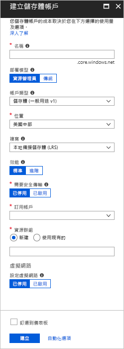
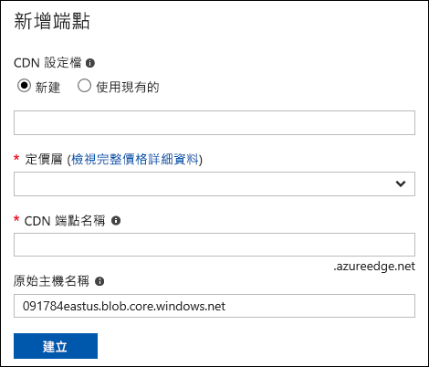
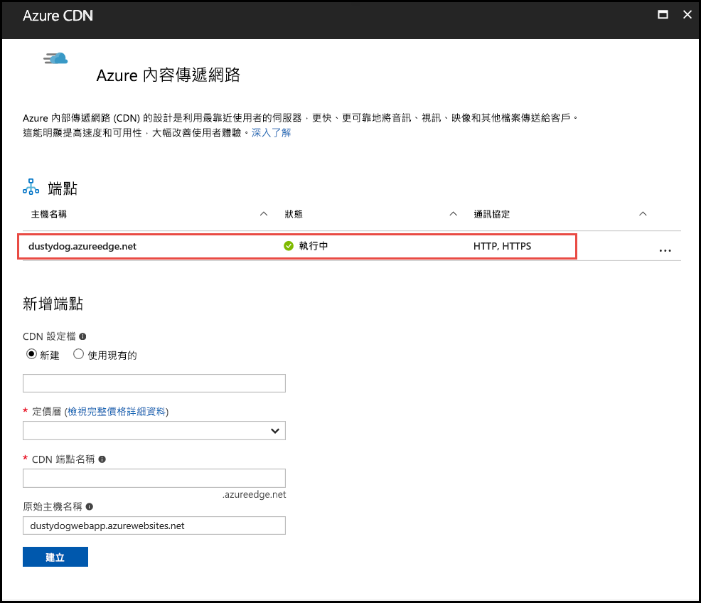
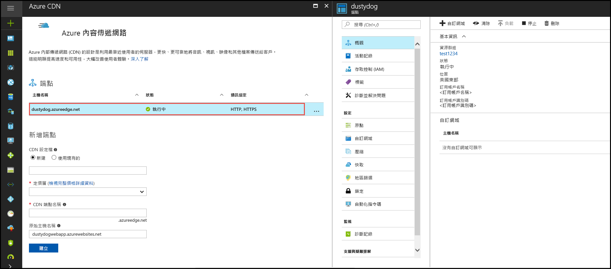

# 整合 Azure 儲存體帳戶與 Azure CDN
您可以啟用 Azure 內容傳遞網路 (CDN)，從 Azure 儲存體快取內容。 Azure CDN 提供開發人員一套傳遞高頻寬內容的全域解決方案。 在北美洲、歐洲、亞洲、澳洲及南美洲的實體節點上，皆可快取 blob 和計算執行個體的靜態內容。

## 步驟 1：建立儲存體帳戶
使用下列程序，為 Azure 訂用帳戶建立新的儲存體帳戶。 有了儲存體帳戶，才能存取 Azure 儲存體服務。 儲存體帳戶代表最高層級的命名空間，用於存取每個 Azure 儲存體服務元件：Azure Blob、佇列和資料表儲存。 如需詳細資訊，請參閱 [Microsoft Azure 儲存體簡介](../storage/common/storage-introduction.md)。

若要建立儲存體帳戶，您必須是服務管理員或是相關訂用帳戶的共同管理員。

> [!NOTE]
> 您可使用數種方法來建立儲存體帳戶，包括 Azure 入口網站和 PowerShell。 本教學課程會示範如何使用 Azure 入口網站。   
> 

**為 Azure 訂用帳戶建立儲存體帳戶**

1. 登入 [Azure 入口網站](https://portal.azure.com)。
2. 在左上角，選取 [建立資源]。 在 [新增] 窗格中選取 [儲存體]，然後選取 [儲存體帳戶 - blob、檔案、資料表、佇列]。
    
    [建立儲存體帳戶] 窗格隨即出現。   

    

3. 在 [名稱] 方塊中，輸入子網域名稱。 此項目可以包含 3 至 24 個小寫字母與數字。
   
    此值會成為 URI 內用來將訂用帳戶的 blob、佇列或資料表資源定址的主機名稱。 若要在 Blob 儲存體中將容器資源定址，請使用下列格式的 URI：
   
    http://&lt;StorageAcountLabel&gt;.blob.core.windows.net/&lt;mycontainer&gt;

    其中 *&lt;StorageAccountLabel&gt;* 指的是您在 [名稱] 方塊中輸入的值。
   
    > [!IMPORTANT]    
    > URL 標籤會形成儲存體帳戶 URI 的子網域，而且必須在 Azure 中的所有代管服務間是唯一的。
   
    此值也用作該儲存體帳戶在入口網站中的名稱，或用於透過程式設計方式存取此帳戶時。
    
4. 使用 [部署模型]、[帳戶種類]、[效能] 和 [複寫] 的預設值。 
    
5. 針對 [訂用帳戶]，選取要與儲存體帳戶一同使用的訂用帳戶。
    
6. 針對 [資源群組]，選取或建立資源群組。 如需資源群組的資訊，請參閱 [Azure Resource Manager 概觀](../azure-resource-manager/resource-group-overview.md#resource-groups)。
    
7. 針對 [位置]，選取儲存體帳戶的位置。
    
8. 選取 [建立] 。 建立儲存體帳戶的流程可能需要幾分鐘才能完成。

## 步驟 2︰啟用儲存體帳戶的 CDN

您可以直接從儲存體帳戶啟用儲存體帳戶的 CDN。 

1. 從儀表板選取儲存體帳戶，然後在左窗格中選取 [Azure CDN]。 如果 [Azure CDN] 按鈕沒有立即顯示，您可以在左窗格的 [搜尋] 方塊中輸入 CDN。
    
    [Azure 內容傳遞網路] 窗格隨即出現。

    
    
2. 輸入所需資訊以建立新端點：
    - **CDN 設定檔**：建立新的 CDN 設定檔，或使用現有 CDN 設定檔。
    - **定價層**：只有在建立 CDN 設定檔時需選取定價層。
    - **CDN 端點名稱**︰輸入 CDN 端點名稱。

    > [!TIP]
    > 根據預設，新的 CDN 端點會使用儲存體帳戶的主機名稱作為原始伺服器。

3. 選取 [建立] 。 端點建立之後，即會出現在端點清單中。

    

> [!NOTE]
> 如果想要指定 CDN 端點的進階組態設定，例如最佳化類型，則您可以改用 [Azure CDN 擴充功能](cdn-create-new-endpoint.md#create-a-new-cdn-endpoint)建立 CDN 端點或 CDN 設定檔。

## 步驟 3︰ 啟用其他 CDN 功能

在儲存體帳戶 [Azure CDN] 窗格中，選取清單內的 CDN 端點，以開啟 CDN 設定窗格。 您可以為傳遞啟用其他的 CDN 功能，例如壓縮、查詢字串和地區篩選。 您也可以將自訂網域對應新增至 CDN 端點，並啟用自訂網域 HTTPS。
    

## 步驟 4：存取 CDN 內容
若要存取 CDN 上快取的內容，請使用入口網站中提供的 CDN URL。 快取 blob 的位址格式如下：

http://<*EndpointName*\>.azureedge.net/<*myPublicContainer*\>/<*BlobName*\>

> [!NOTE]
> 啟用 CDN 存取儲存體帳戶後，所有公開可用的物件皆適用於 CDN 邊緣快取。 如果您修改的物件目前是 CDN 中的快取物件，在快取內容的有效存留期已滿之後，除非 CDN 重新整理內容，否則無法透過 CDN 取得新的內容。

## 步驟 5：從 CDN 移除內容
如果不想繼續在 Azure CDN 中快取物件，您可以採取下列其中一個步驟：

* 將容器設為私人而非公用。 如需詳細資訊，請參閱 [管理對容器與 Blob 的匿名讀取權限](../storage/blobs/storage-manage-access-to-resources.md)。
* 使用 Azure 入口網站來停用或刪除 CDN 端點。
* 修改託管服務，使其不再回應物件的要求。

已在 Azure CDN 中快取的物件會保持快取狀態，直到物件的有效存留期已滿或端點已清除為止。 有效存留期已滿時，Azure CDN 會查看 CDN 端點是否仍然有效，以及物件是否仍可匿名存取。 如果不是的話，將不再快取物件。

## 其他資源
* [將自訂網域新增至 CDN 端點](cdn-map-content-to-custom-domain.md)
* [在 Azure CDN 自訂網域上設定 HTTPS](cdn-custom-ssl.md)

