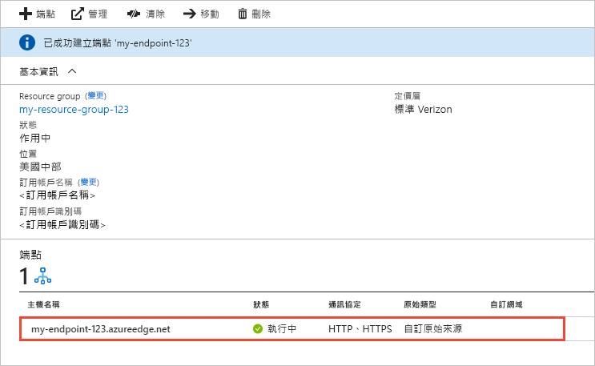

# 建立 Azure CDN 端點
此文章說明在現有 CDN 設定檔中建立 [Azure 內容傳遞網路 (CDN)](cdn-overview.md) 端點的所有設定。 建立設定檔與端點之後，即可開始將內容傳遞給您的客戶。 如需建立設定檔和端點的快速入門，請參閱[快速入門：建立 Azure CDN 設定檔和端點](cdn-create-new-endpoint.md)。

## 必要條件
建立 CDN 端點之前，您必須至少建立一個 CDN 設定檔，其中可包含一或多個 CDN 端點。 若要依網際網路網域、Web 應用程式或其他準則來組織您的 CDN 端點，您可以使用多個設定檔。 由於 CDN 定價會套用於 CDN 設定檔層級，因此，如果您想要使用混合的 Azure CDN 定價層，就必須建立多個 CDN 設定檔。 若要建立 CDN 設定檔，請查看[建立新的 CDN 設定檔](cdn-create-new-endpoint.md#create-a-new-cdn-profile)。

## 登入 Azure 入口網站
使用您的 Azure 帳戶登入 [Azure 入口網站](https://portal.azure.com)。

## 建立新的 CDN 端點

1. 在 [Azure 入口網站](https://portal.azure.com)中，瀏覽到您的 CDN 設定檔。 您可能已在先前步驟中將其釘選至儀表板。 如果沒有，您可藉由選取 [所有服務]，然後選取 [CDN 設定檔] 來尋找。 在 [CDN 設定檔] 窗格中，選取您打算新增至端點的設定檔。 
   
    此時會顯示 [CDN 設定檔] 窗格。

2. 選取 [端點]。
   
    
   
    [新增端點] 頁面隨即出現。
   
    

3. 針對 [名稱]，輸入新 CDN 端點的唯一名稱。 此名稱用於存取位於網域 _<endpointname>_.azureedge.net 的快取資源。

4. 針對 [來源類型]，選擇下列其中一個來源類型： 
   - 適用於 Azure 儲存體的**儲存體**
   - 適用於 Azure 雲端服務的**雲端服務**
   - 適用於 Azure Web Apps 的 **Web 應用程式**
   - **自訂來源**，適用於任何其他可公開存取的原始 Web 伺服器 (裝載於 Azure 或其他位置)

5. 針對 [來源主機名稱]，選取或輸入您的原始伺服器網域。 下拉式清單會列出您在步驟 4 中指定之類型的所有可用原始伺服器。 如果您選取 [自訂來源] 作為您的原始來源類型，請輸入自訂原始伺服器的網域。
    
6. 針對 [原始路徑]，輸入您想要快取的資源路徑。 若要允許您在步驟 5 所指定之網域中快取任何資源，請將此設定保留為空白。
    
7. 針對 [原始主機標頭]，輸入您要 Azure CDN 連同每個要求一起傳送的主機標頭，或保留預設值。
   
   > [!NOTE]
   > 某些類型的原始來源 (例如 Azure 儲存體和 Web Apps) 要求主機標頭必須符合原始來源的網域。 除非您的原始來源需要與其網域不同的主機標頭，否則您應該保留預設值。
   > 
    
8. 針對 [通訊協定] 與 [來源連接埠]，指定通訊協定與連接埠以用來存取原始伺服器上的資源。 至少必須選取一個通訊協定 (HTTP 或 HTTPS)。 使用 CDN 提供的網域 (_<endpointname>_.azureedge.net) 來存取 HTTPS 內容。 
   
   > [!NOTE]
   > [來源連接埠] 值只會決定端點用來從原始伺服器擷取資訊的連接埠。 不論 [原始連接埠] 的值為何，端點本身只會透過預設 HTTP 和 HTTPS 連接埠 (80 和 443) 提供給終端用戶端使用。  
   > 
   > 在**來自 Akamai 的 Azure CDN** 設定檔中，端點不允許原始連接埠的完整 TCP 連接埠範圍。 如需不允許的原始連接埠清單，請參閱 [來自 Akamai 的 Azure CDN 允許的原始連接埠](/previous-versions/azure/mt757337(v=azure.100))。  
   > 
   > **來自 Akamai 的 Azure CDN** 產品不支援對 Azure CDN 自訂網域的 HTTPS 支援。 如需詳細資訊，請參閱[在 Azure CDN 自訂網域上設定 HTTPS](cdn-custom-ssl.md)。
    
9. 針對 [最佳化對象]，選取最符合案例的最佳化類型，以及您想要端點傳送的內容類型。 如需詳細資訊，請參閱[ 針對內容傳遞類型將 Azure CDN 最佳化](cdn-optimization-overview.md)。

    目前根據設定檔類型支援下列最佳化類型設定：
    - **來自 Microsoft 的 Azure CDN 標準**設定檔：
       - [**一般 Web 傳遞**](cdn-optimization-overview.md#general-web-delivery)

    - **來自 Verizon 的 Azure CDN 標準**與**來自 Verizon 的 Azure CDN 進階**設定檔：
       - [**一般 Web 傳遞**](cdn-optimization-overview.md#general-web-delivery)
       - [**動態網站加速**](cdn-optimization-overview.md#dynamic-site-acceleration)

    - **來自 Akamai 的 Azure CDN 標準**設定檔：
       - [**一般 Web 傳遞**](cdn-optimization-overview.md#general-web-delivery)
       - [**一般媒體串流處理**](cdn-optimization-overview.md#general-media-streaming)
       - [**點播視訊媒體串流**](cdn-optimization-overview.md#video-on-demand-media-streaming)
       - [**大型檔案下載**](cdn-optimization-overview.md#large-file-download)
       - [**動態網站加速**](cdn-optimization-overview.md#dynamic-site-acceleration)

10. 選取 [新增] 來建立新的端點。
   
    端點建立之後，即會出現在設定檔的端點清單中。
    
    
    
    因為需要一段時間才能傳播註冊，所以端點不會立即可供使用： 
    - 若為**來自 Microsoft 的標準 Azure CDN** 設定檔，通常會在 10 分鐘內完成傳播。 
    - 若為**來自 Akamai 的標準 Azure CDN** 設定檔，通常會在一分鐘內完成傳播。 
    - 若為**來自 Verizon 的標準 Azure CDN** 和**來自 Verizon 的進階 Azure CDN** 設定檔，通常會在 90 分鐘內完成傳播。 
   
    如果您嘗試在端點設定傳播到存在點 (POP) 伺服器之前使用 CDN 網域名稱，您可能會收到 HTTP 404 回應狀態。 如果您在端點建立之後過了好幾個小時，仍會收到 404 回應狀態，請參閱[針對傳回 404 狀態碼的 Azure CDN 端點進行疑難排解](cdn-troubleshoot-endpoint.md)。

## 清除資源
若要刪除不再需要的端點，請選取它，然後選取 [刪除]。 

## 後續步驟
若要了解自訂網域，請繼續進行將自訂網域新增至您 CDN 端點的教學課程。

> [!div class="nextstepaction"]
> [新增自訂網域](cdn-map-content-to-custom-domain.md)

